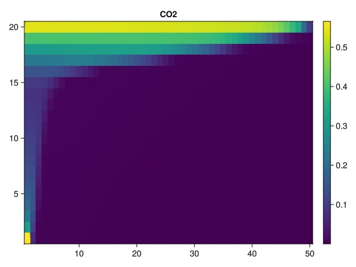
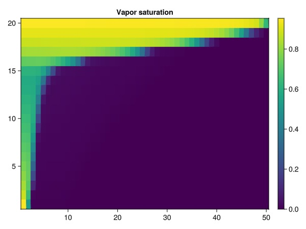
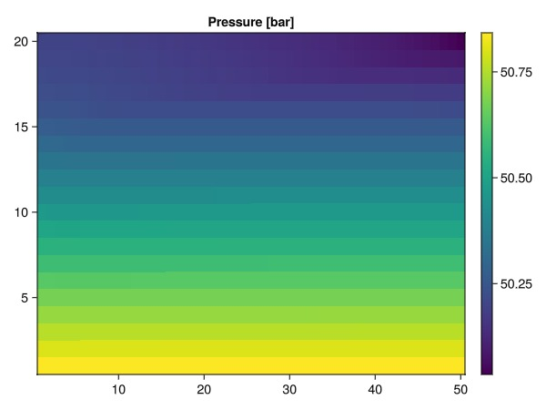
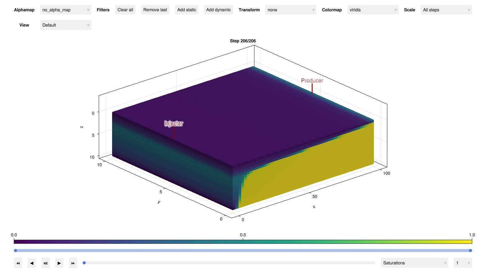

# Intro to compositional flow {#Intro-to-compositional-flow}

This is a simple conceptual example demonstrating how to solve compositional flow. This example uses a two-component water-CO2 system. Note that the default Peng-Robinson is not accurate for this system without adjustments to the parameters. However, the example demonstrates the conceptual workflow for getting started with compositional simulation.

## Set up mixture {#Set-up-mixture}

We load the external flash package and define a two-component H2O-CO2 system. The constructor for each species takes in molecular weight, critical pressure, critical temperature, critical volume, acentric factor given as strict SI. This means, for instance, that molar masses are given in kg/mole and not g/mole or kg/kmol.

```julia
using MultiComponentFlash
h2o = MolecularProperty(0.018015268, 22.064e6, 647.096, 5.595e-05, 0.3442920843)
co2 = MolecularProperty(0.0440098, 7.3773e6, 304.1282, 9.412e-05, 0.22394)

bic = zeros(2, 2)

mixture = MultiComponentMixture([h2o, co2], A_ij = bic, names = ["H2O", "CO2"])
eos = GenericCubicEOS(mixture, PengRobinson())
```


```
MultiComponentFlash.GenericCubicEOS{MultiComponentFlash.PengRobinson, Float64, 2, Nothing}(MultiComponentFlash.PengRobinson(), MultiComponentFlash.MultiComponentMixture{Float64, 2}("UnnamedMixture", ["H2O", "CO2"], (MultiComponentFlash.MolecularProperty{Float64}(0.018015268, 2.2064e7, 647.096, 5.595e-5, 0.3442920843), MultiComponentFlash.MolecularProperty{Float64}(0.0440098, 7.3773e6, 304.1282, 9.412e-5, 0.22394)), [0.0 0.0; 0.0 0.0]), 2.414213562373095, -0.41421356237309515, 0.457235529, 0.077796074, nothing)
```


## Set up domain and wells {#Set-up-domain-and-wells}

```julia
using Jutul, JutulDarcy, GLMakie
nx = 50
ny = 1
nz = 20
dims = (nx, ny, nz)
g = CartesianMesh(dims, (100.0, 10.0, 10.0))
nc = number_of_cells(g)
Darcy, bar, kg, meter, Kelvin, day, sec = si_units(:darcy, :bar, :kilogram, :meter, :Kelvin, :day, :second)
K = repeat([0.1, 0.1, 0.001]*Darcy, 1, nc)
res = reservoir_domain(g, porosity = 0.3, permeability = K)
```


```
DataDomain wrapping CartesianMesh (3D) with 50x1x20=1000 cells with 19 data fields added:
  1000 Cells
    :permeability => 3×1000 Matrix{Float64}
    :porosity => 1000 Vector{Float64}
    :rock_thermal_conductivity => 1000 Vector{Float64}
    :fluid_thermal_conductivity => 1000 Vector{Float64}
    :rock_heat_capacity => 1000 Vector{Float64}
    :component_heat_capacity => 1000 Vector{Float64}
    :rock_density => 1000 Vector{Float64}
    :cell_centroids => 3×1000 Matrix{Float64}
    :volumes => 1000 Vector{Float64}
  1930 Faces
    :neighbors => 2×1930 Matrix{Int64}
    :areas => 1930 Vector{Float64}
    :normals => 3×1930 Matrix{Float64}
    :face_centroids => 3×1930 Matrix{Float64}
  3860 HalfFaces
    :half_face_cells => 3860 Vector{Int64}
    :half_face_faces => 3860 Vector{Int64}
  2140 BoundaryFaces
    :boundary_areas => 2140 Vector{Float64}
    :boundary_centroids => 3×2140 Matrix{Float64}
    :boundary_normals => 3×2140 Matrix{Float64}
    :boundary_neighbors => 2140 Vector{Int64}

```


Set up a vertical well in the first corner, perforated in top layer

```julia
prod = setup_well(g, K, [(nx, ny, 1)], name = :Producer)
```


```
SimpleWell [Producer] (1 nodes, 0 segments, 1 perforations)
```


Set up an injector in the opposite corner, perforated in bottom layer

```julia
inj = setup_well(g, K, [(1, 1, nz)], name = :Injector)
```


```
SimpleWell [Injector] (1 nodes, 0 segments, 1 perforations)
```


## Define system and realize on grid {#Define-system-and-realize-on-grid}

```julia
rhoLS = 844.23*kg/meter^3
rhoVS = 126.97*kg/meter^3
rhoS = [rhoLS, rhoVS]
L, V = LiquidPhase(), VaporPhase()
sys = MultiPhaseCompositionalSystemLV(eos, (L, V))
model, parameters = setup_reservoir_model(res, sys, wells = [inj, prod]);
push!(model[:Reservoir].output_variables, :Saturations)
kr = BrooksCoreyRelativePermeabilities(sys, 2.0, 0.0, 1.0)
model = replace_variables!(model, RelativePermeabilities = kr)
T0 = fill(303.15*Kelvin, nc)
parameters[:Reservoir][:Temperature] = T0
state0 = setup_reservoir_state(model, Pressure = 50*bar, OverallMoleFractions = [1.0, 0.0]);
```


## Define schedule {#Define-schedule}

5 year (5*365.24 days) simulation period

```julia
dt0 = fill(1*day, 26)
dt1 = fill(10.0*day, 180)
dt = cat(dt0, dt1, dims = 1)
rate_target = TotalRateTarget(9.5066e-06*meter^3/sec)
I_ctrl = InjectorControl(rate_target, [0, 1], density = rhoVS)
bhp_target = BottomHolePressureTarget(50*bar)
P_ctrl = ProducerControl(bhp_target)

controls = Dict()
controls[:Injector] = I_ctrl
controls[:Producer] = P_ctrl
forces = setup_reservoir_forces(model, control = controls)
ws, states = simulate_reservoir(state0, model, dt, parameters = parameters, forces = forces);
```


```
Jutul: Simulating 4 years, 52.15 weeks as 206 report steps
╭────────────────┬───────────┬───────────────┬──────────╮
│ Iteration type │  Avg/step │  Avg/ministep │    Total │
│                │ 206 steps │ 207 ministeps │ (wasted) │
├────────────────┼───────────┼───────────────┼──────────┤
│ Newton         │   2.46117 │       2.44928 │  507 (0) │
│ Linearization  │   3.46602 │       3.44928 │  714 (0) │
│ Linear solver  │   17.7379 │       17.6522 │ 3654 (0) │
│ Precond apply  │   35.4757 │       35.3043 │ 7308 (0) │
╰────────────────┴───────────┴───────────────┴──────────╯
╭───────────────┬─────────┬────────────┬─────────╮
│ Timing type   │    Each │   Relative │   Total │
│               │      ms │ Percentage │       s │
├───────────────┼─────────┼────────────┼─────────┤
│ Properties    │  5.7497 │    21.31 % │  2.9151 │
│ Equations     │  3.4461 │    17.99 % │  2.4605 │
│ Assembly      │  1.6767 │     8.75 % │  1.1971 │
│ Linear solve  │  1.0817 │     4.01 % │  0.5484 │
│ Linear setup  │  3.7691 │    13.97 % │  1.9109 │
│ Precond apply │  0.1183 │     6.32 % │  0.8645 │
│ Update        │  0.6669 │     2.47 % │  0.3381 │
│ Convergence   │  1.9927 │    10.40 % │  1.4228 │
│ Input/Output  │  0.5567 │     0.84 % │  0.1152 │
│ Other         │  3.7546 │    13.92 % │  1.9036 │
├───────────────┼─────────┼────────────┼─────────┤
│ Total         │ 26.9749 │   100.00 % │ 13.6763 │
╰───────────────┴─────────┴────────────┴─────────╯
```


## Once the simulation is done, we can plot the states {#Once-the-simulation-is-done,-we-can-plot-the-states}

Note that this example is intended for static publication in the documentation. For interactive visualization you can use functions like `plot_interactive` to interactively visualize the states.

```julia
z = states[end][:OverallMoleFractions][2, :]
function plot_vertical(x, t)
    data = reshape(x, (nx, nz))
    data = data[:, end:-1:1]
    fig, ax, plot = heatmap(data)
    ax.title = t
    Colorbar(fig[1, 2], plot)
    fig
end;
```


### Plot final CO2 mole fraction {#Plot-final-CO2-mole-fraction}

```julia
plot_vertical(z, "CO2")
```



### Plot final vapor saturation {#Plot-final-vapor-saturation}

```julia
sg = states[end][:Saturations][2, :]
plot_vertical(sg, "Vapor saturation")
```



### Plot final pressure {#Plot-final-pressure}

```julia
p = states[end][:Pressure]
plot_vertical(p./bar, "Pressure [bar]")
```



### Plot in interactive viewer {#Plot-in-interactive-viewer}

```julia
plot_reservoir(model, states, step = length(dt), key = :Saturations)
```



## Example on GitHub {#Example-on-GitHub}

If you would like to run this example yourself, it can be downloaded from the JutulDarcy.jl GitHub repository [as a script](https://github.com/sintefmath/JutulDarcy.jl/blob/main/examples/compositional/compositional_2d_vertical.jl), or as a [Jupyter Notebook](https://github.com/sintefmath/JutulDarcy.jl/blob/gh-pages/dev/final_site/notebooks/compositional/compositional_2d_vertical.ipynb)

```
This example took 95.159156565 seconds to complete.
```


---


_This page was generated using [Literate.jl](https://github.com/fredrikekre/Literate.jl)._
