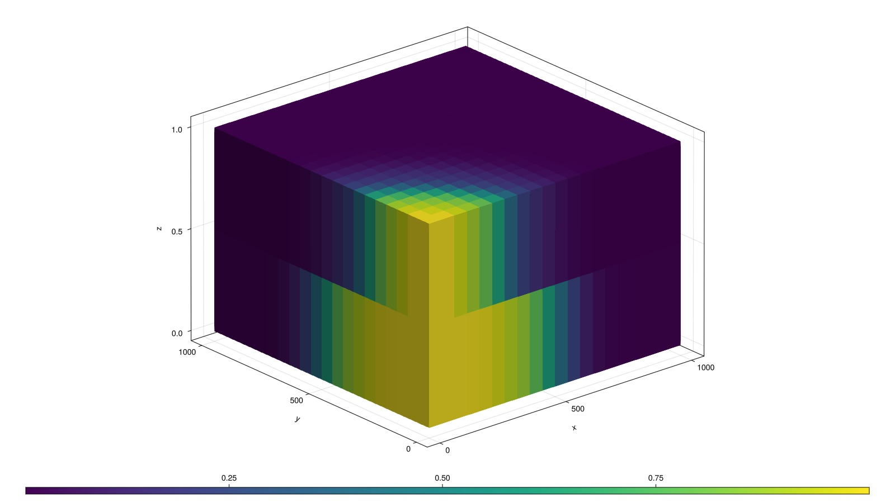
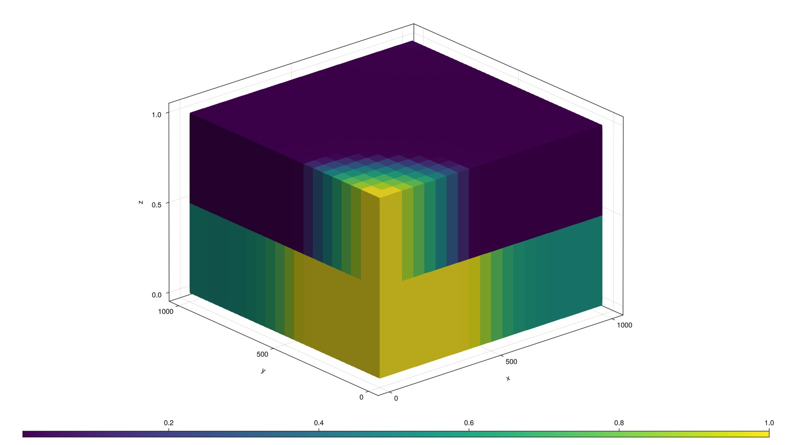
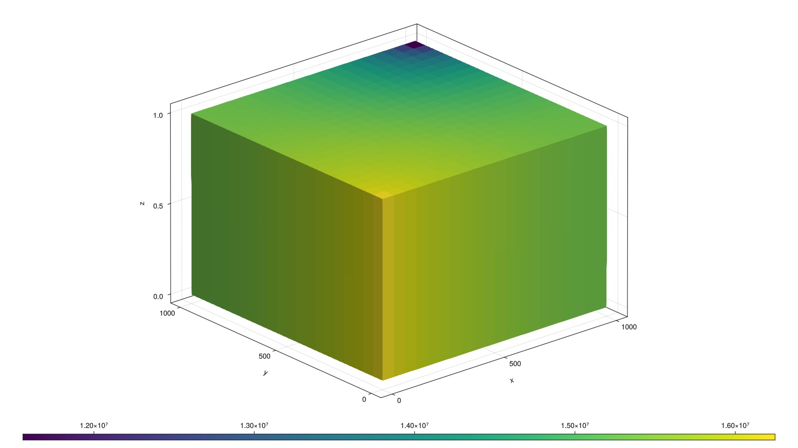

# A more complex compositional model {#A-more-complex-compositional-model}

This example sets up a more complex compositional simulation with five different components. Other than that, the example is similar to the others that include wells and is therefore not commented in great detail.

```julia
using MultiComponentFlash

n2_ch4 = MolecularProperty(0.0161594, 4.58e6, 189.515, 9.9701e-05, 0.00854)
co2 = MolecularProperty(0.04401, 7.3866e6, 304.200, 9.2634e-05, 0.228)
c2_5 = MolecularProperty(0.0455725, 4.0955e6, 387.607, 2.1708e-04, 0.16733)
c6_13 = MolecularProperty(0.117740, 3.345e6, 597.497, 3.8116e-04, 0.38609)
c14_24 = MolecularProperty(0.248827, 1.768e6, 698.515, 7.2141e-04, 0.80784)

bic = [0.11883 0.00070981 0.00077754 0.01 0.011;
       0.00070981 0.15 0.15 0.15 0.15;
       0.00077754 0.15 0 0 0;
       0.01 0.15 0 0 0;
       0.011 0.15 0 0 0]

mixture = MultiComponentMixture([n2_ch4, co2, c2_5, c6_13, c14_24], A_ij = bic, names = ["N2-CH4", "CO2", "C2-5", "C6-13", "C14-24"])
eos = GenericCubicEOS(mixture, PengRobinson())

using Jutul, JutulDarcy, GLMakie
Darcy, bar, kg, meter, Kelvin, day = si_units(:darcy, :bar, :kilogram, :meter, :Kelvin, :day)
nx = ny = 20
nz = 2

dims = (nx, ny, nz)
g = CartesianMesh(dims, (1000.0, 1000.0, 1.0))
nc = number_of_cells(g)
K = repeat([0.05*Darcy], 1, nc)
res = reservoir_domain(g, porosity = 0.25, permeability = K, temperature = 387.45*Kelvin)
```


```
DataDomain wrapping CartesianMesh (3D) with 20x20x2=800 cells with 20 data fields added:
  800 Cells
    :permeability => 1×800 Matrix{Float64}
    :porosity => 800 Vector{Float64}
    :rock_thermal_conductivity => 800 Vector{Float64}
    :fluid_thermal_conductivity => 800 Vector{Float64}
    :rock_heat_capacity => 800 Vector{Float64}
    :component_heat_capacity => 800 Vector{Float64}
    :rock_density => 800 Vector{Float64}
    :temperature => 800 Vector{Float64}
    :cell_centroids => 3×800 Matrix{Float64}
    :volumes => 800 Vector{Float64}
  1920 Faces
    :neighbors => 2×1920 Matrix{Int64}
    :areas => 1920 Vector{Float64}
    :normals => 3×1920 Matrix{Float64}
    :face_centroids => 3×1920 Matrix{Float64}
  3840 HalfFaces
    :half_face_cells => 3840 Vector{Int64}
    :half_face_faces => 3840 Vector{Int64}
  960 BoundaryFaces
    :boundary_areas => 960 Vector{Float64}
    :boundary_centroids => 3×960 Matrix{Float64}
    :boundary_normals => 3×960 Matrix{Float64}
    :boundary_neighbors => 960 Vector{Int64}

```


Set up a vertical well in the first corner, perforated in all layers

```julia
prod = setup_vertical_well(g, K, nx, ny, name = :Producer)
```


```
SimpleWell [Producer] (1 nodes, 0 segments, 2 perforations)
```


Set up an injector in the opposite corner, perforated in all layers

```julia
inj = setup_vertical_well(g, K, 1, 1, name = :Injector)

rhoLS = 1000.0*kg/meter^3
rhoVS = 100.0*kg/meter^3

rhoS = [rhoLS, rhoVS]
L, V = LiquidPhase(), VaporPhase()
```


```
(LiquidPhase(), VaporPhase())
```


Define system and realize on grid

```julia
sys = MultiPhaseCompositionalSystemLV(eos, (L, V))
model, parameters = setup_reservoir_model(res, sys, wells = [inj, prod], block_backend = true);
kr = BrooksCoreyRelativePermeabilities(sys, 2.0, 0.0, 1.0)
model = replace_variables!(model, RelativePermeabilities = kr)

push!(model[:Reservoir].output_variables, :Saturations)

state0 = setup_reservoir_state(model, Pressure = 225*bar, OverallMoleFractions = [0.463, 0.01640, 0.20520, 0.19108, 0.12432]);

dt = repeat([2.0]*day, 365)
rate_target = TotalRateTarget(0.0015)
I_ctrl = InjectorControl(rate_target, [0, 1, 0, 0, 0], density = rhoVS)
bhp_target = BottomHolePressureTarget(100*bar)
P_ctrl = ProducerControl(bhp_target)

controls = Dict()
controls[:Injector] = I_ctrl
controls[:Producer] = P_ctrl
forces = setup_reservoir_forces(model, control = controls)
ws, states = simulate_reservoir(state0, model, dt, parameters = parameters, forces = forces);
```


```
Jutul: Simulating 1 year, 52.11 weeks as 365 report steps
╭────────────────┬───────────┬───────────────┬──────────╮
│ Iteration type │  Avg/step │  Avg/ministep │    Total │
│                │ 365 steps │ 367 ministeps │ (wasted) │
├────────────────┼───────────┼───────────────┼──────────┤
│ Newton         │   2.07123 │       2.05995 │  756 (0) │
│ Linearization  │   3.07671 │       3.05995 │ 1123 (0) │
│ Linear solver  │   9.99178 │       9.93733 │ 3647 (0) │
│ Precond apply  │   19.9836 │       19.8747 │ 7294 (0) │
╰────────────────┴───────────┴───────────────┴──────────╯
╭───────────────┬─────────┬────────────┬─────────╮
│ Timing type   │    Each │   Relative │   Total │
│               │      ms │ Percentage │       s │
├───────────────┼─────────┼────────────┼─────────┤
│ Properties    │ 37.4563 │    61.20 % │ 28.3169 │
│ Equations     │  3.1344 │     7.61 % │  3.5199 │
│ Assembly      │  2.9310 │     7.11 % │  3.2916 │
│ Linear solve  │  2.3961 │     3.92 % │  1.8115 │
│ Linear setup  │  4.4382 │     7.25 % │  3.3553 │
│ Precond apply │  0.2133 │     3.36 % │  1.5556 │
│ Update        │  0.9284 │     1.52 % │  0.7019 │
│ Convergence   │  1.3951 │     3.39 % │  1.5667 │
│ Input/Output  │  0.3404 │     0.27 % │  0.1249 │
│ Other         │  2.6788 │     4.38 % │  2.0252 │
├───────────────┼─────────┼────────────┼─────────┤
│ Total         │ 61.2030 │   100.00 % │ 46.2695 │
╰───────────────┴─────────┴────────────┴─────────╯
```


## Once the simulation is done, we can plot the states {#Once-the-simulation-is-done,-we-can-plot-the-states}

### CO2 mole fraction {#CO2-mole-fraction}

```julia
sg = states[end][:OverallMoleFractions][2, :]
fig, ax, p = plot_cell_data(g, sg)
fig
```



### Gas saturation {#Gas-saturation}

```julia
sg = states[end][:Saturations][2, :]
fig, ax, p = plot_cell_data(g, sg)
fig
```



### Pressure {#Pressure}

```julia
p = states[end][:Pressure]
fig, ax, p = plot_cell_data(g, p)
fig
```



## Example on GitHub {#Example-on-GitHub}

If you would like to run this example yourself, it can be downloaded from the JutulDarcy.jl GitHub repository [as a script](https://github.com/sintefmath/JutulDarcy.jl/blob/main/examples/compositional/compositional_5components.jl), or as a [Jupyter Notebook](https://github.com/sintefmath/JutulDarcy.jl/blob/gh-pages/dev/final_site/notebooks/compositional/compositional_5components.ipynb)

```
This example took 75.913251343 seconds to complete.
```


---


_This page was generated using [Literate.jl](https://github.com/fredrikekre/Literate.jl)._
