# Advanced history matching: Regions, blending and parametric models {#Advanced-history-matching:-Regions,-blending-and-parametric-models}

In this example we will explore a few advanced topics of gradient-based history matching, including how to treat regions and match parametric relative permeability functions. It is recommended that you first read the basic examples on both JutulDarcy simulation models with wells, and the examples on history matching before continuing with this example.

To keep the optimization process speedy, the model used in this example is fairly simple, with three producer wells and a small rectangular domain. We define two rock types that will be given different properties and relative permeability curves, and then we will look at how different prior assumptions will impact the quality of the history match.

```julia
using Jutul, JutulDarcy, GLMakie
import LBFGSB as lb

nx = 20
g = CartesianMesh((nx, nx, 1), (100.0, 100.0, 10.0))
nc = number_of_cells(g)
reservoir = reservoir_domain(g);
```


## Define the rock types {#Define-the-rock-types}

We define a model with two rock types, with the middle of the domain containing the second rock type. We also set up a simple plotting function to visualize the results in 2D.

```julia
Darcy, day, kg, meter, barsa = si_units(:darcy, :day, :kg, :meter, :bar)
X = reservoir[:cell_centroids][1, :]
Y = reservoir[:cell_centroids][2, :]
rocktype = zeros(Int, nc)
for i in 1:nc
    if abs(Y[i] - 50.0) < 20
        rocktype[i] = 2
    else
        rocktype[i] = 1
    end
end

perm = fill(0.1Darcy, nc)
perm[rocktype .== 2] .= 1.0Darcy

function plot_2d(v, title = "")
    fig = Figure()
    ax = Axis(fig[1, 1], title = title)
    plt = heatmap!(ax, reshape(v, nx, nx))
    Colorbar(fig[1, 2], plt)
    fig
end

plot_2d(perm./Darcy, "Permeability / Darcy")
```

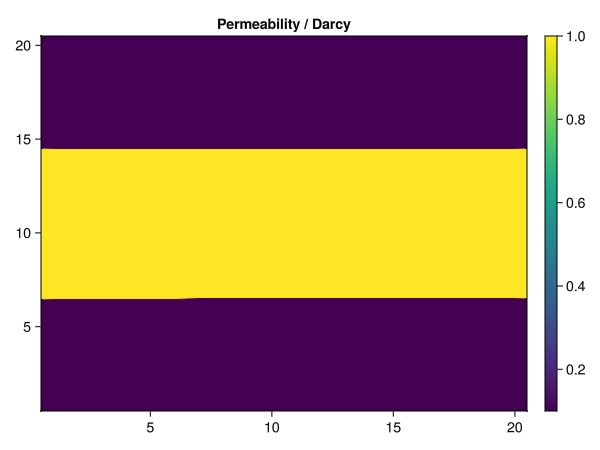

## Set up wells {#Set-up-wells}

We have a single injector (placed in rock type 2) and three producers where two are placed in rock type 1, and one in rock type 2.

```julia
I = setup_vertical_well(reservoir, 1, ceil(nx/2), name = :I)
P1 = setup_vertical_well(reservoir, nx, 1, name = :P1)
P2 = setup_vertical_well(reservoir, nx, ceil(nx/2), name = :P2)
P3 = setup_vertical_well(reservoir, nx, nx, name = :P3)

wells = [I, P1, P2, P3]

fig = Figure()
ax = Axis3(fig[1, 1], title = "Reservoir model with two regions", zreversed = true)
plot_cell_data!(ax, g, perm)
for w in wells
    plot_well!(ax, reservoir, w)
end
fig
```

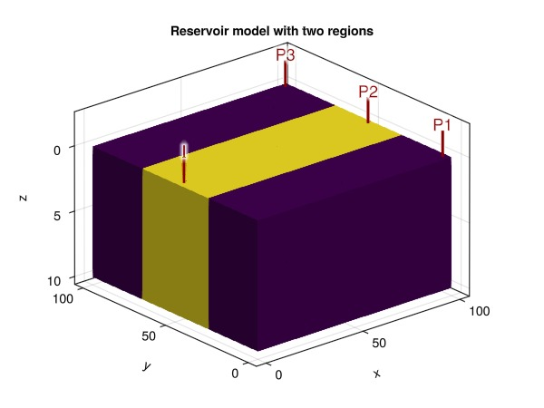

## Set up a simulation model {#Set-up-a-simulation-model}

We are going to set up several different models, starting with the base case. All models use the same PVT description, but will have different variations of the relative permeability parameters that significantly impact the behavior of the system.

```julia
phases = (AqueousPhase(), LiquidPhase())
rhoWS = 1000.0
rhoLS = 780.0
rhoS = [rhoWS, rhoLS] .* kg/meter^3
sys = ImmiscibleSystem(phases, reference_densities = rhoS)

function setup_model_with_relperm(kr)
    model = setup_reservoir_model(reservoir, sys, extra_out = false, wells = wells)
    rmodel = reservoir_model(model)
    set_secondary_variables!(rmodel, RelativePermeabilities = kr)
    JutulDarcy.add_relperm_parameters!(rmodel)
    prm = setup_parameters(model)
    return (model, prm)
end
```


```
setup_model_with_relperm (generic function with 1 method)
```


### Set up the parametric relative permeability model {#Set-up-the-parametric-relative-permeability-model}

The base case uses a parametric Brooks-Corey model with different coefficients for each rock type. The parametric relative permeability function exposes parameters in the simulator that can be used in gradient-based optimization with the adjoint method. This is a very powerful concept when combined with Jutul&#39;s flexible functionality for chaining together differentiable models. For a Brooks-Corey model the parameters are the exponents, the critical saturation and the maximum relative permeability for both the wetting and non-wetting phases. The parametric version allows you to set these values cell-by-cell, but we set them according to the rock type.

```julia
kr = JutulDarcy.ParametricCoreyRelativePermeabilities()
model_base, prm_base = setup_model_with_relperm(kr);

prm_res = prm_base[:Reservoir]

is1 = findall(rocktype .== 1)
is2 = findall(rocktype .== 2)

prm_res[:NonWettingKrExponent][is1] .= 1.8
prm_res[:NonWettingKrExponent][is2] .= 3.0

prm_res[:WettingKrExponent][is1] .= 1.0
prm_res[:WettingKrExponent][is2] .= 1.0

prm_res[:WettingCritical][is1] .= 0.3
prm_res[:WettingCritical][is2] .= 0.1

prm_res[:NonWettingCritical][is1] .= 0.1
prm_res[:NonWettingCritical][is2] .= 0.1

prm_res[:WettingKrMax][is1] .= 0.7
prm_res[:WettingKrMax][is2] .= 1.0

prm_res[:NonWettingKrMax][is1] .= 0.8
prm_res[:NonWettingKrMax][is2] .= 1.0

prm_res
```


```
Dict{Symbol, Any} with 11 entries:
  :Transmissibilities        => [9.86923e-13, 9.86923e-13, 9.86923e-13, 9.86923…
  :ConnateWater              => [0.0, 0.0, 0.0, 0.0, 0.0, 0.0, 0.0, 0.0, 0.0, 0…
  :NonWettingKrExponent      => [1.8, 1.8, 1.8, 1.8, 1.8, 1.8, 1.8, 1.8, 1.8, 1…
  :NonWettingCritical        => [0.1, 0.1, 0.1, 0.1, 0.1, 0.1, 0.1, 0.1, 0.1, 0…
  :WettingKrExponent         => [1.0, 1.0, 1.0, 1.0, 1.0, 1.0, 1.0, 1.0, 1.0, 1…
  :NonWettingKrMax           => [0.8, 0.8, 0.8, 0.8, 0.8, 0.8, 0.8, 0.8, 0.8, 0…
  :FluidVolume               => [25.0, 25.0, 25.0, 25.0, 25.0, 25.0, 25.0, 25.0…
  :TwoPointGravityDifference => [-0.0, -0.0, -0.0, -0.0, -0.0, -0.0, -0.0, -0.0…
  :WettingCritical           => [0.3, 0.3, 0.3, 0.3, 0.3, 0.3, 0.3, 0.3, 0.3, 0…
  :WettingKrMax              => [0.7, 0.7, 0.7, 0.7, 0.7, 0.7, 0.7, 0.7, 0.7, 0…
  :PhaseViscosities          => [0.001 0.001 … 0.001 0.001; 0.001 0.001 … 0.001…
```


### Simulate the base case {#Simulate-the-base-case}

We set up a simple constant rate injection and bottom hole pressure control for the producers. The injection rate is set to a value that will more or less completely flood the domain. The effect of the different relative permeability parameters in the different rock types is clearly visible when the final water saturation is plotted.

```julia
dt = fill(30day, 50)
total_time = sum(dt)
irate = sum(pore_volume(reservoir)) / total_time

i_ctrl = InjectorControl(TotalRateTarget(irate), [1.0, 0.0], density = rhoWS)
p_ctrl = ProducerControl(BottomHolePressureTarget(50barsa))

ctrls = Dict(
    :I => i_ctrl,
    :P1 => p_ctrl,
    :P2 => p_ctrl,
    :P3 => p_ctrl,
)
forces = setup_reservoir_forces(model_base, control = ctrls)
state0 = setup_reservoir_state(model_base, Pressure = 90barsa, Saturations = [0.0, 1.0])

simulated_base = simulate_reservoir(state0, model_base, dt,
    forces = forces, parameters = prm_base,
    output_substates = true,
    info_level = -1
)
ws, states = simulated_base
step_to_plot = 34
plot_2d(states[step_to_plot][:Saturations][1, :], "Water saturation at the end of the simulation")
```

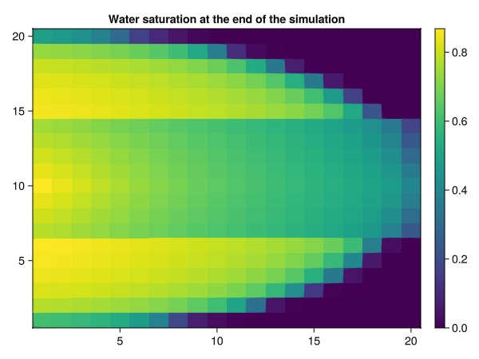

## Set up the history matching problem {#Set-up-the-history-matching-problem}

We set up an objective function that, for a given result, produces the sum of squares in mismatch for the wells: Bottom hole pressures and phase rates with approprioate weights. As a sanity check, we make sure that the objective is zero when the truth case is passed.

```julia
states_base = simulated_base.result.states
w = Float64[]
matches = []
wrat = SurfaceWaterRateTarget(1.0)
orat = SurfaceOilRateTarget(1.0)
bhp = BottomHolePressureTarget(50barsa)

push!(matches, bhp)
push!(w, 1.0/(20*si_unit(:bar)))
push!(matches, wrat)
push!(w, (1/80)*day)
push!(matches, orat)
push!(w, (1/50)*day)

wnames = map(x -> x.name, wells)
o_scale = 1.0/(sum(dt)*length(wnames))
mismatch_objective = (model, state, dt, step_no, forces) -> well_mismatch(
    matches,
    wnames,
    model_base,
    states_base,
    model,
    state,
    dt,
    step_no,
    forces,
    weights = w,
    scale = o_scale,
)
@assert Jutul.evaluate_objective(mismatch_objective, model_base, states_base, dt, forces) == 0.0
```


## Check the objective function for the base case {#Check-the-objective-function-for-the-base-case}

We set up a new case with the same model and parameter definitions, but with defaulted parameter values for the Brooks-Corey model. This will obviously give a fairly different set of well curves, but we can quickly verify that the simulation produces a different saturation front and objective.

```julia
prm_untuned = setup_parameters(model_base)
case_untuned = JutulCase(model_base, dt, forces, state0 = state0, parameters = prm_untuned)
simulated_untuned = simulate_reservoir(case_untuned, output_substates = true, info_level = -1)
ws_untuned, states_untuned = simulated_untuned

obj0 = Jutul.evaluate_objective(mismatch_objective, model_base, simulated_untuned.result.states, dt, forces)
@assert obj0 > 0.0
println("Objective function value for untuned model: ", obj0)
```


```
Objective function value for untuned model: 9.994003577636265e-5
```


### Set up a plotting function for the saturation match {#Set-up-a-plotting-function-for-the-saturation-match}

```julia
function plot_sat_match(vals, name = "")
    sref = reshape(states[step_to_plot][:Saturations][1, :], nx, nx)
    sbase = reshape(vals[step_to_plot][:Saturations][1, :], nx, nx)
    fig = Figure(size = (1800, 600))
    ax = Axis(fig[1, 1], title = name)
    plt = heatmap!(ax, sbase, colorrange = (0.0, 1.0))
    ax = Axis(fig[1, 2], title = "Truth case")
    plt = heatmap!(ax, sref, colorrange = (0.0, 1.0))
    Colorbar(fig[1, 3], plt)
    ax = Axis(fig[1, 4], title = "Difference")
    plt = heatmap!(ax, sbase - sref, colorrange = (-1.0, 1.0), colormap = :seismic)
    Colorbar(fig[1, 5], plt)
    fig
end

plot_sat_match(states_untuned, "Defaulted parameters")
```

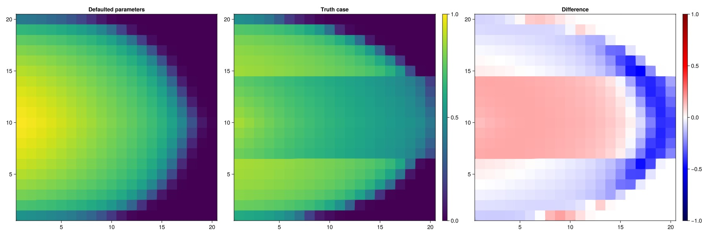

## Set up the first optimization configuration {#Set-up-the-first-optimization-configuration}

We start off this study by doing a straightforward gradient-based optimization of the model where we start from the defaulted parameter values and do not make any assumptions about the number of rock types/facies. In other words, every cell can in principle be assigned a different set of relative permeability parameters if it improves the match against the reference.

We set up some wide bounds for the parameters and set up an optimization configuration. The configuration defines what parameters are to be tuned and the range of values they are allowed to take. As we will see later, there are additional settings that can be used to narrow down the problem definition further, but at the moment we make the following assumptions:
- We only tune the relative permeabilities, not other reservoir parameters like volumes or transmissibilities.
  
- Wells are not tuned.
  
- The bounds for the Brooks-Corey parameters are given.
  

```julia
cfg = optimization_config(model_base, prm_untuned)
kr_exp_bnds = (1.0, 3.0)
kr_crit_bnds = (0.0, 0.45)
kr_max_bnds = (0.2, 1.0)
for (mkey, mcfg) in pairs(cfg)
    for (k, v) in pairs(mcfg)
        if mkey != :Reservoir
            v[:active] = false
        elseif k == :NonWettingKrExponent || k == :WettingKrExponent
            v[:active] = true
            v[:abs_min], v[:abs_max] = kr_exp_bnds
        elseif k == :WettingCritical || k == :NonWettingCritical
            v[:active] = true
            v[:abs_min], v[:abs_max] = kr_crit_bnds
        elseif k == :WettingKrMax || k == :NonWettingKrMax
            v[:active] = true
            v[:abs_min], v[:abs_max] = kr_max_bnds
        else
            v[:active] = false
        end
    end
end

opt_setup = JutulDarcy.setup_reservoir_parameter_optimization(case_untuned, mismatch_objective, cfg, print = 10);
```


```
Parameters for Reservoir
┌──────────────────────┬────────┬─────┬─────────┬─────────────┬─────────────┬───────────┬─────────┐
│                 Name │ Entity │   N │   Scale │ Abs. limits │ Rel. limits │    Limits │ Lumping │
├──────────────────────┼────────┼─────┼─────────┼─────────────┼─────────────┼───────────┼─────────┤
│ NonWettingKrExponent │  Cells │ 400 │ default │      [1, 3] │ [-Inf, Inf] │    [1, 3] │       - │
│   NonWettingCritical │  Cells │ 400 │ default │   [0, 0.45] │ [-Inf, Inf] │ [0, 0.45] │       - │
│    WettingKrExponent │  Cells │ 400 │ default │      [1, 3] │ [-Inf, Inf] │    [1, 3] │       - │
│      NonWettingKrMax │  Cells │ 400 │ default │    [0.2, 1] │ [-Inf, Inf] │  [0.2, 1] │       - │
│      WettingCritical │  Cells │ 400 │ default │   [0, 0.45] │ [-Inf, Inf] │ [0, 0.45] │       - │
│         WettingKrMax │  Cells │ 400 │ default │    [0.2, 1] │ [-Inf, Inf] │  [0.2, 1] │       - │
└──────────────────────┴────────┴─────┴─────────┴─────────────┴─────────────┴───────────┴─────────┘
```


## Set up optimization solver and solve the first set of parameters {#Set-up-optimization-solver-and-solve-the-first-set-of-parameters}

We use the LBFGSB solver to solve the optimization problem. We set up a fairly long optimization with 100 function evaluations since we know that the model is tiny and fast to solve. The optimization function returns the optimized parameters and prints the progress to screen.

```julia
function solve_optimization(setup)
    f! = (x) -> setup.F_and_dF!(NaN, nothing, x)
    g! = (dFdx, x) ->  setup.F_and_dF!(NaN, dFdx, x)
    lower = setup.limits.min
    upper = setup.limits.max
    x0 = setup.x0
    results, final_x = lb.lbfgsb(f!, g!, x0, lb=lower, ub=upper,
        iprint = 0,
        factr = 1e7,
        pgtol = 1e-10,
        maxfun = 100,
        maxiter = 60,
        m = 10
    )
    m = setup.data[:case].model
    prm_tuned = deepcopy(setup.data[:case].parameters)
    devectorize_variables!(prm_tuned, m, final_x, setup.data[:mapper], config = setup.data[:config])
    return prm_tuned
end

prm_tune1 = solve_optimization(opt_setup)
ws_tune1, states_tune1 = simulate_reservoir(state0, model_base, dt, forces = forces, parameters = prm_tune1, info_level = -1);
```


```
RUNNING THE L-BFGS-B CODE

           * * *

Machine precision = 2.220D-16
 N =         2400     M =           10
Obj. #10: 1.5426e-05 (best: 2.2178e-05, relative: 1.5435e-01)
Obj. #20: 2.5301e-06 (best: 2.7809e-06, relative: 2.5316e-02)
Obj. #30: 9.5882e-07 (best: 9.5225e-07, relative: 9.5939e-03)
Obj. #40: 5.1981e-07 (best: 5.2155e-07, relative: 5.2013e-03)

           * * *

Tit   = total number of iterations
Tnf   = total number of function evaluations
Tnint = total number of segments explored during Cauchy searches
Skip  = number of BFGS updates skipped
Nact  = number of active bounds at final generalized Cauchy point
Projg = norm of the final projected gradient
F     = final function value

           * * *

   N    Tit     Tnf  Tnint  Skip  Nact     Projg        F
 2400     34     40    739     0    64   3.732D-07   5.198D-07

CONVERGENCE: REL_REDUCTION_OF_F_<=_FACTR*EPSMCH

 Total User time 3.911E+01 seconds.
```


### Setup plotting for the results {#Setup-plotting-for-the-results}

We set up a simple plotting function that will plot the results for the three producers. This is a good way to verify that our objective function is actually measuring the match we want to see.

```julia
function plot_match(new_ws, new_name)
    fig = Figure(size = (1350, 850))
    for (i, name) in enumerate([:P1, :P2, :P3])
        ax = Axis(fig[1, i], title = "WRAT", ylabel = "m^3/day", xlabel = "days")
        lines!(ax, ws.time./day, -ws[name, :wrat].*day, label = "Truth $name")
        lines!(ax, ws_untuned.time./day, -ws_untuned[name, :wrat].*day, label = "Initial $name")
        lines!(ax, new_ws.time./day, -new_ws[name, :wrat].*day, label = "$new_name $name", linestyle = :dash, linewidth = 3)
        axislegend(position = :lt)

        ax = Axis(fig[2, i], title = "ORAT", ylabel = "m^3/day", xlabel = "days")
        lines!(ax, ws.time./day, -ws[name, :orat].*day, label = "Truth $name")
        lines!(ax, ws_untuned.time./day, -ws_untuned[name, :orat].*day, label = "Initial $name")
        lines!(ax, new_ws.time./day, -new_ws[name, :orat].*day, label = "$new_name $name", linestyle = :dash, linewidth = 3)
        axislegend()
    end
    fig
end

plot_match(ws_tune1, "Gradient-based match")
```

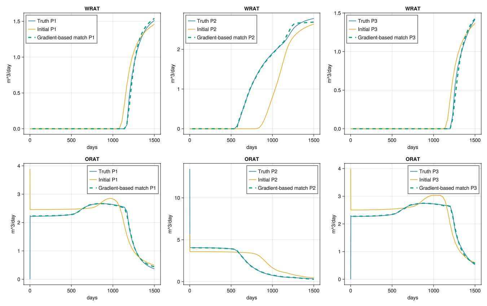

### Plot the saturation front {#Plot-the-saturation-front}

If we look at the saturation front, we can see that the tuned model is quite different than both the truth case and the untuned case. This is a natural consequence of the history matching problem being ill-posed even for simple models, where multiple solutions will match a sparse set of observations like the ones we have from the wells. The tuned model is not a perfect match to the truth case, but it is an improvement over the base case.

```julia
plot_sat_match(states_tune1, "Gradient-based match 1")
```

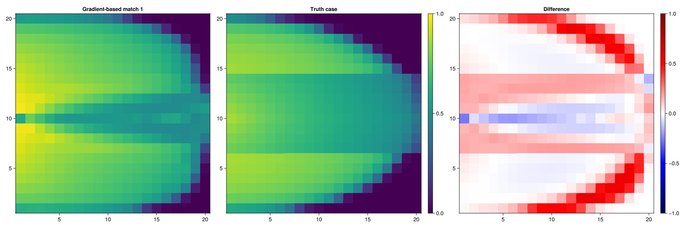

### Plot one of the tuned parameters {#Plot-one-of-the-tuned-parameters}

We can also plot the tuned parameters to see how they look. The tuned parameters vary more or less continously, even though the truth case has distinct regions in place. When the optimization process is conditioned on data from the wells, the optimizer will tend to make the most drastic changes in the near-well region, as these values often have the highest initial gradient.

```julia
plot_2d(prm_tune1[:Reservoir][:NonWettingKrExponent], "Tuned Wetting Kr exponent")
```

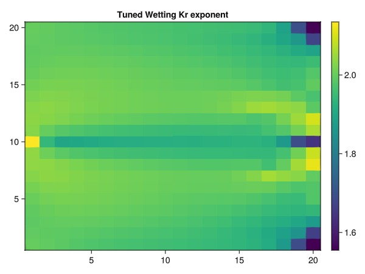

## Set up a second optimization {#Set-up-a-second-optimization}

Let us set up a second optimization problem where we instead of letting the cells vary independently, we assume that the cells are lumped into the two rock types and that we know the distribution of the rock types. This is a more constrained optimization problem, and we can expect that there are fewer solutions to this problem than the previous version.

```julia
cfg2 = optimization_config(model_base, prm_untuned)

for (mkey, mcfg) in pairs(cfg2)
    for (k, v) in pairs(mcfg)
        if mkey != :Reservoir
            v[:active] = false
        elseif k == :NonWettingKrExponent || k == :WettingKrExponent
            v[:active] = true
            v[:abs_min], v[:abs_max] = kr_exp_bnds
            v[:lumping] = rocktype
        elseif k == :WettingCritical || k == :NonWettingCritical
            v[:active] = true
            v[:abs_min], v[:abs_max] = kr_crit_bnds
            v[:lumping] = rocktype
        elseif k == :WettingKrMax || k == :NonWettingKrMax
            v[:lumping] = rocktype
            v[:active] = true
            v[:abs_min], v[:abs_max] = kr_max_bnds
            v[:lumping] = rocktype
        else
            v[:active] = false
        end
    end
end
opt_setup_lump = JutulDarcy.setup_reservoir_parameter_optimization(case_untuned, mismatch_objective, cfg2)
prm_tune2 = solve_optimization(opt_setup_lump)
```


```
Dict{Symbol, Any} with 6 entries:
  :I         => Dict{Symbol, Any}(:FluidVolume=>[0.314159], :WellIndicesThermal…
  :P1        => Dict{Symbol, Any}(:FluidVolume=>[0.314159], :WellIndicesThermal…
  :P3        => Dict{Symbol, Any}(:FluidVolume=>[0.314159], :WellIndicesThermal…
  :Reservoir => Dict{Symbol, Any}(:Transmissibilities=>[9.86923e-13, 9.86923e-1…
  :P2        => Dict{Symbol, Any}(:FluidVolume=>[0.314159], :WellIndicesThermal…
  :Facility  => Dict{Symbol, Any}()
```


### Plot the results {#Plot-the-results}

We again see excellent match against the reference well solutions.

```julia
ws_tune2, states_tune2 = simulate_reservoir(state0, model_base, dt, forces = forces, parameters = prm_tune2, info_level = -1);
plot_match(ws_tune2, "Gradient-based match (regions as prior)")
```

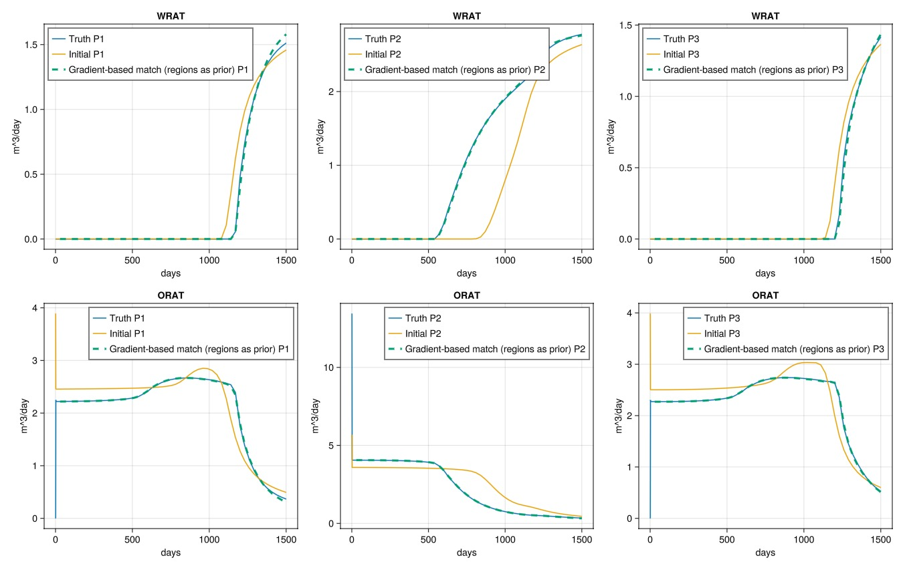

### Plot the saturation front {#Plot-the-saturation-front-2}

The saturation front is also a good match to the truth case as the prior information about the rock types constrained the optimization problem substantially.

```julia
plot_sat_match(states_tune2, "Gradient-based match 2")
```

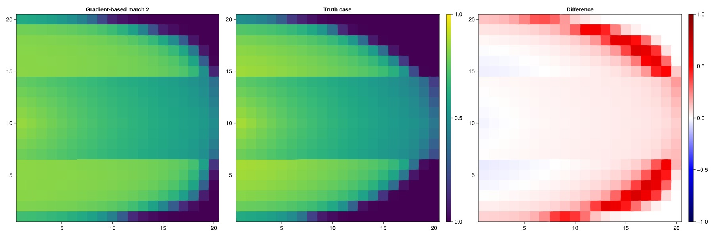

### Print the parameters {#Print-the-parameters}

We can also print the tuned parameters to see how they look. The tuned parameters are for the most part fairly close to the truth case, but there are still substantial differences as some parameters may not actually impact the objective much, or can be compensated by other parameters. The problem is still not quite unique – but it is much more constrained than the previous case.

```julia
function print_match(prm)
    rprm = prm[:Reservoir]
    for k in [:NonWettingKrExponent, :WettingKrExponent, :WettingCritical, :NonWettingCritical, :WettingKrMax, :NonWettingKrMax]
        println("Parameter $k")
        for (regno, cell) in enumerate((is1[1], is2[1]))
            ref = prm_base[:Reservoir][k][cell]
            tuned = rprm[k][cell]
            println("Truth: $ref, Tuned: $tuned")
        end
    end
end
print_match(prm_tune2)
```


```
Parameter NonWettingKrExponent
Truth: 1.8, Tuned: 1.1867888815607042
Truth: 3.0, Tuned: 2.6774119612700775
Parameter WettingKrExponent
Truth: 1.0, Tuned: 1.5096485941870017
Truth: 1.0, Tuned: 1.0793988015205729
Parameter WettingCritical
Truth: 0.3, Tuned: 0.2049126439498945
Truth: 0.1, Tuned: 0.08443459614777427
Parameter NonWettingCritical
Truth: 0.1, Tuned: 0.16803518796801387
Truth: 0.1, Tuned: 0.13869499982642006
Parameter WettingKrMax
Truth: 0.7, Tuned: 0.6562277315696121
Truth: 1.0, Tuned: 0.9741784887270467
Parameter NonWettingKrMax
Truth: 0.8, Tuned: 0.7983843067915537
Truth: 1.0, Tuned: 1.0
```


### Set up a blending variable {#Set-up-a-blending-variable}

Let us flip the problem: What if we know that there are two rock types with corresponding relative permeabilities, but we do not exactly know their distribution? Determining what cells have what rock type is a difficult problem and is in principle discrete (a cell is either rock type 1 or rock type 2). We can use a trick from machine learning to make the problem amenable to gradient based optimization, however, by introducing blending functions that continuously vary between the two rock types. This is a common approach in machine learning and is often referred to as &quot;soft&quot; or &quot;fuzzy&quot; clustering.

We can show the sigmoid function that we will use to blend between the two rock types. The function is defined as: $f(x) = \frac{1}{1 + e^{-αx}}$ where the α parameter adjusts how steeply the function changes between the two regions at x=1.

```julia
function sigmoid(x, α = 1.0)
    return 1.0 / (1.0 + exp(-α*x))
end

x = range(-1, 1, length = 1000)
y1 = sigmoid.(x, 1.0)
y2 = sigmoid.(x, 2.0)
y5 = sigmoid.(x, 5.0)
y10 = sigmoid.(x, 10.0)
y20 = sigmoid.(x, 20.0)

fig = Figure()
ax = Axis(fig[1, 1], title = "Sigmoid Function", xlabel = "x", ylabel = "sigmoid(x)")
lines!(ax, x, y1, linewidth = 2, label = "sigmoid(x) α=1.0")
lines!(ax, x, y2, linewidth = 2, label = "sigmoid(x) α=2.0")
lines!(ax, x, y5, linewidth = 2, label = "sigmoid(x) α=5.0")
lines!(ax, x, y10, linewidth = 2, label = "sigmoid(x) α=10.0")
lines!(ax, x, y20, linewidth = 2, label = "sigmoid(x) α=20.0")
axislegend(position = :lt)
fig
```

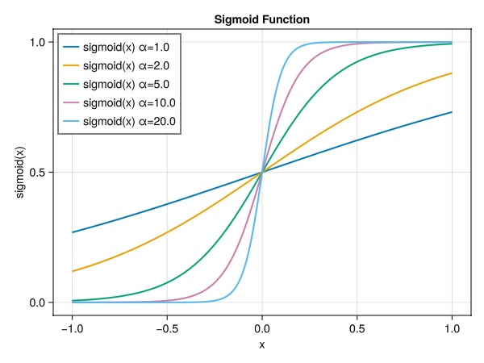

## Plot the blending function for a few regions {#Plot-the-blending-function-for-a-few-regions}

We can plot the blending function for a few regions. The blending function transitions smoothly between the different regions as the variable goes from region 1 (value 1) to region 5 (value 5). This choice of function is particularly attractive since it is differentiable everywhere and forms a partition of unity, so that a smooth function can be constructed by combining the weights with the corresponding functions:

$f(x) = \sum_{i=1}^n w_i(x) f_i(x)$

```julia
function myblend(x, low_bnd, n_max, α = 20.0)
    w1 = sigmoid(x - low_bnd - 0.5, α)
    w2 = sigmoid(x - low_bnd + 0.5, α)
    if low_bnd == 1
        w = 1.0 - w1
    elseif low_bnd == n_max
        w = w2
    else
        w = w2 - w1
    end
    return w
end

nmax = 5
x = range(1, nmax, length = 1000)

fig = Figure(size = (800, 400))
ax = Axis(fig[1, 1], title = "Blending Function", xlabel = "x", ylabel = "blend(x)")
for i in 1:nmax
    v = myblend.(x, i, nmax)
    lines!(ax, x, v, linewidth = 2, label = "Region $i")
end
ylims!(ax, (0, 1.2))
ax.xticks = 0:nmax+1
axislegend(position = :lt, nbanks = 5)
fig
```

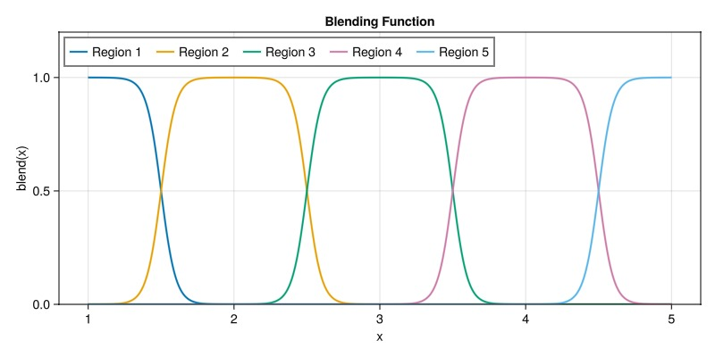

## Set up blending problem {#Set-up-blending-problem}

In our example, if we know that there are two relative permeabilities, the above discussion can be simplified to the case:

$k_r = k_{r1}(p) w_1 + k_{r2} w_2(p)$

Here, $k_{r1}$ and $k_{r2}$ are the two relative permeabilities, and $w_1$ and $w_2$ are the weights of the blending function with respect to regions 1 and 2 that depends on the continuous parameter $p$.

The goal, in terms of programming, is then the following:
1. Set up two relative permeability functions with names 1 and 2 that are distinct and uniform throughout the domain (corresponding to parameter sets 1 and 2 in the truth case).
  
2. Set up a blending parameter together with a new relative permeability function that combines the two relative permeabilities according to the blending rule described above.
  
3. Optimize this case for the blending variable itself, leaving all other variables untouched.
  

Fortunately for us, the blending functionality is already implemented in Jutul. The setup below is primarily verbose because we need to add another relative permeability function with renamed parameters (adding the suffix 2 to the default names) and letting the blending function know that it is supposed to blend the two named fields RelativePermeabilities1 and RelativePermeabilities2 together with one value per phase in each cell based on the added blending parameter.

```julia
model_blend, = setup_model_with_relperm(kr);
rmodel_blend = reservoir_model(model_blend)

kr2 = JutulDarcy.ParametricCoreyRelativePermeabilities(
    wetting_exponent = :WettingKrExponent2,
    nonwetting_exponent = :NonWettingKrExponent2,
    wetting_critical = :WettingCritical2,
    nonwetting_critical = :NonWettingCritical2,
    wetting_krmax = :WettingKrMax2,
    nonwetting_krmax = :NonWettingKrMax2
)

nph = number_of_phases(sys)
blend_var = Jutul.BlendingVariable((:RelativePermeabilities1, :RelativePermeabilities2), nph)
blend_par = Jutul.BlendingParameter(nph)

set_secondary_variables!(rmodel_blend,
    RelativePermeabilities1 = kr,
    RelativePermeabilities2 = kr2,
    RelativePermeabilities = blend_var
)

set_parameters!(rmodel_blend,
    BlendingParameter = blend_par,
)

JutulDarcy.add_relperm_parameters!(rmodel_blend.parameters, kr2)
```


```
OrderedDict{Symbol, Any} with 18 entries:
  :Transmissibilities        => Transmissibilities()
  :TwoPointGravityDifference => TwoPointGravityDifference()
  :ConnateWater              => ConnateWater()
  :PhaseViscosities          => PhaseViscosities()
  :FluidVolume               => FluidVolume()
  :NonWettingCritical        => CriticalKrPoints()
  :WettingCritical           => CriticalKrPoints()
  :NonWettingKrMax           => MaxRelPermPoints()
  :WettingKrMax              => MaxRelPermPoints()
  :NonWettingKrExponent      => CoreyExponentKrPoints()
  :WettingKrExponent         => CoreyExponentKrPoints()
  :BlendingParameter         => BlendingParameter(2)
  :NonWettingCritical2       => CriticalKrPoints()
  :WettingCritical2          => CriticalKrPoints()
  :NonWettingKrMax2          => MaxRelPermPoints()
  :WettingKrMax2             => MaxRelPermPoints()
  :NonWettingKrExponent2     => CoreyExponentKrPoints()
  :WettingKrExponent2        => CoreyExponentKrPoints()
```


### Set parameters for the two regions {#Set-parameters-for-the-two-regions}

Since we now have two separate relative permeability functions, each with their own parameters, we set one of them to use the truth parameters for the first region and the other to use the truth parameters for the second region.

The tuning is then done by only tuning the blending parameter.

```julia
prm_blend_outer = setup_parameters(model_blend)
prm_blend = prm_blend_outer[:Reservoir]

prm_blend[:NonWettingKrExponent] .= 1.8
prm_blend[:NonWettingKrExponent2] .= 3.0

prm_blend[:WettingKrExponent] .= 1.0
prm_blend[:WettingKrExponent2] .= 1.0

prm_blend[:WettingCritical] .= 0.3
prm_blend[:WettingCritical2] .= 0.1

prm_blend[:NonWettingCritical] .= 0.1
prm_blend[:NonWettingCritical2] .= 0.1

prm_blend[:WettingKrMax] .= 0.7
prm_blend[:WettingKrMax2] .= 1.0

prm_blend[:NonWettingKrMax] .= 0.8
prm_blend[:NonWettingKrMax2] .= 1.0


cfg3 = optimization_config(model_blend, prm_blend_outer)

for (mkey, mcfg) in pairs(cfg3)
    for (k, v) in pairs(mcfg)
        if mkey != :Reservoir
            v[:active] = false
        elseif k == :BlendingParameter
            v[:active] = true
            v[:abs_min], v[:abs_max] = (1.0, 2.0)
        else
            v[:active] = false
        end
    end
end
state0_blend = setup_reservoir_state(model_blend, Pressure = 90barsa, Saturations = [0.0, 1.0])
case_lump = JutulCase(model_blend, dt, forces, state0 = state0_blend, parameters = prm_blend_outer)

opt_setup_lump = JutulDarcy.setup_reservoir_parameter_optimization(case_lump, mismatch_objective, cfg3)
prm_tune3 = solve_optimization(opt_setup_lump)
```


```
Dict{Symbol, Any} with 6 entries:
  :I         => Dict{Symbol, Any}(:FluidVolume=>[0.314159], :WellIndicesThermal…
  :P1        => Dict{Symbol, Any}(:FluidVolume=>[0.314159], :WellIndicesThermal…
  :P3        => Dict{Symbol, Any}(:FluidVolume=>[0.314159], :WellIndicesThermal…
  :Reservoir => Dict{Symbol, Any}(:BlendingParameter=>[1.44283, 1.40234, 1.3818…
  :P2        => Dict{Symbol, Any}(:FluidVolume=>[0.314159], :WellIndicesThermal…
  :Facility  => Dict{Symbol, Any}()
```


### Plot the results {#Plot-the-results-2}

We plot the blending parameter both as a smooth parameter (what the optimizer works with) and the parameter rounded to a integer (which can then be input to a standard simulator that does not support the blending trick).

```julia
function plot_blending(vals)
    vals = reshape(vals, nx, nx)
    fig = Figure(size = (1800, 600))
    ax = Axis(fig[1, 1], title = "Tuned parameter")
    plt = heatmap!(ax, vals, colorrange = (1.0, 2.0), colormap = :vik)
    Colorbar(fig[1, 2], plt)
    ax = Axis(fig[1, 3], title = "Effective region")
    heatmap!(ax, round.(vals), colorrange = (1.0, 2.0), colormap = :vik)
    ax = Axis(fig[1, 4], title = "Truth region")
    plt = heatmap!(ax, reshape(rocktype, nx, nx), colorrange = (1.0, 2.0), colormap = Categorical(:vik))
    Colorbar(fig[1, 5], plt)
    fig
end
plot_blending(prm_tune3[:Reservoir][:BlendingParameter])
```

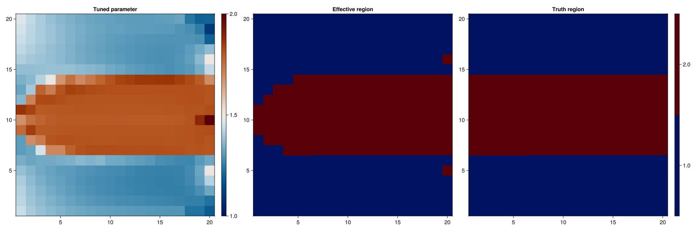

### Verify match {#Verify-match}

We again see good match against the truth case.

```julia
ws_tune3, states_tune3 = simulate_reservoir(state0_blend, model_blend, dt, forces = forces, parameters = prm_tune3, info_level = -1);
plot_match(ws_tune3, "Gradient-based match (blended regions)")
```

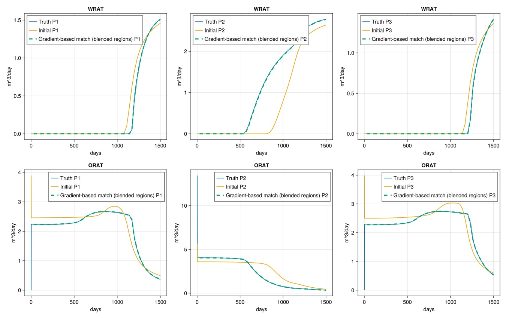

### Plot the saturation front {#Plot-the-saturation-front-3}

```julia
plot_sat_match(states_tune3, "Gradient-based match 3 (blended regions)")
```

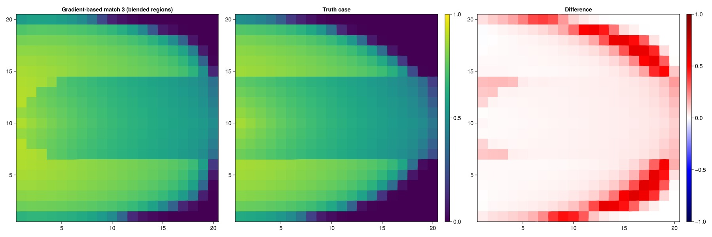

### Run simulation with truncated blending parameter {#Run-simulation-with-truncated-blending-parameter}

We can also turn the region into a discrete region by rounding the blending function and check if the match is substantially different. As most cells are firmly in one region or the other, we can expect that the match remains good.

```julia
prm_tune3_trunc = deepcopy(prm_tune3)
prm_tune3_trunc[:Reservoir][:BlendingParameter] = round.(prm_tune3[:Reservoir][:BlendingParameter])
ws_tune3_trunc, = simulate_reservoir(state0_blend, model_blend, dt, forces = forces, parameters = prm_tune3_trunc, info_level = -1);
plot_match(ws_tune3_trunc, "Gradient-based match (blended, truncated)")
```

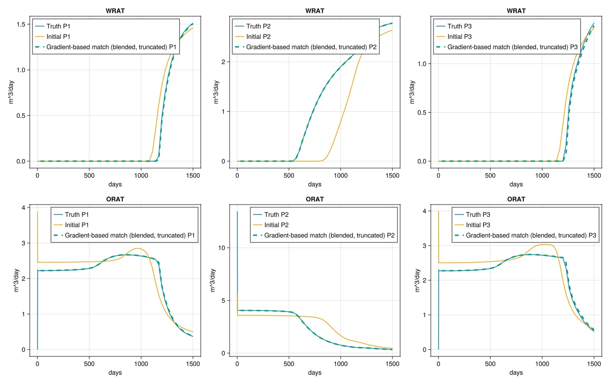

## Optimize regions and parameters at the same time {#Optimize-regions-and-parameters-at-the-same-time}

Finally, we can also optimize the regions and the parameters at the same time. This is a weaker assumption than the two preceeding cases, as the only prior information for the relative permeabilities are the bounds for the parameters and the fact that there are two regions. Consequently, we expect a worse match than in the previous case when looking at saturations and regions.

```julia
cfg4 = optimization_config(model_blend, prm_blend_outer)

equal_lumping = ones(Int, nc)
for (mkey, mcfg) in pairs(cfg4)
    for (k, v) in pairs(mcfg)
        if mkey != :Reservoir
            v[:active] = false
        elseif k == :NonWettingKrExponent || k == :WettingKrExponent || k == :NonWettingKrExponent2 || k == :WettingKrExponent2
            v[:active] = true
            v[:abs_min], v[:abs_max] = kr_exp_bnds
            v[:lumping] = equal_lumping
        elseif k == :WettingCritical || k == :NonWettingCritical || k == :WettingCritical2 || k == :NonWettingCritical2
            v[:active] = true
            v[:abs_min], v[:abs_max] = kr_crit_bnds
            v[:lumping] = equal_lumping
        elseif k == :WettingKrMax || k == :NonWettingKrMax || k == :WettingKrMax2 || k == :NonWettingKrMax2
            v[:active] = true
            v[:abs_min], v[:abs_max] = kr_max_bnds
            v[:lumping] = equal_lumping
        elseif k == :BlendingParameter
            v[:active] = true
            v[:abs_min], v[:abs_max] = (1.0, 2.0)
        else
            v[:active] = false
        end
    end
end
opt_setup_lump2 = JutulDarcy.setup_reservoir_parameter_optimization(case_lump, mismatch_objective, cfg4)
prm_tune4 = solve_optimization(opt_setup_lump2)
```


```
Dict{Symbol, Any} with 6 entries:
  :I         => Dict{Symbol, Any}(:FluidVolume=>[0.314159], :WellIndicesThermal…
  :P1        => Dict{Symbol, Any}(:FluidVolume=>[0.314159], :WellIndicesThermal…
  :P3        => Dict{Symbol, Any}(:FluidVolume=>[0.314159], :WellIndicesThermal…
  :Reservoir => Dict{Symbol, Any}(:BlendingParameter=>[1.49424, 1.48956, 1.4861…
  :P2        => Dict{Symbol, Any}(:FluidVolume=>[0.314159], :WellIndicesThermal…
  :Facility  => Dict{Symbol, Any}()
```


### Plot the match {#Plot-the-match}

```julia
ws_tune4, states_tune4 = simulate_reservoir(state0_blend, model_blend, dt, forces = forces, parameters = prm_tune4, info_level = -1);
plot_match(ws_tune4, "Gradient-based match")
```

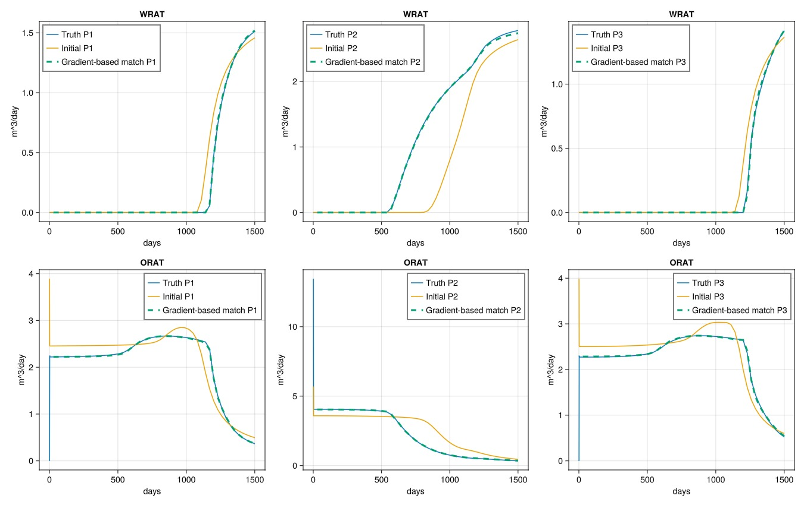

### Plot the saturations {#Plot-the-saturations}

```julia
plot_sat_match(states_tune4, "Gradient-based match 4")
```

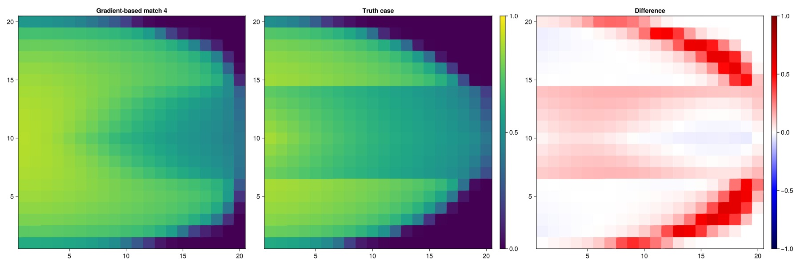

### Plot the blending parameter {#Plot-the-blending-parameter}

We recover a reasonable two-region distribution even when simultaneously optimizing both the blending parameter and the relative permeability parameters.

```julia
plot_blending(prm_tune4[:Reservoir][:BlendingParameter])
```

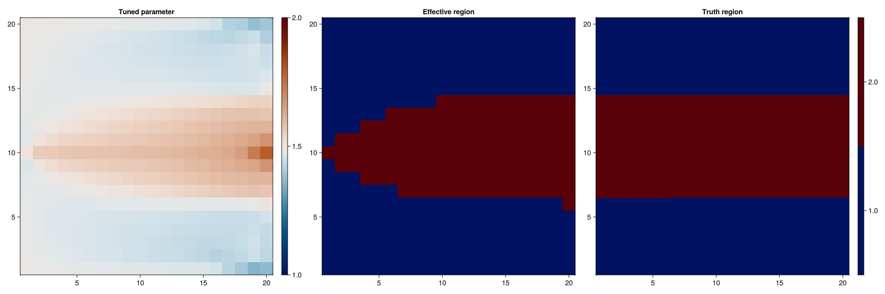

## Conclusion {#Conclusion}

History matching is a fundamentally ill-posed problem and prior assumptions is a large part of narrowing down the problem. In this example we have seen a few different ways of looking at the same matching problem depending on the prior modeling assumptions. Gradient-based optimization is a powerful tool for history matching when you have access to a differentiable simulator. The flexibility to allow on-the-fly setup of new functional relationships and corresponding parameters in JutulDarcy nicely complements the gradients, allowing us to reframe the problem to match our prior assumptions.

## Example on GitHub {#Example-on-GitHub}

If you would like to run this example yourself, it can be downloaded from the JutulDarcy.jl GitHub repository [as a script](https://github.com/sintefmath/JutulDarcy.jl/blob/main/examples/data_assimilation/advanced_history_match.jl), or as a [Jupyter Notebook](https://github.com/sintefmath/JutulDarcy.jl/blob/gh-pages/dev/final_site/notebooks/data_assimilation/advanced_history_match.ipynb)

```
This example took 214.054639876 seconds to complete.
```


---


_This page was generated using [Literate.jl](https://github.com/fredrikekre/Literate.jl)._
