# History matching a coarse model - CGNet {#History-matching-a-coarse-model-CGNet}

This example demonstrates how to calibrate a coarse model against results from a fine model. We do this by optimizing the parameters of the coarse model to match the well curves. This is a implementation of the method described in [[7](/extras/refs#cgnet1)]. This also serves as a demonstration of how to use the simulator for history matching, as the fine model results can stand in for real field observations.

## Load and simulate Egg base case {#Load-and-simulate-Egg-base-case}

We take a subset of the first 60 steps (1350 days) since not much happens after that in terms of well behavior.

```julia
using Jutul, JutulDarcy, HYPRE, GeoEnergyIO, GLMakie
import LBFGSB as lb

egg_dir = JutulDarcy.GeoEnergyIO.test_input_file_path("EGG")
data_pth = joinpath(egg_dir, "EGG.DATA")

fine_case = setup_case_from_data_file(data_pth)
fine_case = fine_case[1:60]
simulated_fine = simulate_reservoir(fine_case)
plot_reservoir(fine_case, simulated_fine.states, key = :Saturations, step = 60)
```

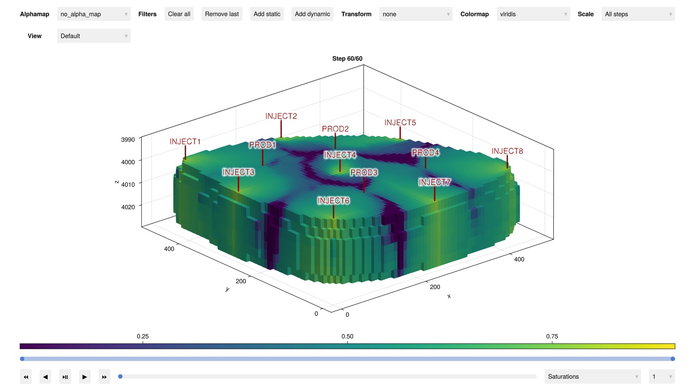

## Create initial coarse model and simulate {#Create-initial-coarse-model-and-simulate}

```julia
coarse_case = JutulDarcy.coarsen_reservoir_case(fine_case, (25, 25, 5), method = :ijk)
simulated_coarse = simulate_reservoir(coarse_case)
plot_reservoir(coarse_case, simulated_coarse.states, key = :Saturations, step = 60)
```

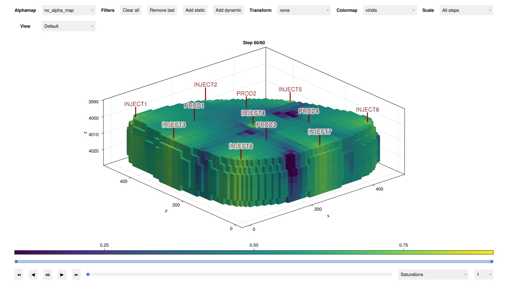

## Setup optimization {#Setup-optimization}

We set up the optimization problem by defining the objective function as a sum of squared mismatches for all well observations, for all time-steps. We also define limits for the parameters, and set up the optimization problem.

We also limit the number of function evaluations since this example runs as a part of continuous integration and we want to keep the runtime short.

```julia
function setup_optimization_cgnet(case_c, case_f, result_f)
    states_f = result_f.result.states
    wells_results, = result_f
    model_c = case_c.model
    state0_c = setup_state(model_c, case_c.state0);
    param_c = setup_parameters(model_c)
    forces_c = case_c.forces
    dt = case_c.dt
    model_f = case_f.model

    bhp = JutulDarcy.BottomHolePressureTarget(1.0)
    wells = collect(keys(JutulDarcy.get_model_wells(case_f)))

    day = si_unit(:day)
    wrat_scale = (1/150)*day
    orat_scale = (1/80)*day
    grat_scale = (1/1000)*day

    w = []
    matches = []
    signs = []
    sys = reservoir_model(model_f).system
    wrat = SurfaceWaterRateTarget(-1.0)
    orat = SurfaceOilRateTarget(-1.0)
    grat = SurfaceGasRateTarget(-1.0)

    push!(matches, bhp)
    push!(w, 1.0/si_unit(:bar))
    push!(signs, 1)

    for phase in JutulDarcy.get_phases(sys)
        if phase == LiquidPhase()
            push!(matches, orat)
            push!(w, orat_scale)
            push!(signs, -1)

        elseif phase == VaporPhase()
            push!(matches, grat)
            push!(w, grat_scale)
            push!(signs, -1)
        else
            @assert phase == AqueousPhase()
            push!(matches, wrat)
            push!(w, wrat_scale)
            push!(signs, -1)
        end
    end
    signs = zeros(Int, length(signs))
    o_scale = 1.0/(sum(dt)*length(wells))
    G = (model_c, state_c, dt, step_no, forces) -> well_mismatch(
        matches,
        wells,
        model_f,
        states_f,
        model_c,
        state_c,
        dt,
        step_no,
        forces,
        weights = w,
        scale = o_scale,
        signs = signs
    )

    @assert Jutul.evaluate_objective(G, model_f, states_f, dt, case_f.forces) == 0.0
    #
    cfg = optimization_config(model_c, param_c,
        use_scaling = true,
        rel_min = 0.001,
        rel_max = 1000
    )
    for (k, v) in cfg
        for (ki, vi) in v
            if ki == :FluidVolume
                vi[:active] = k == :Reservoir
            end
            if ki == :ConnateWater
                vi[:active] = false
            end
            if ki in [:TwoPointGravityDifference, :PhaseViscosities, :PerforationGravityDifference]
                vi[:active] = false
            end
            if ki in [:WellIndices, :Transmissibilities]
                vi[:active] = true
                vi[:abs_min] = 0.0
                vi[:abs_max] = 1e-6
            end

        end
    end
    opt_setup = setup_parameter_optimization(model_c, state0_c, param_c, dt, forces_c, G, cfg);
    x0 = opt_setup.x0
    F0 = opt_setup.F!(x0)
    dF0 = opt_setup.dF!(similar(x0), x0)
    println("Initial objective: $F0, gradient norm $(sum(abs, dF0))")
    return opt_setup
end
```


```
setup_optimization_cgnet (generic function with 1 method)
```


## Define the optimization loop {#Define-the-optimization-loop}

JutulDarcy can use any optimization package that can work with gradients and limits, here we use the `LBFGSB` package.

```julia
function optimize_cgnet(opt_setup)
    lower = opt_setup.limits.min
    upper = opt_setup.limits.max
    x0 = opt_setup.x0
    n = length(x0)
    setup = Dict(:lower => lower, :upper => upper, :x0 => copy(x0))

    prt = 1
    f! = (x) -> opt_setup.F_and_dF!(NaN, nothing, x)
    g! = (dFdx, x) -> opt_setup.F_and_dF!(NaN, dFdx, x)
    results, final_x = lb.lbfgsb(f!, g!, x0, lb=lower, ub=upper,
        iprint = prt,
        factr = 1e12,
        maxfun = 20,
        maxiter = 20,
        m = 20
    )
    return (final_x, results, setup)
end
```


```
optimize_cgnet (generic function with 1 method)
```


## Run the optimization {#Run-the-optimization}

```julia
opt_setup = setup_optimization_cgnet(coarse_case, fine_case, simulated_fine);
final_x, results, setup = optimize_cgnet(opt_setup);
```


```
Parameters for PROD4
┌────────────────────┬──────────────┬───┬─────────┬─────────────┬────────────────┬──────────────────────┬─────────┐
│               Name │       Entity │ N │   Scale │ Abs. limits │    Rel. limits │               Limits │ Lumping │
├────────────────────┼──────────────┼───┼─────────┼─────────────┼────────────────┼──────────────────────┼─────────┤
│ WellIndicesThermal │ Perforations │ 5 │ default │    [0, Inf] │ [0.001, 1e+03] │   [0.0183, 3.67e+04] │       - │
│        WellIndices │ Perforations │ 5 │ default │  [0, 1e-06] │ [0.001, 1e+03] │ [4.22e-15, 7.95e-09] │       - │
└────────────────────┴──────────────┴───┴─────────┴─────────────┴────────────────┴──────────────────────┴─────────┘
Parameters for Reservoir
┌────────────────────┬────────┬──────┬─────────┬─────────────────┬────────────────┬──────────────────────┬─────────┐
│               Name │ Entity │    N │   Scale │     Abs. limits │    Rel. limits │               Limits │ Lumping │
├────────────────────┼────────┼──────┼─────────┼─────────────────┼────────────────┼──────────────────────┼─────────┤
│ Transmissibilities │  Faces │ 6792 │ default │      [0, 1e-06] │ [0.001, 1e+03] │ [1.71e-16, 4.75e-08] │       - │
│        FluidVolume │  Cells │ 2516 │ default │ [2.22e-16, Inf] │ [0.001, 1e+03] │   [0.0512, 9.22e+05] │       - │
└────────────────────┴────────┴──────┴─────────┴─────────────────┴────────────────┴──────────────────────┴─────────┘
Parameters for INJECT5
┌────────────────────┬──────────────┬───┬─────────┬─────────────┬────────────────┬──────────────────────┬─────────┐
│               Name │       Entity │ N │   Scale │ Abs. limits │    Rel. limits │               Limits │ Lumping │
├────────────────────┼──────────────┼───┼─────────┼─────────────┼────────────────┼──────────────────────┼─────────┤
│ WellIndicesThermal │ Perforations │ 5 │ default │    [0, Inf] │ [0.001, 1e+03] │   [0.0183, 3.67e+04] │       - │
│        WellIndices │ Perforations │ 5 │ default │  [0, 1e-06] │ [0.001, 1e+03] │ [9.46e-15, 1.96e-08] │       - │
└────────────────────┴──────────────┴───┴─────────┴─────────────┴────────────────┴──────────────────────┴─────────┘
Parameters for INJECT4
┌────────────────────┬──────────────┬───┬─────────┬─────────────┬────────────────┬──────────────────────┬─────────┐
│               Name │       Entity │ N │   Scale │ Abs. limits │    Rel. limits │               Limits │ Lumping │
├────────────────────┼──────────────┼───┼─────────┼─────────────┼────────────────┼──────────────────────┼─────────┤
│ WellIndicesThermal │ Perforations │ 5 │ default │    [0, Inf] │ [0.001, 1e+03] │   [0.0164, 3.28e+04] │       - │
│        WellIndices │ Perforations │ 5 │ default │  [0, 1e-06] │ [0.001, 1e+03] │ [2.33e-15, 5.35e-09] │       - │
└────────────────────┴──────────────┴───┴─────────┴─────────────┴────────────────┴──────────────────────┴─────────┘
Parameters for INJECT8
┌────────────────────┬──────────────┬───┬─────────┬─────────────┬────────────────┬─────────────────────┬─────────┐
│               Name │       Entity │ N │   Scale │ Abs. limits │    Rel. limits │              Limits │ Lumping │
├────────────────────┼──────────────┼───┼─────────┼─────────────┼────────────────┼─────────────────────┼─────────┤
│ WellIndicesThermal │ Perforations │ 5 │ default │    [0, Inf] │ [0.001, 1e+03] │  [0.0171, 3.42e+04] │       - │
│        WellIndices │ Perforations │ 5 │ default │  [0, 1e-06] │ [0.001, 1e+03] │ [2.9e-15, 7.68e-09] │       - │
└────────────────────┴──────────────┴───┴─────────┴─────────────┴────────────────┴─────────────────────┴─────────┘
Parameters for INJECT6
┌────────────────────┬──────────────┬───┬─────────┬─────────────┬────────────────┬──────────────────────┬─────────┐
│               Name │       Entity │ N │   Scale │ Abs. limits │    Rel. limits │               Limits │ Lumping │
├────────────────────┼──────────────┼───┼─────────┼─────────────┼────────────────┼──────────────────────┼─────────┤
│ WellIndicesThermal │ Perforations │ 5 │ default │    [0, Inf] │ [0.001, 1e+03] │   [0.0171, 3.42e+04] │       - │
│        WellIndices │ Perforations │ 5 │ default │  [0, 1e-06] │ [0.001, 1e+03] │ [5.94e-15, 1.29e-08] │       - │
└────────────────────┴──────────────┴───┴─────────┴─────────────┴────────────────┴──────────────────────┴─────────┘
Parameters for INJECT1
┌────────────────────┬──────────────┬───┬─────────┬─────────────┬────────────────┬──────────────────────┬─────────┐
│               Name │       Entity │ N │   Scale │ Abs. limits │    Rel. limits │               Limits │ Lumping │
├────────────────────┼──────────────┼───┼─────────┼─────────────┼────────────────┼──────────────────────┼─────────┤
│ WellIndicesThermal │ Perforations │ 5 │ default │    [0, Inf] │ [0.001, 1e+03] │   [0.0183, 3.67e+04] │       - │
│        WellIndices │ Perforations │ 5 │ default │  [0, 1e-06] │ [0.001, 1e+03] │ [4.45e-15, 1.02e-08] │       - │
└────────────────────┴──────────────┴───┴─────────┴─────────────┴────────────────┴──────────────────────┴─────────┘
Parameters for INJECT7
┌────────────────────┬──────────────┬───┬─────────┬─────────────┬────────────────┬──────────────────────┬─────────┐
│               Name │       Entity │ N │   Scale │ Abs. limits │    Rel. limits │               Limits │ Lumping │
├────────────────────┼──────────────┼───┼─────────┼─────────────┼────────────────┼──────────────────────┼─────────┤
│ WellIndicesThermal │ Perforations │ 5 │ default │    [0, Inf] │ [0.001, 1e+03] │   [0.0164, 3.28e+04] │       - │
│        WellIndices │ Perforations │ 5 │ default │  [0, 1e-06] │ [0.001, 1e+03] │ [2.23e-15, 4.66e-09] │       - │
└────────────────────┴──────────────┴───┴─────────┴─────────────┴────────────────┴──────────────────────┴─────────┘
Parameters for INJECT3
┌────────────────────┬──────────────┬───┬─────────┬─────────────┬────────────────┬─────────────────────┬─────────┐
│               Name │       Entity │ N │   Scale │ Abs. limits │    Rel. limits │              Limits │ Lumping │
├────────────────────┼──────────────┼───┼─────────┼─────────────┼────────────────┼─────────────────────┼─────────┤
│ WellIndicesThermal │ Perforations │ 5 │ default │    [0, Inf] │ [0.001, 1e+03] │  [0.0171, 3.42e+04] │       - │
│        WellIndices │ Perforations │ 5 │ default │  [0, 1e-06] │ [0.001, 1e+03] │ [4.87e-15, 1.3e-08] │       - │
└────────────────────┴──────────────┴───┴─────────┴─────────────┴────────────────┴─────────────────────┴─────────┘
Parameters for PROD2
┌────────────────────┬──────────────┬───┬─────────┬─────────────┬────────────────┬──────────────────────┬─────────┐
│               Name │       Entity │ N │   Scale │ Abs. limits │    Rel. limits │               Limits │ Lumping │
├────────────────────┼──────────────┼───┼─────────┼─────────────┼────────────────┼──────────────────────┼─────────┤
│ WellIndicesThermal │ Perforations │ 5 │ default │    [0, Inf] │ [0.001, 1e+03] │   [0.0171, 3.42e+04] │       - │
│        WellIndices │ Perforations │ 5 │ default │  [0, 1e-06] │ [0.001, 1e+03] │ [2.96e-14, 4.31e-08] │       - │
└────────────────────┴──────────────┴───┴─────────┴─────────────┴────────────────┴──────────────────────┴─────────┘
Parameters for PROD3
┌────────────────────┬──────────────┬───┬─────────┬─────────────┬────────────────┬─────────────────────┬─────────┐
│               Name │       Entity │ N │   Scale │ Abs. limits │    Rel. limits │              Limits │ Lumping │
├────────────────────┼──────────────┼───┼─────────┼─────────────┼────────────────┼─────────────────────┼─────────┤
│ WellIndicesThermal │ Perforations │ 5 │ default │    [0, Inf] │ [0.001, 1e+03] │  [0.0183, 3.67e+04] │       - │
│        WellIndices │ Perforations │ 5 │ default │  [0, 1e-06] │ [0.001, 1e+03] │ [2.34e-15, 5.7e-09] │       - │
└────────────────────┴──────────────┴───┴─────────┴─────────────┴────────────────┴─────────────────────┴─────────┘
Parameters for PROD1
┌────────────────────┬──────────────┬───┬─────────┬─────────────┬────────────────┬──────────────────────┬─────────┐
│               Name │       Entity │ N │   Scale │ Abs. limits │    Rel. limits │               Limits │ Lumping │
├────────────────────┼──────────────┼───┼─────────┼─────────────┼────────────────┼──────────────────────┼─────────┤
│ WellIndicesThermal │ Perforations │ 5 │ default │    [0, Inf] │ [0.001, 1e+03] │   [0.0183, 3.67e+04] │       - │
│        WellIndices │ Perforations │ 5 │ default │  [0, 1e-06] │ [0.001, 1e+03] │ [2.04e-15, 4.29e-09] │       - │
└────────────────────┴──────────────┴───┴─────────┴─────────────┴────────────────┴──────────────────────┴─────────┘
Parameters for INJECT2
┌────────────────────┬──────────────┬───┬─────────┬─────────────┬────────────────┬──────────────────────┬─────────┐
│               Name │       Entity │ N │   Scale │ Abs. limits │    Rel. limits │               Limits │ Lumping │
├────────────────────┼──────────────┼───┼─────────┼─────────────┼────────────────┼──────────────────────┼─────────┤
│ WellIndicesThermal │ Perforations │ 5 │ default │    [0, Inf] │ [0.001, 1e+03] │   [0.0183, 4.59e+04] │       - │
│        WellIndices │ Perforations │ 5 │ default │  [0, 1e-06] │ [0.001, 1e+03] │ [1.08e-14, 2.15e-08] │       - │
└────────────────────┴──────────────┴───┴─────────┴─────────────┴────────────────┴──────────────────────┴─────────┘
Obj. #1: 5.9118e+00 (best: Inf, relative: 1.0000e+00)
Initial objective: 5.911750081164171, gradient norm 581599.100413164
RUNNING THE L-BFGS-B CODE

           * * *

Machine precision = 2.220D-16
 N =         9428     M =           20

At X0         0 variables are exactly at the bounds

At iterate    0    f=  5.91175D+00    |proj g|=  9.99001D-01
┌ Warning: Partial data passed, objective set to large value 59.11750081164171.
└ @ Jutul ~/.julia/packages/Jutul/96oRl/src/ad/gradients.jl:693
Obj. #2: 5.9118e+01 (best: 5.9118e+00, relative: 1.0000e+01)
Obj. #3: 9.0100e+01 (best: 5.9118e+00, relative: 1.5241e+01)
Obj. #4: 8.9191e+01 (best: 5.9118e+00, relative: 1.5087e+01)
Obj. #5: 8.7380e+01 (best: 5.9118e+00, relative: 1.4781e+01)
Obj. #6: 8.2086e+01 (best: 5.9118e+00, relative: 1.3885e+01)
Obj. #7: 6.4831e+01 (best: 5.9118e+00, relative: 1.0967e+01)
Obj. #8: 2.7836e+01 (best: 5.9118e+00, relative: 4.7086e+00)
Obj. #9: 2.5763e+00 (best: 5.9118e+00, relative: 4.3579e-01)

At iterate    1    f=  2.57626D+00    |proj g|=  9.99000D-01
Obj. #10: 1.0877e+00 (best: 2.5763e+00, relative: 1.8399e-01)

At iterate    2    f=  1.08771D+00    |proj g|=  9.99002D-01
Obj. #11: 1.4918e+00 (best: 1.0877e+00, relative: 2.5234e-01)
Obj. #12: 3.3030e-01 (best: 1.0877e+00, relative: 5.5872e-02)

At iterate    3    f=  3.30300D-01    |proj g|=  9.98795D-01
Obj. #13: 2.7223e-01 (best: 3.3030e-01, relative: 4.6049e-02)

At iterate    4    f=  2.72232D-01    |proj g|=  9.98816D-01
Obj. #14: 1.9174e-01 (best: 2.7223e-01, relative: 3.2434e-02)

At iterate    5    f=  1.91745D-01    |proj g|=  9.98820D-01
Obj. #15: 1.3282e-01 (best: 1.9174e-01, relative: 2.2467e-02)

At iterate    6    f=  1.32818D-01    |proj g|=  9.99004D-01
Obj. #16: 1.2468e-01 (best: 1.3282e-01, relative: 2.1090e-02)

At iterate    7    f=  1.24676D-01    |proj g|=  9.99005D-01
Obj. #17: 1.0305e-01 (best: 1.2468e-01, relative: 1.7431e-02)

At iterate    8    f=  1.03048D-01    |proj g|=  9.99003D-01
Obj. #18: 8.9030e-02 (best: 1.0305e-01, relative: 1.5060e-02)

At iterate    9    f=  8.90305D-02    |proj g|=  9.98796D-01
Obj. #19: 8.4019e-02 (best: 8.9030e-02, relative: 1.4212e-02)

At iterate   10    f=  8.40187D-02    |proj g|=  9.99069D-01
Obj. #20: 7.4477e-02 (best: 8.4019e-02, relative: 1.2598e-02)

At iterate   11    f=  7.44772D-02    |proj g|=  9.99012D-01

           * * *

Tit   = total number of iterations
Tnf   = total number of function evaluations
Tnint = total number of segments explored during Cauchy searches
Skip  = number of BFGS updates skipped
Nact  = number of active bounds at final generalized Cauchy point
Projg = norm of the final projected gradient
F     = final function value

           * * *

   N    Tit     Tnf  Tnint  Skip  Nact     Projg        F
 9428     11     20   9256     0    11   9.990D-01   7.448D-02
  F =   7.4477216865258919E-002

STOP: TOTAL NO. of f AND g EVALUATIONS EXCEEDS LIMIT

 Cauchy                time 3.662E-03 seconds.
 Subspace minimization time 3.296E-03 seconds.
 Line search           time 7.077E+01 seconds.

 Total User time 7.213E+01 seconds.
```


### Transfer the results back {#Transfer-the-results-back}

The optimization is generic and works on a single long vector that represents all our active parameters. We can devectorize this vector back into the nested representation used by the model itself and simulate.

```julia
tuned_case = deepcopy(opt_setup.data[:case])
model_c = coarse_case.model
model_f = fine_case.model
param_c = tuned_case.parameters
data = opt_setup.data
devectorize_variables!(param_c, model_c, final_x, data[:mapper], config = data[:config])


simulated_tuned = simulate_reservoir(tuned_case);
```


```
Jutul: Simulating 3 years, 36.32 weeks as 60 report steps
╭────────────────┬──────────┬──────────────┬──────────╮
│ Iteration type │ Avg/step │ Avg/ministep │    Total │
│                │ 60 steps │ 67 ministeps │ (wasted) │
├────────────────┼──────────┼──────────────┼──────────┤
│ Newton         │  4.03333 │      3.61194 │  242 (0) │
│ Linearization  │     5.15 │      4.61194 │  309 (0) │
│ Linear solver  │     16.1 │      14.4179 │  966 (0) │
│ Precond apply  │     32.2 │      28.8358 │ 1932 (0) │
╰────────────────┴──────────┴──────────────┴──────────╯
╭───────────────┬────────┬────────────┬────────╮
│ Timing type   │   Each │   Relative │  Total │
│               │     ms │ Percentage │      s │
├───────────────┼────────┼────────────┼────────┤
│ Properties    │ 0.3202 │     4.25 % │ 0.0775 │
│ Equations     │ 0.6213 │    10.54 % │ 0.1920 │
│ Assembly      │ 0.5996 │    10.17 % │ 0.1853 │
│ Linear solve  │ 0.3993 │     5.31 % │ 0.0966 │
│ Linear setup  │ 3.1281 │    41.57 % │ 0.7570 │
│ Precond apply │ 0.1931 │    20.49 % │ 0.3731 │
│ Update        │ 0.1387 │     1.84 % │ 0.0336 │
│ Convergence   │ 0.1737 │     2.95 % │ 0.0537 │
│ Input/Output  │ 0.0719 │     0.26 % │ 0.0048 │
│ Other         │ 0.1970 │     2.62 % │ 0.0477 │
├───────────────┼────────┼────────────┼────────┤
│ Total         │ 7.5255 │   100.00 % │ 1.8212 │
╰───────────────┴────────┴────────────┴────────╯
```


### Plot the results interactively {#Plot-the-results-interactively}

```julia
using GLMakie

wells_f, = simulated_fine
wells_c, = simulated_coarse
wells_t, states_t, time = simulated_tuned

plot_well_results([wells_f, wells_c, wells_t], time, names = ["Fine", "CGNet-initial", "CGNet-tuned"])
```

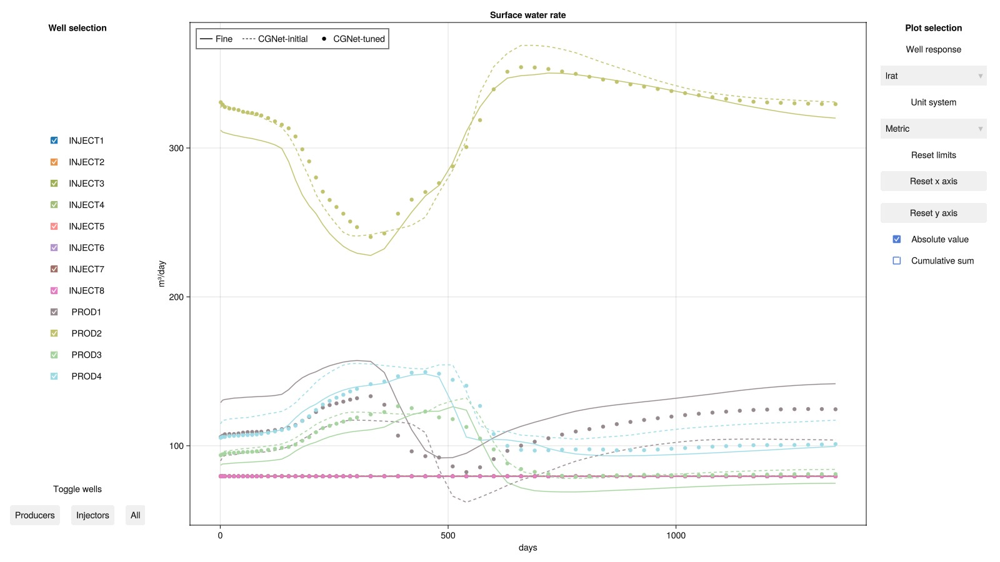

### Create a function to compare individual wells {#Create-a-function-to-compare-individual-wells}

We next compare individual wells to see how the optimization has affected the match between the coarse scale and fine scale. As we can see, we have reasonably good match between the original model with about 18,000 cells and the coarse model with about 3000 cells. Even better match could be possible by adding more coarse blocks, or also optimizing for example the relative permeability parameters for the coarse model.

We plot the water cut and total rate for the production wells, and the bottom hole pressure for the injection wells.

```julia
function plot_tuned_well(k, kw; lposition = :lt)
    fig = Figure()
    ax = Axis(fig[1, 1], title = "$k", xlabel = "days", ylabel = "$kw")
    t = wells_f.time./si_unit(:day)
    if kw == :wcut
        F = x -> x[k, :wrat]./x[k, :lrat]
    else
        F = x -> abs.(x[k, kw])
    end

    lines!(ax, t, F(wells_f), label = "Fine-scale")
    lines!(ax, t, F(wells_c), label = "Initial coarse")
    lines!(ax, t, F(wells_t), label = "Tuned coarse")
    axislegend(position = lposition)
    fig
end
```


```
plot_tuned_well (generic function with 1 method)
```


### Plot PROD1 water cut {#Plot-PROD1-water-cut}

```julia
plot_tuned_well(:PROD1, :wcut)
```

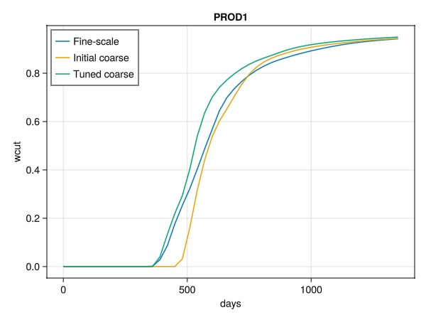

### Plot PROD2 water cut {#Plot-PROD2-water-cut}

```julia
plot_tuned_well(:PROD2, :wcut)
```

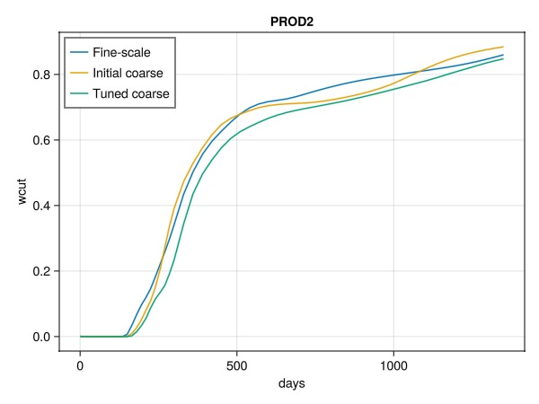

### Plot PROD4 water cut {#Plot-PROD4-water-cut}

```julia
plot_tuned_well(:PROD4, :wcut)
```

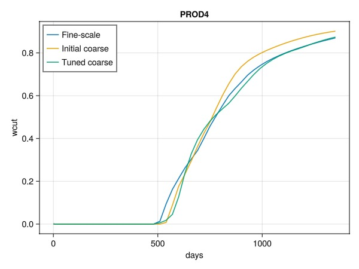

### Plot PROD1 total rate {#Plot-PROD1-total-rate}

```julia
plot_tuned_well(:PROD1, :rate)
```

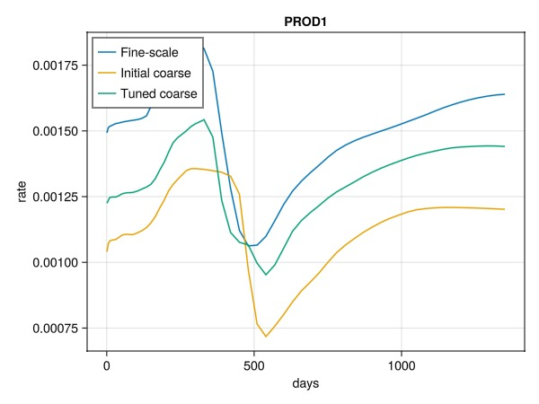

### Plot PROD2 total rate {#Plot-PROD2-total-rate}

```julia
plot_tuned_well(:PROD2, :rate)
```

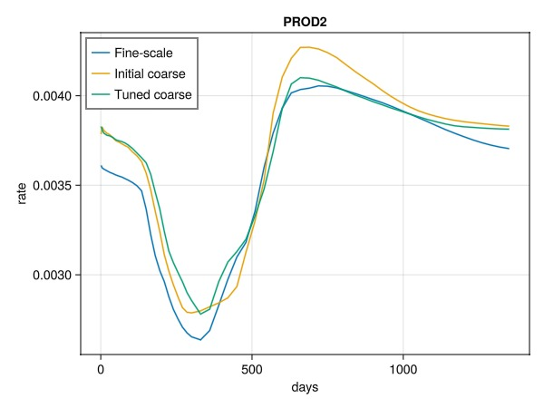

### Plot PROD4 total rate {#Plot-PROD4-total-rate}

```julia
plot_tuned_well(:PROD4, :rate)
```

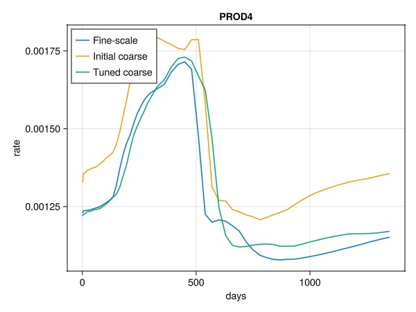

### Plot INJECT1 bhp {#Plot-INJECT1-bhp}

```julia
plot_tuned_well(:INJECT1, :bhp, lposition = :rt)
```

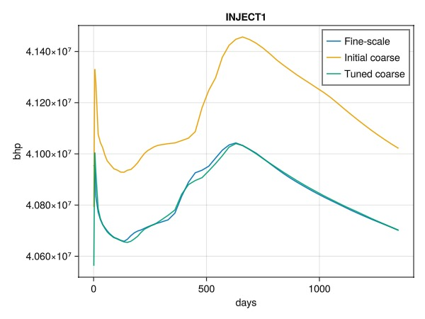

### Plot INJECT4 bhp {#Plot-INJECT4-bhp}

```julia
plot_tuned_well(:INJECT4, :bhp, lposition = :rt)
```

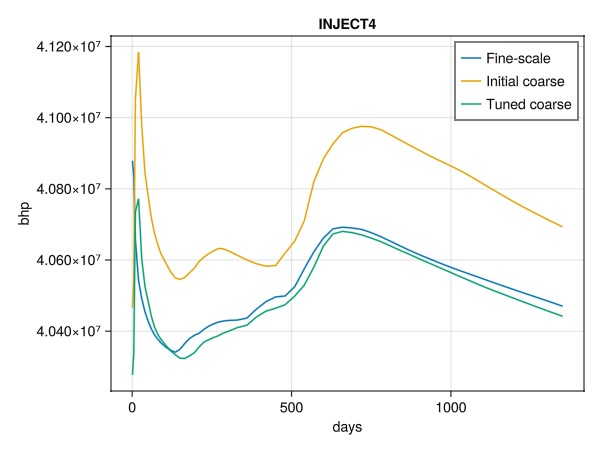

## Plot the objective evaluations during optimization {#Plot-the-objective-evaluations-during-optimization}

```julia
fig = Figure()
ys = log10
is = x -> x
ax1 = Axis(fig[1, 1], yscale = ys, title = "Objective evaluations", xlabel = "Iterations", ylabel = "Objective")
plot!(ax1, opt_setup[:data][:obj_hist][2:end])
fig
```

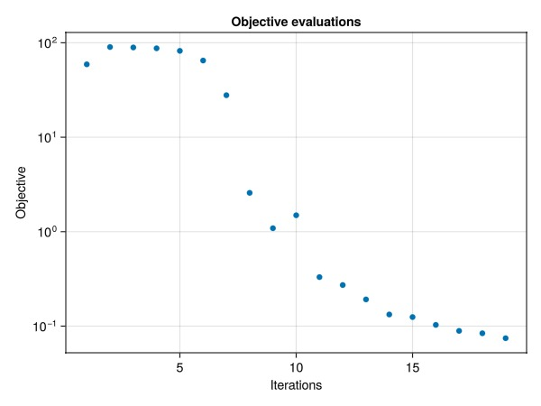

## Plot the evoluation of scaled parameters {#Plot-the-evoluation-of-scaled-parameters}

We show the difference between the initial and final values of the scaled parameters, as well as the lower bound.

JutulDarcy maps the parameters to a single vector for optimization with values that are approximately in the box limit range (0, 1). This is convenient for optimizers, but can also be useful when plotting the parameters, even if the units are not preserved in this visualization, only the magnitude.

```julia
fig = Figure(size = (800, 600))
ax1 = Axis(fig[1, 1], title = "Scaled parameters", ylabel = "Scaled value")
scatter!(ax1, setup[:x0], label = "Initial X")
scatter!(ax1, final_x, label = "Final X", markersize = 5)
lines!(ax1, setup[:lower], label = "Lower bound")
axislegend()

trans = data[:mapper][:Reservoir][:Transmissibilities]

function plot_bracket(v, k)
    start = v.offset_x+1
    stop = v.offset_x+v.n_x
    y0 = setup[:lower][start]
    y1 = setup[:lower][stop]
    bracket!(ax1, start, y0, stop, y1,
    text = "$k", offset = 1, orientation = :down)
end

for (k, v) in pairs(data[:mapper][:Reservoir])
    plot_bracket(v, k)
end
ylims!(ax1, (-0.2*maximum(final_x), nothing))
fig
```

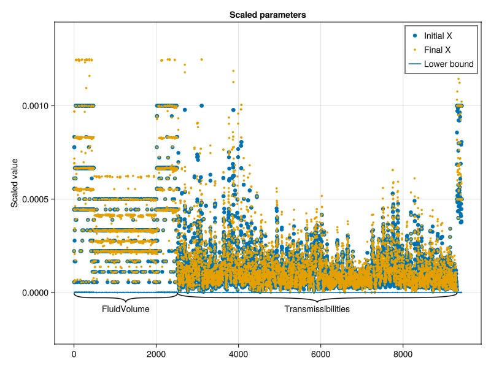

## Example on GitHub {#Example-on-GitHub}

If you would like to run this example yourself, it can be downloaded from the JutulDarcy.jl GitHub repository [as a script](https://github.com/sintefmath/JutulDarcy.jl/blob/main/examples/data_assimilation/cgnet_egg.jl), or as a [Jupyter Notebook](https://github.com/sintefmath/JutulDarcy.jl/blob/gh-pages/dev/final_site/notebooks/data_assimilation/cgnet_egg.ipynb)

```
This example took 168.421553992 seconds to complete.
```


---


_This page was generated using [Literate.jl](https://github.com/fredrikekre/Literate.jl)._
