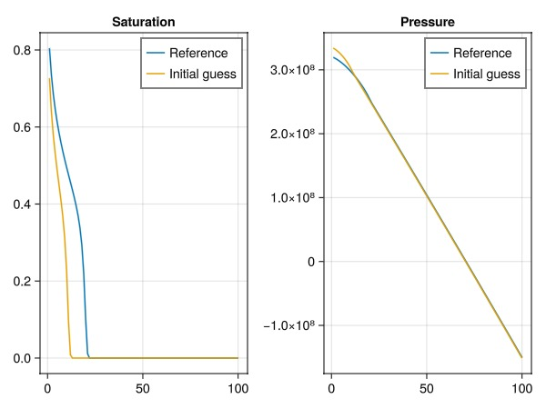
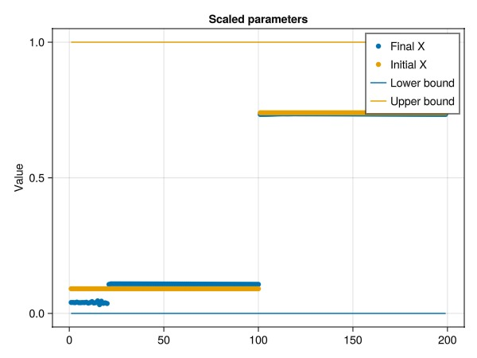
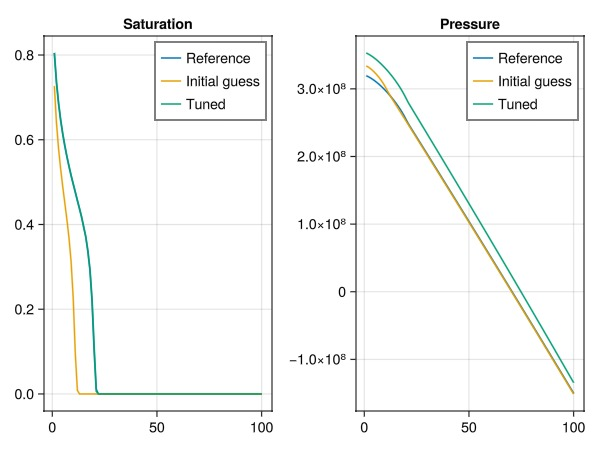
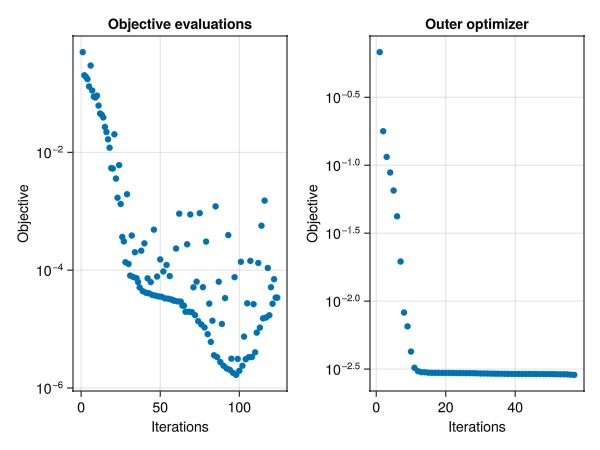

# Gradient-based matching of parameters against observations {#Gradient-based-matching-of-parameters-against-observations}

We create a simple test problem: A 1D nonlinear displacement. The observations are generated by solving the same problem with the true parameters. We then match the parameters against the observations using a different starting guess for the parameters, but otherwise the same physical description of the system.

```julia
using Jutul
using JutulDarcy
using LinearAlgebra
using GLMakie

function setup_bl(;nc = 100, time = 1.0, nstep = 100, poro = 0.1, perm = 9.8692e-14)
    T = time
    tstep = repeat([T/nstep], nstep)
    G = get_1d_reservoir(nc, poro = poro, perm = perm)
    nc = number_of_cells(G)

    bar = 1e5
    p0 = 1000*bar
    sys = ImmiscibleSystem((LiquidPhase(), VaporPhase()))
    model = SimulationModel(G, sys)
    model.primary_variables[:Pressure] = Pressure(minimum = -Inf, max_rel = nothing)
    kr = BrooksCoreyRelativePermeabilities(sys, [2.0, 2.0])
    replace_variables!(model, RelativePermeabilities = kr)
    tot_time = sum(tstep)

    parameters = setup_parameters(model, PhaseViscosities = [1e-3, 5e-3]) # 1 and 5 cP
    state0 = setup_state(model, Pressure = p0, Saturations = [0.0, 1.0])

    irate = 100*sum(parameters[:FluidVolume])/tot_time
    src  = [SourceTerm(1, irate, fractional_flow = [1.0-1e-3, 1e-3]),
            SourceTerm(nc, -irate, fractional_flow = [1.0, 0.0])]
    forces = setup_forces(model, sources = src)

    return (model, state0, parameters, forces, tstep)
end
```


```
setup_bl (generic function with 1 method)
```


Number of cells and time-steps

```julia
N = 100
Nt = 100
poro_ref = 0.1
perm_ref = 9.8692e-14
```


```
9.8692e-14
```


## Set up and simulate reference {#Set-up-and-simulate-reference}

```julia
model_ref, state0_ref, parameters_ref, forces, tstep = setup_bl(nc = N, nstep = Nt, poro = poro_ref, perm = perm_ref)
states_ref, = simulate(state0_ref, model_ref, tstep, parameters = parameters_ref, forces = forces);
```


```
Jutul: Simulating 1 second as 100 report steps
╭────────────────┬───────────┬───────────────┬──────────╮
│ Iteration type │  Avg/step │  Avg/ministep │    Total │
│                │ 100 steps │ 100 ministeps │ (wasted) │
├────────────────┼───────────┼───────────────┼──────────┤
│ Newton         │      1.07 │          1.07 │  107 (0) │
│ Linearization  │      2.07 │          2.07 │  207 (0) │
│ Linear solver  │      1.07 │          1.07 │  107 (0) │
│ Precond apply  │       0.0 │           0.0 │    0 (0) │
╰────────────────┴───────────┴───────────────┴──────────╯
╭───────────────┬─────────┬────────────┬────────╮
│ Timing type   │    Each │   Relative │  Total │
│               │      ms │ Percentage │      s │
├───────────────┼─────────┼────────────┼────────┤
│ Properties    │  0.0152 │     0.04 % │ 0.0016 │
│ Equations     │  2.2519 │    10.70 % │ 0.4661 │
│ Assembly      │  1.9512 │     9.27 % │ 0.4039 │
│ Linear solve  │ 14.5823 │    35.80 % │ 1.5603 │
│ Linear setup  │  0.0000 │     0.00 % │ 0.0000 │
│ Precond apply │  0.0000 │     0.00 % │ 0.0000 │
│ Update        │  2.6038 │     6.39 % │ 0.2786 │
│ Convergence   │  2.0688 │     9.83 % │ 0.4282 │
│ Input/Output  │  0.3858 │     0.89 % │ 0.0386 │
│ Other         │ 11.0345 │    27.09 % │ 1.1807 │
├───────────────┼─────────┼────────────┼────────┤
│ Total         │ 40.7298 │   100.00 % │ 4.3581 │
╰───────────────┴─────────┴────────────┴────────╯
```


## Set up another case where the porosity is different {#Set-up-another-case-where-the-porosity-is-different}

```julia
model, state0, parameters, = setup_bl(nc = N, nstep = Nt, poro = 2*poro_ref, perm = 1.0*perm_ref)
states, rep = simulate(state0, model, tstep, parameters = parameters, forces = forces);
```


```
Jutul: Simulating 1 second as 100 report steps
╭────────────────┬───────────┬───────────────┬──────────╮
│ Iteration type │  Avg/step │  Avg/ministep │    Total │
│                │ 100 steps │ 100 ministeps │ (wasted) │
├────────────────┼───────────┼───────────────┼──────────┤
│ Newton         │      1.01 │          1.01 │  101 (0) │
│ Linearization  │      2.01 │          2.01 │  201 (0) │
│ Linear solver  │      1.01 │          1.01 │  101 (0) │
│ Precond apply  │       0.0 │           0.0 │    0 (0) │
╰────────────────┴───────────┴───────────────┴──────────╯
╭───────────────┬──────────┬────────────┬─────────╮
│ Timing type   │     Each │   Relative │   Total │
│               │       μs │ Percentage │      ms │
├───────────────┼──────────┼────────────┼─────────┤
│ Properties    │  14.9856 │     4.50 % │  1.5135 │
│ Equations     │  17.4670 │    10.45 % │  3.5109 │
│ Assembly      │   5.8741 │     3.51 % │  1.1807 │
│ Linear solve  │ 188.6763 │    56.70 % │ 19.0563 │
│ Linear setup  │   0.0000 │     0.00 % │  0.0000 │
│ Precond apply │   0.0000 │     0.00 % │  0.0000 │
│ Update        │   9.7575 │     2.93 % │  0.9855 │
│ Convergence   │   9.7194 │     5.81 % │  1.9536 │
│ Input/Output  │   8.8520 │     2.63 % │  0.8852 │
│ Other         │  44.7592 │    13.45 % │  4.5207 │
├───────────────┼──────────┼────────────┼─────────┤
│ Total         │ 332.7365 │   100.00 % │ 33.6064 │
╰───────────────┴──────────┴────────────┴─────────╯
```


## Plot the results {#Plot-the-results}

```julia
fig = Figure()
ax = Axis(fig[1, 1], title = "Saturation")
lines!(ax, states_ref[end][:Saturations][1, :], label = "Reference")
lines!(ax, states[end][:Saturations][1, :], label = "Initial guess")
axislegend(ax)
ax = Axis(fig[1, 2], title = "Pressure")
lines!(ax, states_ref[end][:Pressure], label = "Reference")
lines!(ax, states[end][:Pressure], label = "Initial guess")
axislegend(ax)
fig
```



## Define objective function {#Define-objective-function}

Define objective as mismatch between water saturation in current state and reference state. The objective function is currently a sum over all time steps. We implement a function for one term of this sum.

```julia
function mass_mismatch(m, state, dt, step_no, forces)
    state_ref = states_ref[step_no]
    fld = :Saturations
    val = state[fld]
    ref = state_ref[fld]
    err = 0
    for i in axes(val, 2)
        err += (val[1, i] - ref[1, i])^2
    end
    return dt*err
end
@assert Jutul.evaluate_objective(mass_mismatch, model, states_ref, tstep, forces) == 0.0
@assert Jutul.evaluate_objective(mass_mismatch, model, states, tstep, forces) > 0.0
```


## Set up a configuration for the optimization {#Set-up-a-configuration-for-the-optimization}

The optimization code enables all parameters for optimization by default, with relative box limits 0.1 and 10 specified here. If use_scaling is enabled the variables in the optimization are scaled so that their actual limits are approximately box limits.

We are not interested in matching gravity effects or viscosity here. Transmissibilities are derived from permeability and varies significantly. We can set log scaling to get a better conditioned optimization system, without changing the limits or the result.

```julia
cfg = optimization_config(model, parameters, use_scaling = true, rel_min = 0.1, rel_max = 10)
for (ki, vi) in cfg
    if ki in [:TwoPointGravityDifference, :PhaseViscosities]
        vi[:active] = false
    end
    if ki == :Transmissibilities
        vi[:scaler] = :log
    end
end
print_obj = 100
```


```
100
```


## Set up parameter optimization {#Set-up-parameter-optimization}

This gives us a set of function handles together with initial guess and limits. Generally calling either of the functions will mutate the data Dict. The options are: F_o(x) -&gt; evaluate objective dF_o(dFdx, x) -&gt; evaluate gradient of objective, mutating dFdx (may trigger evaluation of F_o) F_and_dF(F, dFdx, x) -&gt; evaluate F and/or dF. Value of nothing will mean that the corresponding entry is skipped.

```julia
F_o, dF_o, F_and_dF, x0, lims, data = setup_parameter_optimization(model, state0, parameters, tstep, forces, mass_mismatch, cfg, print = print_obj, param_obj = true);
F_initial = F_o(x0)
dF_initial = dF_o(similar(x0), x0)
@info "Initial objective: $F_initial, gradient norm $(norm(dF_initial))"
```


```
Parameters for model
┌────────────────────┬────────┬─────┬─────────┬─────────────────┬─────────────┬──────────────────────┬─────────┐
│               Name │ Entity │   N │   Scale │     Abs. limits │ Rel. limits │               Limits │ Lumping │
├────────────────────┼────────┼─────┼─────────┼─────────────────┼─────────────┼──────────────────────┼─────────┤
│ Transmissibilities │  Faces │  99 │     log │        [0, Inf] │   [0.1, 10] │ [9.87e-13, 9.87e-11] │       - │
│        FluidVolume │  Cells │ 100 │ default │ [2.22e-16, Inf] │   [0.1, 10] │       [0.0002, 0.02] │       - │
└────────────────────┴────────┴─────┴─────────┴─────────────────┴─────────────┴──────────────────────┴─────────┘
[ Info: Initial objective: 0.6770524183270709, gradient norm 4.12674840425729
```


## Link to an optimizer package {#Link-to-an-optimizer-package}

We use Optim.jl but the interface is general enough that e.g. LBFGSB.jl can easily be swapped in.

LBFGS is a good choice for this problem, as Jutul provides sensitivities via adjoints that are inexpensive to compute.

```julia
using Optim
lower, upper = lims
inner_optimizer = LBFGS()
opts = Optim.Options(store_trace = true, show_trace = true, time_limit = 30)
results = optimize(Optim.only_fg!(F_and_dF), lower, upper, x0, Fminbox(inner_optimizer), opts)
x = results.minimizer
display(results)
F_final = F_o(x)
```


```
3.419371214263971e-5
```


## Compute the solution using the tuned parameters found in x. {#Compute-the-solution-using-the-tuned-parameters-found-in-x.}

```julia
parameters_t = deepcopy(parameters)
devectorize_variables!(parameters_t, model, x, data[:mapper], config = data[:config])
x_truth = vectorize_variables(model_ref, parameters_ref, data[:mapper], config = data[:config])

states_tuned, = simulate(state0, model, tstep, parameters = parameters_t, forces = forces);
nothing
```


```
Jutul: Simulating 1 second as 100 report steps
╭────────────────┬───────────┬───────────────┬──────────╮
│ Iteration type │  Avg/step │  Avg/ministep │    Total │
│                │ 100 steps │ 100 ministeps │ (wasted) │
├────────────────┼───────────┼───────────────┼──────────┤
│ Newton         │      1.07 │          1.07 │  107 (0) │
│ Linearization  │      2.07 │          2.07 │  207 (0) │
│ Linear solver  │      1.07 │          1.07 │  107 (0) │
│ Precond apply  │       0.0 │           0.0 │    0 (0) │
╰────────────────┴───────────┴───────────────┴──────────╯
╭───────────────┬──────────┬────────────┬─────────╮
│ Timing type   │     Each │   Relative │   Total │
│               │       μs │ Percentage │      ms │
├───────────────┼──────────┼────────────┼─────────┤
│ Properties    │  14.5067 │     2.59 % │  1.5522 │
│ Equations     │  17.5539 │     6.07 % │  3.6337 │
│ Assembly      │   5.9840 │     2.07 % │  1.2387 │
│ Linear solve  │ 416.4947 │    74.50 % │ 44.5649 │
│ Linear setup  │   0.0000 │     0.00 % │  0.0000 │
│ Precond apply │   0.0000 │     0.00 % │  0.0000 │
│ Update        │  10.0631 │     1.80 % │  1.0768 │
│ Convergence   │  10.0946 │     3.49 % │  2.0896 │
│ Input/Output  │   9.0781 │     1.52 % │  0.9078 │
│ Other         │  44.4521 │     7.95 % │  4.7564 │
├───────────────┼──────────┼────────────┼─────────┤
│ Total         │ 559.0655 │   100.00 % │ 59.8200 │
╰───────────────┴──────────┴────────────┴─────────╯
```


## Plot final parameter spread {#Plot-final-parameter-spread}

```julia
@info "Final residual $F_final (down from $F_initial)"
fig = Figure()
ax1 = Axis(fig[1, 1], title = "Scaled parameters", ylabel = "Value")
scatter!(ax1, x, label = "Final X")
scatter!(ax1, x0, label = "Initial X")
lines!(ax1, lower, label = "Lower bound")
lines!(ax1, upper, label = "Upper bound")
axislegend()
fig
```



## Plot the final solutions. {#Plot-the-final-solutions.}

Note that we only match saturations - so any match in pressure is not guaranteed.

```julia
fig = Figure()
ax = Axis(fig[1, 1], title = "Saturation")
lines!(ax, states_ref[end][:Saturations][1, :], label = "Reference")
lines!(ax, states[end][:Saturations][1, :], label = "Initial guess")
lines!(ax, states_tuned[end][:Saturations][1, :], label = "Tuned")

axislegend(ax)
ax = Axis(fig[1, 2], title = "Pressure")
lines!(ax, states_ref[end][:Pressure], label = "Reference")
lines!(ax, states[end][:Pressure], label = "Initial guess")
lines!(ax, states_tuned[end][:Pressure], label = "Tuned")
axislegend(ax)
fig
```



## Plot the objective history and function evaluations {#Plot-the-objective-history-and-function-evaluations}

```julia
fig = Figure()
ax1 = Axis(fig[1, 1], yscale = log10, title = "Objective evaluations", xlabel = "Iterations", ylabel = "Objective")
plot!(ax1, data[:obj_hist][2:end])
ax2 = Axis(fig[1, 2], yscale = log10, title = "Outer optimizer", xlabel = "Iterations", ylabel = "Objective")
t = map(x -> x.value, Optim.trace(results))
plot!(ax2, t)
fig
```



## Example on GitHub {#Example-on-GitHub}

If you would like to run this example yourself, it can be downloaded from the JutulDarcy.jl GitHub repository [as a script](https://github.com/sintefmath/JutulDarcy.jl/blob/main/examples/data_assimilation/optimize_simple_bl.jl), or as a [Jupyter Notebook](https://github.com/sintefmath/JutulDarcy.jl/blob/gh-pages/dev/final_site/notebooks/data_assimilation/optimize_simple_bl.ipynb)

```
This example took 49.981155139 seconds to complete.
```


---


_This page was generated using [Literate.jl](https://github.com/fredrikekre/Literate.jl)._
