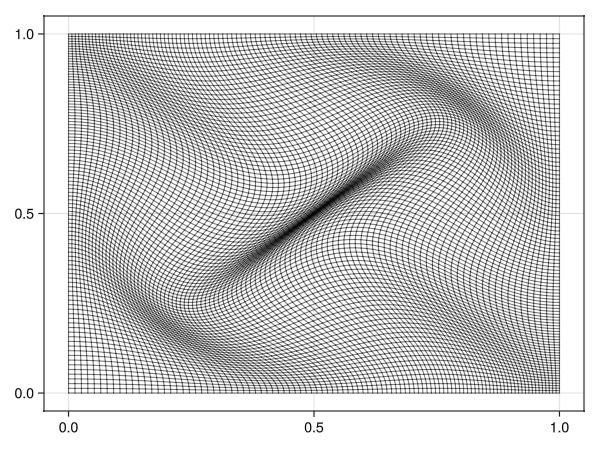
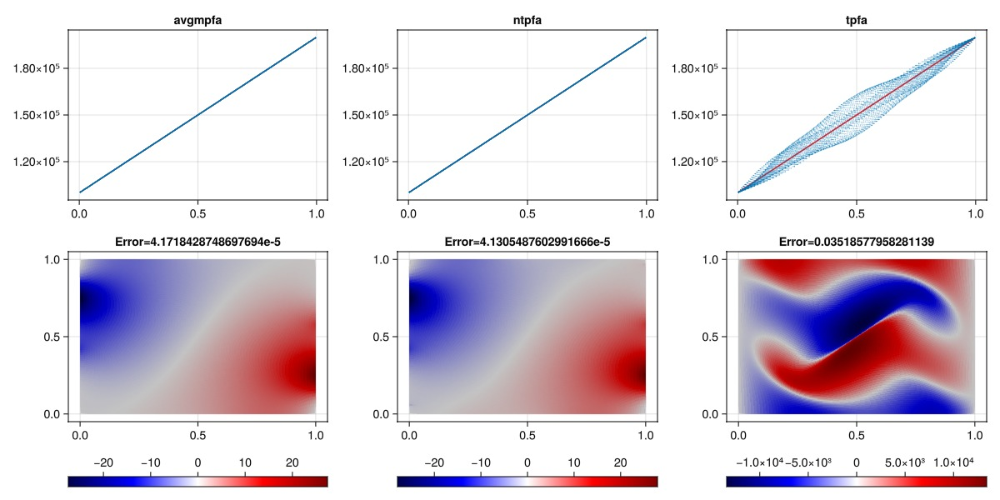

# Consistent discretizations: Average MPFA and nonlinear TPFA {#Consistent-discretizations:-Average-MPFA-and-nonlinear-TPFA}

This example demonstrates how to use alternative discretizations for the pressure gradient term in the Darcy equation, i.e. the approximation of the Darcy flux:

$\mathbf{}{K}(\nabla p + \rho g \Delta z)$.

It is well-known that for certain combinations of grid geometry and permeability fields, the classical two-point flux approximation scheme can give incorrect results. This is due to the fact that the TPFA scheme is not a formally consistent method when the product of the permeability tensor and the normal vector does not align with the cell-to-cell vectors over a face (lack of K-orthogonality).

In such cases, it is often beneficial to use a consistent discretization. JutulDarcy includes a class of linear and nonlinear schemes that are designed to be accurate even for challenging grids.

For further details on this class of methods, which differ a bit from the classical MPFA-O type method often seen in the literature, see [[9](/extras/refs#schneider_nonlinear)], [[10](/extras/refs#zhang_nonlinear)] and [[11](/extras/refs#raynaud_discretization)].

## Define a mesh and twist the nodes {#Define-a-mesh-and-twist-the-nodes}

This makes the mesh non K-orthogonal and will lead to wrong solutions for the default TPFA scheme.

```julia
using Jutul
using JutulDarcy
using LinearAlgebra
using GLMakie

sys = SinglePhaseSystem()
nx = nz = 100
pdims = (1.0, 1.0)
g = CartesianMesh((nx, nz), pdims)

g = UnstructuredMesh(g)
D = dim(g)

v = 0.1
for i in eachindex(g.node_points)
    x, y = g.node_points[i]
    shiftx =  v*sin(π*x)*sin(3*(-π/2 + π*y))
    shifty =  v*sin(π*y)*sin(3*(-π/2 + π*x))
    g.node_points[i] += [shiftx, shifty]
end

nc = number_of_cells(g)
domain = reservoir_domain(g, permeability = 0.1*si_unit(:darcy))

fig = Figure()
Jutul.plot_mesh_edges!(Axis(fig[1, 1]), g)
fig
```



## Create a test problem function {#Create-a-test-problem-function}

We set up a problem for our given domain with left and right boundary boundary conditions that correspond to a linear pressure drop. We can expect the steady-state pressure solution to be linear between the two faces as there is no variation in permeability or significant compressibility. The function will return the pressure solution at the end of the simulation for a given scheme.

```julia
function solve_test_problem(scheme)
    model, parameters = setup_reservoir_model(domain, sys,
        general_ad = true,
        kgrad = scheme,
        block_backend = false
    )
    state0 = setup_reservoir_state(model, Pressure = 1e5)
    nc = number_of_cells(g)
    bcells = Int64[]
    bpres = Float64[]
    for k in 1:nz
        bnd_l = Jutul.cell_index(g, (1, k))
        bnd_r = Jutul.cell_index(g, (nx, k))
        push!(bcells, bnd_l)
        push!(bpres, 1e5)
        push!(bcells, bnd_r)
        push!(bpres, 2e5)
    end
    bc = flow_boundary_condition(bcells, domain, bpres)
    forces = setup_reservoir_forces(model, bc = bc)

    dt = [si_unit(:day)]
    _, states = simulate_reservoir(state0, model, dt,
        forces = forces, failure_cuts_timestep = false,
        tol_cnv = 1e-6,
        linear_solver = GenericKrylov(preconditioner = AMGPreconditioner(:smoothed_aggregation), rtol = 1e-6)
        )
    return states[end][:Pressure]
end
```


```
solve_test_problem (generic function with 1 method)
```


## Solve the test problem with three different schemes {#Solve-the-test-problem-with-three-different-schemes}
- TPFA (two-point flux approximation, inconsistent, linear)
  
- Average MPFA (consistent, linear)
  
- NTPFA (nonlinear two-point flux approximation, consistent, nonlinear)
  

```julia
results = Dict()
for m in [:tpfa, :avgmpfa, :ntpfa]
    println("Solving $m")
    results[m] = solve_test_problem(m);
end
```


```
Solving tpfa
Jutul: Simulating 1 day as 1 report steps
╭────────────────┬──────────┬──────────────┬──────────╮
│ Iteration type │ Avg/step │ Avg/ministep │    Total │
│                │  1 steps │  1 ministeps │ (wasted) │
├────────────────┼──────────┼──────────────┼──────────┤
│ Newton         │      5.0 │          5.0 │    5 (0) │
│ Linearization  │      6.0 │          6.0 │    6 (0) │
│ Linear solver  │     50.0 │         50.0 │   50 (0) │
│ Precond apply  │     55.0 │         55.0 │   55 (0) │
╰────────────────┴──────────┴──────────────┴──────────╯
╭───────────────┬──────────┬────────────┬────────╮
│ Timing type   │     Each │   Relative │  Total │
│               │       ms │ Percentage │      s │
├───────────────┼──────────┼────────────┼────────┤
│ Properties    │   0.1991 │     0.02 % │ 0.0010 │
│ Equations     │ 108.3595 │    13.35 % │ 0.6502 │
│ Assembly      │  72.4085 │     8.92 % │ 0.4345 │
│ Linear solve  │ 235.4543 │    24.18 % │ 1.1773 │
│ Linear setup  │  52.3552 │     5.38 % │ 0.2618 │
│ Precond apply │   5.0553 │     5.71 % │ 0.2780 │
│ Update        │  21.5312 │     2.21 % │ 0.1077 │
│ Convergence   │  80.9253 │     9.97 % │ 0.4856 │
│ Input/Output  │  51.5778 │     1.06 % │ 0.0516 │
│ Other         │ 284.4486 │    29.21 % │ 1.4222 │
├───────────────┼──────────┼────────────┼────────┤
│ Total         │ 973.9439 │   100.00 % │ 4.8697 │
╰───────────────┴──────────┴────────────┴────────╯
Solving avgmpfa
Jutul: Simulating 1 day as 1 report steps
╭────────────────┬──────────┬──────────────┬───────────╮
│ Iteration type │ Avg/step │ Avg/ministep │     Total │
│                │  1 steps │ 18 ministeps │  (wasted) │
├────────────────┼──────────┼──────────────┼───────────┤
│ Newton         │    162.0 │          9.0 │ 162 (150) │
│ Linearization  │    180.0 │         10.0 │ 180 (160) │
│ Linear solver  │    914.0 │      50.7778 │ 914 (667) │
│ Precond apply  │    936.0 │         52.0 │ 936 (683) │
╰────────────────┴──────────┴──────────────┴───────────╯
╭───────────────┬─────────┬────────────┬────────╮
│ Timing type   │    Each │   Relative │  Total │
│               │      ms │ Percentage │      s │
├───────────────┼─────────┼────────────┼────────┤
│ Properties    │  0.1901 │     0.42 % │ 0.0308 │
│ Equations     │ 25.5218 │    62.67 % │ 4.5939 │
│ Assembly      │  0.5642 │     1.39 % │ 0.1015 │
│ Linear solve  │  1.0510 │     2.32 % │ 0.1703 │
│ Linear setup  │  8.1108 │    17.92 % │ 1.3139 │
│ Precond apply │  0.2452 │     3.13 % │ 0.2295 │
│ Update        │  0.3613 │     0.80 % │ 0.0585 │
│ Convergence   │  3.1755 │     7.80 % │ 0.5716 │
│ Input/Output  │  1.1594 │     0.28 % │ 0.0209 │
│ Other         │  1.4806 │     3.27 % │ 0.2399 │
├───────────────┼─────────┼────────────┼────────┤
│ Total         │ 45.2520 │   100.00 % │ 7.3308 │
╰───────────────┴─────────┴────────────┴────────╯
Solving ntpfa
Jutul: Simulating 1 day as 1 report steps
╭────────────────┬──────────┬──────────────┬───────────╮
│ Iteration type │ Avg/step │ Avg/ministep │     Total │
│                │  1 steps │ 27 ministeps │  (wasted) │
├────────────────┼──────────┼──────────────┼───────────┤
│ Newton         │    256.0 │      9.48148 │ 256 (240) │
│ Linearization  │    283.0 │      10.4815 │ 283 (256) │
│ Linear solver  │    962.0 │      35.6296 │ 962 (703) │
│ Precond apply  │    988.0 │      36.5926 │ 988 (722) │
╰────────────────┴──────────┴──────────────┴───────────╯
╭───────────────┬─────────┬────────────┬─────────╮
│ Timing type   │    Each │   Relative │   Total │
│               │      ms │ Percentage │       s │
├───────────────┼─────────┼────────────┼─────────┤
│ Properties    │  0.1918 │     0.44 % │  0.0491 │
│ Equations     │ 27.3594 │    69.27 % │  7.7427 │
│ Assembly      │  0.4267 │     1.08 % │  0.1207 │
│ Linear solve  │  0.7342 │     1.68 % │  0.1880 │
│ Linear setup  │  7.8802 │    18.05 % │  2.0173 │
│ Precond apply │  0.2430 │     2.15 % │  0.2401 │
│ Update        │  0.2657 │     0.61 % │  0.0680 │
│ Convergence   │  1.9807 │     5.01 % │  0.5605 │
│ Input/Output  │  0.7879 │     0.19 % │  0.0213 │
│ Other         │  0.6657 │     1.52 % │  0.1704 │
├───────────────┼─────────┼────────────┼─────────┤
│ Total         │ 43.6649 │   100.00 % │ 11.1782 │
╰───────────────┴─────────┴────────────┴─────────╯
```


## Plot the results {#Plot-the-results}

We plot the pressure solution for each of the schemes, as well as the error. Note that the color axis varies between error plots. As the grid is quite skewed, we observe significant errors for the TPFA scheme, with no significant error for the consistent schemes.

```julia
x = domain[:cell_centroids][1, :]
get_ref(x) = x*1e5 + 1e5
x_distinct = sort(unique(x))
sol = get_ref.(x_distinct)

fig = Figure(size = (1200, 600))
for (i, (m, s)) in enumerate(results)
    ref = get_ref.(x)
    err = norm(s .- ref)/norm(ref)

    ax = Axis(fig[1, i], title = "$m")
    lines!(ax, x_distinct, sol, color = :red)
    scatter!(ax, x, s, label = m, markersize = 1, alpha = 0.5, transparency = true)

    ax2 = Axis(fig[2, i], title = "Error=$err")
    Δ = s - ref
    emin, emax = extrema(Δ)
    largest = max(abs(emin), abs(emax))
    crange = (-largest, largest)
    plt = plot_cell_data!(ax2, g, Δ, colorrange = crange, colormap = :seismic)
    Colorbar(fig[3, i], plt, vertical = false)
end
fig
```



## Example on GitHub {#Example-on-GitHub}

If you would like to run this example yourself, it can be downloaded from the JutulDarcy.jl GitHub repository [as a script](https://github.com/sintefmath/JutulDarcy.jl/blob/main/examples/discretization/consistent_avgmpfa.jl), or as a [Jupyter Notebook](https://github.com/sintefmath/JutulDarcy.jl/blob/gh-pages/dev/final_site/notebooks/discretization/consistent_avgmpfa.ipynb)

```
This example took 47.98233472 seconds to complete.
```


---


_This page was generated using [Literate.jl](https://github.com/fredrikekre/Literate.jl)._
