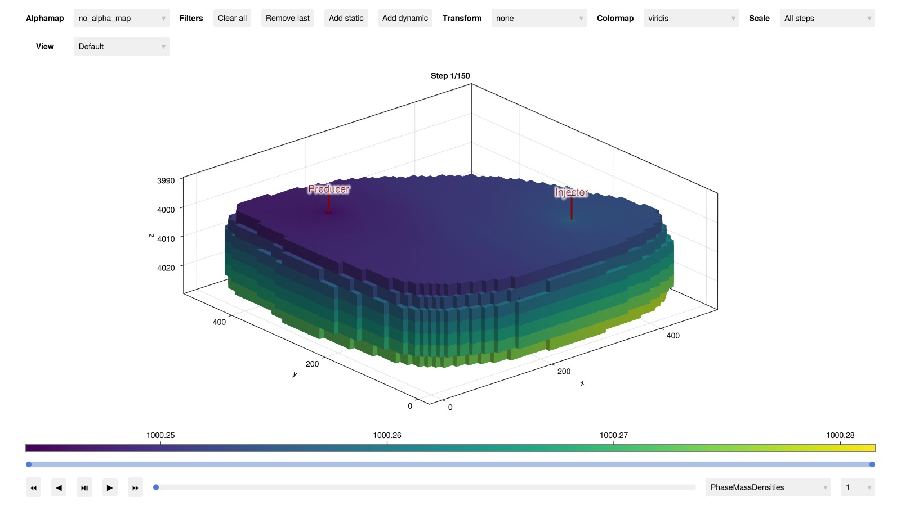
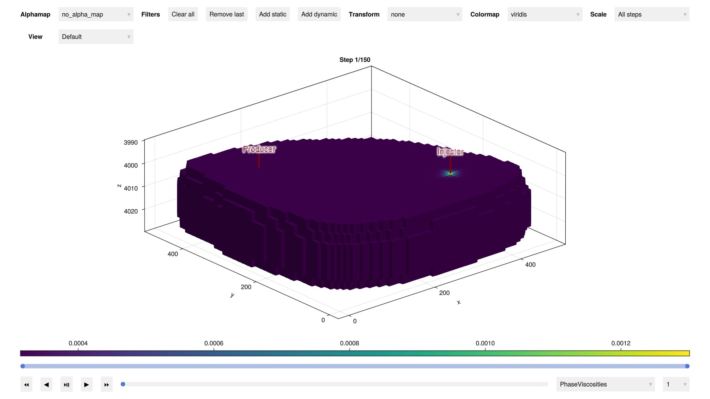
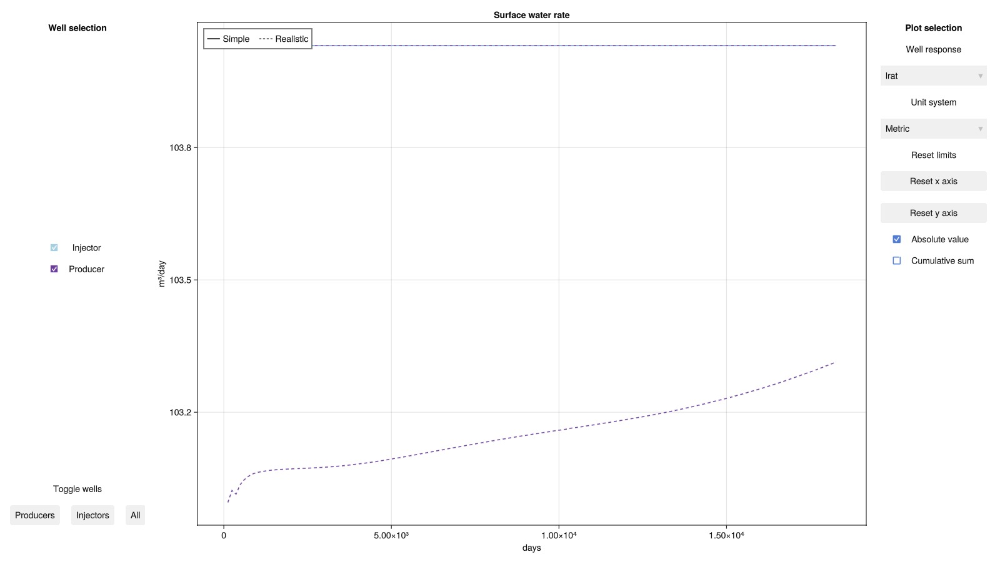
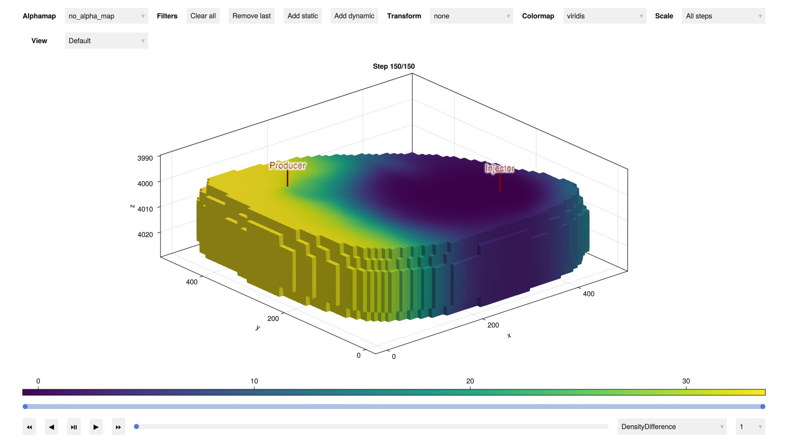

# Geothermal doublet {#Geothermal-doublet}

This example demonstrates how to set up a geothermal doublet simulation using JutulDarcy. We will use two different PVT functions–one simple and one realistic–to highlight the importance of accurate fluid physics in geothermal simulations.

```julia
using Jutul, JutulDarcy, HYPRE, GeoEnergyIO, GLMakie
meter, kilogram, bar, year = si_units(:meter, :kilogram, :bar, :year)
```


```
(1.0, 1.0, 100000.0, 3.1556952e7)
```


## Make setup function {#Make-setup-function}

We use the synthethic EGG model [[8](/extras/refs#egg_model)] to emulate realistic geology. Instead of using the original wells, we set up a simple injector-producer doublet, placed so that injected fluids will sweep a large part of the reservoir.

Set up EGG model

```julia
egg_dir = JutulDarcy.GeoEnergyIO.test_input_file_path("EGG")
data_pth = joinpath(egg_dir, "EGG.DATA")
case0 = setup_case_from_data_file(data_pth)
domain = reservoir_model(case0.model).data_domain;
```


Make setup function

```julia
function setup_doublet(sys)

    inj_well = setup_vertical_well(domain, 45, 15, name = :Injector, simple_well = false)
    prod_well = setup_vertical_well(domain, 15, 45, name = :Producer, simple_well = false)

    model, _ = setup_reservoir_model(
        domain, sys,
        thermal = true,
        wells = [inj_well, prod_well],
    );
    rmodel = reservoir_model(model)
    push!(rmodel.output_variables, :PhaseMassDensities, :PhaseViscosities)

    state0 = setup_reservoir_state(model,
        Pressure = 50bar,
        Temperature = convert_to_si(90, :Celsius)
    )

    time = 50year
    pv_tot = sum(pore_volume(reservoir_model(model).data_domain))
    rate = 2*pv_tot/time
    rate_target = TotalRateTarget(rate)
    ctrl_inj  = InjectorControl(rate_target, [1.0],
        density = 1000.0, temperature = convert_to_si(10.0, :Celsius))

    bhp_target = BottomHolePressureTarget(25bar)
    ctrl_prod = ProducerControl(bhp_target)

    control = Dict(:Injector => ctrl_inj, :Producer => ctrl_prod)

    dt = 4year/12
    dt = fill(dt, Int(time/dt))

    forces = setup_reservoir_forces(model, control = control)

    return JutulCase(model, dt, forces, state0 = state0)

end
```


```
setup_doublet (generic function with 1 method)
```


## Simple fluid physics {#Simple-fluid-physics}

We start by setting up a simple fluid physics where water is slightly compressible, but with no influence of temperature. Viscosity is constant.

```julia
rhoWS = 1000.0kilogram/meter^3
sys = SinglePhaseSystem(AqueousPhase(), reference_density = rhoWS)
case_simple = setup_doublet(sys)
results_simple = simulate_reservoir(case_simple);
```


```
Jutul: Simulating 50 years as 150 report steps
╭────────────────┬───────────┬───────────────┬──────────╮
│ Iteration type │  Avg/step │  Avg/ministep │    Total │
│                │ 150 steps │ 155 ministeps │ (wasted) │
├────────────────┼───────────┼───────────────┼──────────┤
│ Newton         │   1.07333 │       1.03871 │  161 (0) │
│ Linearization  │   2.10667 │       2.03871 │  316 (0) │
│ Linear solver  │      2.22 │       2.14839 │  333 (0) │
│ Precond apply  │      4.44 │       4.29677 │  666 (0) │
╰────────────────┴───────────┴───────────────┴──────────╯
╭───────────────┬──────────┬────────────┬─────────╮
│ Timing type   │     Each │   Relative │   Total │
│               │       ms │ Percentage │       s │
├───────────────┼──────────┼────────────┼─────────┤
│ Properties    │   0.6450 │     0.59 % │  0.1039 │
│ Equations     │  24.9943 │    45.08 % │  7.8982 │
│ Assembly      │   3.3628 │     6.07 % │  1.0626 │
│ Linear solve  │   2.3660 │     2.17 % │  0.3809 │
│ Linear setup  │  22.9943 │    21.13 % │  3.7021 │
│ Precond apply │   1.6193 │     6.16 % │  1.0785 │
│ Update        │   2.1163 │     1.94 % │  0.3407 │
│ Convergence   │   3.7336 │     6.73 % │  1.1798 │
│ Input/Output  │   0.9619 │     0.85 % │  0.1491 │
│ Other         │  10.0920 │     9.27 % │  1.6248 │
├───────────────┼──────────┼────────────┼─────────┤
│ Total         │ 108.8240 │   100.00 % │ 17.5207 │
╰───────────────┴──────────┴────────────┴─────────╯
```


Interactive plot of the reservoir state

```julia
plot_reservoir(case_simple.model, results_simple.states)
```



## Realistic fluid physics {#Realistic-fluid-physics}

Next, we repeat the simulation with more realistic fluid physics. We use a formulation from [NIST](https://webbook.nist.gov/chemistry/fluid/) where density, viscosity and heat capacity depend on pressure and temperature.

```julia
case_real = setup_doublet(:geothermal)
results_real = simulate_reservoir(case_real);
```


```
Jutul: Simulating 50 years as 150 report steps
╭────────────────┬───────────┬───────────────┬──────────╮
│ Iteration type │  Avg/step │  Avg/ministep │    Total │
│                │ 150 steps │ 158 ministeps │ (wasted) │
├────────────────┼───────────┼───────────────┼──────────┤
│ Newton         │      2.22 │       2.10759 │  333 (0) │
│ Linearization  │   3.27333 │       3.10759 │  491 (0) │
│ Linear solver  │      7.78 │       7.38608 │ 1167 (0) │
│ Precond apply  │     15.56 │       14.7722 │ 2334 (0) │
╰────────────────┴───────────┴───────────────┴──────────╯
╭───────────────┬─────────┬────────────┬─────────╮
│ Timing type   │    Each │   Relative │   Total │
│               │      ms │ Percentage │       s │
├───────────────┼─────────┼────────────┼─────────┤
│ Properties    │  1.7812 │     2.40 % │  0.5931 │
│ Equations     │ 17.0103 │    33.85 % │  8.3521 │
│ Assembly      │  1.7673 │     3.52 % │  0.8677 │
│ Linear solve  │  2.7626 │     3.73 % │  0.9200 │
│ Linear setup  │ 22.1196 │    29.85 % │  7.3658 │
│ Precond apply │  1.6032 │    15.16 % │  3.7419 │
│ Update        │  0.8694 │     1.17 % │  0.2895 │
│ Convergence   │  1.5884 │     3.16 % │  0.7799 │
│ Input/Output  │  0.9636 │     0.62 % │  0.1523 │
│ Other         │  4.8430 │     6.54 % │  1.6127 │
├───────────────┼─────────┼────────────┼─────────┤
│ Total         │ 74.0989 │   100.00 % │ 24.6749 │
╰───────────────┴─────────┴────────────┴─────────╯
```


Interactive plot of the reservoir state

```julia
plot_reservoir(case_real.model, results_real.states)
```



## Compare results {#Compare-results}

A key performace metric for geothermal doublets is the time it takes before the cold water injected to uphold pressure reaches the producer. At this point, production temperature will rapidly decline, so that the breakthrough time effectivelt defines the lifespan of the doublet. We plot the well results for the two simulations to compare the two different PVT formulations. Since water viscosty is not affected by temperature in the simple PVT model, water movement is much faster in this scenario, thereby grossly underestimating the lifespan of the doublet compared to the realistic PVT. This effect is further amplified by the thermal shrinkage due to colling present in the realistic PVT model.

```julia
plot_well_results([results_simple.wells, results_real.wells]; names = ["Simple", "Realistic"])
```



Finally, we plot the density to see how the two simulations differ. As density in the the simple PVT is only dependent on pressure, it is largely constant except from in the vicinity of the wells, where pressure gradients are larger. In the realistic PVT, where density is a function of both pressure and temperature, we see that it is affected in all regions swept by the injected cold water.

```julia
ρ_simple = map(s -> s[:PhaseMassDensities], results_simple.states)
ρ_real = map(s -> s[:PhaseMassDensities], results_real.states)
Δρ = map(Δρ -> Dict(:DensityDifference => Δρ), ρ_simple .- ρ_real)
plot_reservoir(case_real.model, Δρ; step = length(Δρ))
```



## Example on GitHub {#Example-on-GitHub}

If you would like to run this example yourself, it can be downloaded from the JutulDarcy.jl GitHub repository [as a script](https://github.com/sintefmath/JutulDarcy.jl/blob/main/examples/geothermal/geothermal_doublet.jl), or as a [Jupyter Notebook](https://github.com/sintefmath/JutulDarcy.jl/blob/gh-pages/dev/final_site/notebooks/geothermal/geothermal_doublet.ipynb)

```
This example took 70.053476088 seconds to complete.
```


---


_This page was generated using [Literate.jl](https://github.com/fredrikekre/Literate.jl)._
