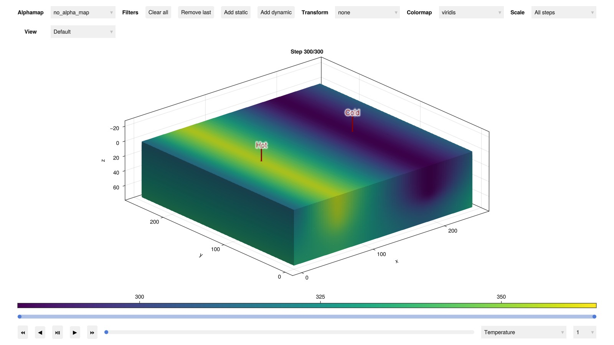
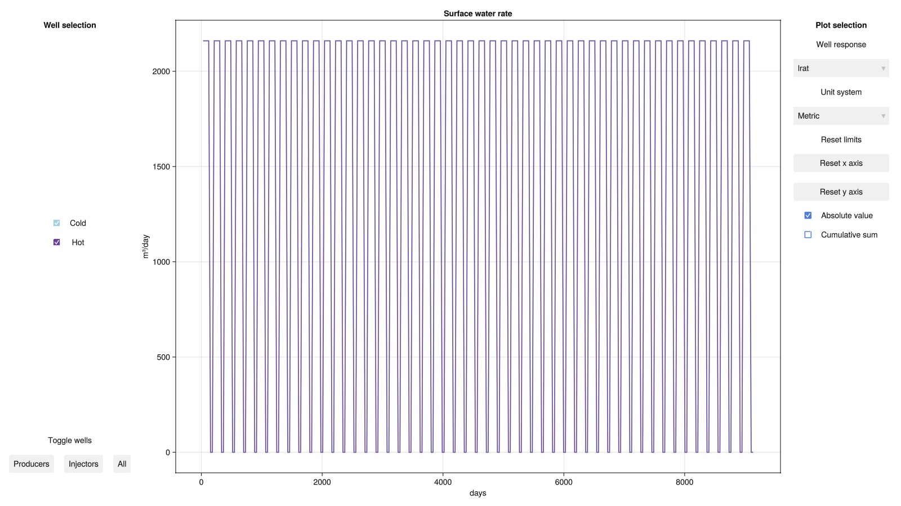
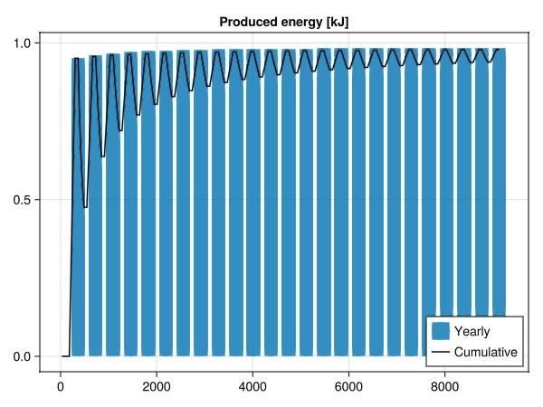

# High-temperature Aquifer Thermal Energy Storage (HT-ATES) {#High-temperature-Aquifer-Thermal-Energy-Storage-HT-ATES}

This example demonstrates how to simulate high-temperature aquifer thermal energy storage. We set up a simple case describing a vertical slice of a reservoir with an a main (hot) well near the left boundary, and a supporting (cold) well near the right boundary. The reservoir has boundarys condition that provides a constant pressure and temperature. We set up a yearly cycle where energy is stored from June to September, and discharged from December to March. The rest of the year is a rest period where no energy is stored or produced.

```julia
using JutulDarcy, Jutul, HYPRE
import Dates: monthname
darcy, litre, year, second = si_units(:darcy, :litre, :year, :second)

nx = 100
nz = 100

temperature_top = convert_to_si(40.0, :Celsius)
pressure_top = convert_to_si(120.0, :bar)
temperature_surface = convert_to_si(10.0, :Celsius)

grad_p = 1000*9.81
grad_T = 0.3
```


```
0.3
```


## Set up the reservoir {#Set-up-the-reservoir}

```julia
g = CartesianMesh((nx, 1, nz), (250.0, 250.0, 75.0))
reservoir = reservoir_domain(g,
    permeability = [0.3, 0.3, 0.1].*darcy,
    porosity = 0.3,
    rock_thermal_conductivity = 2.0,
    fluid_thermal_conductivity = 0.6
)

depth = reservoir[:cell_centroids][3, :];
```


## Define wells and model {#Define-wells-and-model}

```julia
di = Int(ceil(nx/4))
k = Int(ceil(nz/2))
Whot = setup_vertical_well(reservoir, 0+di   , 1, toe = k, name = :Hot)
Wcold = setup_vertical_well(reservoir, nx-di+1, 1, toe = k, name = :Cold)

model, parameters = setup_reservoir_model(reservoir, :geothermal, wells = [Whot, Wcold]);
```


## Set up boundary and initial conditions {#Set-up-boundary-and-initial-conditions}

```julia
bcells = Int[]
pressure_res = Float64[]
temperature_res = Float64[]
for cell in 1:number_of_cells(g)
    d = depth[cell]
    push!(pressure_res, pressure_top + grad_p*d)
    push!(temperature_res, temperature_top + grad_T*d)

    I, J, K = cell_ijk(g, cell)
    if I == 1 || I == nx
        push!(bcells, cell)
    end
end

bc = flow_boundary_condition(bcells, reservoir, pressure_res[bcells], temperature_res[bcells]);
```


## Set up the schedule {#Set-up-the-schedule}

### Set up forces {#Set-up-forces}

We assume we have a supply amounting to 90°C. at 25 l/s for storage. During the discharge period, we assume the same discharge rate and a temperature of 10°C.

```julia
charge_rate = 25litre/second
discharge_rate = charge_rate
temperature_charge = temperature_top + 50.0
temperature_discharge = temperature_top - 30.0
```


```
283.15
```


Set up forces for charging

```julia
rate_target = TotalRateTarget(charge_rate)
ctrl_hot  = InjectorControl(rate_target, [1.0], density = 1000.0, temperature = temperature_charge)
rate_target = TotalRateTarget(-charge_rate)
ctrl_cold = ProducerControl(rate_target)
forces_charge = setup_reservoir_forces(model, control = Dict(:Hot => ctrl_hot, :Cold => ctrl_cold), bc = bc)
```


```
Dict{Symbol, Any} with 4 entries:
  :Hot       => (mask = nothing,)
  :Cold      => (mask = nothing,)
  :Reservoir => (bc = FlowBoundaryCondition{Int64, Float64, Nothing}[FlowBounda…
  :Facility  => (control = Dict{Symbol, WellControlForce}(:Hot=>InjectorControl…
```


Set up forces for discharging

```julia
rate_target = TotalRateTarget(discharge_rate)
ctrl_cold = InjectorControl(rate_target, [1.0], density = 1000.0, temperature = temperature_discharge)
rate_target = TotalRateTarget(-discharge_rate)
ctrl_hot = ProducerControl(rate_target)
forces_discharge = setup_reservoir_forces(model, control = Dict(:Hot => ctrl_hot, :Cold => ctrl_cold), bc = bc)
```


```
Dict{Symbol, Any} with 4 entries:
  :Hot       => (mask = nothing,)
  :Cold      => (mask = nothing,)
  :Reservoir => (bc = FlowBoundaryCondition{Int64, Float64, Nothing}[FlowBounda…
  :Facility  => (control = Dict{Symbol, WellControlForce}(:Hot=>ProducerControl…
```


### Set up forces for rest period {#Set-up-forces-for-rest-period}

```julia
forces_rest = setup_reservoir_forces(model, bc = bc)
```


```
Dict{Symbol, Any} with 4 entries:
  :Hot       => (mask = nothing,)
  :Cold      => (mask = nothing,)
  :Reservoir => (bc = FlowBoundaryCondition{Int64, Float64, Nothing}[FlowBounda…
  :Facility  => (control = Dict{Symbol, Any}(:Hot=>DisabledControl{DisabledTarg…
```


### Set up timesteps and assign forces to each timestep {#Set-up-timesteps-and-assign-forces-to-each-timestep}

```julia
num_years = 25
dt = Float64[]
forces = []
month = year/12
for year in 1:num_years
    for mno in vcat(6:12, 1:5)
        mname = monthname(mno)
        if mname in ("January", "February", "March", "December")
            push!(dt, month)
            push!(forces, forces_discharge)
        elseif mname in ("June", "July", "August", "September")
            push!(dt, month)
            push!(forces, forces_charge)
        else
            @assert mname in ("April", "May", "October", "November")
            push!(dt, month)
            push!(forces, forces_rest)
        end
    end
end
```


## Set up initial state {#Set-up-initial-state}

```julia
state0 = setup_reservoir_state(model, Pressure = pressure_res, Temperature = temperature_res);
```


## Simulate the case {#Simulate-the-case}

```julia
ws, states = simulate_reservoir(state0, model, dt,
    forces = forces,
    parameters = parameters
);
```


```
Jutul: Simulating 25 years as 300 report steps
╭────────────────┬───────────┬───────────────┬──────────╮
│ Iteration type │  Avg/step │  Avg/ministep │    Total │
│                │ 300 steps │ 306 ministeps │ (wasted) │
├────────────────┼───────────┼───────────────┼──────────┤
│ Newton         │   3.56667 │       3.49673 │ 1070 (0) │
│ Linearization  │   4.58667 │       4.49673 │ 1376 (0) │
│ Linear solver  │   9.67667 │       9.48693 │ 2903 (0) │
│ Precond apply  │   19.3533 │       18.9739 │ 5806 (0) │
╰────────────────┴───────────┴───────────────┴──────────╯
╭───────────────┬─────────┬────────────┬─────────╮
│ Timing type   │    Each │   Relative │   Total │
│               │      ms │ Percentage │       s │
├───────────────┼─────────┼────────────┼─────────┤
│ Properties    │  1.0176 │     4.13 % │  1.0889 │
│ Equations     │  5.8816 │    30.72 % │  8.0931 │
│ Assembly      │  0.9460 │     4.94 % │  1.3018 │
│ Linear solve  │  1.0543 │     4.28 % │  1.1281 │
│ Linear setup  │  6.4870 │    26.35 % │  6.9410 │
│ Precond apply │  0.8170 │    18.00 % │  4.7432 │
│ Update        │  0.3949 │     1.60 % │  0.4225 │
│ Convergence   │  0.5604 │     2.93 % │  0.7712 │
│ Input/Output  │  0.4896 │     0.57 % │  0.1498 │
│ Other         │  1.5934 │     6.47 % │  1.7049 │
├───────────────┼─────────┼────────────┼─────────┤
│ Total         │ 24.6211 │   100.00 % │ 26.3446 │
╰───────────────┴─────────┴────────────┴─────────╯
```


## Plot the reservoir states in the interactive viewer {#Plot-the-reservoir-states-in-the-interactive-viewer}

```julia
using GLMakie
plot_reservoir(model, states, key = :Temperature, step = num_years*12)
```



## Plot wells interactively {#Plot-wells-interactively}

```julia
plot_well_results(ws)
```



## Plot energy recovery factor {#Plot-energy-recovery-factor}

The energy recovery factor η is defined as the amount of stored to produced energy. We plot this both cumulatively and for each of the 25 yearly cycles

```julia
wd = ws.wells[:Hot]
c_p_water = 4.186 # kJ/kgK

well_temp = wd[:temperature]
q = wd[:mass_rate]

storage = q .> 0
q_store = q.*storage
q_prod = q.*(.!storage)
stored_energy = well_temp.*q_store.*c_p_water.*dt
produced_energy = -well_temp.*q_prod.*c_p_water.*dt
η_cumulative = cumsum(produced_energy)./cumsum(stored_energy)
t = cumsum(dt)./si_unit(:day)

η, T = zeros(num_years), zeros(num_years)
for i = 1:num_years
    ix = (1:12) .+ 12*(i-1)
    se = sum(stored_energy[ix])
    pe = sum(produced_energy[ix])
    η[i] = pe/se
    T[i] = t[ix[end]]
end

fig = Figure()
ax = Axis(fig[1, 1], title = "Produced energy [kJ]")
barplot!(ax, T, η, label = "Yearly")
lines!(ax, t, η_cumulative, color = :black, label = "Cumulative")
axislegend(ax, position = :rb)
fig
```



## Example on GitHub {#Example-on-GitHub}

If you would like to run this example yourself, it can be downloaded from the JutulDarcy.jl GitHub repository [as a script](https://github.com/sintefmath/JutulDarcy.jl/blob/main/examples/geothermal/htates_intro.jl), or as a [Jupyter Notebook](https://github.com/sintefmath/JutulDarcy.jl/blob/gh-pages/dev/final_site/notebooks/geothermal/htates_intro.ipynb)

```
This example took 46.131593832 seconds to complete.
```


---


_This page was generated using [Literate.jl](https://github.com/fredrikekre/Literate.jl)._
