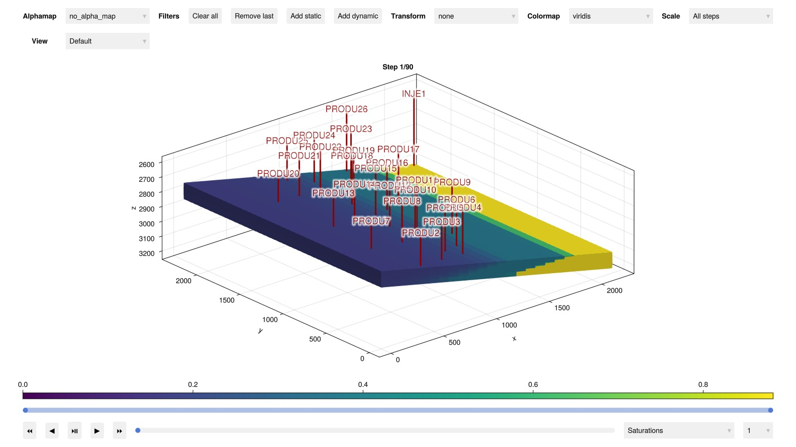
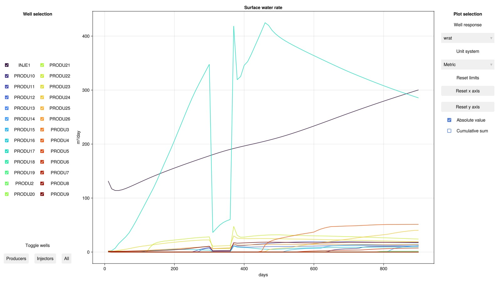
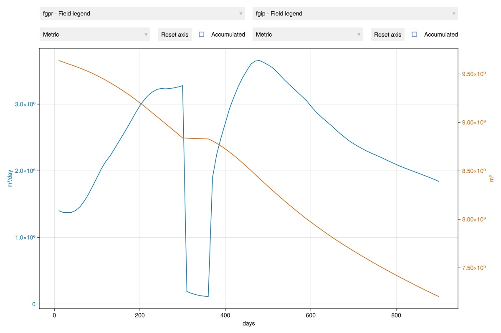

# Simulating Eclipse/DATA input files {#Simulating-Eclipse/DATA-input-files}

The DATA format is commonly used in reservoir simulation. JutulDarcy can set up cases on this format and includes a fully featured grid builder for corner-point grids. Once a case has been set up, it uses the same types as a regular JutulDarcy simulation, allowing modification and use of the case in differentiable workflows.

We begin by loading the SPE9 dataset via the GeoEnergyIO package. This package includes a set of open datasets that can be used for testing and benchmarking. The SPE9 dataset is a 3D model with a corner-point grid and a set of wells produced by the Society of Petroleum Engineers. The specific version of the file included here is taken from the [OPM tests](https://github.com/OPM/opm-tests) repository.

```julia
using JutulDarcy, GeoEnergyIO
pth = GeoEnergyIO.test_input_file_path("SPE9", "SPE9.DATA");
```


## Set up and run a simulation {#Set-up-and-run-a-simulation}

We have supressed the output of the simulation to avoid cluttering the documentation, but we can set the `info_level` to a higher value to see the output.

If we do not need the case, we could also have simulated by passing the path: `ws, states = simulate_data_file(pth)`

```julia
case = setup_case_from_data_file(pth)
ws, states = simulate_reservoir(case);
```


```
PVT: Fixing table for low pressure conditions.
Jutul: Simulating 2 years, 24.22 weeks as 90 report steps
╭────────────────┬──────────┬──────────────┬──────────╮
│ Iteration type │ Avg/step │ Avg/ministep │    Total │
│                │ 90 steps │ 98 ministeps │ (wasted) │
├────────────────┼──────────┼──────────────┼──────────┤
│ Newton         │  3.43333 │      3.15306 │  309 (0) │
│ Linearization  │  4.52222 │      4.15306 │  407 (0) │
│ Linear solver  │  10.8667 │      9.97959 │  978 (0) │
│ Precond apply  │  21.7333 │      19.9592 │ 1956 (0) │
╰────────────────┴──────────┴──────────────┴──────────╯
╭───────────────┬─────────┬────────────┬─────────╮
│ Timing type   │    Each │   Relative │   Total │
│               │      ms │ Percentage │       s │
├───────────────┼─────────┼────────────┼─────────┤
│ Properties    │  2.5467 │     4.57 % │  0.7869 │
│ Equations     │ 13.3459 │    31.57 % │  5.4318 │
│ Assembly      │  3.3219 │     7.86 % │  1.3520 │
│ Linear solve  │  2.7644 │     4.97 % │  0.8542 │
│ Linear setup  │ 12.3264 │    22.14 % │  3.8089 │
│ Precond apply │  0.9911 │    11.27 % │  1.9387 │
│ Update        │  1.2421 │     2.23 % │  0.3838 │
│ Convergence   │  1.7564 │     4.16 % │  0.7149 │
│ Input/Output  │  0.6799 │     0.39 % │  0.0666 │
│ Other         │  6.0401 │    10.85 % │  1.8664 │
├───────────────┼─────────┼────────────┼─────────┤
│ Total         │ 55.6769 │   100.00 % │ 17.2042 │
╰───────────────┴─────────┴────────────┴─────────╯
```


## Show the input data {#Show-the-input-data}

The input data takes the form of a Dict:

```julia
case.input_data
```


```
Dict{String, Any} with 6 entries:
  "RUNSPEC"  => OrderedDict{String, Any}("TITLE"=>"SPE 9", "DIMENS"=>[24, 25, 1…
  "GRID"     => OrderedDict{String, Any}("cartDims"=>(24, 25, 15), "CURRENT_BOX…
  "PROPS"    => OrderedDict{String, Any}("PVTW"=>Any[[2.48211e7, 1.0034, 4.3511…
  "SUMMARY"  => OrderedDict{String, Any}()
  "SCHEDULE" => Dict{String, Any}("STEPS"=>OrderedDict{String, Any}[OrderedDict…
  "SOLUTION" => OrderedDict{String, Any}("EQUIL"=>Any[[2753.87, 2.48211e7, 3032…
```


We can also examine the for example RUNSPEC section, which is also represented as a Dict.

```julia
case.input_data["RUNSPEC"]
```


```
OrderedDict{String, Any} with 13 entries:
  "TITLE"    => "SPE 9"
  "DIMENS"   => [24, 25, 15]
  "OIL"      => true
  "WATER"    => true
  "GAS"      => true
  "DISGAS"   => true
  "FIELD"    => true
  "START"    => DateTime("2015-01-01T00:00:00")
  "WELLDIMS" => [26, 5, 1, 26, 5, 10, 5, 4, 3, 0, 1, 1, 10, 201]
  "TABDIMS"  => [1, 1, 40, 20, 1, 20, 20, 1, 1, -1  …  -1, 10, 10, 10, -1, 5, 5…
  "EQLDIMS"  => [1, 100, 50, 1, 50]
  "UNIFIN"   => true
  "UNIFOUT"  => true
```


## Plot the simulation model {#Plot-the-simulation-model}

These plot are normally interactive, but if you are reading the published online documentation static screenshots will be inserted instead.

```julia
using GLMakie
plot_reservoir(case.model, states)
```



## Plot the well responses {#Plot-the-well-responses}

We can plot the well responses (rates and pressures) in an interactive viewer. Multiple wells can be plotted simultaneously, with options to select which units are to be used for plotting.

```julia
plot_well_results(ws)
```



## Plot the field responses {#Plot-the-field-responses}

Similar to the wells, we can also plot field-wide measurables. We plot the field gas production rate and the average pressure as the initial selection. If you are running this case interactively you can select which measurables to plot.

We observe that the field pressure steadily decreases over time, as a result of the gas production. The drop in pressure is not uniform, as during the period where little gas is produced, the decrease in field pressure is slower.

```julia
plot_reservoir_measurables(case, ws, states, left = :fgpr, right = :pres)
```



## Example on GitHub {#Example-on-GitHub}

If you would like to run this example yourself, it can be downloaded from the JutulDarcy.jl GitHub repository [as a script](https://github.com/sintefmath/JutulDarcy.jl/blob/main/examples/introduction/data_input_file.jl), or as a [Jupyter Notebook](https://github.com/sintefmath/JutulDarcy.jl/blob/gh-pages/dev/final_site/notebooks/introduction/data_input_file.ipynb)

```
This example took 33.645339901 seconds to complete.
```


---


_This page was generated using [Literate.jl](https://github.com/fredrikekre/Literate.jl)._
