# Intro to sensitivities in JutulDarcy {#Intro-to-sensitivities-in-JutulDarcy}

Sensitivites with respect to custom parameters: We demonstrate how to set up a simple conceptual model, add new parameters and variable definitions in the form of a new relative permeability function, and calculate and visualize parameter sensitivities.

We first set up a quarter-five-spot model where the domain is flooded from left to right. Some cells have lower permeability to impede flow and make the scenario more interesting.

For more details, see the paper [JutulDarcy.jl - a Fully Differentiable High-Performance Reservoir Simulator Based on Automatic Differentiation](https://doi.org/10.3997/2214-4609.202437111).

```julia
using Jutul, JutulDarcy, GLMakie, HYPRE
darcy, kg, meter, year, day, bar = si_units(:darcy, :kilogram, :meter, :year, :day, :bar)

L = 1000.0meter
H = 100.0meter
big = false # Paper uses big, takes some more time to run
if big
    nx = 500
else
    nx = 100
end
dx = L/nx

g = CartesianMesh((nx, nx, 1), (L, L, H))
nc = number_of_cells(g)
perm = fill(0.1darcy, nc)

reservoir = reservoir_domain(g, permeability = 0.1darcy)
centroids = reservoir[:cell_centroids]
rock_type = fill(1, nc)
for (i, x, y) in zip(eachindex(perm), centroids[1, :], centroids[2, :])
    xseg = (x > 0.2L) & (x < 0.8L) & (y > 0.75L) & (y < 0.8L)
    yseg = (y > 0.2L) & (y < 0.8L) & (x > 0.75L) & (x < 0.8L)
    if xseg || yseg
        rock_type[i] = 2
    end
    xseg = (x > 0.2L) & (x < 0.55L) & (y > 0.50L) & (y < 0.55L)
    yseg = (y > 0.2L) & (y < 0.55L) & (x > 0.50L) & (x < 0.55L)
    if xseg || yseg
        rock_type[i] = 3
    end
    xseg = (x > 0.2L) & (x < 0.3L) & (y > 0.25L) & (y < 0.3L)
    yseg = (y > 0.2L) & (y < 0.3L) & (x > 0.25L) & (x < 0.3L)
    if xseg || yseg
        rock_type[i] = 4
    end
end

perm = reservoir[:permeability]
@. perm[rock_type == 2] = 0.001darcy
@. perm[rock_type == 3] = 0.005darcy
@. perm[rock_type == 4] = 0.01darcy

I = setup_vertical_well(reservoir, 1, 1, name = :Injector)
P = setup_vertical_well(reservoir, nx, nx, name = :Producer)

phases = (AqueousPhase(), VaporPhase())
rhoWS, rhoGS = 1000.0kg/meter^3, 700.0kg/meter^3
system = ImmiscibleSystem(phases, reference_densities = (rhoWS, rhoGS))

model, = setup_reservoir_model(reservoir, system, wells = [I, P])
rmodel = reservoir_model(model)
```


```
SimulationModel:

  Model with 20000 degrees of freedom, 20000 equations and 79600 parameters

  domain:
    DiscretizedDomain with MinimalTPFATopology (10000 cells, 19800 faces) and discretizations for mass_flow, heat_flow

  system:
    ImmiscibleSystem with AqueousPhase, VaporPhase

  context:
    ParallelCSRContext(BlockMajorLayout(false), 1000, 1, MetisPartitioner(:KWAY))

  formulation:
    FullyImplicitFormulation()

  data_domain:
    DataDomain wrapping CartesianMesh (3D) with 100x100x1=10000 cells with 19 data fields added:
  10000 Cells
    :permeability => 10000 Vector{Float64}
    :porosity => 10000 Vector{Float64}
    :rock_thermal_conductivity => 10000 Vector{Float64}
    :fluid_thermal_conductivity => 10000 Vector{Float64}
    :rock_heat_capacity => 10000 Vector{Float64}
    :component_heat_capacity => 10000 Vector{Float64}
    :rock_density => 10000 Vector{Float64}
    :cell_centroids => 3×10000 Matrix{Float64}
    :volumes => 10000 Vector{Float64}
  19800 Faces
    :neighbors => 2×19800 Matrix{Int64}
    :areas => 19800 Vector{Float64}
    :normals => 3×19800 Matrix{Float64}
    :face_centroids => 3×19800 Matrix{Float64}
  39600 HalfFaces
    :half_face_cells => 39600 Vector{Int64}
    :half_face_faces => 39600 Vector{Int64}
  20400 BoundaryFaces
    :boundary_areas => 20400 Vector{Float64}
    :boundary_centroids => 3×20400 Matrix{Float64}
    :boundary_normals => 3×20400 Matrix{Float64}
    :boundary_neighbors => 20400 Vector{Int64}

  primary_variables:
   1) Pressure    ∈ 10000 Cells: 1 dof each
   2) Saturations ∈ 10000 Cells: 1 dof, 2 values each

  secondary_variables:
   1) PhaseMassDensities     ∈ 10000 Cells: 2 values each
      -> ConstantCompressibilityDensities as evaluator
   2) TotalMasses            ∈ 10000 Cells: 2 values each
      -> TotalMasses as evaluator
   3) RelativePermeabilities ∈ 10000 Cells: 2 values each
      -> BrooksCoreyRelativePermeabilities as evaluator
   4) PhaseMobilities        ∈ 10000 Cells: 2 values each
      -> JutulDarcy.PhaseMobilities as evaluator
   5) PhaseMassMobilities    ∈ 10000 Cells: 2 values each
      -> JutulDarcy.PhaseMassMobilities as evaluator

  parameters:
   1) Transmissibilities        ∈ 19800 Faces: Scalar
   2) TwoPointGravityDifference ∈ 19800 Faces: Scalar
   3) ConnateWater              ∈ 10000 Cells: Scalar
   4) PhaseViscosities          ∈ 10000 Cells: 2 values each
   5) FluidVolume               ∈ 10000 Cells: Scalar

  equations:
   1) mass_conservation ∈ 10000 Cells: 2 values each
      -> ConservationLaw{:TotalMasses, TwoPointPotentialFlowHardCoded{Vector{Int64}, Vector{@NamedTuple{self::Int64, other::Int64, face::Int64, face_sign::Int64}}}, Jutul.DefaultFlux, 2}

  output_variables:
    Pressure, Saturations, TotalMasses

  extra:
    OrderedDict{Symbol, Any} with keys: Symbol[]

```


## Plot the initial variable graph {#Plot-the-initial-variable-graph}

We plot the default variable graph that describes how the different variables relate to each other. When we add a new parameter and property in the next section, the graph is automatically modified.

```julia
using NetworkLayout, LayeredLayouts, GraphMakie
Jutul.plot_variable_graph(rmodel)
```

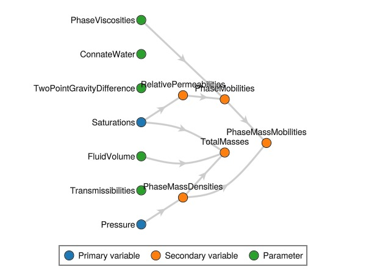

## Change the variables {#Change-the-variables}

We replace the density variable with a more compressible version, and we also define a new relative permeability variable that depends on a new parameter `KrExponents` to define the exponent of the relative permeability in each cell and phase of the model.

This is done through several steps:
1. First, we define the type
  
2. We define functions that act on that type, in particular the update function that is used to evaluate the new relative permeability during the simulation for named inputs `Saturations` and `KrExponents`.
  
3. We define the `KrExponents` as a model parameter with a default value, that can subsequently be used by the relative permeability.
  

Finally we plot the variable graph again to verify that the new relationship has been included in our model.

```julia
c = [1e-6/bar, 1e-4/bar]
density = ConstantCompressibilityDensities(p_ref = 1*bar, density_ref = [rhoWS, rhoGS], compressibility = c)
replace_variables!(rmodel, PhaseMassDensities = density);

import JutulDarcy: AbstractRelativePermeabilities, PhaseVariables
struct MyKr <: AbstractRelativePermeabilities end
@jutul_secondary function update_my_kr!(vals, def::MyKr, model, Saturations, KrExponents, cells_to_update)
    for c in cells_to_update
        for ph in axes(vals, 1)
            S_α = max(Saturations[ph, c], 0.0)
            n_α = KrExponents[ph, c]
            vals[ph, c] = S_α^n_α
        end
    end
end
struct MyKrExp <: PhaseVariables end
Jutul.default_value(model, ::MyKrExp) = 2.0
set_parameters!(rmodel, KrExponents = MyKrExp())
replace_variables!(rmodel, RelativePermeabilities = MyKr());
Jutul.plot_variable_graph(rmodel)
```

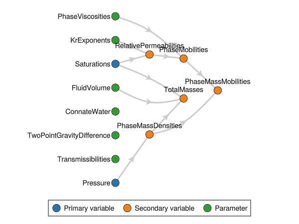

## Set up scenario and simulate {#Set-up-scenario-and-simulate}

```julia
parameters = setup_parameters(model)
exponents = parameters[:Reservoir][:KrExponents]
for (cell, rtype) in enumerate(rock_type)
    if rtype == 1
        exp_w = 2
        exp_g = 3
    else
        exp_w = 1
        exp_g = 2
    end
    exponents[1, cell] = exp_w
    exponents[2, cell] = exp_g
end

pv = pore_volume(model, parameters)
state0 = setup_reservoir_state(model, Pressure = 150*bar, Saturations = [1.0, 0.0])

dt = repeat([30.0]*day, 12*5)
pv = pore_volume(model, parameters)
total_time = sum(dt)
inj_rate = sum(pv)/total_time

rate_target = TotalRateTarget(inj_rate)
I_ctrl = InjectorControl(rate_target, [0.0, 1.0], density = rhoGS)
bhp_target = BottomHolePressureTarget(50*bar)
P_ctrl = ProducerControl(bhp_target)
controls = Dict()
controls[:Injector] = I_ctrl
controls[:Producer] = P_ctrl

forces = setup_reservoir_forces(model, control = controls)
case = JutulCase(model, dt, forces, parameters = parameters, state0 = state0)
result = simulate_reservoir(case, output_substates = true);
```


```
Jutul: Simulating 4 years, 48.43 weeks as 60 report steps
╭────────────────┬──────────┬───────────────┬──────────╮
│ Iteration type │ Avg/step │  Avg/ministep │    Total │
│                │ 60 steps │ 116 ministeps │ (wasted) │
├────────────────┼──────────┼───────────────┼──────────┤
│ Newton         │  8.81667 │       4.56034 │  529 (0) │
│ Linearization  │    10.75 │       5.56034 │  645 (0) │
│ Linear solver  │  30.3333 │       15.6897 │ 1820 (0) │
│ Precond apply  │  60.6667 │       31.3793 │ 3640 (0) │
╰────────────────┴──────────┴───────────────┴──────────╯
╭───────────────┬─────────┬────────────┬─────────╮
│ Timing type   │    Each │   Relative │   Total │
│               │      ms │ Percentage │       s │
├───────────────┼─────────┼────────────┼─────────┤
│ Properties    │  0.6556 │     1.88 % │  0.3468 │
│ Equations     │  3.0829 │    10.77 % │  1.9885 │
│ Assembly      │  2.5562 │     8.93 % │  1.6488 │
│ Linear solve  │  2.4886 │     7.13 % │  1.3165 │
│ Linear setup  │  9.5558 │    27.38 % │  5.0550 │
│ Precond apply │  0.8031 │    15.84 % │  2.9232 │
│ Update        │  3.3434 │     9.58 % │  1.7687 │
│ Convergence   │  2.1022 │     7.35 % │  1.3559 │
│ Input/Output  │  1.4451 │     0.91 % │  0.1676 │
│ Other         │  3.5695 │    10.23 % │  1.8883 │
├───────────────┼─────────┼────────────┼─────────┤
│ Total         │ 34.8946 │   100.00 % │ 18.4593 │
╰───────────────┴─────────┴────────────┴─────────╯
```


## Print the gas saturation {#Print-the-gas-saturation}

```julia
ws, states = result
ws(:Producer, :grat)
```


```
Legend
┌───────┬──────────────────┬──────┬─────────────────────────────┐
│ Label │ Description      │ Unit │ Type of quantity            │
├───────┼──────────────────┼──────┼─────────────────────────────┤
│ grat  │ Surface gas rate │ m³/s │ gas_volume_surface per time │
└───────┴──────────────────┴──────┴─────────────────────────────┘
Producer result
┌─────────┬──────────────┐
│    time │         grat │
│    days │         m³/s │
├─────────┼──────────────┤
│     1.0 │         -0.0 │
│ 1.64286 │         -0.0 │
│ 2.05612 │         -0.0 │
│ 2.98597 │         -0.0 │
│ 5.07812 │         -0.0 │
│ 8.84401 │         -0.0 │
│ 14.4928 │         -0.0 │
│ 22.2464 │         -0.0 │
│    30.0 │         -0.0 │
│ 39.9689 │         -0.0 │
│ 49.9844 │         -0.0 │
│    60.0 │         -0.0 │
│    75.0 │         -0.0 │
│    90.0 │         -0.0 │
│   105.0 │         -0.0 │
│   120.0 │         -0.0 │
│   135.0 │         -0.0 │
│   150.0 │         -0.0 │
│   165.0 │         -0.0 │
│   180.0 │         -0.0 │
│   195.0 │         -0.0 │
│   210.0 │         -0.0 │
│   225.0 │         -0.0 │
│   240.0 │         -0.0 │
│   255.0 │         -0.0 │
│   270.0 │         -0.0 │
│   285.0 │         -0.0 │
│   300.0 │         -0.0 │
│   315.0 │         -0.0 │
│   330.0 │         -0.0 │
│   345.0 │         -0.0 │
│   360.0 │         -0.0 │
│   375.0 │         -0.0 │
│   390.0 │         -0.0 │
│   405.0 │         -0.0 │
│   420.0 │         -0.0 │
│   435.0 │         -0.0 │
│   450.0 │         -0.0 │
│   465.0 │         -0.0 │
│   480.0 │         -0.0 │
│   495.0 │         -0.0 │
│   510.0 │         -0.0 │
│   525.0 │         -0.0 │
│   540.0 │         -0.0 │
│   555.0 │         -0.0 │
│   570.0 │         -0.0 │
│   585.0 │         -0.0 │
│   600.0 │         -0.0 │
│   615.0 │         -0.0 │
│   630.0 │         -0.0 │
│   645.0 │         -0.0 │
│   660.0 │         -0.0 │
│   675.0 │         -0.0 │
│   690.0 │         -0.0 │
│   705.0 │         -0.0 │
│   720.0 │         -0.0 │
│   735.0 │         -0.0 │
│   750.0 │         -0.0 │
│   765.0 │         -0.0 │
│   780.0 │         -0.0 │
│   795.0 │         -0.0 │
│   810.0 │         -0.0 │
│   825.0 │         -0.0 │
│   840.0 │         -0.0 │
│   855.0 │         -0.0 │
│   870.0 │         -0.0 │
│   885.0 │         -0.0 │
│   900.0 │         -0.0 │
│   915.0 │         -0.0 │
│   930.0 │         -0.0 │
│   945.0 │         -0.0 │
│   960.0 │         -0.0 │
│   975.0 │         -0.0 │
│   990.0 │         -0.0 │
│  1005.0 │         -0.0 │
│  1020.0 │         -0.0 │
│  1035.0 │         -0.0 │
│  1050.0 │         -0.0 │
│  1065.0 │         -0.0 │
│  1080.0 │         -0.0 │
│  1095.0 │         -0.0 │
│  1110.0 │         -0.0 │
│  1125.0 │         -0.0 │
│  1140.0 │         -0.0 │
│  1155.0 │         -0.0 │
│  1170.0 │         -0.0 │
│  1185.0 │         -0.0 │
│  1200.0 │         -0.0 │
│  1215.0 │         -0.0 │
│  1230.0 │         -0.0 │
│  1245.0 │         -0.0 │
│  1260.0 │         -0.0 │
│  1275.0 │         -0.0 │
│  1290.0 │         -0.0 │
│  1305.0 │         -0.0 │
│  1320.0 │         -0.0 │
│  1335.0 │         -0.0 │
│  1350.0 │ -0.000270177 │
│  1365.0 │  -0.00947943 │
│  1372.5 │   -0.0157172 │
│  1380.0 │    -0.020079 │
│  1395.0 │   -0.0252096 │
│  1410.0 │   -0.0286564 │
│  1440.0 │   -0.0325147 │
│  1470.0 │   -0.0349002 │
│  1500.0 │   -0.0365192 │
│  1530.0 │   -0.0377315 │
│  1560.0 │   -0.0387118 │
│  1590.0 │   -0.0395436 │
│  1620.0 │   -0.0402677 │
│  1650.0 │    -0.040907 │
│  1680.0 │   -0.0414767 │
│  1710.0 │   -0.0419889 │
│  1740.0 │    -0.042455 │
│  1770.0 │    -0.042886 │
│  1800.0 │   -0.0432937 │
└─────────┴──────────────┘
```


## Define objective function {#Define-objective-function}

We let the objective function be the amount produced of produced gas, normalized by the injected amount.

```julia
using GLMakie
function objective_function(model, state, Δt, step_i, forces)
    grat = JutulDarcy.compute_well_qoi(model, state, forces, :Producer, SurfaceGasRateTarget)
    return Δt*grat/(inj_rate*total_time)
end
data_domain_with_gradients = JutulDarcy.reservoir_sensitivities(case, result, objective_function, include_parameters = true)
```


```
DataDomain wrapping CartesianMesh (3D) with 100x100x1=10000 cells with 25 data fields added:
  10000 Cells
    :permeability => 10000 Vector{Float64}
    :porosity => 10000 Vector{Float64}
    :rock_thermal_conductivity => 10000 Vector{Float64}
    :fluid_thermal_conductivity => 10000 Vector{Float64}
    :rock_heat_capacity => 10000 Vector{Float64}
    :component_heat_capacity => 10000 Vector{Float64}
    :rock_density => 10000 Vector{Float64}
    :cell_centroids => 3×10000 Matrix{Float64}
    :volumes => 10000 Vector{Float64}
    :ConnateWater => 10000 Vector{Float64}
    :PhaseViscosities => 2×10000 Matrix{Float64}
    :FluidVolume => 10000 Vector{Float64}
    :KrExponents => 2×10000 Matrix{Float64}
  19800 Faces
    :neighbors => 2×19800 Matrix{Int64}
    :areas => 19800 Vector{Float64}
    :normals => 3×19800 Matrix{Float64}
    :face_centroids => 3×19800 Matrix{Float64}
    :Transmissibilities => 19800 Vector{Float64}
    :TwoPointGravityDifference => 19800 Vector{Float64}
  39600 HalfFaces
    :half_face_cells => 39600 Vector{Int64}
    :half_face_faces => 39600 Vector{Int64}
  20400 BoundaryFaces
    :boundary_areas => 20400 Vector{Float64}
    :boundary_centroids => 3×20400 Matrix{Float64}
    :boundary_normals => 3×20400 Matrix{Float64}
    :boundary_neighbors => 20400 Vector{Int64}

```


## Launch interactive plotter for cell-wise gradients {#Launch-interactive-plotter-for-cell-wise-gradients}

```julia
plot_reservoir(data_domain_with_gradients)
```

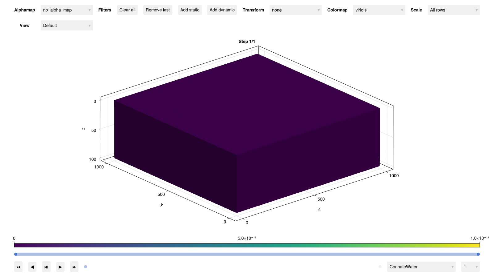

## Set up plotting functions {#Set-up-plotting-functions}

```julia
∂K = data_domain_with_gradients[:permeability]
∂ϕ = data_domain_with_gradients[:porosity]

function get_cscale(x)
    minv0, maxv0 = extrema(x)
    minv = min(minv0, -maxv0)
    maxv = max(maxv0, -minv0)
    return (minv, maxv)
end

function myplot(title, vals; kwarg...)
    fig = Figure()
    myplot!(fig, 1, 1, title, vals; kwarg...)
    return fig
end

function myplot!(fig, I, J, title, vals; is_grad = false, is_log = false, colorrange = missing, contourplot = false, nticks = 5, ticks = missing, colorbar = true, kwarg...)
    ax = Axis(fig[I, J], title = title)

    if is_grad
        if ismissing(colorrange)
            colorrange = get_cscale(vals)
        end
        cmap = :seismic
    else
        if ismissing(colorrange)
            colorrange = extrema(vals)
        end
        cmap = :seaborn_icefire_gradient
    end
    hidedecorations!(ax)
    hidespines!(ax)
    arg = (; colormap = cmap, colorrange = colorrange, kwarg...)
    plt = plot_cell_data!(ax, g, vals; shading = NoShading, arg...)
    if colorbar
        if ismissing(ticks)
            ticks = range(colorrange..., nticks)
        end
        Colorbar(fig[I, J+1], plt, ticks = ticks, ticklabelsize = 25, size = 25)
    end
    return fig
end
```


```
myplot! (generic function with 1 method)
```


## Plot the permeability {#Plot-the-permeability}

```julia
myplot("Permeability", perm./darcy, colorscale = log10, ticks = [0.001, 0.01, 0.1])
```

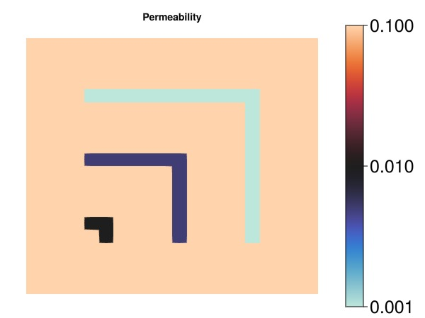

## Plot the evolution of the gas saturation {#Plot-the-evolution-of-the-gas-saturation}

```julia
fig = Figure(size = (1200, 400))
sg = states[25][:Saturations][2, :]
myplot!(fig, 1, 1, "Gas saturation", sg, colorrange = (0, 1), colorbar = false)
sg = states[70][:Saturations][2, :]
myplot!(fig, 1, 2, "Gas saturation", sg, colorrange = (0, 1), colorbar = false)
sg = states[end][:Saturations][2, :]
myplot!(fig, 1, 3, "Gas saturation", sg, colorrange = (0, 1))
fig
```

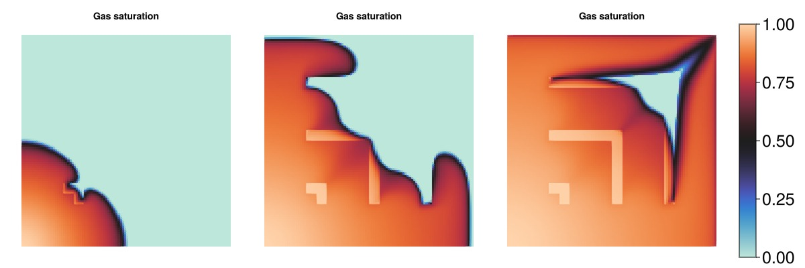

## Plot the sensitivity of the objective with respect to permeability {#Plot-the-sensitivity-of-the-objective-with-respect-to-permeability}

```julia
if big
    cr = (-0.001, 0.001)
    cticks = [-0.001, -0.0005, 0.0005, 0.001]
else
    cr = (-0.05, 0.05)
    cticks = [-0.05, -0.025, 0, 0.025, 0.05]
end

myplot("perm_sens", ∂K.*darcy, is_grad = true, ticks = cticks, colorrange = cr)
```

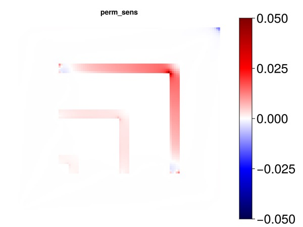

## Plot the sensitivity of the objective with respect to porosity {#Plot-the-sensitivity-of-the-objective-with-respect-to-porosity}

```julia
if big
    cr = (-0.00001, 0.00001)
else
    cr = (-0.00025, 0.00025)
end
myplot("porosity_sens", ∂ϕ, is_grad = true, colorrange = cr)
```

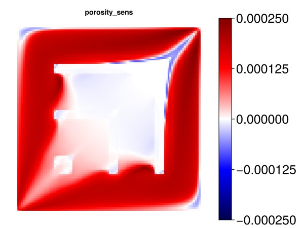

## Gradient with respect to cell centroids {#Gradient-with-respect-to-cell-centroids}

```julia
∂xyz = data_domain_with_gradients[:cell_centroids]
∂x = ∂xyz[1, :]
∂y = ∂xyz[2, :]
∂z = ∂xyz[3, :]
#
if big
    cr = [-1e-8, 1e-8]
else
    cr = [-1e-7, 1e-7]
end
```


```
2-element Vector{Float64}:
 -1.0e-7
  1.0e-7
```


## Plot the sensitivity of the objective with respect to x cell centroids {#Plot-the-sensitivity-of-the-objective-with-respect-to-x-cell-centroids}

```julia
myplot("dx_sens", ∂x, is_grad = true, colorrange = cr)
```

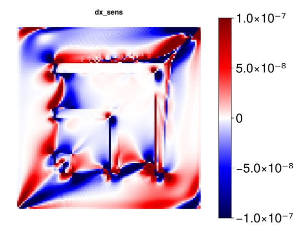

## Plot the sensitivity of the objective with respect to y cell centroids {#Plot-the-sensitivity-of-the-objective-with-respect-to-y-cell-centroids}

```julia
myplot("dy_sens", ∂y, is_grad = true, colorrange = cr)
```

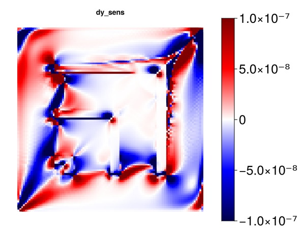

## Plot the sensitivity of the objective with respect to z cell centroids {#Plot-the-sensitivity-of-the-objective-with-respect-to-z-cell-centroids}

Note: The effect here is primarily coming from gravity.

```julia
myplot("dz_sens", ∂z, is_grad = true, colorrange = cr)
```

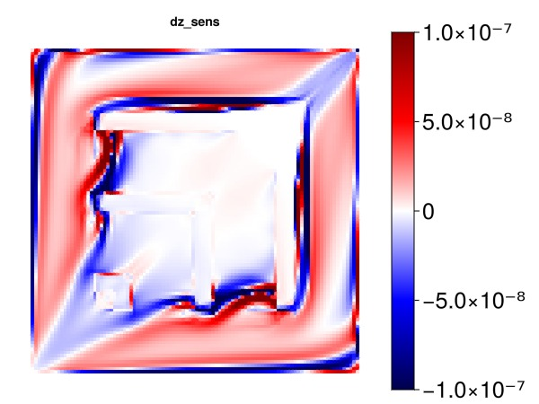

## Plot the effect of the new liquid kr exponent on the gas production {#Plot-the-effect-of-the-new-liquid-kr-exponent-on-the-gas-production}

```julia
if big
    cr = [-1e-7, 1e-7]
else
    cr = [-8e-6, 8e-6]
end

kre = data_domain_with_gradients[:KrExponents]
exp_l = kre[1, :]
myplot("exp_liquid", exp_l, is_grad = true, colorrange = cr)
```

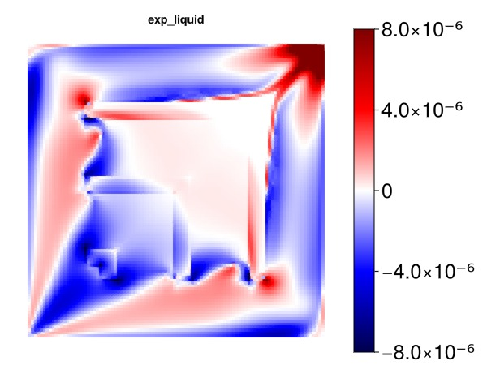

## Plot the effect of the new vapor kr exponent on the gas production {#Plot-the-effect-of-the-new-vapor-kr-exponent-on-the-gas-production}

```julia
exp_v = kre[2, :]
myplot("exp_vapor", exp_v, is_grad = true, colorrange = cr)
```

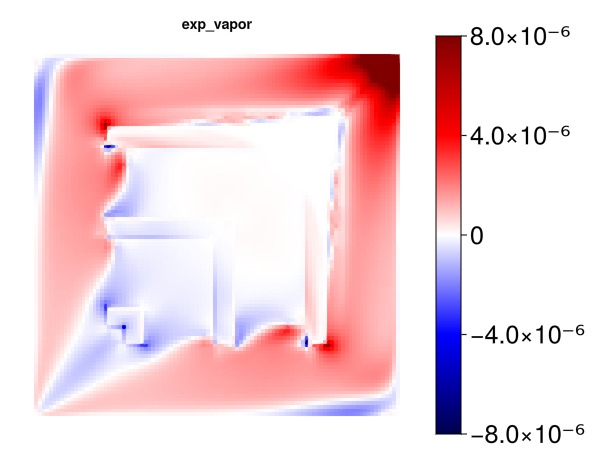

## Plot the effect of the liquid phase viscosity {#Plot-the-effect-of-the-liquid-phase-viscosity}

Note: The viscosity can in many models be a variable and not a parameter. For this simple model, however, it is treated as a parameter and we obtain sensitivities.

```julia
mu = data_domain_with_gradients[:PhaseViscosities]
if big
    cr = [-0.001, 0.001]
else
    cr = [-0.01, 0.01]
end
mu_l = mu[1, :]
myplot("mu_liquid", mu_l, is_grad = true, colorrange = cr)
```

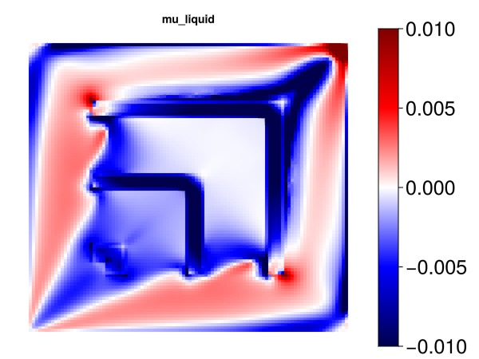

## Plot the effect of the liquid phase viscosity {#Plot-the-effect-of-the-liquid-phase-viscosity-2}

```julia
mu_v = mu[2, :]
myplot("mu_vapor", mu_v, is_grad = true, colorrange = cr)
```

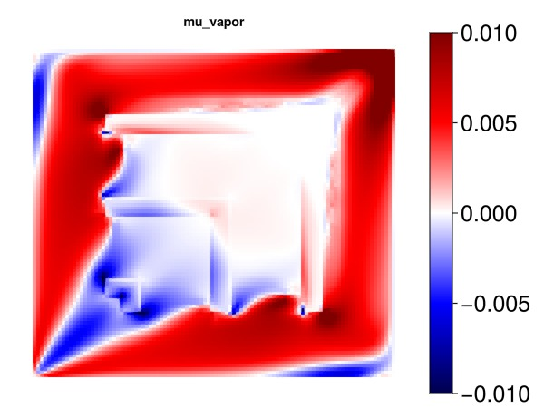

## Example on GitHub {#Example-on-GitHub}

If you would like to run this example yourself, it can be downloaded from the JutulDarcy.jl GitHub repository [as a script](https://github.com/sintefmath/JutulDarcy.jl/blob/main/examples/introduction/intro_sensitivities.jl), or as a [Jupyter Notebook](https://github.com/sintefmath/JutulDarcy.jl/blob/gh-pages/dev/final_site/notebooks/introduction/intro_sensitivities.ipynb)

```
This example took 189.413895902 seconds to complete.
```


---


_This page was generated using [Literate.jl](https://github.com/fredrikekre/Literate.jl)._
