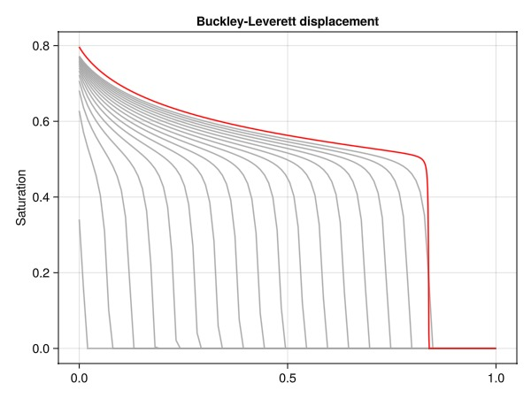

# Buckley-Leverett two-phase problem {#Buckley-Leverett-two-phase-problem}

The Buckley-Leverett test problem is a classical reservoir simulation benchmark that demonstrates the nonlinear displacement process of a viscous fluid being displaced by a less viscous fluid, typically taken to be water displacing oil.

## Problem definition {#Problem-definition}

This is a simple model without wells, where the flow is driven by a simple source term and a simple constant pressure boundary condition at the outlet. We define a function that sets up a two-phase system, a simple 1D domain and replaces the default relative permeability functions with quadratic functions:

$k_{r\alpha}(S) = \min \left(\frac{S - S_r}{1 - S_r}, 1\right)^n, S_r = 0.2, n = 2$

In addition, the phase viscosities are treated as constant parameters of 1 and 5 centipoise for the displacing and resident fluids, respectively.

The function is parametrized on the number of cells and the number of time-steps used to solve the model. This function, since it uses a relatively simple setup without wells, uses the `Jutul` functions directly.

```julia
using JutulDarcy, Jutul
function solve_bl(;nc = 100, time = 1.0, nstep = nc)
    T = time
    tstep = repeat([T/nstep], nstep)
    domain = get_1d_reservoir(nc)
    nc = number_of_cells(domain)
    timesteps = tstep*3600*24
    bar = 1e5
    p0 = 100*bar
    sys = ImmiscibleSystem((LiquidPhase(), VaporPhase()))
    model = SimulationModel(domain, sys)
    kr = BrooksCoreyRelativePermeabilities(sys, [2.0, 2.0], [0.2, 0.2])
    replace_variables!(model, RelativePermeabilities = kr)
    tot_time = sum(timesteps)
    pv = pore_volume(domain)
    irate = 500*sum(pv)/tot_time
    src  = SourceTerm(1, irate, fractional_flow = [1.0, 0.0])
    bc = FlowBoundaryCondition(nc, p0/2)
    forces = setup_forces(model, sources = src, bc = bc)
    parameters = setup_parameters(model, PhaseViscosities = [1e-3, 5e-3]) # 1 and 5 cP
    state0 = setup_state(model, Pressure = p0, Saturations = [0.0, 1.0])
    states, report = simulate(state0, model, timesteps,
        forces = forces, parameters = parameters)
    return states, model, report
end
```


```
solve_bl (generic function with 1 method)
```


## Run the base case {#Run-the-base-case}

We solve a small model with 100 cells and 100 steps to serve as the baseline.

```julia
n, n_f = 100, 1000
states, model, report = solve_bl(nc = n)
print_stats(report)
```


```
Jutul: Simulating 1 day as 100 report steps
╭────────────────┬───────────┬───────────────┬──────────╮
│ Iteration type │  Avg/step │  Avg/ministep │    Total │
│                │ 100 steps │ 100 ministeps │ (wasted) │
├────────────────┼───────────┼───────────────┼──────────┤
│ Newton         │      3.31 │          3.31 │  331 (0) │
│ Linearization  │      4.31 │          4.31 │  431 (0) │
│ Linear solver  │      3.31 │          3.31 │  331 (0) │
│ Precond apply  │       0.0 │           0.0 │    0 (0) │
╰────────────────┴───────────┴───────────────┴──────────╯
╭───────────────┬────────┬────────────┬────────╮
│ Timing type   │   Each │   Relative │  Total │
│               │     ms │ Percentage │      s │
├───────────────┼────────┼────────────┼────────┤
│ Properties    │ 0.0144 │     0.17 % │ 0.0048 │
│ Equations     │ 0.3041 │     4.63 % │ 0.1311 │
│ Assembly      │ 0.0067 │     0.10 % │ 0.0029 │
│ Linear solve  │ 3.6058 │    42.13 % │ 1.1935 │
│ Linear setup  │ 0.0000 │     0.00 % │ 0.0000 │
│ Precond apply │ 0.0000 │     0.00 % │ 0.0000 │
│ Update        │ 0.1276 │     1.49 % │ 0.0422 │
│ Convergence   │ 0.7917 │    12.05 % │ 0.3412 │
│ Input/Output  │ 0.3004 │     1.06 % │ 0.0300 │
│ Other         │ 3.2838 │    38.37 % │ 1.0869 │
├───────────────┼────────┼────────────┼────────┤
│ Total         │ 8.5578 │   100.00 % │ 2.8326 │
╰───────────────┴────────┴────────────┴────────╯
╭────────────────┬───────────┬───────────────┬──────────╮
│ Iteration type │  Avg/step │  Avg/ministep │    Total │
│                │ 100 steps │ 100 ministeps │ (wasted) │
├────────────────┼───────────┼───────────────┼──────────┤
│ Newton         │      3.31 │          3.31 │  331 (0) │
│ Linearization  │      4.31 │          4.31 │  431 (0) │
│ Linear solver  │      3.31 │          3.31 │  331 (0) │
│ Precond apply  │       0.0 │           0.0 │    0 (0) │
╰────────────────┴───────────┴───────────────┴──────────╯
╭───────────────┬────────┬────────────┬────────╮
│ Timing type   │   Each │   Relative │  Total │
│               │     ms │ Percentage │      s │
├───────────────┼────────┼────────────┼────────┤
│ Properties    │ 0.0144 │     0.17 % │ 0.0048 │
│ Equations     │ 0.3041 │     4.63 % │ 0.1311 │
│ Assembly      │ 0.0067 │     0.10 % │ 0.0029 │
│ Linear solve  │ 3.6058 │    42.13 % │ 1.1935 │
│ Linear setup  │ 0.0000 │     0.00 % │ 0.0000 │
│ Precond apply │ 0.0000 │     0.00 % │ 0.0000 │
│ Update        │ 0.1276 │     1.49 % │ 0.0422 │
│ Convergence   │ 0.7917 │    12.05 % │ 0.3412 │
│ Input/Output  │ 0.3004 │     1.06 % │ 0.0300 │
│ Other         │ 3.2838 │    38.37 % │ 1.0869 │
├───────────────┼────────┼────────────┼────────┤
│ Total         │ 8.5578 │   100.00 % │ 2.8326 │
╰───────────────┴────────┴────────────┴────────╯
```


## Run refined version (1000 cells, 1000 steps) {#Run-refined-version-1000-cells,-1000-steps}

Using a grid with 100 cells will not yield a fully converged solution. We can increase the number of cells at the cost of increasing the runtime a bit. Note that most of the time is spent in the linear solver, which uses a direct sparse LU factorization by default. For larger problems it is recommended to use an iterative solver. The high-level interface used in later examples automatically sets up an iterative solver with the appropriate preconditioner.

```julia
states_refined, _, report_refined = solve_bl(nc = n_f);
print_stats(report_refined)
```


```
Jutul: Simulating 23 hours, 60 minutes as 1000 report steps
╭────────────────┬────────────┬────────────────┬──────────╮
│ Iteration type │   Avg/step │   Avg/ministep │    Total │
│                │ 1000 steps │ 1000 ministeps │ (wasted) │
├────────────────┼────────────┼────────────────┼──────────┤
│ Newton         │      3.265 │          3.265 │ 3265 (0) │
│ Linearization  │      4.265 │          4.265 │ 4265 (0) │
│ Linear solver  │      3.265 │          3.265 │ 3265 (0) │
│ Precond apply  │        0.0 │            0.0 │    0 (0) │
╰────────────────┴────────────┴────────────────┴──────────╯
╭───────────────┬────────┬────────────┬────────╮
│ Timing type   │   Each │   Relative │  Total │
│               │     ms │ Percentage │      s │
├───────────────┼────────┼────────────┼────────┤
│ Properties    │ 0.0818 │     3.50 % │ 0.2671 │
│ Equations     │ 0.0647 │     3.62 % │ 0.2759 │
│ Assembly      │ 0.0458 │     2.56 % │ 0.1955 │
│ Linear solve  │ 2.0063 │    85.90 % │ 6.5506 │
│ Linear setup  │ 0.0000 │     0.00 % │ 0.0000 │
│ Precond apply │ 0.0000 │     0.00 % │ 0.0000 │
│ Update        │ 0.0248 │     1.06 % │ 0.0811 │
│ Convergence   │ 0.0177 │     0.99 % │ 0.0756 │
│ Input/Output  │ 0.0449 │     0.59 % │ 0.0449 │
│ Other         │ 0.0415 │     1.78 % │ 0.1355 │
├───────────────┼────────┼────────────┼────────┤
│ Total         │ 2.3357 │   100.00 % │ 7.6262 │
╰───────────────┴────────┴────────────┴────────╯
╭────────────────┬────────────┬────────────────┬──────────╮
│ Iteration type │   Avg/step │   Avg/ministep │    Total │
│                │ 1000 steps │ 1000 ministeps │ (wasted) │
├────────────────┼────────────┼────────────────┼──────────┤
│ Newton         │      3.265 │          3.265 │ 3265 (0) │
│ Linearization  │      4.265 │          4.265 │ 4265 (0) │
│ Linear solver  │      3.265 │          3.265 │ 3265 (0) │
│ Precond apply  │        0.0 │            0.0 │    0 (0) │
╰────────────────┴────────────┴────────────────┴──────────╯
╭───────────────┬────────┬────────────┬────────╮
│ Timing type   │   Each │   Relative │  Total │
│               │     ms │ Percentage │      s │
├───────────────┼────────┼────────────┼────────┤
│ Properties    │ 0.0818 │     3.50 % │ 0.2671 │
│ Equations     │ 0.0647 │     3.62 % │ 0.2759 │
│ Assembly      │ 0.0458 │     2.56 % │ 0.1955 │
│ Linear solve  │ 2.0063 │    85.90 % │ 6.5506 │
│ Linear setup  │ 0.0000 │     0.00 % │ 0.0000 │
│ Precond apply │ 0.0000 │     0.00 % │ 0.0000 │
│ Update        │ 0.0248 │     1.06 % │ 0.0811 │
│ Convergence   │ 0.0177 │     0.99 % │ 0.0756 │
│ Input/Output  │ 0.0449 │     0.59 % │ 0.0449 │
│ Other         │ 0.0415 │     1.78 % │ 0.1355 │
├───────────────┼────────┼────────────┼────────┤
│ Total         │ 2.3357 │   100.00 % │ 7.6262 │
╰───────────────┴────────┴────────────┴────────╯
```


## Plot results {#Plot-results}

We plot the saturation front for the base case at different times together with the final solution for the refined model. In this case, refining the grid by a factor 10 gave us significantly less smearing of the trailing front.

```julia
using GLMakie
x = range(0, stop = 1, length = n)
x_f = range(0, stop = 1, length = n_f)
f = Figure()
ax = Axis(f[1, 1], ylabel = "Saturation", title = "Buckley-Leverett displacement")
for i in 1:6:length(states)
    lines!(ax, x, states[i][:Saturations][1, :], color = :darkgray)
end
lines!(ax, x_f, states_refined[end][:Saturations][1, :], color = :red)
f
```



## Example on GitHub {#Example-on-GitHub}

If you would like to run this example yourself, it can be downloaded from the JutulDarcy.jl GitHub repository [as a script](https://github.com/sintefmath/JutulDarcy.jl/blob/main/examples/introduction/two_phase_buckley_leverett.jl), or as a [Jupyter Notebook](https://github.com/sintefmath/JutulDarcy.jl/blob/gh-pages/dev/final_site/notebooks/introduction/two_phase_buckley_leverett.ipynb)

```
This example took 15.099974948 seconds to complete.
```


---


_This page was generated using [Literate.jl](https://github.com/fredrikekre/Literate.jl)._
