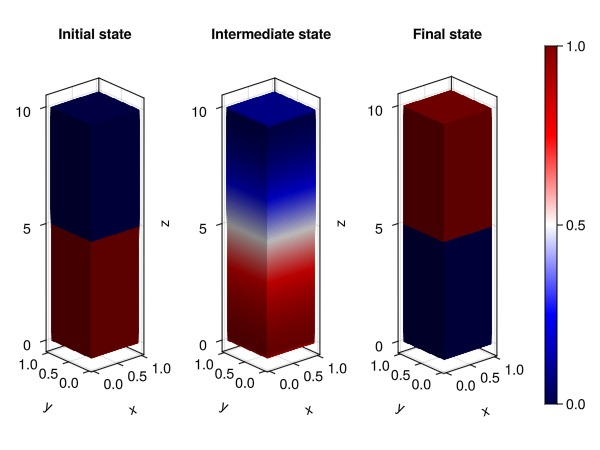
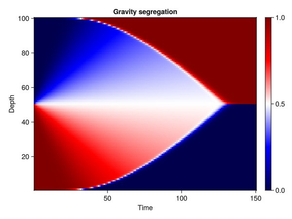

# Gravity segregation example {#Gravity-segregation-example}

The simplest type of porous media simulation problem to set up that is not trivial is the transition to equilibrium from an unstable initial condition. Placing a heavy fluid on top of a lighter fluid will lead to the heavy fluid moving down while the lighter fluid moves up.

## Problem set up {#Problem-set-up}

We define a simple 1D gravity column with an approximate 10-1 ratio in density between the two compressible phases and let it simulate until equilibrium is reached. We begin by defining the reservoir domain itself.

```julia
using JutulDarcy, Jutul
nc = 100
Darcy, bar, kg, meter, day = si_units(:darcy, :bar, :kilogram, :meter, :day)

g = CartesianMesh((1, 1, nc), (1.0, 1.0, 10.0))
domain = reservoir_domain(g, permeability = 1.0*Darcy);
```


## Fluid properties {#Fluid-properties}

Define two phases liquid and vapor with a 10-1 ratio reference densities and set up the simulation model.

```julia
p0 = 100*bar

rhoLS = 1000.0*kg/meter^3
rhoVS = 100.0*kg/meter^3
cl, cv = 1e-5/bar, 1e-4/bar
L, V = LiquidPhase(), VaporPhase()
sys = ImmiscibleSystem([L, V])
model = SimulationModel(domain, sys);
```


### Definition for phase mass densities {#Definition-for-phase-mass-densities}

Replace default density with a constant compressibility function that uses the reference values at the initial pressure.

```julia
density = ConstantCompressibilityDensities(sys, p0, [rhoLS, rhoVS], [cl, cv])
set_secondary_variables!(model, PhaseMassDensities = density);
```


### Set up initial state {#Set-up-initial-state}

Put heavy phase on top and light phase on bottom. Saturations have one value per phase, per cell and consequently a per-cell instantiation will require a two by number of cells matrix as input. We also set up time-steps for the simulation, using the provided conversion factor to convert days into seconds.

```julia
nl = nc ÷ 2
sL = vcat(ones(nl), zeros(nc - nl))'
s0 = vcat(sL, 1 .- sL)
state0 = setup_state(model, Pressure = p0, Saturations = s0)
timesteps = repeat([0.02]*day, 150);
```


## Perform simulation {#Perform-simulation}

We simulate the system using the default linear solver and otherwise default options. Using `simulate` with the default options means that no dynamic timestepping will be used, and the simulation will report on the exact 150 steps defined above.

```julia
states, report = simulate(state0, model, timesteps);
```


```
Jutul: Simulating 3 days as 150 report steps
╭────────────────┬───────────┬───────────────┬──────────╮
│ Iteration type │  Avg/step │  Avg/ministep │    Total │
│                │ 150 steps │ 150 ministeps │ (wasted) │
├────────────────┼───────────┼───────────────┼──────────┤
│ Newton         │      1.78 │          1.78 │  267 (0) │
│ Linearization  │      2.78 │          2.78 │  417 (0) │
│ Linear solver  │      1.78 │          1.78 │  267 (0) │
│ Precond apply  │       0.0 │           0.0 │    0 (0) │
╰────────────────┴───────────┴───────────────┴──────────╯
╭───────────────┬────────┬────────────┬────────╮
│ Timing type   │   Each │   Relative │  Total │
│               │     ms │ Percentage │      s │
├───────────────┼────────┼────────────┼────────┤
│ Properties    │ 0.0147 │     0.29 % │ 0.0039 │
│ Equations     │ 0.0178 │     0.55 % │ 0.0074 │
│ Assembly      │ 0.0063 │     0.19 % │ 0.0026 │
│ Linear solve  │ 0.1957 │     3.90 % │ 0.0523 │
│ Linear setup  │ 0.0000 │     0.00 % │ 0.0000 │
│ Precond apply │ 0.0000 │     0.00 % │ 0.0000 │
│ Update        │ 0.0103 │     0.21 % │ 0.0028 │
│ Convergence   │ 0.0111 │     0.35 % │ 0.0046 │
│ Input/Output  │ 0.0111 │     0.12 % │ 0.0017 │
│ Other         │ 4.7371 │    94.38 % │ 1.2648 │
├───────────────┼────────┼────────────┼────────┤
│ Total         │ 5.0190 │   100.00 % │ 1.3401 │
╰───────────────┴────────┴────────────┴────────╯
```


## Plot results {#Plot-results}

Plot the saturations of the liquid phase at three different timesteps: The initial, unstable state, an intermediate state where fluid exchange between the top and bottom is initiated, and the final equilibrium state where the phases have swapped places.

```julia
using GLMakie
fig = Figure()
function plot_sat!(ax, state)
    plot_cell_data!(ax, g, state[:Saturations][1, :],
        colorrange = (0.0, 1.0),
        colormap = :seismic
    )
end
ax1 = Axis3(fig[1, 1], title = "Initial state", aspect = (1, 1, 4.0))
plot_sat!(ax1, state0)

ax2 = Axis3(fig[1, 2], title = "Intermediate state", aspect = (1, 1, 4.0))
plot_sat!(ax2, states[25])

ax3 = Axis3(fig[1, 3], title = "Final state", aspect = (1, 1, 4.0))
plt = plot_sat!(ax3, states[end])
Colorbar(fig[1, 4], plt)
fig
```



### Plot time series {#Plot-time-series}

The 1D nature of the problem allows us to plot all timesteps simultaneously in 2D. We see that the heavy fluid, colored blue, is initially at the top of the domain and the lighter fluid is at the bottom. These gradually switch places until all the heavy fluid is at the lower part of the column.

```julia
tmp = vcat(map((x) -> x[:Saturations][1, :]', states)...)
f = Figure()
ax = Axis(f[1, 1], xlabel = "Time", ylabel = "Depth", title = "Gravity segregation")
hm = heatmap!(ax, tmp, colormap = :seismic)
Colorbar(f[1, 2], hm)
f
```



## Example on GitHub {#Example-on-GitHub}

If you would like to run this example yourself, it can be downloaded from the JutulDarcy.jl GitHub repository [as a script](https://github.com/sintefmath/JutulDarcy.jl/blob/main/examples/introduction/two_phase_gravity_segregation.jl), or as a [Jupyter Notebook](https://github.com/sintefmath/JutulDarcy.jl/blob/gh-pages/dev/final_site/notebooks/introduction/two_phase_gravity_segregation.ipynb)

```
This example took 4.109757572 seconds to complete.
```


---


_This page was generated using [Literate.jl](https://github.com/fredrikekre/Literate.jl)._
