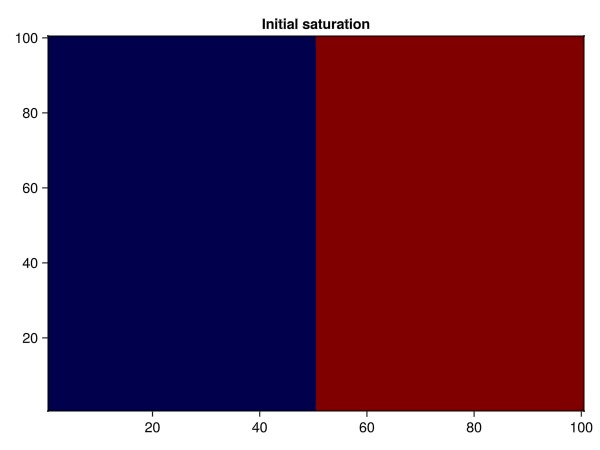
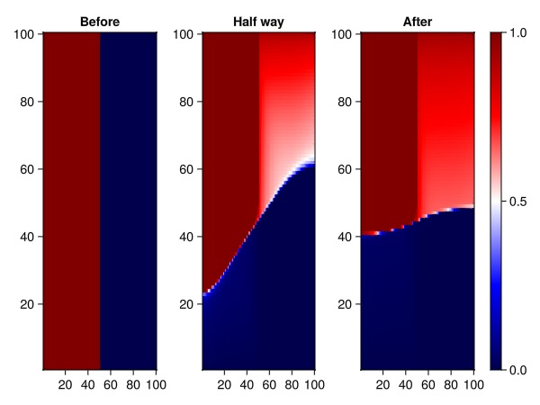

# Gravity circulation with CPR preconditioner {#Gravity-circulation-with-CPR-preconditioner}

This example demonstrates a more complex gravity driven instability. The problem is a bit larger than the [Gravity segregation example](/examples/introduction/two_phase_gravity_segregation#Gravity-segregation-example), and is therefore set up using the high level API that automatically sets up an iterative linear solver with a constrained pressure residual (CPR) preconditioner and automatic timestepping.

The high level API uses the more low level `Jutul` API seen in the other examples under the hood and makes more complex problems easy to set up. The same data structures and functions are used, allowing for deep customization if the defaults are not appropriate.

```julia
using JutulDarcy
using Jutul
using GLMakie
cmap = :seismic
nx = nz = 100;
```


## Define the domain {#Define-the-domain}

```julia
D = 10.0
g = CartesianMesh((nx, 1, nz), (D, 1.0, D))
domain = reservoir_domain(g);
```


## Set up model and properties {#Set-up-model-and-properties}

```julia
Darcy, bar, kg, meter, day = si_units(:darcy, :bar, :kilogram, :meter, :day)
p0 = 100*bar
rhoLS = 1000.0*kg/meter^3 # Definition of fluid phases
rhoVS = 500.0*kg/meter^3
cl, cv = 1e-5/bar, 1e-4/bar
L, V = LiquidPhase(), VaporPhase()
sys = ImmiscibleSystem([L, V])
model, parameters = setup_reservoir_model(domain, sys)
density = ConstantCompressibilityDensities(sys, p0, [rhoLS, rhoVS], [cl, cv]) # Replace density with a lighter pair
replace_variables!(model, PhaseMassDensities = density);
kr = BrooksCoreyRelativePermeabilities(sys, [2.0, 3.0])
replace_variables!(model, RelativePermeabilities = kr)
```


```
MultiModel with 1 models and 0 cross-terms. 20000 equations, 20000 degrees of freedom and 69600 parameters.

  models:
    1) Reservoir (20000x20000)
       ImmiscibleSystem with LiquidPhase, VaporPhase
       ∈ MinimalTPFATopology (10000 cells, 19800 faces)

Model storage will be optimized for runtime performance.

```


### Define initial saturation {#Define-initial-saturation}

Set the left part of the domain to be filled by the vapor phase and the heavy liquid phase in the remainder. To do this, we grab the cell centroids in the x direction from the domain, reshape them to the structured mesh we are working on and define the liquid saturation from there.

```julia
c = domain[:cell_centroids]
x = reshape(c[1, :], nx, nz)

sL = zeros(nx, nz)
plane = D/2.0
for i in 1:nx
    for j = 1:nz
        X = x[i, j]
        sL[i, j] = clamp(Float64(X > plane), 0, 1)
    end
end
heatmap(sL, colormap = cmap, axis = (title = "Initial saturation",))
```



### Set up initial state {#Set-up-initial-state}

```julia
sL = vec(sL)'
sV = 1 .- sL
s0 = vcat(sV, sL)
state0 = setup_reservoir_state(model, Pressure = p0, Saturations = s0)
```


```
Dict{Any, Any} with 1 entry:
  :Reservoir => Dict{Symbol, Any}(:PhaseMassMobilities=>[0.0 0.0 … 0.0 0.0; 0.0…
```


### Set the viscosity of the phases {#Set-the-viscosity-of-the-phases}

By default, viscosity is a parameter and can be set per-phase and per cell.

```julia
μ = parameters[:Reservoir][:PhaseViscosities]
@. μ[1, :] = 1e-3
@. μ[2, :] = 5e-3
```


```
10000-element view(::Matrix{Float64}, 2, :) with eltype Float64:
 0.005
 0.005
 0.005
 0.005
 0.005
 0.005
 0.005
 0.005
 0.005
 0.005
 ⋮
 0.005
 0.005
 0.005
 0.005
 0.005
 0.005
 0.005
 0.005
 0.005
```


Convert time-steps from days to seconds

```julia
timesteps = repeat([10.0*3600*24], 20)
_, states, = simulate_reservoir(state0, model, timesteps, parameters = parameters);
```


```
Jutul: Simulating 28 weeks, 4 days as 20 report steps
╭────────────────┬──────────┬──────────────┬──────────╮
│ Iteration type │ Avg/step │ Avg/ministep │    Total │
│                │ 20 steps │ 65 ministeps │ (wasted) │
├────────────────┼──────────┼──────────────┼──────────┤
│ Newton         │    20.45 │      6.29231 │  409 (2) │
│ Linearization  │     23.6 │      7.26154 │  472 (2) │
│ Linear solver  │    47.05 │      14.4769 │  941 (0) │
│ Precond apply  │     94.1 │      28.9538 │ 1882 (0) │
╰────────────────┴──────────┴──────────────┴──────────╯
╭───────────────┬─────────┬────────────┬────────╮
│ Timing type   │    Each │   Relative │  Total │
│               │      ms │ Percentage │      s │
├───────────────┼─────────┼────────────┼────────┤
│ Properties    │  0.8822 │     3.67 % │ 0.3608 │
│ Equations     │  0.8496 │     4.08 % │ 0.4010 │
│ Assembly      │  1.1429 │     5.49 % │ 0.5395 │
│ Linear solve  │  2.0139 │     8.39 % │ 0.8237 │
│ Linear setup  │  7.8738 │    32.78 % │ 3.2204 │
│ Precond apply │  0.7324 │    14.03 % │ 1.3784 │
│ Update        │  0.3204 │     1.33 % │ 0.1310 │
│ Convergence   │  1.0334 │     4.97 % │ 0.4878 │
│ Input/Output  │  0.9257 │     0.61 % │ 0.0602 │
│ Other         │  5.9168 │    24.64 % │ 2.4200 │
├───────────────┼─────────┼────────────┼────────┤
│ Total         │ 24.0165 │   100.00 % │ 9.8227 │
╰───────────────┴─────────┴────────────┴────────╯
```


## Plot results {#Plot-results}

Plot initial saturation

```julia
tmp = reshape(state0[:Reservoir][:Saturations][1, :], nx, nz)
f = Figure()
ax = Axis(f[1, 1], title = "Before")
heatmap!(ax, tmp, colormap = cmap)
```


```
MakieCore.Heatmap{Tuple{MakieCore.EndPoints{Float32}, MakieCore.EndPoints{Float32}, Matrix{Float32}}}
```


Plot intermediate saturation

```julia
tmp = reshape(states[length(states) ÷ 2][:Saturations][1, :], nx, nz)
ax = Axis(f[1, 2], title = "Half way")
hm = heatmap!(ax, tmp, colormap = cmap)
```


```
MakieCore.Heatmap{Tuple{MakieCore.EndPoints{Float32}, MakieCore.EndPoints{Float32}, Matrix{Float32}}}
```


Plot final saturation

```julia
tmp = reshape(states[end][:Saturations][1, :], nx, nz)
ax = Axis(f[1, 3], title = "After")
hm = heatmap!(ax, tmp, colormap = cmap)
Colorbar(f[1, 4], hm)
f
```



## Example on GitHub {#Example-on-GitHub}

If you would like to run this example yourself, it can be downloaded from the JutulDarcy.jl GitHub repository [as a script](https://github.com/sintefmath/JutulDarcy.jl/blob/main/examples/introduction/two_phase_unstable_gravity.jl), or as a [Jupyter Notebook](https://github.com/sintefmath/JutulDarcy.jl/blob/gh-pages/dev/final_site/notebooks/introduction/two_phase_unstable_gravity.ipynb)

```
This example took 19.813411061 seconds to complete.
```


---


_This page was generated using [Literate.jl](https://github.com/fredrikekre/Literate.jl)._
