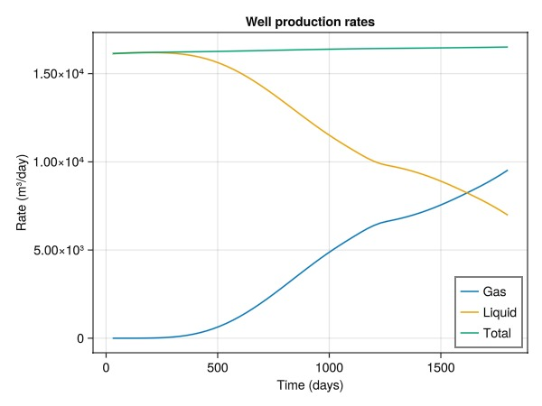
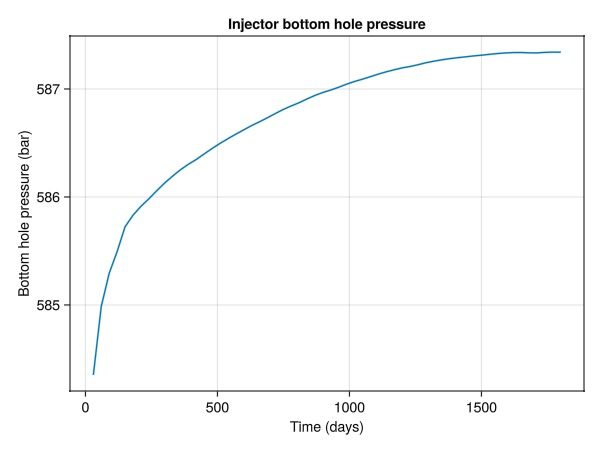
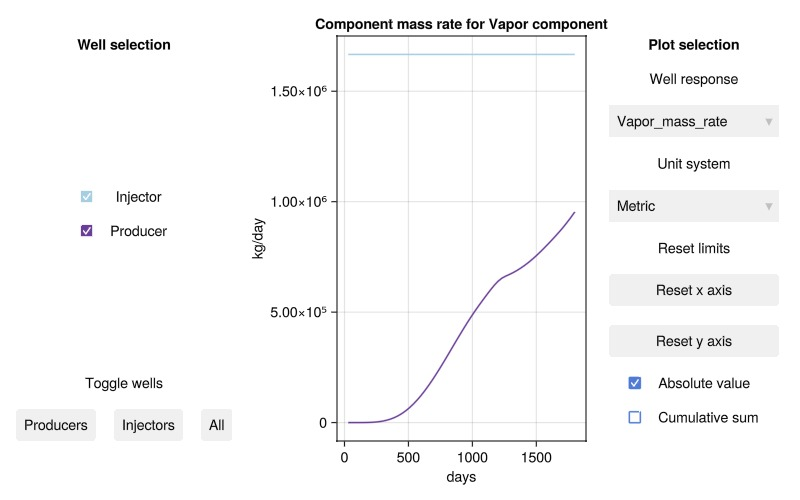

# Introduction to wells {#Introduction-to-wells}

This example demonstrates how to set up a 3D domain with a layered permeability field, define wells and solve a simple production-injection schedule. We begin by loading the `Jutul` package that contains generic features like grids and linear solvers and the `JutulDarcy` package itself.

## Preliminaries {#Preliminaries}

```julia
using JutulDarcy, Jutul
```


`JutulDarcy` uses SI units internally. It is therefore convenient to define a few constants at the start of the script to have more managable numbers later on.

```julia
Darcy, bar, kg, meter, day = si_units(:darcy, :bar, :kilogram, :meter, :day);
```


## Defining a porous medium {#Defining-a-porous-medium}

We start by defining the static part of our simulation problem – the porous medium itself.

### Defining the grid {#Defining-the-grid}

The first step is to create a grid for our simulation domain. We make a tiny 5 by 5 grid with 4 layers that discretizes a physical domain of 2000 by 1500 by 50 meters.

```julia
nx = ny = 5
nz = 4
dims = (nx, ny, nz)
g = CartesianMesh(dims, (2000.0, 1500.0, 50.0))
```


```
CartesianMesh (3D) with 5x5x4=100 cells
```


### Adding properties and making a domain {#Adding-properties-and-making-a-domain}

The grid by itself does not fully specify a porous medium. For that we need to specify the permeability in each cell and the porosity. Permeability, often denoted by a positive-definite tensor K, describes the relationship between a pressure gradient and the flow through the medium. Porosity is a dimensionless number between 0 and 1 that describes how much of the porous medium is void space where fluids can be present. The assumption of Darcy flow becomes less reasonable for high porosity values and the flow equations break down at zero porosity. A porosity of 0.2 is then a safe choice.

Jutul uses the `DataDomain` type to store a domain/grid together with data. For porous media simulation, `JutulDarcy` includes a convenience function `reservoir_domain` that contains defaults for permeability and porosity. We specify the permeability per-cell with varying values per layer in the vertical direction and a single porosity value for all cells that the function will expand for us. From the output, we can see that basic geometry primitives are also automatically added:

```julia
nlayer = nx*ny # Cells in each layer
K = vcat(
    fill(0.65, nlayer),
    fill(0.3, nlayer),
    fill(0.5, nlayer),
    fill(0.2, nlayer)
    )*Darcy

domain = reservoir_domain(g, permeability = K, porosity = 0.2)
```


```
DataDomain wrapping CartesianMesh (3D) with 5x5x4=100 cells with 19 data fields added:
  100 Cells
    :permeability => 100 Vector{Float64}
    :porosity => 100 Vector{Float64}
    :rock_thermal_conductivity => 100 Vector{Float64}
    :fluid_thermal_conductivity => 100 Vector{Float64}
    :rock_heat_capacity => 100 Vector{Float64}
    :component_heat_capacity => 100 Vector{Float64}
    :rock_density => 100 Vector{Float64}
    :cell_centroids => 3×100 Matrix{Float64}
    :volumes => 100 Vector{Float64}
  235 Faces
    :neighbors => 2×235 Matrix{Int64}
    :areas => 235 Vector{Float64}
    :normals => 3×235 Matrix{Float64}
    :face_centroids => 3×235 Matrix{Float64}
  470 HalfFaces
    :half_face_cells => 470 Vector{Int64}
    :half_face_faces => 470 Vector{Int64}
  130 BoundaryFaces
    :boundary_areas => 130 Vector{Float64}
    :boundary_centroids => 3×130 Matrix{Float64}
    :boundary_normals => 3×130 Matrix{Float64}
    :boundary_neighbors => 130 Vector{Int64}

```


## Defining wells {#Defining-wells}

Now that we have a porous medium with all static properties set up, it is time to introduce some driving forces. Jutul assumes no-flow boundary conditions on all boundary faces unless otherwise specified so we can go ahead and add wells to the model.

### A vertical producer well {#A-vertical-producer-well}

We will define two wells: A first well is named &quot;Producer&quot; and is a vertical well positioned at `(1, 1)`. By default, the [`setup_vertical_well`](/man/highlevel#JutulDarcy.setup_vertical_well) function perforates all layers in the model.

```julia
Prod = setup_vertical_well(domain, 1, 1, name = :Producer);
```


### A single-perforation injector {#A-single-perforation-injector}

We also define an injector by [`setup_well`](/man/highlevel#JutulDarcy.setup_well). This function allows us to pass a vector of either cell indices or tuples of logical indices that the well trajectory will follow. We setup the injector in the upper left corner.

```julia
Inj = setup_well(domain, [(nx, ny, 1)], name = :Injector);
```


## Choosing a fluid system {#Choosing-a-fluid-system}

To solve multiphase flow with our little toy reservoir we need to pick a fluid system. The type of system determines what physical effects are modelled, what parameters are required and the runtime and accuracy of the resulting simulation. The choice is in practice a trade-off between accuracy, runtime and available data that should be informed by modelling objectives. In this example our goal is to understand how to set up a simple well problem and the [`ImmiscibleSystem`](/man/basics/systems#JutulDarcy.ImmiscibleSystem) requires a minimal amount of input. We define liquid and gas phases and their densities at some reference conditions and instantiate the system.

```julia
# Set up a two-phase immiscible system and define a density secondary variable
phases = (LiquidPhase(), VaporPhase())
rhoLS = 1000.0
rhoGS = 100.0
rhoS = [rhoLS, rhoGS] .* kg/meter^3
sys = ImmiscibleSystem(phases, reference_densities = rhoS)
```


```
ImmiscibleSystem with LiquidPhase, VaporPhase
```


### Creating the model {#Creating-the-model}

The same fluid system can be used for both flow inside the wells and the reservoir. JutulDarcy treats wells as first-class citizens and models flow inside the well bore using the same fluid description as the reservoir, with modified equations to account for the non-Darcy velocities. We call the utility function that sets up all of this for us:

```julia
model, parameters = setup_reservoir_model(domain, sys, wells = [Inj, Prod])
model
```


```
MultiModel with 4 models and 6 cross-terms. 206 equations, 206 degrees of freedom and 791 parameters.

  models:
    1) Reservoir (200x200)
       ImmiscibleSystem with LiquidPhase, VaporPhase
       ∈ MinimalTPFATopology (100 cells, 235 faces)
    2) Injector (2x2)
       ImmiscibleSystem with LiquidPhase, VaporPhase
       ∈ SimpleWell [Injector] (1 nodes, 0 segments, 1 perforations)
    3) Producer (2x2)
       ImmiscibleSystem with LiquidPhase, VaporPhase
       ∈ SimpleWell [Producer] (1 nodes, 0 segments, 4 perforations)
    4) Facility (2x2)
       JutulDarcy.PredictionMode()
       ∈ WellGroup([:Injector, :Producer], true, true)

  cross_terms:
    1) Injector <-> Reservoir (Eqs: mass_conservation <-> mass_conservation)
       JutulDarcy.ReservoirFromWellFlowCT
    2) Producer <-> Reservoir (Eqs: mass_conservation <-> mass_conservation)
       JutulDarcy.ReservoirFromWellFlowCT
    3) Injector  -> Facility (Eq: control_equation)
       JutulDarcy.FacilityFromWellFlowCT
    4) Facility  -> Injector (Eq: mass_conservation)
       JutulDarcy.WellFromFacilityFlowCT
    5) Producer  -> Facility (Eq: control_equation)
       JutulDarcy.FacilityFromWellFlowCT
    6) Facility  -> Producer (Eq: mass_conservation)
       JutulDarcy.WellFromFacilityFlowCT

Model storage will be optimized for runtime performance.

```


The model is an instance of the [`MultiModel`](/ref/jutul#Jutul.MultiModel) from `Jutul` where a submodel is defined for the reservoir, each of the wells and the facility that controls both wells. In addition we can see the cross-terms that couple these wells together. If we want to see more details on how either of these are set up, we can display for example the reservoir model.

```julia
reservoir = model[:Reservoir]
```


```
SimulationModel:

  Model with 200 degrees of freedom, 200 equations and 770 parameters

  domain:
    DiscretizedDomain with MinimalTPFATopology (100 cells, 235 faces) and discretizations for mass_flow, heat_flow

  system:
    ImmiscibleSystem with LiquidPhase, VaporPhase

  context:
    ParallelCSRContext(BlockMajorLayout(false), 1000, 1, MetisPartitioner(:KWAY))

  formulation:
    FullyImplicitFormulation()

  data_domain:
    DataDomain wrapping CartesianMesh (3D) with 5x5x4=100 cells with 19 data fields added:
  100 Cells
    :permeability => 100 Vector{Float64}
    :porosity => 100 Vector{Float64}
    :rock_thermal_conductivity => 100 Vector{Float64}
    :fluid_thermal_conductivity => 100 Vector{Float64}
    :rock_heat_capacity => 100 Vector{Float64}
    :component_heat_capacity => 100 Vector{Float64}
    :rock_density => 100 Vector{Float64}
    :cell_centroids => 3×100 Matrix{Float64}
    :volumes => 100 Vector{Float64}
  235 Faces
    :neighbors => 2×235 Matrix{Int64}
    :areas => 235 Vector{Float64}
    :normals => 3×235 Matrix{Float64}
    :face_centroids => 3×235 Matrix{Float64}
  470 HalfFaces
    :half_face_cells => 470 Vector{Int64}
    :half_face_faces => 470 Vector{Int64}
  130 BoundaryFaces
    :boundary_areas => 130 Vector{Float64}
    :boundary_centroids => 3×130 Matrix{Float64}
    :boundary_normals => 3×130 Matrix{Float64}
    :boundary_neighbors => 130 Vector{Int64}

  primary_variables:
   1) Pressure    ∈ 100 Cells: 1 dof each
   2) Saturations ∈ 100 Cells: 1 dof, 2 values each

  secondary_variables:
   1) PhaseMassDensities     ∈ 100 Cells: 2 values each
      -> ConstantCompressibilityDensities as evaluator
   2) TotalMasses            ∈ 100 Cells: 2 values each
      -> TotalMasses as evaluator
   3) RelativePermeabilities ∈ 100 Cells: 2 values each
      -> BrooksCoreyRelativePermeabilities as evaluator
   4) PhaseMobilities        ∈ 100 Cells: 2 values each
      -> JutulDarcy.PhaseMobilities as evaluator
   5) PhaseMassMobilities    ∈ 100 Cells: 2 values each
      -> JutulDarcy.PhaseMassMobilities as evaluator

  parameters:
   1) Transmissibilities        ∈ 235 Faces: Scalar
   2) TwoPointGravityDifference ∈ 235 Faces: Scalar
   3) PhaseViscosities          ∈ 100 Cells: 2 values each
   4) FluidVolume               ∈ 100 Cells: Scalar

  equations:
   1) mass_conservation ∈ 100 Cells: 2 values each
      -> ConservationLaw{:TotalMasses, TwoPointPotentialFlowHardCoded{Vector{Int64}, Vector{@NamedTuple{self::Int64, other::Int64, face::Int64, face_sign::Int64}}}, Jutul.DefaultFlux, 2}

  output_variables:
    Pressure, Saturations, TotalMasses

  extra:
    OrderedDict{Symbol, Any} with keys: Symbol[]

```


We can see that the model contains primary variables, secondary variables (sometimes referred to as properties) and static parameters in addition to the system we already set up. These can be replaced or modified to alter the behavior of the system.

### Replace the density function with our custom version {#Replace-the-density-function-with-our-custom-version}

Let us change the definition of phase mass densities for our model. We&#39;d like to model our liquid phase as weakly compressible and the vapor phase with more significant compressibility. A common approach is to define densities $\rho_\alpha^s$ at some reference pressure $p_r$ and use a phase compressibility $c_\alpha$ to extrapolate around that known value.

$\rho_\alpha (p) = \rho_\alpha^s \exp((p - p_r)c_\alpha)$

This is already implement in Jutul and we simply need to instantiate the variable definition:

```julia
c = [1e-6/bar, 1e-4/bar]
ρ = ConstantCompressibilityDensities(p_ref = 1*bar, density_ref = rhoS, compressibility = c)
```


```
ConstantCompressibilityDensities (ref_dens=[1000.0, 100.0] kg/m^3, ref_p=[1.0, 1.0] bar)
```


Before replacing it in the model. This change will propagate to all submodels that have a definition given for PhaseMassDensities, including the wells. The facility, which does not know about densities, will ignore it.

```julia
replace_variables!(model, PhaseMassDensities = ρ);
```


This concludes the setup of the model.

## Set up initial state {#Set-up-initial-state}

The model is time-dependent and requires initial conditions. For the immiscible model it is sufficient to specify the reference phase pressure and the saturations for both phases, summed up to one. These can be specified per cell or one for the entire grid. Specifying a single pressure for the entire model is not very realistic, but should be fine for our simple example. The initial conditions will equilibrate themselves from gravity fairly quickly.

```julia
state0 = setup_reservoir_state(model, Pressure = 150*bar, Saturations = [1.0, 0.0])
```


```
Dict{Any, Any} with 4 entries:
  :Producer  => Dict{Symbol, Any}(:PhaseMassDensities=>[0.0; 0.0;;], :Saturatio…
  :Injector  => Dict{Symbol, Any}(:PhaseMassDensities=>[0.0; 0.0;;], :Saturatio…
  :Reservoir => Dict{Symbol, Any}(:PhaseMassMobilities=>[0.0 0.0 … 0.0 0.0; 0.0…
  :Facility  => Dict{Symbol, Any}(:TotalSurfaceMassRate=>[0.0, 0.0], :WellGroup…
```


## Set up report time steps and injection rate {#Set-up-report-time-steps-and-injection-rate}

We create a set of time-steps. These are report steps where the solution will be reported, but the simulator itself will do internal subdivision of time steps if these values are too coarse for the solvers. We also define an injection rate of a full pore-volume (at reference conditions) of gas.

```julia
dt = repeat([30.0]*day, 12*5)
pv = pore_volume(model, parameters)
inj_rate = sum(pv)/sum(dt)
```


```
0.19290123456790123
```


## Set up well controls {#Set-up-well-controls}

We then set up a total rate target (positive value for injection) together with a corresponding injection control that specifies the mass fractions of the two components/phases for pure gas injection, with surface density given by the known gas density. The producer operates at a fixed bottom hole pressure. These are given as a `Dict` with keys that correspond to the well names.

```julia
rate_target = TotalRateTarget(inj_rate)
I_ctrl = InjectorControl(rate_target, [0.0, 1.0], density = rhoGS)
bhp_target = BottomHolePressureTarget(50*bar)
P_ctrl = ProducerControl(bhp_target)
controls = Dict()
controls[:Injector] = I_ctrl
controls[:Producer] = P_ctrl
# Set up the forces
```


```
ProducerControl{BottomHolePressureTarget{Float64}, Float64}(BottomHolePressureTarget with value 50.0 [bar], 1.0)
```


Set up forces for the whole model. For this example, all other forces than the well controls are defaulted (amounting to no-flow for the reservoir). Jutul supports either a single set of forces for the entire simulation, or a vector of equal length to `dt` with varying forces. Reasonable operational limits for wells are also set up by default.

```julia
forces = setup_reservoir_forces(model, control = controls)
```


```
Dict{Symbol, Any} with 4 entries:
  :Producer  => (mask = nothing,)
  :Injector  => (mask = nothing,)
  :Reservoir => (bc = nothing, sources = nothing)
  :Facility  => (control = Dict{Any, Any}(:Producer=>ProducerControl{BottomHole…
```


## Simulate the model {#Simulate-the-model}

We are finally ready to simulate the model for the given initial state `state0`, report steps `dt`, `parameters` and forces. As the model is small, barring any compilation time, this should run in about 300 ms.

```julia
result = simulate_reservoir(state0, model, dt, parameters = parameters, forces = forces);
```


```
Jutul: Simulating 4 years, 48.43 weeks as 60 report steps
╭────────────────┬──────────┬──────────────┬──────────╮
│ Iteration type │ Avg/step │ Avg/ministep │    Total │
│                │ 60 steps │ 68 ministeps │ (wasted) │
├────────────────┼──────────┼──────────────┼──────────┤
│ Newton         │     3.75 │      3.30882 │  225 (0) │
│ Linearization  │  4.88333 │      4.30882 │  293 (0) │
│ Linear solver  │     3.95 │      3.48529 │  237 (0) │
│ Precond apply  │      7.9 │      6.97059 │  474 (0) │
╰────────────────┴──────────┴──────────────┴──────────╯
╭───────────────┬─────────┬────────────┬────────╮
│ Timing type   │    Each │   Relative │  Total │
│               │      ms │ Percentage │      s │
├───────────────┼─────────┼────────────┼────────┤
│ Properties    │  0.0285 │     0.26 % │ 0.0064 │
│ Equations     │  1.3099 │    15.32 % │ 0.3838 │
│ Assembly      │  0.9338 │    10.92 % │ 0.2736 │
│ Linear solve  │  0.6320 │     5.68 % │ 0.1422 │
│ Linear setup  │  0.6131 │     5.51 % │ 0.1380 │
│ Precond apply │  0.0187 │     0.35 % │ 0.0089 │
│ Update        │  0.3200 │     2.87 % │ 0.0720 │
│ Convergence   │  1.2558 │    14.69 % │ 0.3679 │
│ Input/Output  │  0.4529 │     1.23 % │ 0.0308 │
│ Other         │  4.8065 │    43.17 % │ 1.0815 │
├───────────────┼─────────┼────────────┼────────┤
│ Total         │ 11.1334 │   100.00 % │ 2.5050 │
╰───────────────┴─────────┴────────────┴────────╯
```


### Unpacking the result {#Unpacking-the-result}

The result contains a lot of data. This can be unpacked to get the most typical desired outputs: Well responses, reservoir states and the time they correspond to.

```julia
wd, states, t = result;
```


We could in fact equally well have written `wd, states, t = simulate_reservoir(...)` to arrive at the same result.

## Plot the producer responses {#Plot-the-producer-responses}

We load a plotting package to plot the wells.

```julia
using GLMakie
```


## Plot the surface rates at the producer {#Plot-the-surface-rates-at-the-producer}

We observe that the total rate does not vary much, but the composition changes from liquid to gas as the front propagate through the domain and hits the producer well. Gas rates:

```julia
qg = wd[:Producer][:grat];
```


Total rate:

```julia
qt = wd[:Producer][:rate];
```


Compute liquid rate and plot:

```julia
ql = qt - qg
x = t/day
fig = Figure()
ax = Axis(fig[1, 1],
    xlabel = "Time (days)",
    ylabel = "Rate (m³/day)",
    title = "Well production rates"
)
lines!(ax, x, abs.(qg).*day, label = "Gas")
lines!(ax, x, abs.(ql).*day, label = "Liquid")
lines!(ax, x, abs.(qt).*day, label = "Total")
axislegend(position = :rb)
fig
```



## Plot bottom hole pressure of the injector {#Plot-bottom-hole-pressure-of-the-injector}

The pressure builds during injection, until the gas breaks through to the other well.

```julia
bh = wd[:Injector][:bhp]
fig = Figure()
ax = Axis(fig[1, 1],
    xlabel = "Time (days)",
    ylabel = "Bottom hole pressure (bar)",
    title = "Injector bottom hole pressure"
)
lines!(ax, x, bh./bar)
fig
```



## Plot the well results in the interactive viewer {#Plot-the-well-results-in-the-interactive-viewer}

Note that this will open a new window with the plot.

```julia
plot_well_results(wd, resolution = (800, 500))
```



## Plot the reservoir and final gas saturation field {#Plot-the-reservoir-and-final-gas-saturation-field}

```julia
plot_cell_data(g, states[end][:Saturations][1, :], colormap = :seismic)
```


```
(Scene (1600px, 900px):
  0 Plots
  2 Child Scenes:
    ├ Scene (1600px, 900px)
    └ Scene (1600px, 900px), Makie.Axis3(), MakieCore.Mesh{Tuple{GeometryBasics.Mesh{3, Float64, GeometryBasics.NgonFace{3, GeometryBasics.OffsetInteger{-1, UInt32}}, (:position, :normal), Tuple{Vector{GeometryBasics.Point{3, Float64}}, Vector{GeometryBasics.Vec{3, Float32}}}, Vector{GeometryBasics.NgonFace{3, GeometryBasics.OffsetInteger{-1, UInt32}}}}}})
```


## Example on GitHub {#Example-on-GitHub}

If you would like to run this example yourself, it can be downloaded from the JutulDarcy.jl GitHub repository [as a script](https://github.com/sintefmath/JutulDarcy.jl/blob/main/examples/introduction/wells_intro.jl), or as a [Jupyter Notebook](https://github.com/sintefmath/JutulDarcy.jl/blob/gh-pages/dev/final_site/notebooks/introduction/wells_intro.ipynb)

```
This example took 15.383022132 seconds to complete.
```


---


_This page was generated using [Literate.jl](https://github.com/fredrikekre/Literate.jl)._
