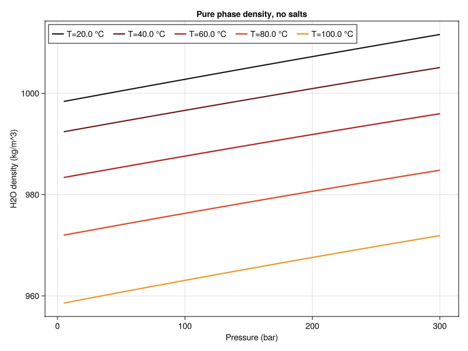
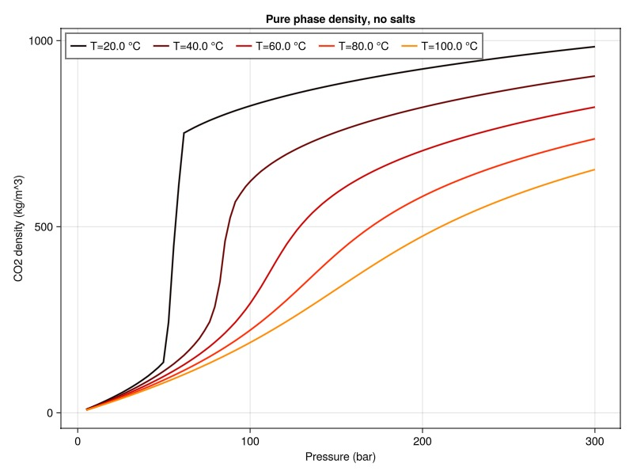
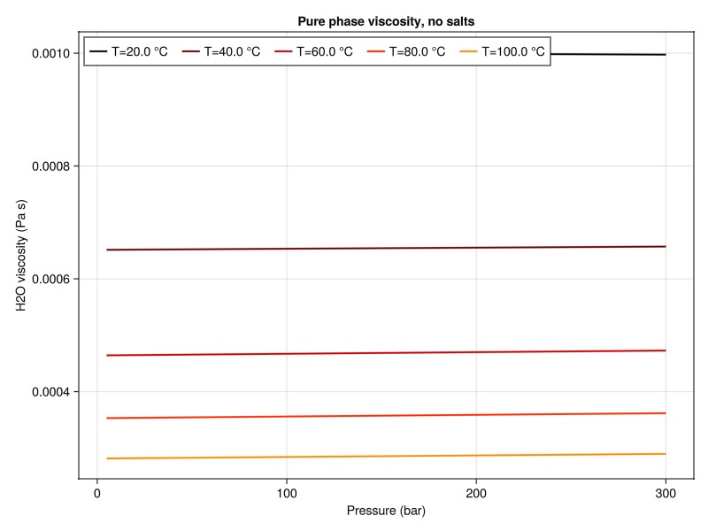
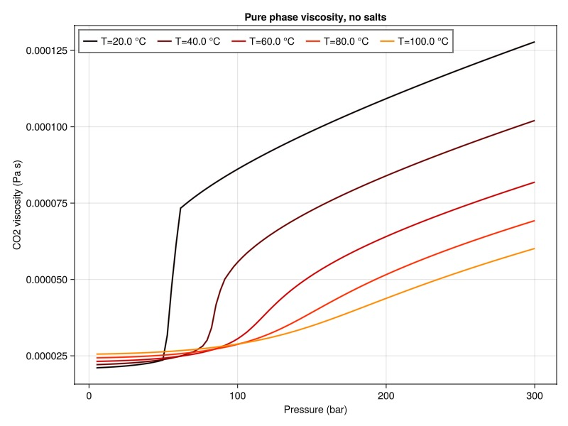
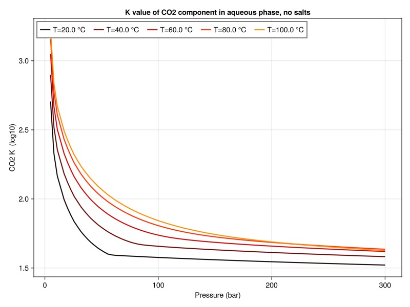
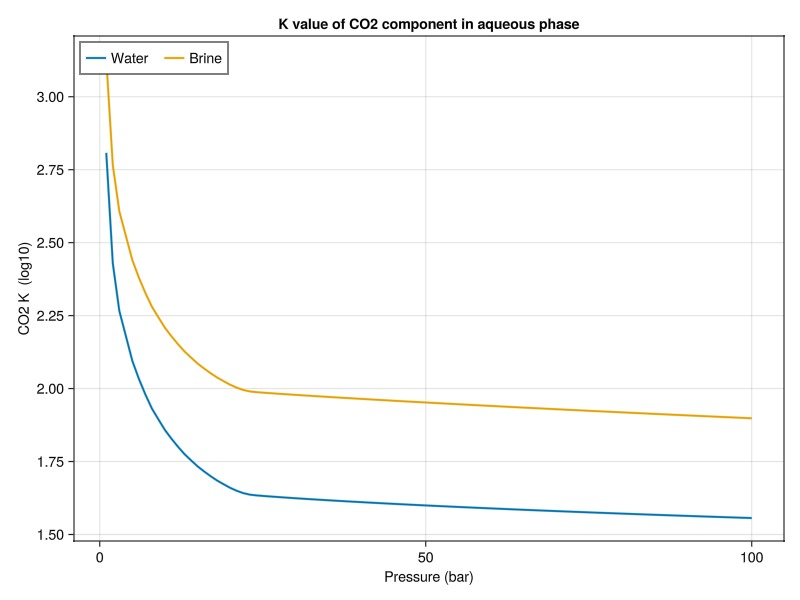
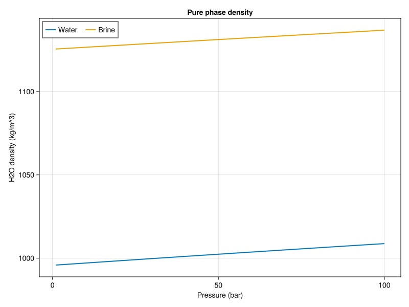

# CO2-brine correlations with salinity {#CO2-brine-correlations-with-salinity}

JutulDarcy includes a set of pre-generated tables for simulation of CO2 storage in saline aquifers, as well as functions for calculating PVT and solubility properties of CO2-brine mixtures with varying degrees of salinity.

For more details on the property calculations used herein, please see the paper [Three-dimensional simulation of geologic carbon dioxide sequestration using MRST by L. Saló et al (2024)](https://doi.org/10.46690/ager.2024.10.06).

This example demonstrates how to plot the properties, and does a basic comparison of how the properties change when the aqueous phase has salts added.

```julia
using Jutul, JutulDarcy, GLMakie
import JutulDarcy.CO2Properties: co2_brine_property_tables
```


## Define plotting functions {#Define-plotting-functions}

We define a plotting function that varies temperature, and one that compares the same property with and without salts for a given temperature.

```julia
T = [20.0, 40.0, 60.0, 80.0, 100.0]
p = range(5, 300, 100)

function plot_property(prop, tab, component, title = "")
    trans = x -> x
    if prop == :viscosity
        u = "(Pa s)"
    elseif prop == :density
        u = "(kg/m^3)"
    elseif prop == :K
        u = " (log10)"
        trans = log10
    else
        u = ""
    end
    is_h2o = component == :H2O
    fig = Figure(size = (800, 600))
    ax = Axis(fig[1, 1], title = title, xlabel = "Pressure (bar)", ylabel = "$component $prop $u")

    F = tab[prop]
    if prop == :K
        F = F.K
    end
    for (i, T_i) in enumerate(T)
        val = F.(convert_to_si(p, :bar), T_i + 273.15)
        if is_h2o
            val = map(first, val)
        else
            val = map(last, val)
        end
        lines!(ax, p, trans.(val), label = "T=$(T_i) °C",
            colormap = :hot,
            color = i,
            colorrange = (1, length(T)+3),
            linewidth = 2,
        )
    end
    axislegend(position = :lt, orientation = :horizontal)
    fig
end

function plot_brine_comparison(prop, T, tab1, tab2, component, title = "")
    trans = x -> x
    if prop == :viscosity
        u = "(Pa s)"
    elseif prop == :density
        u = "(kg/m^3)"
    elseif prop == :K
        u = ""
        u = " (log10)"
        trans = log10
    else
        u = ""
    end
    is_h2o = component == :H2O
    fig = Figure(size = (800, 600))
    ax = Axis(fig[1, 1], title = title, xlabel = "Pressure (bar)", ylabel = "$component $prop $u")

    pbar = convert_to_si.(p, :bar)

    F1 = tab1[prop]
    F2 = tab2[prop]
    if prop == :K
        F1 = F1.K
        F2 = F2.K
    end
    val1 = F1.(pbar, T + 273.15)
    val2 = F2.(pbar, T + 273.15)

    if is_h2o
        val1 = map(first, val1)
        val2 = map(first, val2)
    else
        val1 = map(last, val1)
        val2 = map(last, val2)
    end
    lines!(ax, trans.(val1), label = "Water",
        linewidth = 2,
    )
    lines!(ax, trans.(val2), label = "Brine",
        linewidth = 2,
    )
    axislegend(position = :lt, orientation = :horizontal)
    fig
end
```


```
plot_brine_comparison (generic function with 2 methods)
```


## Generate tables {#Generate-tables}

We get tables for a wide pressure and temperature range. The first set of tables assumes no salts, and the second set of tables uses specified molar fractions of salts in the aqueous phase.

```julia
tab_water = co2_brine_property_tables()
tab_brine = co2_brine_property_tables(
    salt_names = ["NaCl", "KCl"],
    salt_mole_fractions = [0.05, 0.01]
)
```


```
Dict{Symbol, Any} with 11 entries:
  :density                         => BilinearInterpolant{Vector{Float64}, Matr…
  :heat_capacity_constant_pressure => BilinearInterpolant{Vector{Float64}, Matr…
  :phase_conductivity              => BilinearInterpolant{Vector{Float64}, Matr…
  :K                               => KValueWrapper{BilinearInterpolant{Vector{…
  :co2_table                       => (data = [1.0 101325.0 … 827.805 434249.0;…
  :viscosity                       => BilinearInterpolant{Vector{Float64}, Matr…
  :h2o_table                       => (data = [1.0 101325.0 … 4216.11 2.04082e5…
  :solubility_table                => (data = [1.0 101325.0 0.00660871 0.001131…
  :enthalpy                        => BilinearInterpolant{Vector{Float64}, Matr…
  :heat_capacity_constant_volume   => BilinearInterpolant{Vector{Float64}, Matr…
  :internal_energy                 => BilinearInterpolant{Vector{Float64}, Matr…
```


## Plot aqueous mass density {#Plot-aqueous-mass-density}

```julia
plot_property(:density, tab_water, :H2O, "Pure phase density, no salts")
```



## Plot gaseous mass density {#Plot-gaseous-mass-density}

```julia
plot_property(:density, tab_water, :CO2, "Pure phase density, no salts")
```



## Plot aqueous viscosity {#Plot-aqueous-viscosity}

```julia
plot_property(:viscosity, tab_water, :H2O, "Pure phase viscosity, no salts")
```



## Plot gaseous viscosity {#Plot-gaseous-viscosity}

```julia
plot_property(:viscosity, tab_water, :CO2, "Pure phase viscosity, no salts")
```



## Plot K-value of CO2 {#Plot-K-value-of-CO2}

The K value defines the ratio between liquid and vapor phases at equilibrium conditions and is closely related to solubility. For a component we relate the liquid mass fraction $x_i$ to the vapor mole fraction $y_i$ of that component by the K-value $K_i$:

$y_i = K_i(p, T) x_i$

```julia
plot_property(:K, tab_water, :CO2, "K value of CO2 component in aqueous phase, no salts")
```



## Compare K value with and without salts {#Compare-K-value-with-and-without-salts}

```julia
plot_brine_comparison(:K, 30.0, tab_water, tab_brine, :CO2, "K value of CO2 component in aqueous phase")
```



## Compare density with and without salts {#Compare-density-with-and-without-salts}

```julia
plot_brine_comparison(:density, 30.0, tab_water, tab_brine, :H2O, "Pure phase density")
```



## Example on GitHub {#Example-on-GitHub}

If you would like to run this example yourself, it can be downloaded from the JutulDarcy.jl GitHub repository [as a script](https://github.com/sintefmath/JutulDarcy.jl/blob/main/examples/properties/co2_props.jl), or as a [Jupyter Notebook](https://github.com/sintefmath/JutulDarcy.jl/blob/gh-pages/dev/final_site/notebooks/properties/co2_props.ipynb)

```
This example took 7.263262396 seconds to complete.
```


---


_This page was generated using [Literate.jl](https://github.com/fredrikekre/Literate.jl)._
