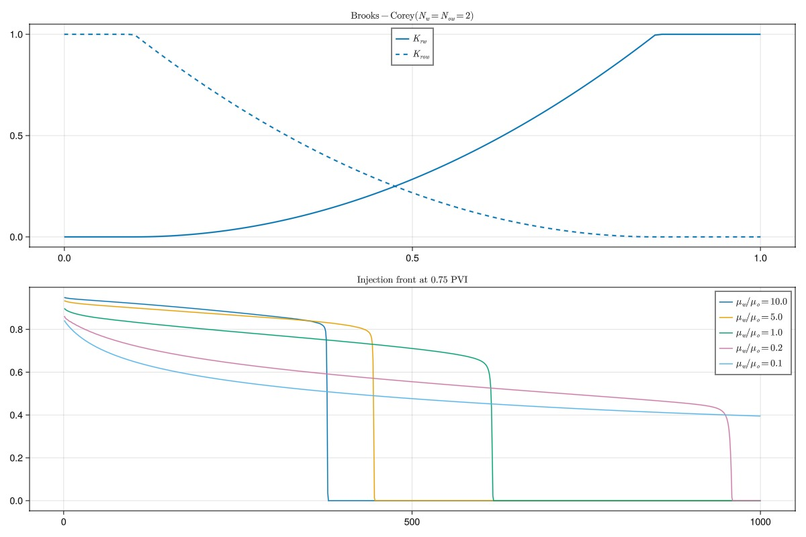
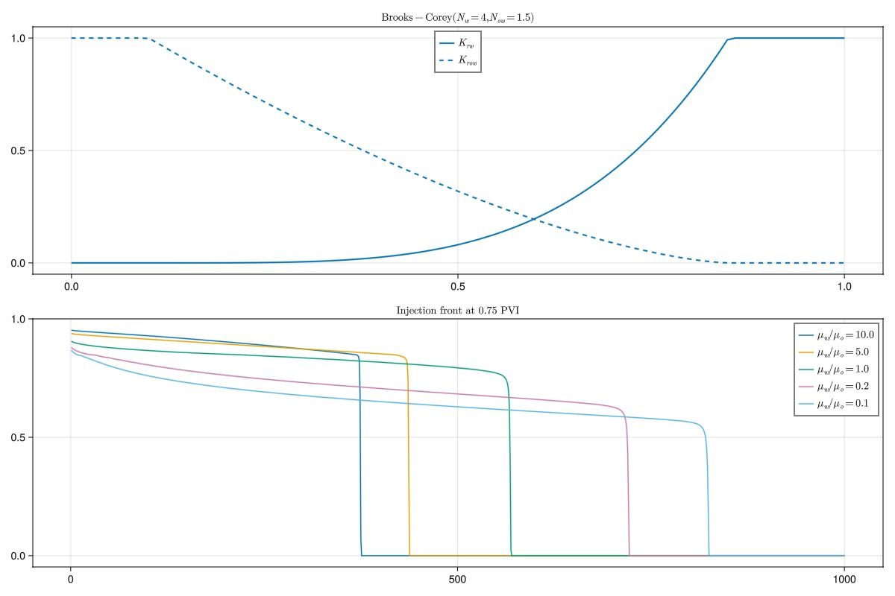
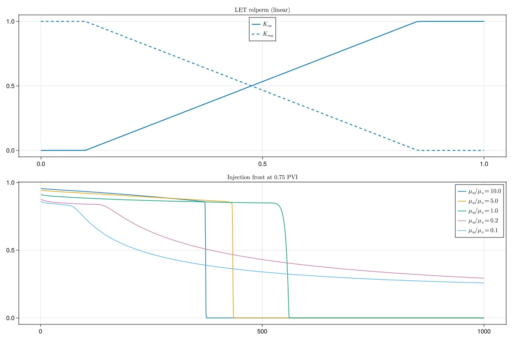
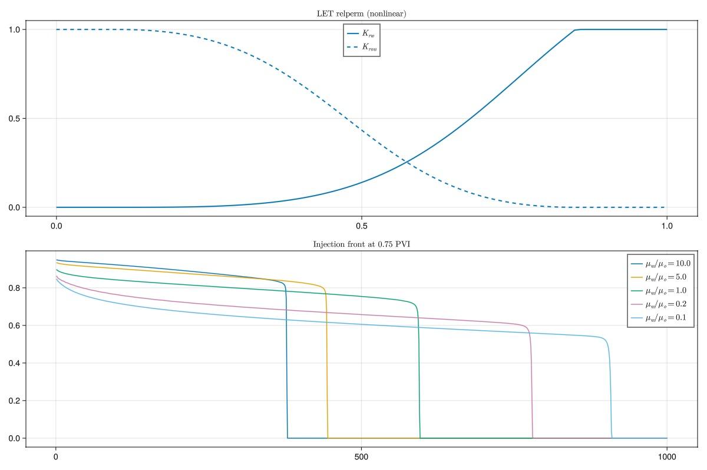
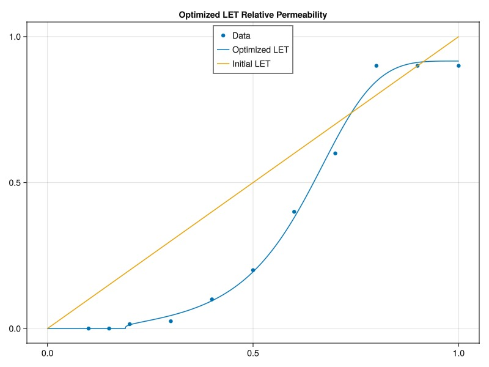
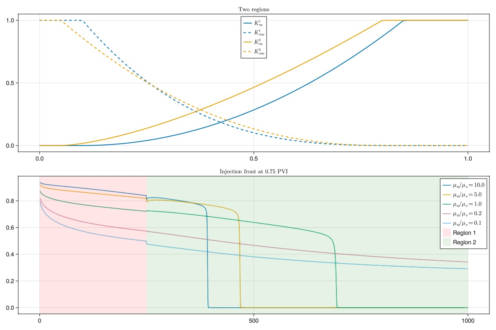
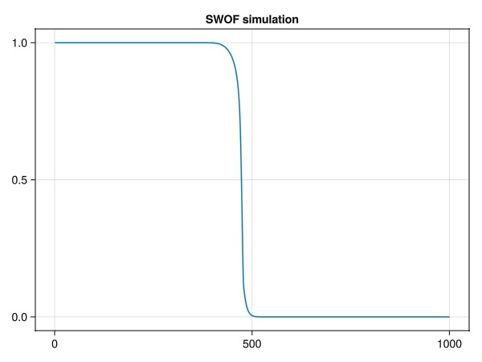
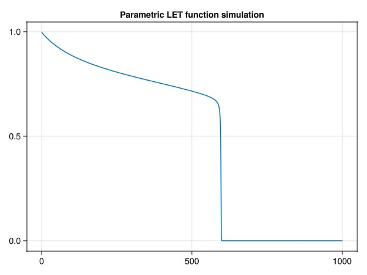

# Relative Permeabilities in JutulDarcy {#Relative-Permeabilities-in-JutulDarcy}

We will show a few of the functions for evaluating relative permeabilities, show how these can be fitted to data and finally how they can be used in simulation.

```julia
using GLMakie
using JutulDarcy, Jutul
import JutulDarcy: table_to_relperm, PhaseRelativePermeability, brooks_corey_relperm, let_relperm, ReservoirRelativePermeabilities
```


## Define helper functions {#Define-helper-functions}

The following functions are used to set up a simple reservoir model with a linear displacement for a given relative permeability function. The function also takes in the viscosity ratio as an optional parameter.

### Simulation helpers {#Simulation-helpers}

```julia
function setup_model_with_relperm(kr; mu_ratio = 1.0)
    mesh = CartesianMesh(1000, 1000.0)
    domain = reservoir_domain(mesh)
    nc = number_of_cells(domain)
    sys = ImmiscibleSystem((LiquidPhase(), VaporPhase()), reference_densities = [1000.0, 700.0])
    model,  = setup_reservoir_model(domain, sys)
    rmodel = reservoir_model(model)
    replace_variables!(rmodel, RelativePermeabilities = kr)
    JutulDarcy.add_relperm_parameters!(rmodel)
    parameters = setup_parameters(model)
    parameters[:Reservoir][:PhaseViscosities] = repeat([mu_ratio*1e-3, 1e-3], 1, nc)
    return (model, parameters)
end

function simulate_bl(model, parameters; pvi = 0.75)
    domain = reservoir_domain(model)
    nc = number_of_cells(domain)
    nstep = nc
    timesteps = fill(3600*24/nstep, nstep)
    p0 = 100*si_unit(:bar)
    tot_time = sum(timesteps)
    pv = pore_volume(domain)
    irate = pvi*sum(pv)/tot_time
    src  = SourceTerm(1, irate, fractional_flow = [1.0, 0.0])
    bc = FlowBoundaryCondition(nc, p0/2)
    forces = setup_reservoir_forces(model, sources = src, bc = bc)
    state0 = setup_reservoir_state(model, Pressure = p0, Saturations = [0.0, 1.0])
    ws, states = simulate_reservoir(state0, model, timesteps,
        forces = forces, parameters = parameters, info_level = -1)
    return states[end][:Saturations][1, :]
end

function define_relperm_single_region(krw_t, krow_t, sw_t)
    krow = PhaseRelativePermeability(reverse(1.0 .- sw), reverse(krow_t), label = :ow)
    krw = PhaseRelativePermeability(sw, krw_t, label = :ow)
    return ReservoirRelativePermeabilities(w = krw, ow = krow)
end
```


```
define_relperm_single_region (generic function with 1 method)
```


### Single region table plotting functions {#Single-region-table-plotting-functions}

```julia
function simulate_and_plot(sw, krw, krow, name)
    fig = Figure(size = (1200, 800))
    ax = Axis(fig[1, 1], title = name)
    colors = Makie.wong_colors()
    lines!(ax, sw, krw, label = L"K_{rw}", color = colors[1], linewidth = 2)
    lines!(ax, sw, krow, label = L"K_{row}", color = colors[1], linestyle = :dash, linewidth = 2)

    axislegend(position = :ct)

    krdef = define_relperm_single_region(krw, krow, sw)
    ax = Axis(fig[2, 1], title = L"\text{Injection front at 0.75 PVI}")

    for mu_ratio in [10, 5, 1, 0.2, 0.1]
        println("Simulating with mu_ratio = $mu_ratio")
        model, parameters = setup_model_with_relperm(krdef, mu_ratio = mu_ratio)
        water_front = simulate_bl(model, parameters)
        lines!(ax, water_front, label = L"\mu_w/\mu_o=%$mu_ratio")
    end
    axislegend()
    return fig
end
```


```
simulate_and_plot (generic function with 1 method)
```


## Brooks-Corey and LET relative permeabilities {#Brooks-Corey-and-LET-relative-permeabilities}

We will now show how to use the `brooks_corey_relperm` and `let_relperm` to generate relative permeability tables. These tables can in principle be used in any simulator that supports relative permeability tables.

We define a saturation range and calculate the relative permeabilities for two phases. We then simulate a simple 1D displacement and plot the water front.

### Brooks-Corey {#Brooks-Corey}

The Brooks-Corey model is a simple model that can be used to generate relative permeabilities. The model is defined in the mobile region as:

$k_{rw} = k_{max,w} \bar{S}_w$

$k_{ro} = k_{max,o} \bar{S}_o$

where $k_{max,w}$ is the maximum relative permeability, $\bar{S}_w$ is the normalized saturation for the water phase,

$\bar{S}_w = \frac{S_w - S_{wi}}{1 - S_{wi} - S_{ro}}$

and, similarly, for the oil phase:

$\bar{S}_o = \frac{S_o - S_{ro}}{1 - S_{wi} - S_{ro}}$

JutulDarcy contains a function `brooks_corey_relperm` that can be used to evaluate the values for a given saturation range:

```julia
sw = range(0, 1, 100)
so = 1.0 .- sw

swi = 0.1
srow = 0.15
r_tot = swi + srow

krw = brooks_corey_relperm.(sw, n = 2, residual = swi, residual_total = r_tot)
krow = brooks_corey_relperm.(so, n = 2, residual = srow, residual_total = r_tot)

simulate_and_plot(sw, krw, krow, L"\text{Brooks-Corey} (N_w = N_{ow} = 2)")
```



### Brooks-Corey: Different exponents {#Brooks-Corey:-Different-exponents}

We can also use different exponents for the water and oil phases. Here we pick other values for the exponents:

```julia
krw = brooks_corey_relperm.(sw, n = 4, residual = swi, residual_total = r_tot)
krow = brooks_corey_relperm.(so, n = 1.5, residual = srow, residual_total = r_tot)

simulate_and_plot(sw, krw, krow, L"\text{Brooks-Corey} (N_w = 4, N_{ow} = 1.5)")
```



### LET relative permeabilities {#LET-relative-permeabilities}

The LET model is a generalization of the Brooks-Corey model that introduces additional parameters to more easily control the shape of the curve. It is defined as:

$k_{rw} = k_{max,w} \frac{\bar{S}_w^{L_w}}{\bar{S}_w^{L_w} + E_w(1 - \bar{S}_w)^{T_w}}$

The oil phase is defined analogously. The LET model has three exponents $L$, $E$, and $T$ that together define the shape of the curve.

### LET table as fully linear {#LET-table-as-fully-linear}

We can use the `let_relperm` function to generate a fully linear relative permeability curve, i.e. $k_{rw} = S_w$ and $k_{ro} = S_o$. This is overkill for the LET model, but it is a good way to verify that the function works as expected and that the linear model can be captured by LET functions.

```julia
krw = let_relperm.(sw, L = 1.0, E = 1.0, T = 1.0, residual = swi, residual_total = r_tot)
krow = let_relperm.(so, L = 1.0, E = 1.0, T = 1.0, residual = srow, residual_total = r_tot)

simulate_and_plot(sw, krw, krow, L"\text{LET relperm (linear)}")
```



### LET table, nonlinear exponents {#LET-table,-nonlinear-exponents}

The functions are immediately more interesting if we use nonlinear exponents.

```julia
krw = let_relperm.(sw, L = 3.0, E = 2.0, T = 1.0, residual = swi, residual_total = r_tot)
krow = let_relperm.(so, L = 2.0, E = 1.0, T = 2.0, residual = srow, residual_total = r_tot)

simulate_and_plot(sw, krw, krow, L"\text{LET relperm (nonlinear)}")
```



## Fitting relative permeabilities to data {#Fitting-relative-permeabilities-to-data}

We can use either the Brooks-Corey or LET models to fit relative permeabilities to data. We generate some synthetic data and define a function that gives the sum of squares mismatch function between the data and the chosen LET model. As these functions are relatively simple Julia functions, we can use the `Optim` package to perform optimization to find the best fit.

We do this by setting up an objective function that takes the current LET parameters as a flat vector with length five and returns the sum of squares. As Julia is a pretty fast programming language, performing a thousand gradient-free evaluations should only take a few milliseconds, but we could also have used a differentiable optimizer if we wanted to.

The optimizer is provided lower limits for the parameters to avoid numerical issues. The initial guess is a completely linear LET function.

```julia
using Optim

s_to_match  = [0.1, 0.15, 0.2, 0.3, 0.4, 0.5, 0.6, 0.7, 0.8, 0.9, 1.0]
kr_to_match = [0.0, 0.0, 0.015, 0.025, 0.1, 0.2, 0.4, 0.6, 0.90, 0.90, 0.90]

function relperm_mismatch(x)
    L, E, T, r, kr_max = x
    kr = let_relperm.(s_to_match, L = L, E = E, T = T, residual = r, kr_max = kr_max)
    return sum((kr .- kr_to_match).^2)
end

x0 = [1.0, 1.0, 1.0, 0.0, 1.0]
lower = [0.0, 0.0, 0.0, 0.0, 0.1]
upper = [20, 20, 20, 0.5, 1.0]
res = optimize(relperm_mismatch, lower, upper, x0, NelderMead(), Optim.Options(iterations = 100000))
L, E, T, r, kr_max = Optim.minimizer(res)
res
```


```
 * Status: success

 * Candidate solution
    Final objective value:     5.894436e-03

 * Found with
    Algorithm:     Nelder-Mead

 * Convergence measures
    √(Σ(yᵢ-ȳ)²)/n ≤ 1.0e-08

 * Work counters
    Seconds run:   0  (vs limit Inf)
    Iterations:    510
    f(x) calls:    811

```


### Plot the matched function {#Plot-the-matched-function}

We get a pretty good match - the optimization is able to find reasonable parameters without sign of overfitting. This is because the LET functions are designed to always give a physically reasonable relative permeability curve.

```julia
fmt = x -> round(x, digits = 2)
println("Optimized parameters:\n\tL = $(fmt(L))\n\tE = $(fmt(E))\n\tT = $(fmt(T))\n\tr = $(fmt(r))\n\tkr_max = $(fmt(kr_max))")
fig = Figure(size = (800, 600))
ax = Axis(fig[1, 1], title = "Optimized LET Relative Permeability")

s_fine = range(0, 1, 1000)
initial_kr = let_relperm.(s_fine, L = x0[1], E = x0[2], T = x0[3], residual = x0[4], kr_max = x0[5])
optimized_kr = let_relperm.(s_fine, L = L, E = E, T = T, residual = r, kr_max = kr_max)
scatter!(ax, s_to_match, kr_to_match, label = "Data")
lines!(ax, s_fine, optimized_kr, label = "Optimized LET")
lines!(ax, s_fine, initial_kr, label = "Initial LET")
axislegend(position = :ct)
fig
```



## Multiple regions in JutulDarcy {#Multiple-regions-in-JutulDarcy}

Relative permeabilities are typically associated with the rock type of the reservoir. If multiple rock types are present, they should be given different relative permeability functions. This can be done by defining a region vector that indices the rock type of each cell. We also define the relative permeability of each phase to be a `Tuple` of two relative permeability functions, one for each region.

We set up utility functions for setting up a two-region relative permeability and then demonstrate this with a simple example that uses Brooks-Corey.

```julia
function define_relperm_two_regions(krw_t1, krow_t1, krw_t2, krow_t2, sw_t, reg)
    krow1 = PhaseRelativePermeability(reverse(1.0 .- sw), reverse(krow_t1), label = :ow)
    krw1 = PhaseRelativePermeability(sw, krw_t1, label = :ow)
    krow2 = PhaseRelativePermeability(reverse(1.0 .- sw), reverse(krow_t2), label = :ow)
    krw2 = PhaseRelativePermeability(sw, krw_t2, label = :ow)

    return ReservoirRelativePermeabilities(w = (krw1, krw2), ow = (krow1, krow2), regions = reg)
end

function simulate_and_plot_two_regions(sw, krw1, krow1, krw2, krow2, name)
    fig = Figure(size = (1200, 800))
    ax = Axis(fig[1, 1], title = name)
    colors = Makie.wong_colors()
    lines!(ax, sw, krw1, label = L"K_{rw}^1", color = colors[1], linewidth = 2)
    lines!(ax, sw, krow1, label = L"K_{row}^1", color = colors[1], linestyle = :dash, linewidth = 2)

    lines!(ax, sw, krw2, label = L"K_{rw}^2", color = colors[2], linewidth = 2)
    lines!(ax, sw, krow2, label = L"K_{row}^2", color = colors[2], linestyle = :dash, linewidth = 2)

    axislegend(position = :ct)

    reg = ones(Int, 1000)
    reg[250:end] .= 2
    krdef = define_relperm_two_regions(krw1, krow1, krw2, krow2, sw, reg)
    ax = Axis(fig[2, 1], title = L"\text{Injection front at 0.75 PVI}")

    for mu_ratio in [10, 5, 1, 0.2, 0.1]
        println("Simulating with mu_ratio = $mu_ratio")
        model, parameters = setup_model_with_relperm(krdef, mu_ratio = mu_ratio)
        water_front = simulate_bl(model, parameters)
        lines!(ax, water_front, label = L"\mu_w/\mu_o=%$mu_ratio")
    end
    vspan!(ax, 0, 250, color = (:red, 0.1), label = "Region 1")
    vspan!(ax, 250, 1000, color = (:green, 0.1), label = "Region 2")
    axislegend()
    fig
end

swi = 0.1
srow = 0.15
r_tot = swi + srow

krw1 = brooks_corey_relperm.(sw, n = 2, residual = swi, residual_total = r_tot)
krow1 = brooks_corey_relperm.(so, n = 3, residual = srow, residual_total = r_tot)

swi2 = 0.05
srow2 = 0.2
r_tot2 = swi2 + srow2

krw2 = brooks_corey_relperm.(sw, n = 1.5, residual = swi2, residual_total = r_tot2)
krow2 = brooks_corey_relperm.(so, n = 2.2, residual = srow2, residual_total = r_tot2)

simulate_and_plot_two_regions(sw, krw1, krow1, krw2, krow2, L"\text{Two regions}")
```



## SWOF/SGOF-type tables {#SWOF/SGOF-type-tables}

The `table_to_relperm` function can be used to convert SWOF/SGOF tables to the JutulDarcy format. The function takes in a table and a saturation range and returns a tuple of two relative permeability functions.

We demonstrate this by using a simple SWOF table and then feed this to the converter before simulating a bit.

Note that JutulDarcy automatically sets up these functions when reading DATA files, so this is only necessary if you want to use the functions in a custom workflow.

```julia
swof = hcat(
    range(0, 1, length=10),
    [0.0, 0.1, 0.15, 0.25, 0.35, 0.45, 0.55, 0.7, 0.85, 1.0],
    reverse(range(0, 1, length=10)),
    zeros(10)
)
```


```
10×4 Matrix{Float64}:
 0.0       0.0   1.0       0.0
 0.111111  0.1   0.888889  0.0
 0.222222  0.15  0.777778  0.0
 0.333333  0.25  0.666667  0.0
 0.444444  0.35  0.555556  0.0
 0.555556  0.45  0.444444  0.0
 0.666667  0.55  0.333333  0.0
 0.777778  0.7   0.222222  0.0
 0.888889  0.85  0.111111  0.0
 1.0       1.0   0.0       0.0
```


### Convert to relperm objects and show {#Convert-to-relperm-objects-and-show}

```julia
krw, krow = table_to_relperm(swof)
krw
```


```
PhaseRelativePermeability for w:
  .k: Internal representation: Jutul.LinearInterpolant{Vector{Float64}, Vector{Float64}, Missing}([-1.0e-16, 0.1111111111111111, 0.2222222222222222, 0.3333333333333333, 0.4444444444444444, 0.5555555555555556, 0.6666666666666666, 0.7777777777777778, 0.8888888888888887, 1.0], [0.0, 0.1, 0.15, 0.25, 0.35, 0.45, 0.55, 0.7, 0.85, 1.0], missing)
  Connate saturation = 0.0
  Critical saturation = 0.0
  Maximum rel. perm = 1.0 at 1.0

```


### Feed SWOF table to simulation {#Feed-SWOF-table-to-simulation}

```julia
krdef = ReservoirRelativePermeabilities(w = krw, ow = krow)

model, prm = setup_model_with_relperm(krdef)
lines(simulate_bl(model, prm), axis = (title = "SWOF simulation",))
```



## Parametric relative permeabilities {#Parametric-relative-permeabilities}

So far, we have been using tabulated relative permeabilities. JutulDarcy is not limited to only working with tables and we can demonstrate this by making use of parametric relative permeabilities instead.

Parametric functions expose parameters such as L, E, T, and residual saturations on a cell-by-cell basis and evaluates the relative permeabilities during simulation with the same functions we used to generate tables in the preceeding section.

Using parametric functions has a few advantages:
1. The relative permeability functions are analytical, which can be more favorable for numerical convergence when compared to standard tables.
  
2. Exposing the parameters through Jutul&#39;s parameter system makes it possible to perform gradient-based history matching.
  
3. The parameters can vary from cell to cell, which can be useful for reduced-order modelling where the link between relative permeabilities and rock types is disregarded.
  

```julia
kr_let = JutulDarcy.ParametricLETRelativePermeabilities()
model, prm = setup_model_with_relperm(kr_let)

lines(simulate_bl(model, prm), axis = (title = "Parametric LET function simulation",))
```



### Check out the parameters {#Check-out-the-parameters}

The LET parameters are now numerical parameters in the reservoir:

```julia
rmodel = reservoir_model(model)
```


```
SimulationModel:

  Model with 2000 degrees of freedom, 2000 equations and 14998 parameters

  domain:
    DiscretizedDomain with MinimalTPFATopology (1000 cells, 999 faces) and discretizations for mass_flow, heat_flow

  system:
    ImmiscibleSystem with LiquidPhase, VaporPhase

  context:
    ParallelCSRContext(BlockMajorLayout(false), 1000, 1, MetisPartitioner(:KWAY))

  formulation:
    FullyImplicitFormulation()

  data_domain:
    DataDomain wrapping CartesianMesh (1D) with 1000x1x1=1000 cells with 19 data fields added:
  1000 Cells
    :permeability => 1000 Vector{Float64}
    :porosity => 1000 Vector{Float64}
    :rock_thermal_conductivity => 1000 Vector{Float64}
    :fluid_thermal_conductivity => 1000 Vector{Float64}
    :rock_heat_capacity => 1000 Vector{Float64}
    :component_heat_capacity => 1000 Vector{Float64}
    :rock_density => 1000 Vector{Float64}
    :cell_centroids => 1×1000 Matrix{Float64}
    :volumes => 1000 Vector{Float64}
  999 Faces
    :neighbors => 2×999 Matrix{Int64}
    :areas => 999 Vector{Float64}
    :normals => 1×999 Matrix{Float64}
    :face_centroids => 1×999 Matrix{Float64}
  1998 HalfFaces
    :half_face_cells => 1998 Vector{Int64}
    :half_face_faces => 1998 Vector{Int64}
  2 BoundaryFaces
    :boundary_areas => 2 Vector{Float64}
    :boundary_centroids => 1×2 Matrix{Float64}
    :boundary_normals => 1×2 Matrix{Float64}
    :boundary_neighbors => 2 Vector{Int64}

  primary_variables:
   1) Pressure    ∈ 1000 Cells: 1 dof each
   2) Saturations ∈ 1000 Cells: 1 dof, 2 values each

  secondary_variables:
   1) PhaseMassDensities     ∈ 1000 Cells: 2 values each
      -> ConstantCompressibilityDensities as evaluator
   2) TotalMasses            ∈ 1000 Cells: 2 values each
      -> TotalMasses as evaluator
   3) RelativePermeabilities ∈ 1000 Cells: 2 values each
      -> JutulDarcy.ParametricLETRelativePermeabilities as evaluator
   4) PhaseMobilities        ∈ 1000 Cells: 2 values each
      -> JutulDarcy.PhaseMobilities as evaluator
   5) PhaseMassMobilities    ∈ 1000 Cells: 2 values each
      -> JutulDarcy.PhaseMassMobilities as evaluator

  parameters:
   1) Transmissibilities        ∈ 999 Faces: Scalar
   2) TwoPointGravityDifference ∈ 999 Faces: Scalar
   3) PhaseViscosities          ∈ 1000 Cells: 2 values each
   4) FluidVolume               ∈ 1000 Cells: Scalar
   5) WettingLET                ∈ 1000 Cells: 3 values each
   6) WettingCritical           ∈ 1000 Cells: Scalar
   7) WettingKrMax              ∈ 1000 Cells: Scalar
   8) NonWettingLET             ∈ 1000 Cells: 3 values each
   9) NonWettingCritical        ∈ 1000 Cells: Scalar
   10) NonWettingKrMax           ∈ 1000 Cells: Scalar

  equations:
   1) mass_conservation ∈ 1000 Cells: 2 values each
      -> ConservationLaw{:TotalMasses, TwoPointPotentialFlowHardCoded{Vector{Int64}, Vector{@NamedTuple{self::Int64, other::Int64, face::Int64, face_sign::Int64}}}, Jutul.DefaultFlux, 2}

  output_variables:
    Pressure, Saturations, TotalMasses

  extra:
    OrderedDict{Symbol, Any} with keys: Symbol[]

```


## Conclusion {#Conclusion}

We have explored a few aspects of relative permeabilities in JutulDarcy. There are a number of advanced topics that we did not cover, such as the use of end-point scaling in the more conventional reservoir simulation sense or the use of hysteresis. We still hope that this example has given you a good starting point for working with relative permeabilities in JutulDarcy.

## Example on GitHub {#Example-on-GitHub}

If you would like to run this example yourself, it can be downloaded from the JutulDarcy.jl GitHub repository [as a script](https://github.com/sintefmath/JutulDarcy.jl/blob/main/examples/properties/relperms.jl), or as a [Jupyter Notebook](https://github.com/sintefmath/JutulDarcy.jl/blob/gh-pages/dev/final_site/notebooks/properties/relperms.ipynb)

```
This example took 135.261187827 seconds to complete.
```


---


_This page was generated using [Literate.jl](https://github.com/fredrikekre/Literate.jl)._
