# Comparison between JutulDarcy.jl and MRST {#Comparison-between-JutulDarcy.jl-and-MRST}

This example contains validation of JutulDarcy.jl against [MRST](https://www.mrst.no). In general, minor differences are observed. These can be traced back to a combination of different internal timestepping done by the simulators and that JutulDarcy by default uses a multisegment well formulation while MRST uses a standard instantaneous equilibrium model without well bore storage terms. These differences are most evident when simulators start up.

These cases have been exported using the MRST `jutul` module which can export MRST or Eclipse-type of cases to a JutulDarcy-compatible input format. They can then be simulated using [`simulate_mrst_case`](/man/basics/input_files#JutulDarcy.simulate_mrst_case).

```julia
using JutulDarcy, Jutul
using GLMakie
```


## Define a few utilities for plotting the MRST results {#Define-a-few-utilities-for-plotting-the-MRST-results}

We are going to compare well responses against pre-computed results stored inside the JutulDarcy module.

```julia
function mrst_case_path(name)
    base_path, = splitdir(pathof(JutulDarcy))
    joinpath(base_path, "..", "test", "mrst", "$(name).mat")
end

function mrst_solution(result)
    return result.extra[:mrst]["extra"][1]["mrst_solution"]
end

function mrst_well_index(mrst_result, k)
    return findfirst(isequal("$k"), vec(mrst_result["names"]))
end

function get_mrst_comparison(wdata, ref, wname, t = :bhp)
    yscale = "m³/s"
    if t == :bhp
        tname = :bhp
        mname = "bhp"
        yscale = "Pa"
    elseif t == :qos
        tname = :orat
        mname = "qOs"
    elseif t == :qws
        tname = :wrat
        mname = "qWs"
    elseif t == :qgs
        tname = :grat
        mname = "qGs"
    else
        error("Not supported: $t")
    end
    jutul = wdata[tname]
    mrst = ref[mname][:, mrst_well_index(ref, wname)]

    return (jutul, mrst, tname, yscale)
end

function plot_comparison(wsol, ref, rep_t, t, wells_keys = keys(wsol.wells))
    fig = Figure()
    ax = Axis(fig[1, 1], xlabel = "time (days)")
    l = ""
    yscale = ""
    T = rep_t./(3600*24.0)
    for (w, d) in wsol.wells
        if !(w in wells_keys)
            continue
        end
        jutul, mrst, l, yscale = get_mrst_comparison(d, ref, w, t)
        lines!(ax, T, abs.(jutul), label = "$w")
        scatter!(ax, T, abs.(mrst), markersize = 8)
    end
    axislegend()
    ax.ylabel[] = "$l ($yscale)"
    fig
end
```


```
plot_comparison (generic function with 2 methods)
```


## The Egg model (oil-water compressible) {#The-Egg-model-oil-water-compressible}

A two-phase model that is taken from the first member of the EGG ensemble. For more details, see the paper where the ensemble is introduced:

[Jansen, Jan-Dirk, et al. &quot;The egg model–a geological ensemble for reservoir simulation.&quot; Geoscience Data Journal 1.2 (2014): 192-195.](https://doi.org/10.1002/gdj3.21)

### Simulate model {#Simulate-model}

```julia
egg = simulate_mrst_case(mrst_case_path("egg"), info_level = -1)
wells = egg.wells
rep_t = egg.time
ref = mrst_solution(egg);
```


```
MRST model: Reading input file /home/runner/work/JutulDarcy.jl/JutulDarcy.jl/src/../test/mrst/egg.mat.
[ Info: This is the first call to simulate_mrst_case. Compilation may take some time...
MRST model: Starting simulation of immiscible system with 18553 cells and 2 phases and 2 components.
MRST model: Model was successfully simulated.
```


### Compare well responses {#Compare-well-responses}

```julia
injectors = [:INJECT1, :INJECT2, :INJECT3, :INJECT4, :INJECT5, :INJECT6, :INJECT7]
producers = [:PROD1, :PROD2, :PROD3, :PROD4]
```


```
4-element Vector{Symbol}:
 :PROD1
 :PROD2
 :PROD3
 :PROD4
```


#### Bottom hole pressures {#Bottom-hole-pressures}

```julia
plot_comparison(wells, ref, rep_t, :bhp, injectors)
```

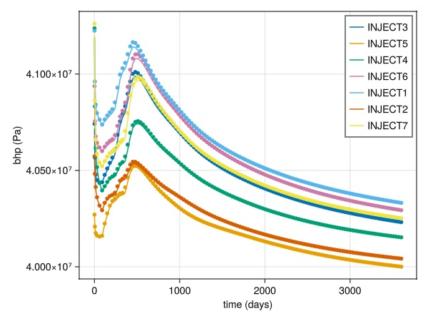

#### Oil rates {#Oil-rates}

```julia
plot_comparison(wells, ref, rep_t, :qos, producers)
```

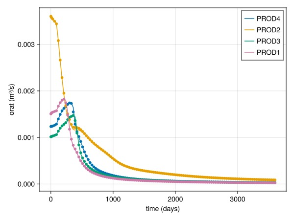

#### Water rates {#Water-rates}

```julia
plot_comparison(wells, ref, rep_t, :qws, producers)
```

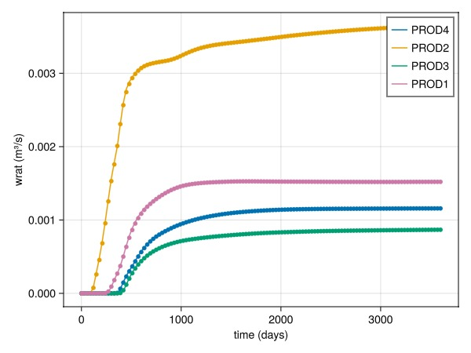

## SPE1 (black oil, disgas) {#SPE1-black-oil,-disgas}

A shortened version of the SPE1 benchmark case.

[Odeh, A.S. 1981. Comparison of Solutions to a Three-Dimensional Black-Oil Reservoir Simulation Problem. J Pet Technol 33 (1): 13–25. SPE-9723-PA](http://dx.doi.org/10.2118/9723-PA)

For comparison against other simulators, see the equivialent JutulSPE1 example in the Jutul module for [MRST](https://www.mrst.no)

### Simulate model {#Simulate-model-2}

```julia
spe1 = simulate_mrst_case(mrst_case_path("spe1"), info_level = -1)
wells = spe1.wells
rep_t = spe1.time
ref = mrst_solution(spe1);
```


```
MRST model: Reading input file /home/runner/work/JutulDarcy.jl/JutulDarcy.jl/src/../test/mrst/spe1.mat.
[ Info: This is the first call to simulate_mrst_case. Compilation may take some time...
MRST model: Starting simulation of black-oil system with 300 cells and 3 phases and 3 components.
MRST model: Model was successfully simulated.
```


### Compare well responses {#Compare-well-responses-2}

#### Bottom hole pressures {#Bottom-hole-pressures-2}

```julia
plot_comparison(wells, ref, rep_t, :bhp)
```

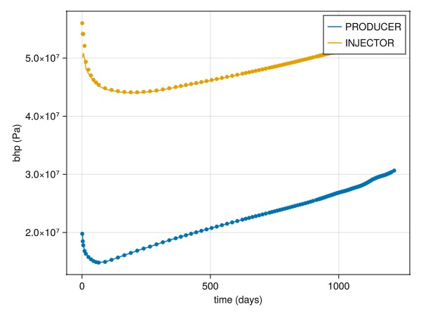

#### Gas rates {#Gas-rates}

```julia
plot_comparison(wells, ref, rep_t, :qgs, [:PRODUCER])
```

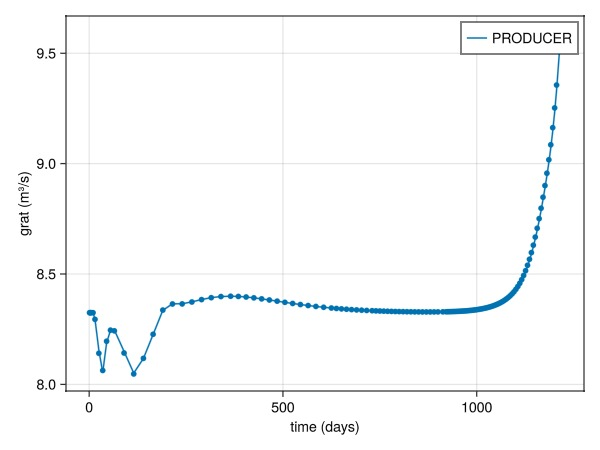

## SPE3 (black oil, vapoil) {#SPE3-black-oil,-vapoil}

A black-oil variant of the SPE3 benchmark case.

[Kenyon, D. &quot;Third SPE comparative solution project: gas cycling of retrograde condensate reservoirs.&quot; Journal of Petroleum Technology 39.08 (1987): 981-997](http://dx.doi.org/10.2118/12278-PA)

### Simulate model {#Simulate-model-3}

```julia
spe3 = simulate_mrst_case(mrst_case_path("spe3"), info_level = -1)
wells = spe3.wells
rep_t = spe3.time
ref = mrst_solution(spe3);
```


```
MRST model: Reading input file /home/runner/work/JutulDarcy.jl/JutulDarcy.jl/src/../test/mrst/spe3.mat.
[ Info: This is the first call to simulate_mrst_case. Compilation may take some time...
MRST model: Starting simulation of black-oil system with 324 cells and 3 phases and 3 components.
MRST model: Model was successfully simulated.
```


### Compare well responses {#Compare-well-responses-3}

#### Bottom hole pressures {#Bottom-hole-pressures-3}

```julia
plot_comparison(wells, ref, rep_t, :bhp, [:PRODUCER])
```

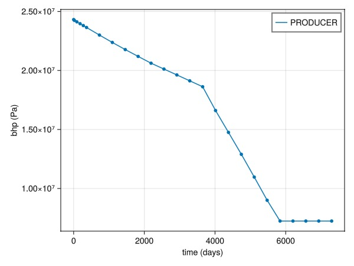

#### Gas rates {#Gas-rates-2}

```julia
plot_comparison(wells, ref, rep_t, :qgs, [:PRODUCER])
```

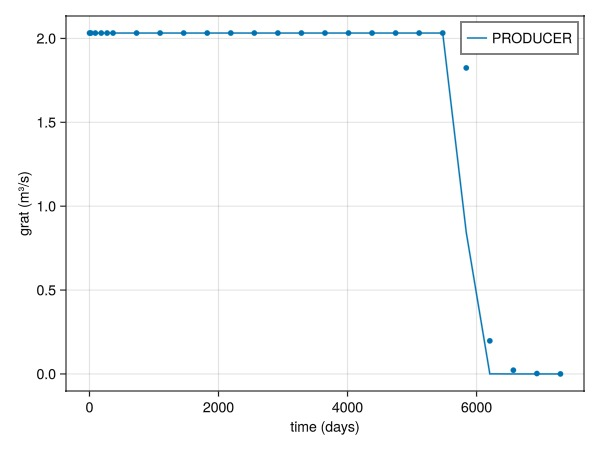

#### Oil rates {#Oil-rates-2}

```julia
plot_comparison(wells, ref, rep_t, :qos, [:PRODUCER])
```

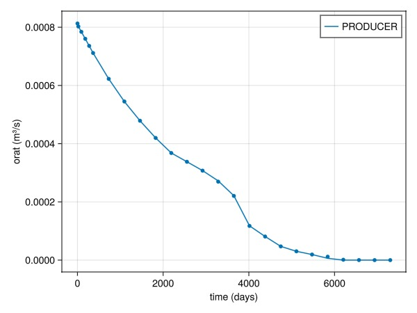

## SPE9 (black oil, disgas) {#SPE9-black-oil,-disgas}

Example of the SPE9 model exported from MRST running in JutulDarcy.

[Killough, J. E. 1995. Ninth SPE comparative solution project: A   reexamination of black-oil simulation. In SPE Reservoir Simulation   Symposium,  12-15 February 1995, San Antonio, Texas. SPE 29110-MS](http://dx.doi.org/10.2118/29110-MS)

For comparison against other simulators, see the equivialent JutulSPE9 example in the Jutul module for [MRST](https://www.mrst.no)

### Simulate model {#Simulate-model-4}

```julia
spe9 = simulate_mrst_case(mrst_case_path("spe9"), info_level = -1)
wells = spe9.wells
rep_t = spe9.time
ref = mrst_solution(spe9);
```


```
MRST model: Reading input file /home/runner/work/JutulDarcy.jl/JutulDarcy.jl/src/../test/mrst/spe9.mat.
[ Info: This is the first call to simulate_mrst_case. Compilation may take some time...
PVT: Fixing table for low pressure conditions.
MRST model: Starting simulation of black-oil system with 9000 cells and 3 phases and 3 components.
MRST model: Model was successfully simulated.
```


### Compare well responses {#Compare-well-responses-4}

```julia
injectors = [:INJE1]
producers = [Symbol("PROD$i") for i in 1:25]
```


```
25-element Vector{Symbol}:
 :PROD1
 :PROD2
 :PROD3
 :PROD4
 :PROD5
 :PROD6
 :PROD7
 :PROD8
 :PROD9
 :PROD10
 ⋮
 :PROD17
 :PROD18
 :PROD19
 :PROD20
 :PROD21
 :PROD22
 :PROD23
 :PROD24
 :PROD25
```


#### Injector water rate {#Injector-water-rate}

```julia
plot_comparison(wells, ref, rep_t, :qws, injectors)
```

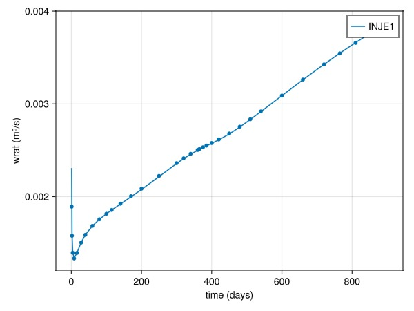

#### Oil rates {#Oil-rates-3}

```julia
plot_comparison(wells, ref, rep_t, :qos, producers)
```

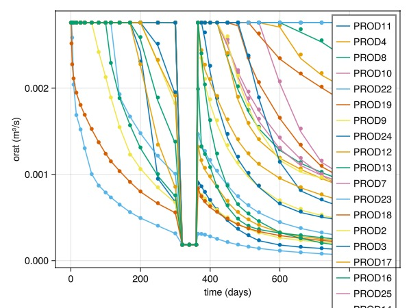

#### Water rates {#Water-rates-2}

```julia
plot_comparison(wells, ref, rep_t, :qws, producers)
```

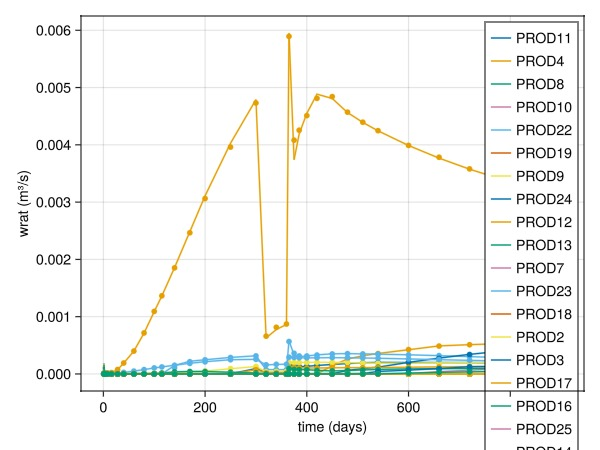

#### Bottom hole pressures {#Bottom-hole-pressures-4}

```julia
plot_comparison(wells, ref, rep_t, :bhp, producers)
```

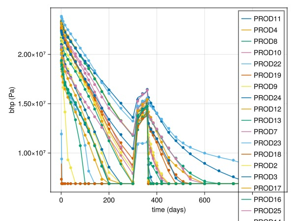

## Example on GitHub {#Example-on-GitHub}

If you would like to run this example yourself, it can be downloaded from the JutulDarcy.jl GitHub repository [as a script](https://github.com/sintefmath/JutulDarcy.jl/blob/main/examples/validation/validation_mrst.jl), or as a [Jupyter Notebook](https://github.com/sintefmath/JutulDarcy.jl/blob/gh-pages/dev/final_site/notebooks/validation/validation_mrst.ipynb)

```
This example took 125.907827767 seconds to complete.
```


---


_This page was generated using [Literate.jl](https://github.com/fredrikekre/Literate.jl)._
