# Norne: Real field black-oil model {#Norne:-Real-field-black-oil-model}

The Norne model is a real field model. The model has been adapted so that the input file only contains features present in JutulDarcy, with the most notable omissions being removal of hysteresis and threshold pressures between equilibriation reqgions. For more details, see the [OPM data webpage](https://opm-project.org/?page_id=559)

```julia
using Jutul, JutulDarcy, GLMakie, DelimitedFiles, HYPRE, GeoEnergyIO
norne_dir = GeoEnergyIO.test_input_file_path("NORNE_NOHYST")
data_pth = joinpath(norne_dir, "NORNE_NOHYST.DATA")
data = parse_data_file(data_pth)
case = setup_case_from_data_file(data);
```


```
F-4H completion: Removed COMPDAT as (36, 68, 17) is not active in processed mesh.
Rel. Perm. Scaling: Three-point scaling active.
Shutting D-1H: Well has no open perforations at step 137, shutting.
Initialization: Negative saturation in 215 cells for phase 2. Normalizing.
Transmissibility: Replaced 2 non-finite half-transmissibilities (out of 267694, 0.0%) with zero.
Transmissibility: Replaced 2 non-finite half-transmissibilities (out of 267694, 0.0%) with zero.
```


## Unpack the case to see basic data structures {#Unpack-the-case-to-see-basic-data-structures}

```julia
model = case.model
parameters = case.parameters
forces = case.forces
dt = case.dt;
```


## Plot the reservoir mesh, wells and faults {#Plot-the-reservoir-mesh,-wells-and-faults}

We compose a few different plotting calls together to make a plot that shows the outline of the mesh, the fault structures and the well trajectories.

```julia
import Jutul: plot_mesh_edges!
reservoir = reservoir_domain(model)
mesh = physical_representation(reservoir)
wells = get_model_wells(model)
fig = Figure(size = (1200, 800))
ax = Axis3(fig[1, 1], zreversed = true)
plot_mesh_edges!(ax, mesh, alpha = 0.5)
for (k, w) in wells
    plot_well!(ax, mesh, w)
end
plot_faults!(ax, mesh, alpha = 0.5)
ax.azimuth[] = -3.0
ax.elevation[] = 0.5
fig
```

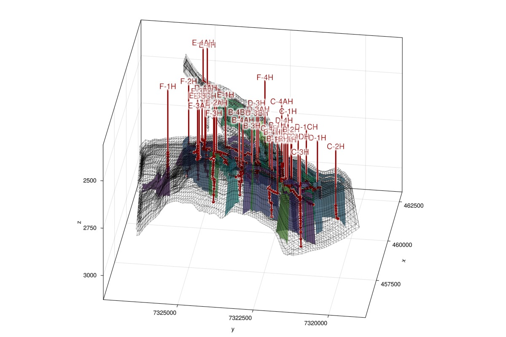

## Plot the reservoir static properties in interactive viewer {#Plot-the-reservoir-static-properties-in-interactive-viewer}

```julia
fig = plot_reservoir(model, key = :porosity)
ax = fig.current_axis[]
plot_faults!(ax, mesh, alpha = 0.5)
ax.azimuth[] = -3.0
ax.elevation[] = 0.5
fig
```

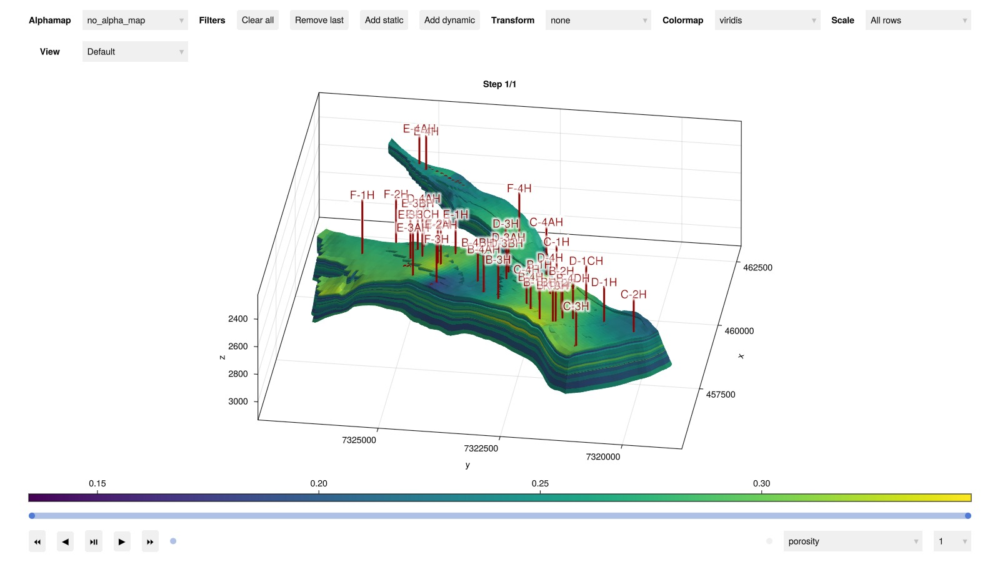

## Simulate the model {#Simulate-the-model}

```julia
ws, states = simulate_reservoir(case, output_substates = true)
```


```
ReservoirSimResult with 467 entries:

  wells (36 present):
    :D-2H
    :F-2H
    :D-4H
    :B-1H
    :C-4H
    :F-1H
    :B-4AH
    :C-1H
    :B-2H
    :E-1H
    :B-4BH
    :D-3AH
    :D-3BH
    :C-3H
    :E-3H
    :K-3H
    :E-4AH
    :D-1H
    :B-1AH
    :E-3CH
    :E-4H
    :E-2H
    :E-2AH
    :C-4AH
    :B-1BH
    :C-2H
    :B-4DH
    :D-3H
    :E-3AH
    :D-4AH
    :B-3H
    :F-3H
    :E-3BH
    :D-1CH
    :F-4H
    :B-4H
    Results per well:
       :wrat => Vector{Float64} of size (467,)
       :Aqueous_mass_rate => Vector{Float64} of size (467,)
       :orat => Vector{Float64} of size (467,)
       :bhp => Vector{Float64} of size (467,)
       :gor => Vector{Float64} of size (467,)
       :lrat => Vector{Float64} of size (467,)
       :mass_rate => Vector{Float64} of size (467,)
       :rate => Vector{Float64} of size (467,)
       :Vapor_mass_rate => Vector{Float64} of size (467,)
       :control => Vector{Symbol} of size (467,)
       :Liquid_mass_rate => Vector{Float64} of size (467,)
       :wcut => Vector{Float64} of size (467,)
       :grat => Vector{Float64} of size (467,)

  states (Vector with 467 entries, reservoir variables for each state)
    :Rv => Vector{Float64} of size (44417,)
    :BlackOilUnknown => Vector{BlackOilX{Float64}} of size (44417,)
    :Saturations => Matrix{Float64} of size (3, 44417)
    :Pressure => Vector{Float64} of size (44417,)
    :Rs => Vector{Float64} of size (44417,)
    :ImmiscibleSaturation => Vector{Float64} of size (44417,)
    :TotalMasses => Matrix{Float64} of size (3, 44417)

  time (report time for each state)
     Vector{Float64} of length 467

  result (extended states, reports)
     SimResult with 247 entries

  extra
     Dict{Any, Any} with keys :simulator, :config

  Completed at May. 20 2025 23:05 after 9 minutes, 38 seconds, 332.7 milliseconds.
```


## Plot the reservoir solution {#Plot-the-reservoir-solution}

```julia
fig = plot_reservoir(model, states, step = 247, key = :Saturations)
ax = fig.current_axis[]
ax.azimuth[] = -3.0
ax.elevation[] = 0.5
fig
```

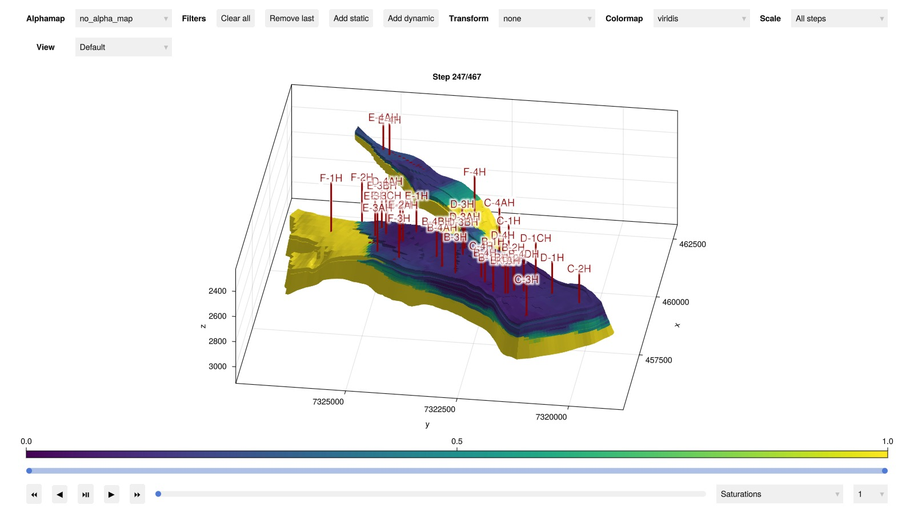

## Load reference and set up plotting {#Load-reference-and-set-up-plotting}

```julia
csv_path = joinpath(norne_dir, "REFERENCE.CSV")
data_ref, header = readdlm(csv_path, ',', header = true)
time_ref = data_ref[:, 1]
time_jutul = deepcopy(ws.time)
wells = deepcopy(ws.wells)
wnames = collect(keys(wells))
nw = length(wnames)
day = si_unit(:day)
cmap = :tableau_hue_circle

inj = Symbol[]
prod = Symbol[]
for (wellname, well) in pairs(wells)
    qts = well[:wrat] + well[:orat] + well[:grat]
    if sum(qts) > 0
        push!(inj, wellname)
    else
        push!(prod, wellname)
    end
end

function plot_well_comparison(response, well_names, reponse_name = "$response"; cumulative = false)
    fig = Figure(size = (1000, 400))
    if response == :bhp
        ys = 1/si_unit(:bar)
        yl = "Bottom hole pressure / Bar"
    elseif response == :wrat
        ys = si_unit(:day)
        if cumulative
            yl = "Cumulative water rate / m³"
        else
            yl = "Water rate / m³/day"
        end
    elseif response == :grat
        ys = si_unit(:day)/1e6
        if cumulative
            yl = "Cumulative gas rate / 10⁶ m³"
        else
            yl = "Gas rate / 10⁶ m³/day"
        end
    elseif response == :orat
        ys = si_unit(:day)/(1000*si_unit(:stb))
        if cumulative
            yl = "Cumulative oil rate / 10³ stb"
        else
            yl = "Oil rate / 10³ stb/day"
        end
    else
        error("$response not ready.")
    end
    welltypes = []
    ax = Axis(fig[1:4, 1], xlabel = "Time / days", ylabel = yl)
    i = 1
    linehandles = []
    linelabels = []
    for well_name in well_names
        well = wells[well_name]
        label_in_csv = "$well_name:$response"
        ref_pos = findfirst(x -> x == label_in_csv, vec(header))
        qoi = copy(well[response]).*ys
        qoi_ref = data_ref[:, ref_pos].*ys
        tot_rate = copy(well[:rate])
        grat_ref = data_ref[:, findfirst(x -> x == "$well_name:grat", vec(header))]
        orat_ref = data_ref[:, findfirst(x -> x == "$well_name:orat", vec(header))]
        wrat_ref = data_ref[:, findfirst(x -> x == "$well_name:wrat", vec(header))]
        tot_rate_ref = grat_ref + orat_ref + wrat_ref
        if cumulative
            @. qoi_ref[tot_rate_ref == 0] = 0
            @. qoi[tot_rate == 0] = 0
            qoi_ref = cumsum(qoi_ref.*diff([0, time_ref...]./day))
            qoi = cumsum(qoi.*diff([0, time_jutul...]./day))
        else
            @. qoi_ref[tot_rate_ref == 0] = NaN
            @. qoi[tot_rate == 0] = NaN
        end
        crange = (1, max(length(well_names), 2))
        lh = lines!(ax, time_jutul./day, abs.(qoi),
            color = i,
            colorrange = crange,
            label = "$well_name", colormap = cmap
        )
        push!(linehandles, lh)
        push!(linelabels, "$well_name")
        lines!(ax, time_ref./day, abs.(qoi_ref),
            color = i,
            colorrange = crange,
            linestyle = :dash,
            colormap = cmap
        )
        i += 1
    end
    l1 = LineElement(color = :black, linestyle = nothing)
    l2 = LineElement(color = :black, linestyle = :dash)

    Legend(fig[1:3, 2], linehandles, linelabels, nbanks = 3)
    Legend(fig[4, 2], [l1, l2], ["JutulDarcy.jl", "OPM Flow"])
    fig
end
```


```
plot_well_comparison (generic function with 2 methods)
```


## Injector bhp {#Injector-bhp}

```julia
plot_well_comparison(:bhp, inj, "Bottom hole pressure")
```

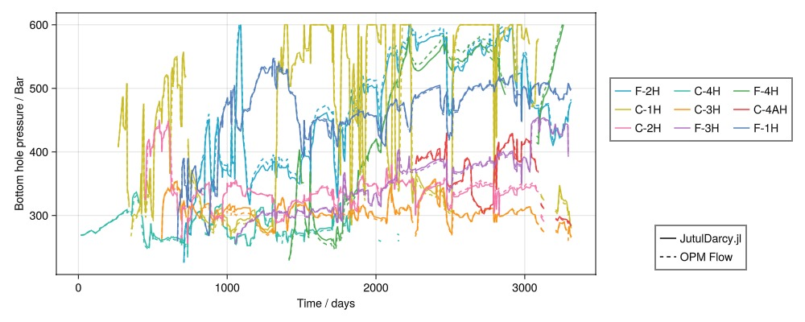

## Gas injection rates {#Gas-injection-rates}

### Rates {#Rates}

```julia
plot_well_comparison(:grat, inj, "Gas surface injection rate")
```

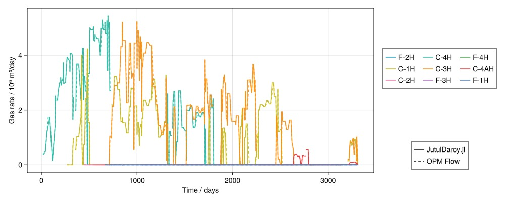

## Cumulative gas injection rates {#Cumulative-gas-injection-rates}

```julia
plot_well_comparison(:grat, inj, "Cumulative gas surface injection rate", cumulative = true)
```

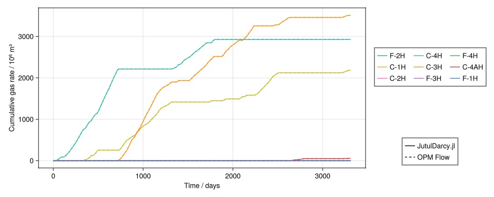

## Water injection rates {#Water-injection-rates}

### Rates {#Rates-2}

```julia
plot_well_comparison(:wrat, inj, "Water surface injection rate")
```

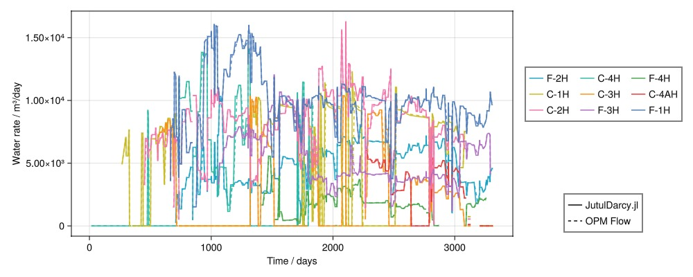

### Cumulative rates {#Cumulative-rates}

```julia
plot_well_comparison(:wrat, inj, "Cumulative water surface injection rate", cumulative = true)
```

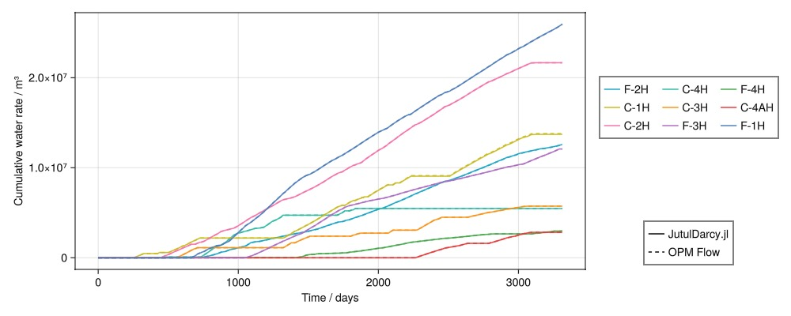

## Producer bhp {#Producer-bhp}

```julia
plot_well_comparison(:bhp, prod, "Bottom hole pressure")
```

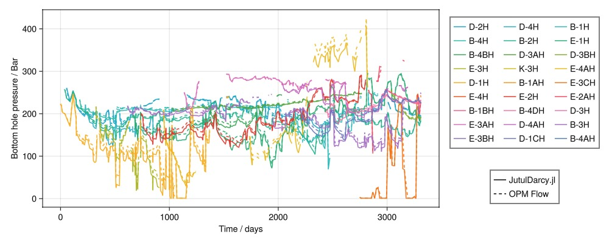

## Oil production rates {#Oil-production-rates}

### Rates {#Rates-3}

```julia
plot_well_comparison(:orat, prod, "Oil surface production rate")
```

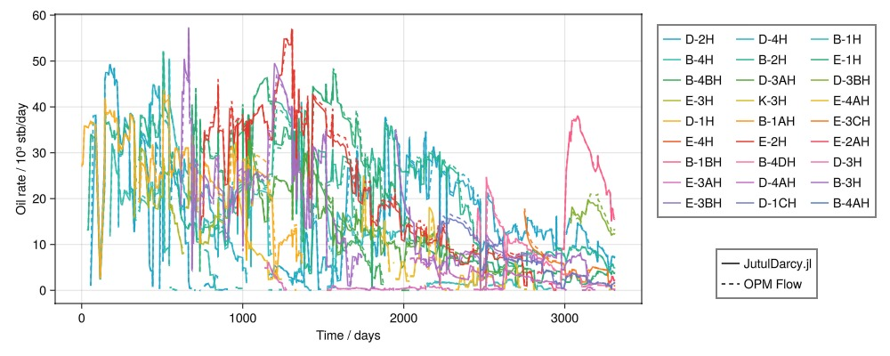

### Cumulative rates {#Cumulative-rates-2}

```julia
plot_well_comparison(:orat, prod, "Cumulative oil surface production rate", cumulative = true)
```

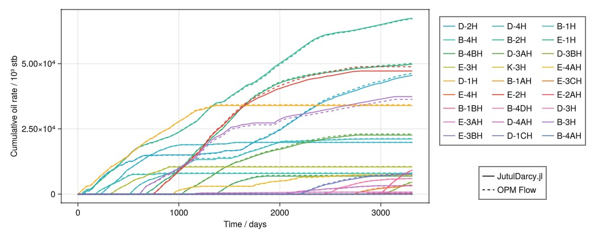

## Gas production rates {#Gas-production-rates}

### Rates {#Rates-4}

```julia
plot_well_comparison(:grat, prod, "Gas surface production rate")
```

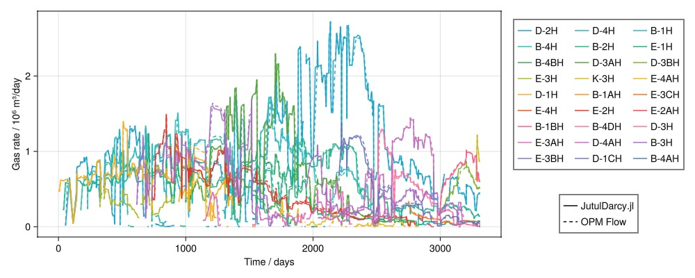

### Cumulative rates {#Cumulative-rates-3}

```julia
plot_well_comparison(:grat, prod, "Cumulative gas surface production rate", cumulative = true)
```

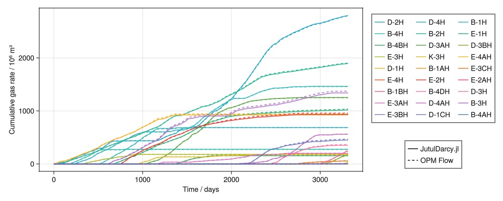

## Water production rates {#Water-production-rates}

### Rates {#Rates-5}

```julia
plot_well_comparison(:wrat, prod, "Water surface production rate")
```

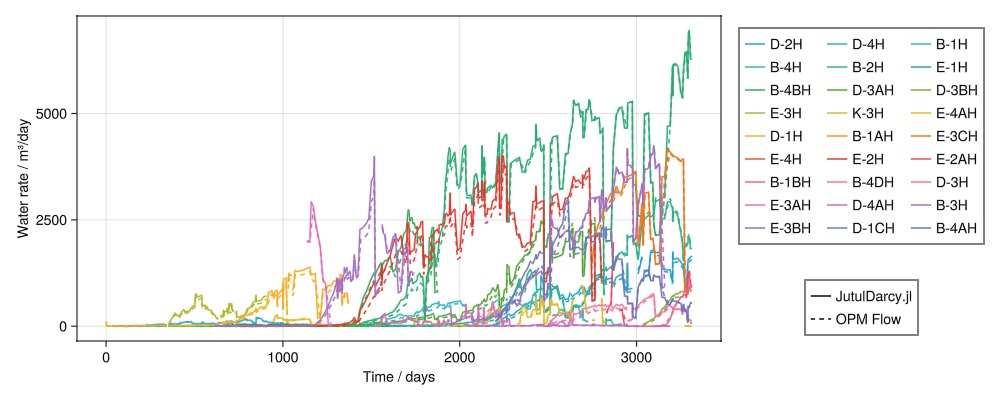

### Cumulative rates {#Cumulative-rates-4}

```julia
plot_well_comparison(:wrat, prod, "Cumulative water surface production rate", cumulative = true)
```

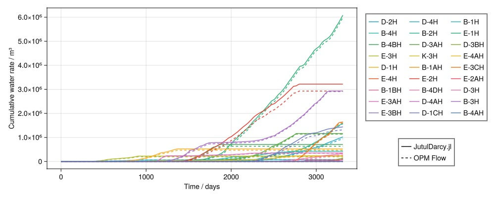

## Interactive plotting of field statistics {#Interactive-plotting-of-field-statistics}

```julia
plot_reservoir_measurables(case, ws, states, left = :fgpr, right = :pres)
```

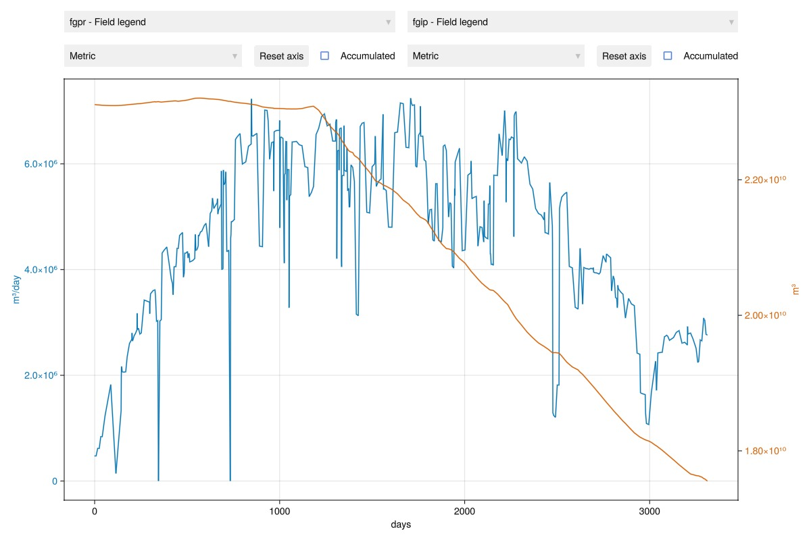

## Plot wells {#Plot-wells}

```julia
plot_well_results(ws)
```

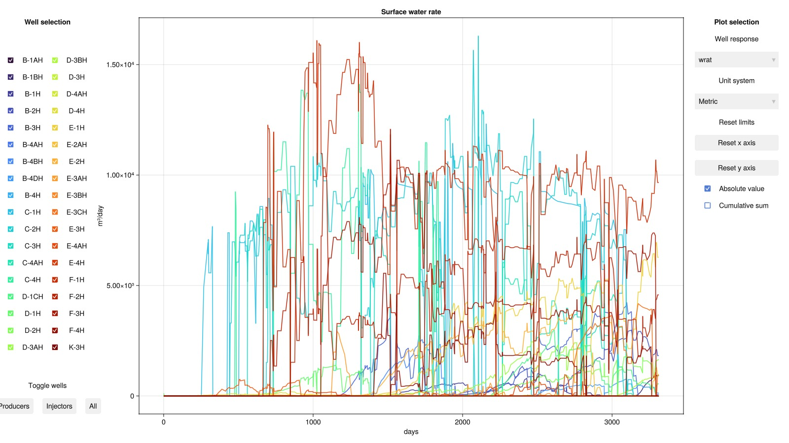

## Example on GitHub {#Example-on-GitHub}

If you would like to run this example yourself, it can be downloaded from the JutulDarcy.jl GitHub repository [as a script](https://github.com/sintefmath/JutulDarcy.jl/blob/main/examples/validation/validation_norne_nohyst.jl), or as a [Jupyter Notebook](https://github.com/sintefmath/JutulDarcy.jl/blob/gh-pages/dev/final_site/notebooks/validation/validation_norne_nohyst.ipynb)

```
This example took 650.698164014 seconds to complete.
```


---


_This page was generated using [Literate.jl](https://github.com/fredrikekre/Literate.jl)._
