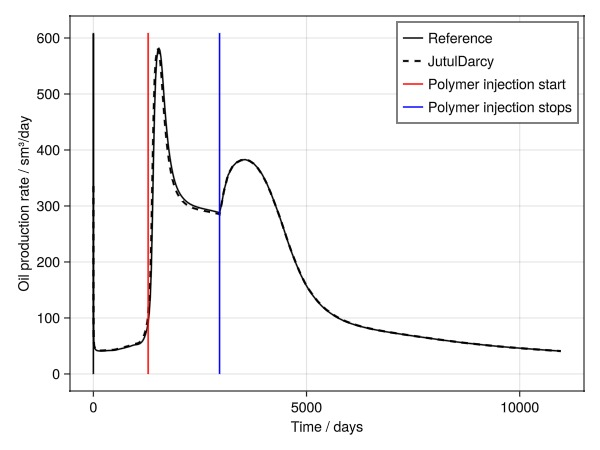
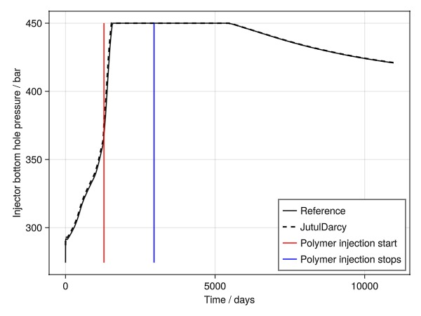
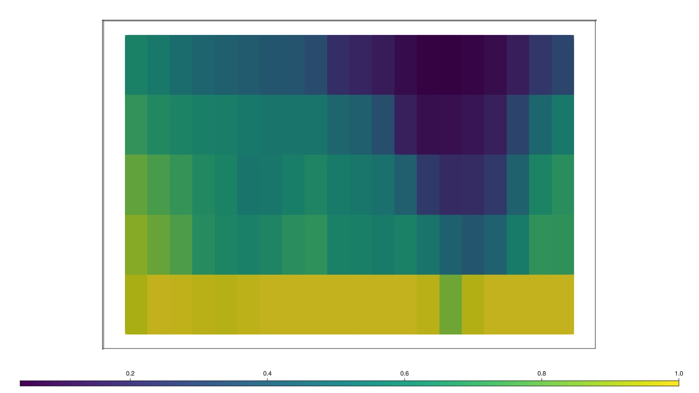
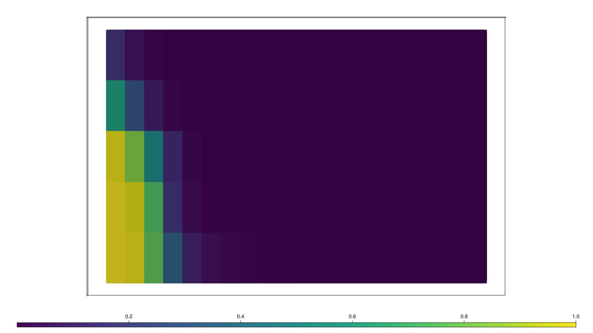
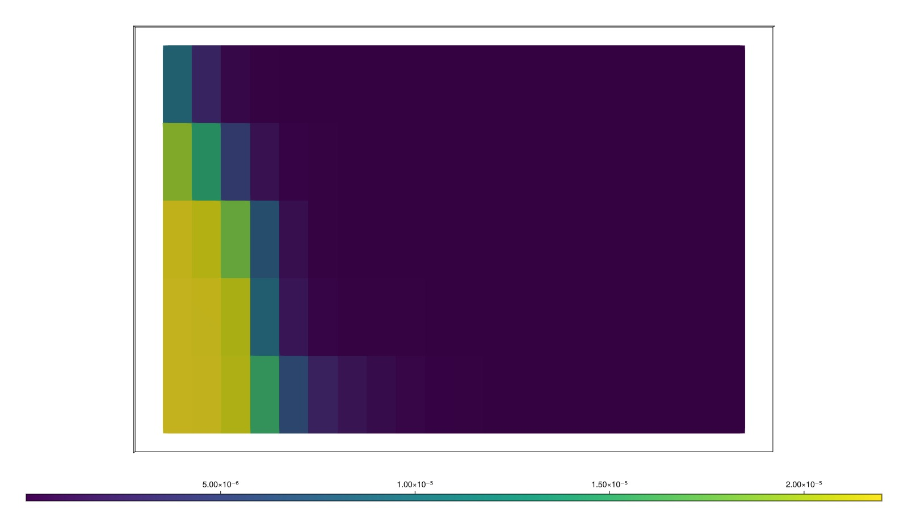

# Polymer injection in a 2D black-oil reservoir model {#Polymer-injection-in-a-2D-black-oil-reservoir-model}

This example validates a small polymer model taken from the OPM-tests repository. The model is a 2D black-oil reservoir model with polymer injection. Adding polymer to the water phase increases the viscosity of the water and helps with mobility control. This is implemented in JutulDarcy as a tracer that can alter the properties of the system.

At present, the JutulDarcy polymer model supports the following features:
- Polymer injection in the water phase
  
- Varying degree of mixing between polymer and water
  
- Adsorption of polymer to the rock
  
- Polymer viscosity changes
  
- Permeability reduction from polymer
  
- Dead pore space for polymer part of water phase
  

Note that non-Newtonian / shear effectsare not yet implemented in the polymer model.

```julia
using GeoEnergyIO, Jutul, JutulDarcy, GLMakie, DelimitedFiles
pth = JutulDarcy.GeoEnergyIO.test_input_file_path("BOPOLYMER_NOSHEAR", "BOPOLYMER_NOSHEAR.DATA")
data = parse_data_file(pth)
case = setup_case_from_data_file(data)
push!(case.model[:Reservoir].output_variables, :PolymerConcentration)
push!(case.model[:Reservoir].output_variables, :PhaseViscosities)
push!(case.model[:Reservoir].output_variables, :AdsorbedPolymerConcentration)

ws, states, time = simulate_reservoir(case)
```


```
ReservoirSimResult with 228 entries:

  wells (2 present):
    :PROD01
    :INJE01
    Results per well:
       :wrat => Vector{Float64} of size (228,)
       :Aqueous_mass_rate => Vector{Float64} of size (228,)
       :orat => Vector{Float64} of size (228,)
       :bhp => Vector{Float64} of size (228,)
       :gor => Vector{Float64} of size (228,)
       :lrat => Vector{Float64} of size (228,)
       :mass_rate => Vector{Float64} of size (228,)
       :rate => Vector{Float64} of size (228,)
       :Vapor_mass_rate => Vector{Float64} of size (228,)
       :control => Vector{Symbol} of size (228,)
       :Liquid_mass_rate => Vector{Float64} of size (228,)
       :wcut => Vector{Float64} of size (228,)
       :grat => Vector{Float64} of size (228,)

  states (Vector with 228 entries, reservoir variables for each state)
    :TracerMasses => Matrix{Float64} of size (1, 100)
    :Rs => Vector{Float64} of size (100,)
    :ImmiscibleSaturation => Vector{Float64} of size (100,)
    :BlackOilUnknown => Vector{BlackOilX{Float64}} of size (100,)
    :TracerConcentrations => Matrix{Float64} of size (1, 100)
    :Rv => Vector{Float64} of size (100,)
    :AdsorbedPolymerConcentration => Vector{Float64} of size (100,)
    :Saturations => Matrix{Float64} of size (3, 100)
    :Pressure => Vector{Float64} of size (100,)
    :PolymerConcentration => Vector{Float64} of size (100,)
    :PhaseViscosities => Matrix{Float64} of size (3, 100)
    :TotalMasses => Matrix{Float64} of size (3, 100)

  time (report time for each state)
     Vector{Float64} of length 228

  result (extended states, reports)
     SimResult with 228 entries

  extra
     Dict{Any, Any} with keys :simulator, :config

  Completed at May. 20 2025 23:05 after 15 seconds, 662 milliseconds, 99.45 microseconds.
```


## Load the reference solution and set up plotting {#Load-the-reference-solution-and-set-up-plotting}

```julia
ref_pth = JutulDarcy.GeoEnergyIO.test_input_file_path("BOPOLYMER_NOSHEAR", "result.txt")
tab, header = DelimitedFiles.readdlm(ref_pth, header = true)
header = vec(header)
units = tab[1, :]
tab = Float64.(tab[2:end, :])
getcol(x) = tab[:, findfirst(isequal(x), header)]
time_ref = getcol("TIME")

function plot_comparison(jutul, ref, label; pos = :rt)
    fig = Figure()
    ax = Axis(fig[1, 1]; xlabel = "Time / days", ylabel = label)
    lines!(ax, time_ref, ref, label = "Reference", color = :black)
    lines!(ax, time./si_unit(:day), jutul, label = "JutulDarcy", linestyle = :dash, linewidth = 2, color = :black)
    lines!(ax, [1285.0, 1285.0], [minimum([jutul; ref]), maximum([jutul; ref])], label = "Polymer injection start", color = :red)
    lines!(ax, [2960.0, 2960.0], [minimum([jutul; ref]), maximum([jutul; ref])], label = "Polymer injection stops", color = :blue)
    axislegend(position = pos)
    fig
end
```


```
plot_comparison (generic function with 1 method)
```


## Plot oil production rate {#Plot-oil-production-rate}

```julia
wopr_ref = getcol("WOPR:PROD01")
wopr = -ws[:PROD01, :orat]*si_unit(:day)
plot_comparison(wopr, wopr_ref, "Oil production rate / sm³/day")
```



## Plot bottom hole pressure {#Plot-bottom-hole-pressure}

The pressure required to inject water significantly increases as polymer is added. This is due to the increased viscosity of the water phase when polymer is part of the mixture.

```julia
wbhp_ref = getcol("WBHP:INJE01")
wbhp = ws[:INJE01, :bhp]./si_unit(:bar)
plot_comparison(wbhp, wbhp_ref, "Injector bottom hole pressure / bar", pos = :rb)
```



## Plot the water front after polymer injection {#Plot-the-water-front-after-polymer-injection}

```julia
reservoir = reservoir_domain(case.model)
g = physical_representation(reservoir)
```


```
UnstructuredMesh with 100 cells, 175 faces and 250 boundary faces
```


## Plot the water saturation front {#Plot-the-water-saturation-front}

```julia
fig, ax, plt = plot_cell_data(g, states[148][:Saturations][1, :])
ax.azimuth = 1.5π
ax.elevation = 0
hidedecorations!(ax)
fig
```



## Plot the polymer concentration {#Plot-the-polymer-concentration}

```julia
fig, ax, plt = plot_cell_data(g, states[148][:PolymerConcentration])
ax.azimuth = 1.5π
ax.elevation = 0
hidedecorations!(ax)
fig
```



## Plot the adsorbed polymer concentration {#Plot-the-adsorbed-polymer-concentration}

The polymer is adsorbed to the rock surface. This is a key part of the polymer model – the polymer is not only in the water phase but also adsorbed to the rock.

```julia
fig, ax, plt = plot_cell_data(g, states[148][:AdsorbedPolymerConcentration])
ax.azimuth = 1.5π
ax.elevation = 0
hidedecorations!(ax)
fig
```



## Example on GitHub {#Example-on-GitHub}

If you would like to run this example yourself, it can be downloaded from the JutulDarcy.jl GitHub repository [as a script](https://github.com/sintefmath/JutulDarcy.jl/blob/main/examples/validation/validation_polymer.jl), or as a [Jupyter Notebook](https://github.com/sintefmath/JutulDarcy.jl/blob/gh-pages/dev/final_site/notebooks/validation/validation_polymer.ipynb)

```
This example took 47.061580948 seconds to complete.
```


---


_This page was generated using [Literate.jl](https://github.com/fredrikekre/Literate.jl)._
