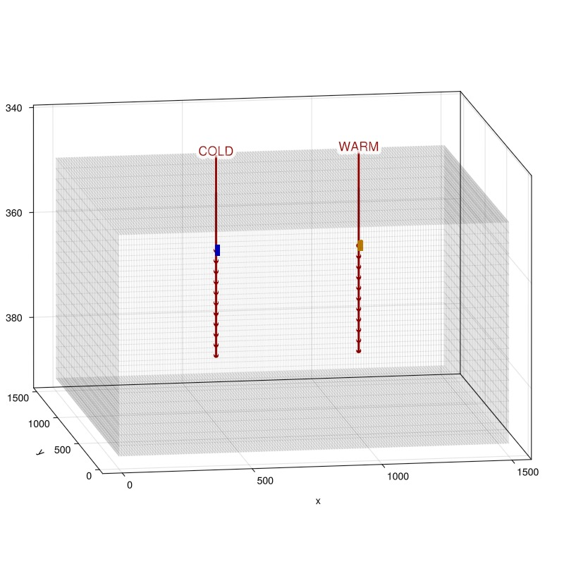
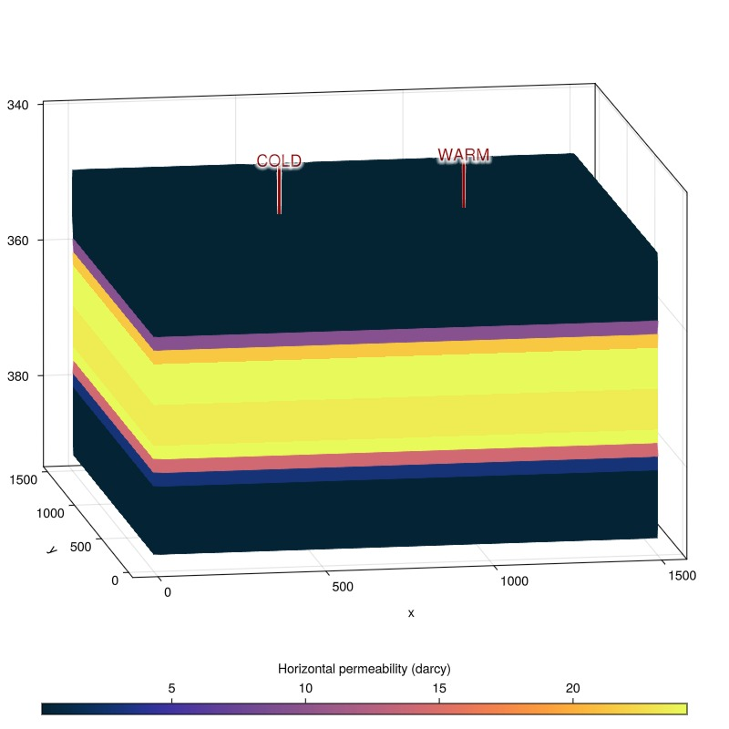
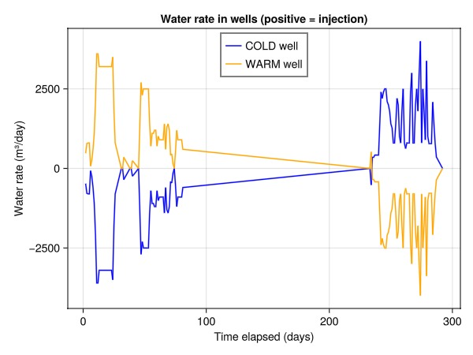
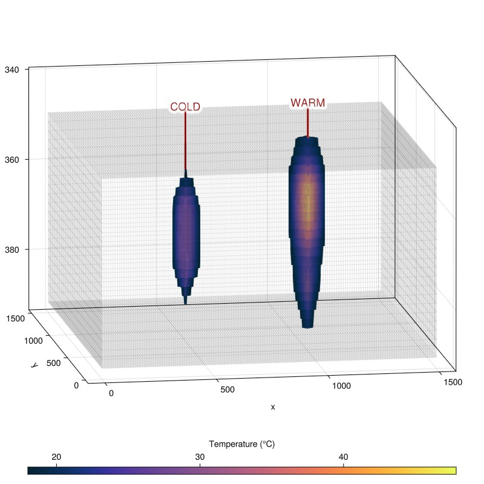
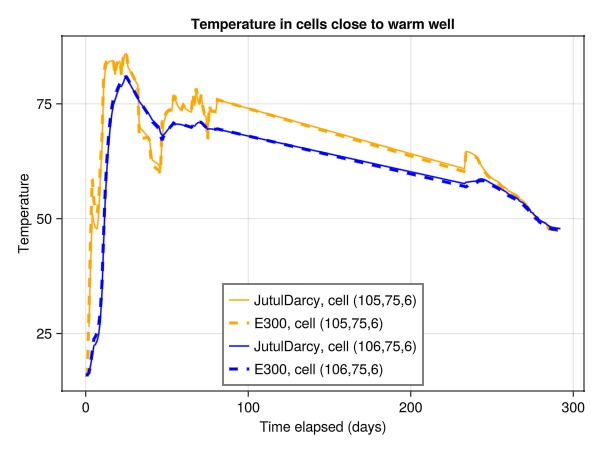
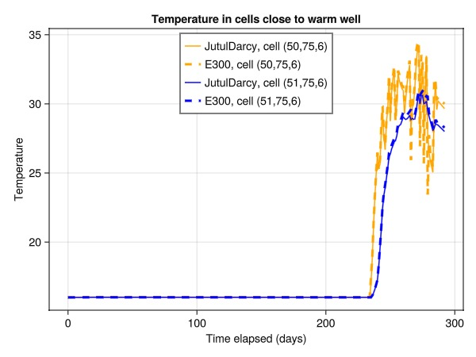
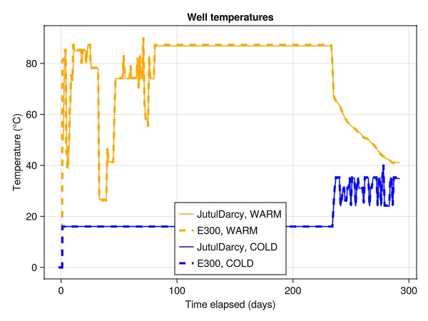
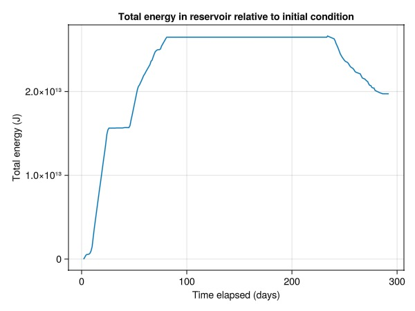
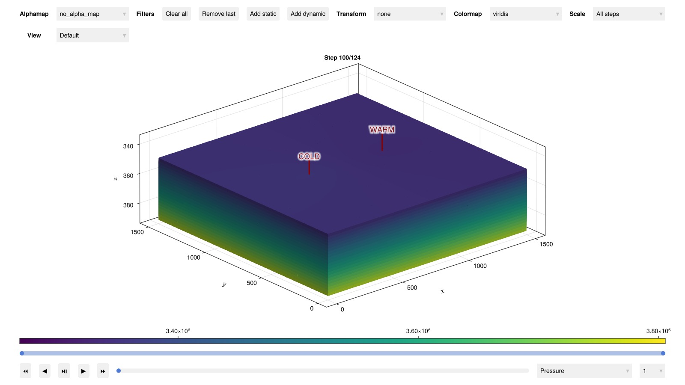

# Aquifer thermal energy storage (ATES) validation {#Aquifer-thermal-energy-storage-ATES-validation}

This example validates JutulDarcy&#39;s thermal solver against results from a commercial simulator. The test case is a simple ATES model with a single pair of wells (hot / cold) where the cold well is used for pressure support with a mirrored injection rate. Towards the later part of the schedule, the cold well reinjects water that is a higher temperature than the background.

This case is completely specified in the `ATES_TEST.DATA` file which was provided by TNO. The model is a structured mesh with 472 500 active cells.

```julia
using Jutul, JutulDarcy, GeoEnergyIO, DelimitedFiles, HYPRE, GLMakie
basepth = GeoEnergyIO.test_input_file_path("ATES_TEST")
data = parse_data_file(joinpath(basepth, "ATES_TEST.DATA"))

wdata, wheader = readdlm(joinpath(basepth, "wells.txt"), ',', header = true)
cdata, cheader = readdlm(joinpath(basepth, "cells.txt"), ',', header = true)
case = setup_case_from_data_file(data)
ws, states, t_seconds = simulate_reservoir(case, info_level = 1);
```


```
Parser: PROPS/VISCREF - Parser has only partial support. VISCREF may have missing or wrong entries.
┌ Warning: Did not find supported time kw in step 126: Keys were ["WELOPEN"].
└ @ JutulDarcy ~/work/JutulDarcy.jl/JutulDarcy.jl/src/input_simulation/data_input.jl:1694
setup_reservoir_state: Received primary variable Saturations, but this is not known to reservoir model.
Jutul: Simulating 41 weeks, 5 days as 124 report steps
Step   1/124: Solving start to 2 days, Δt = 2 days
Step   2/124: Solving 2 days to 3 days, Δt = 1 day
Step   3/124: Solving 3 days to 4 days, Δt = 1 day
Step   4/124: Solving 4 days to 5 days, Δt = 1 day
Step   5/124: Solving 5 days to 6 days, Δt = 1 day
Step   6/124: Solving 6 days to 1 week, Δt = 1 day
Step   7/124: Solving 1 week to 1 week, 1 day, Δt = 1 day
Step   8/124: Solving 1 week, 1 day to 1 week, 2 days, Δt = 1 day
Step   9/124: Solving 1 week, 2 days to 1 week, 3 days, Δt = 1 day
Step  10/124: Solving 1 week, 3 days to 1 week, 4 days, Δt = 1 day
Step  11/124: Solving 1 week, 4 days to 1 week, 5 days, Δt = 1 day
Step  12/124: Solving 1 week, 5 days to 1 week, 6 days, Δt = 1 day
Step  13/124: Solving 1 week, 6 days to 2 weeks, Δt = 1 day
Step  14/124: Solving 2 weeks to 2 weeks, 1 day, Δt = 1 day
Step  15/124: Solving 2 weeks, 1 day to 2 weeks, 2 days, Δt = 1 day
Step  16/124: Solving 2 weeks, 2 days to 2 weeks, 3 days, Δt = 1 day
Step  17/124: Solving 2 weeks, 3 days to 2 weeks, 4 days, Δt = 1 day
Step  18/124: Solving 2 weeks, 4 days to 2 weeks, 5 days, Δt = 1 day
Step  19/124: Solving 2 weeks, 5 days to 2 weeks, 6 days, Δt = 1 day
Step  20/124: Solving 2 weeks, 6 days to 3 weeks, Δt = 1 day
Step  21/124: Solving 3 weeks to 3 weeks, 1 day, Δt = 1 day
Step  22/124: Solving 3 weeks, 1 day to 3 weeks, 2 days, Δt = 1 day
Step  23/124: Solving 3 weeks, 2 days to 3 weeks, 3 days, Δt = 1 day
Step  24/124: Solving 3 weeks, 3 days to 3 weeks, 4 days, Δt = 1 day
Step  25/124: Solving 3 weeks, 4 days to 3 weeks, 5 days, Δt = 1 day
Step  26/124: Solving 3 weeks, 5 days to 4 weeks, 3 days, Δt = 5 days
Step  27/124: Solving 4 weeks, 3 days to 4 weeks, 4 days, Δt = 1 day
Step  28/124: Solving 4 weeks, 4 days to 4 weeks, 5 days, Δt = 1 day
Step  29/124: Solving 4 weeks, 5 days to 5 weeks, 3 days, Δt = 5 days
Step  30/124: Solving 5 weeks, 3 days to 5 weeks, 4 days, Δt = 1 day
Step  31/124: Solving 5 weeks, 4 days to 5 weeks, 5 days, Δt = 1 day
Step  32/124: Solving 5 weeks, 5 days to 5 weeks, 6 days, Δt = 1 day
Step  33/124: Solving 5 weeks, 6 days to 6 weeks, 3 days, Δt = 4 days
Step  34/124: Solving 6 weeks, 3 days to 6 weeks, 4 days, Δt = 1 day
Step  35/124: Solving 6 weeks, 4 days to 6 weeks, 5 days, Δt = 1 day
Step  36/124: Solving 6 weeks, 5 days to 6 weeks, 6 days, Δt = 1 day
Step  37/124: Solving 6 weeks, 6 days to 7 weeks, Δt = 1 day
Step  38/124: Solving 7 weeks to 7 weeks, 1 day, Δt = 1 day
Step  39/124: Solving 7 weeks, 1 day to 7 weeks, 2 days, Δt = 1 day
Step  40/124: Solving 7 weeks, 2 days to 7 weeks, 3 days, Δt = 1 day
Step  41/124: Solving 7 weeks, 3 days to 7 weeks, 4 days, Δt = 1 day
Step  42/124: Solving 7 weeks, 4 days to 7 weeks, 5 days, Δt = 1 day
Step  43/124: Solving 7 weeks, 5 days to 7 weeks, 6 days, Δt = 1 day
Step  44/124: Solving 7 weeks, 6 days to 8 weeks, Δt = 1 day
Step  45/124: Solving 8 weeks to 8 weeks, 1 day, Δt = 1 day
Step  46/124: Solving 8 weeks, 1 day to 8 weeks, 2 days, Δt = 1 day
Step  47/124: Solving 8 weeks, 2 days to 8 weeks, 3 days, Δt = 1 day
Step  48/124: Solving 8 weeks, 3 days to 8 weeks, 4 days, Δt = 1 day
Step  49/124: Solving 8 weeks, 4 days to 8 weeks, 5 days, Δt = 1 day
Step  50/124: Solving 8 weeks, 5 days to 8 weeks, 6 days, Δt = 1 day
Step  51/124: Solving 8 weeks, 6 days to 9 weeks, Δt = 1 day
Step  52/124: Solving 9 weeks to 9 weeks, 1 day, Δt = 1 day
Step  53/124: Solving 9 weeks, 1 day to 9 weeks, 2 days, Δt = 1 day
Step  54/124: Solving 9 weeks, 2 days to 9 weeks, 3 days, Δt = 1 day
Step  55/124: Solving 9 weeks, 3 days to 9 weeks, 4 days, Δt = 1 day
Step  56/124: Solving 9 weeks, 4 days to 9 weeks, 5 days, Δt = 1 day
Step  57/124: Solving 9 weeks, 5 days to 9 weeks, 6 days, Δt = 1 day
Step  58/124: Solving 9 weeks, 6 days to 10 weeks, Δt = 1 day
Step  59/124: Solving 10 weeks to 10 weeks, 1 day, Δt = 1 day
Step  60/124: Solving 10 weeks, 1 day to 10 weeks, 2 days, Δt = 1 day
Step  61/124: Solving 10 weeks, 2 days to 10 weeks, 3 days, Δt = 1 day
Step  62/124: Solving 10 weeks, 3 days to 10 weeks, 4 days, Δt = 1 day
Step  63/124: Solving 10 weeks, 4 days to 10 weeks, 5 days, Δt = 1 day
Step  64/124: Solving 10 weeks, 5 days to 10 weeks, 6 days, Δt = 1 day
Step  65/124: Solving 10 weeks, 6 days to 11 weeks, Δt = 1 day
Step  66/124: Solving 11 weeks to 11 weeks, 1 day, Δt = 1 day
Step  67/124: Solving 11 weeks, 1 day to 11 weeks, 2 days, Δt = 1 day
Step  68/124: Solving 11 weeks, 2 days to 11 weeks, 3 days, Δt = 1 day
Step  69/124: Solving 11 weeks, 3 days to 11 weeks, 4 days, Δt = 1 day
Step  70/124: Solving 11 weeks, 4 days to 33 weeks, 2 days, Δt = 21 weeks, 5 days
Step  71/124: Solving 33 weeks, 2 days to 33 weeks, 3 days, Δt = 1 day
Step  72/124: Solving 33 weeks, 3 days to 33 weeks, 4 days, Δt = 1 day
Step  73/124: Solving 33 weeks, 4 days to 33 weeks, 5 days, Δt = 1 day
Step  74/124: Solving 33 weeks, 5 days to 33 weeks, 6 days, Δt = 1 day
Step  75/124: Solving 33 weeks, 6 days to 34 weeks, Δt = 1 day
Step  76/124: Solving 34 weeks to 34 weeks, 1 day, Δt = 1 day
Step  77/124: Solving 34 weeks, 1 day to 34 weeks, 2 days, Δt = 1 day
Step  78/124: Solving 34 weeks, 2 days to 34 weeks, 3 days, Δt = 1 day
Step  79/124: Solving 34 weeks, 3 days to 34 weeks, 4 days, Δt = 1 day
Step  80/124: Solving 34 weeks, 4 days to 34 weeks, 5 days, Δt = 1 day
Step  81/124: Solving 34 weeks, 5 days to 34 weeks, 6 days, Δt = 1 day
Step  82/124: Solving 34 weeks, 6 days to 35 weeks, Δt = 1 day
Step  83/124: Solving 35 weeks to 35 weeks, 1 day, Δt = 1 day
Step  84/124: Solving 35 weeks, 1 day to 35 weeks, 2 days, Δt = 1 day
Step  85/124: Solving 35 weeks, 2 days to 35 weeks, 3 days, Δt = 1 day
Step  86/124: Solving 35 weeks, 3 days to 35 weeks, 4 days, Δt = 1 day
Step  87/124: Solving 35 weeks, 4 days to 35 weeks, 5 days, Δt = 1 day
Step  88/124: Solving 35 weeks, 5 days to 35 weeks, 6 days, Δt = 1 day
Step  89/124: Solving 35 weeks, 6 days to 36 weeks, Δt = 1 day
Step  90/124: Solving 36 weeks to 36 weeks, 1 day, Δt = 1 day
Step  91/124: Solving 36 weeks, 1 day to 36 weeks, 2 days, Δt = 1 day
Step  92/124: Solving 36 weeks, 2 days to 36 weeks, 3 days, Δt = 1 day
Step  93/124: Solving 36 weeks, 3 days to 36 weeks, 4 days, Δt = 1 day
Step  94/124: Solving 36 weeks, 4 days to 36 weeks, 5 days, Δt = 1 day
Step  95/124: Solving 36 weeks, 5 days to 36 weeks, 6 days, Δt = 1 day
Step  96/124: Solving 36 weeks, 6 days to 37 weeks, Δt = 1 day
Step  97/124: Solving 37 weeks to 37 weeks, 1 day, Δt = 1 day
Step  98/124: Solving 37 weeks, 1 day to 37 weeks, 2 days, Δt = 1 day
Step  99/124: Solving 37 weeks, 2 days to 37 weeks, 3 days, Δt = 1 day
Step 100/124: Solving 37 weeks, 3 days to 37 weeks, 4 days, Δt = 1 day
Step 101/124: Solving 37 weeks, 4 days to 37 weeks, 5 days, Δt = 1 day
Step 102/124: Solving 37 weeks, 5 days to 37 weeks, 6 days, Δt = 1 day
Step 103/124: Solving 37 weeks, 6 days to 38 weeks, Δt = 1 day
Step 104/124: Solving 38 weeks to 38 weeks, 1 day, Δt = 1 day
Step 105/124: Solving 38 weeks, 1 day to 38 weeks, 2 days, Δt = 1 day
Step 106/124: Solving 38 weeks, 2 days to 38 weeks, 3 days, Δt = 1 day
Step 107/124: Solving 38 weeks, 3 days to 38 weeks, 4 days, Δt = 1 day
Step 108/124: Solving 38 weeks, 4 days to 38 weeks, 5 days, Δt = 1 day
Step 109/124: Solving 38 weeks, 5 days to 38 weeks, 6 days, Δt = 1 day
Step 110/124: Solving 38 weeks, 6 days to 39 weeks, Δt = 1 day
Step 111/124: Solving 39 weeks to 39 weeks, 1 day, Δt = 1 day
Step 112/124: Solving 39 weeks, 1 day to 39 weeks, 2 days, Δt = 1 day
Step 113/124: Solving 39 weeks, 2 days to 39 weeks, 3 days, Δt = 1 day
Step 114/124: Solving 39 weeks, 3 days to 39 weeks, 4 days, Δt = 1 day
Step 115/124: Solving 39 weeks, 4 days to 39 weeks, 5 days, Δt = 1 day
Step 116/124: Solving 39 weeks, 5 days to 39 weeks, 6 days, Δt = 1 day
Step 117/124: Solving 39 weeks, 6 days to 40 weeks, Δt = 1 day
Step 118/124: Solving 40 weeks to 40 weeks, 1 day, Δt = 1 day
Step 119/124: Solving 40 weeks, 1 day to 40 weeks, 3 days, Δt = 2 days
Step 120/124: Solving 40 weeks, 3 days to 40 weeks, 4 days, Δt = 1 day
Step 121/124: Solving 40 weeks, 4 days to 40 weeks, 5 days, Δt = 1 day
Step 122/124: Solving 40 weeks, 5 days to 40 weeks, 6 days, Δt = 1 day
Step 123/124: Solving 40 weeks, 6 days to 41 weeks, Δt = 1 day
Step 124/124: Solving 41 weeks to 41 weeks, 5 days, Δt = 5 days
Simulation complete: Completed 124 report steps in 7 minutes, 20 seconds, 6.227 milliseconds and 357 iterations.
╭────────────────┬───────────┬───────────────┬──────────╮
│ Iteration type │  Avg/step │  Avg/ministep │    Total │
│                │ 124 steps │ 133 ministeps │ (wasted) │
├────────────────┼───────────┼───────────────┼──────────┤
│ Newton         │   2.87903 │       2.68421 │  357 (0) │
│ Linearization  │   3.95161 │       3.68421 │  490 (0) │
│ Linear solver  │    11.621 │       10.8346 │ 1441 (0) │
│ Precond apply  │   23.2419 │       21.6692 │ 2882 (0) │
╰────────────────┴───────────┴───────────────┴──────────╯
╭───────────────┬────────┬────────────┬──────────╮
│ Timing type   │   Each │   Relative │    Total │
│               │      s │ Percentage │        s │
├───────────────┼────────┼────────────┼──────────┤
│ Properties    │ 0.0439 │     3.56 % │  15.6718 │
│ Equations     │ 0.1618 │    18.02 % │  79.2715 │
│ Assembly      │ 0.0368 │     4.10 % │  18.0308 │
│ Linear solve  │ 0.0864 │     7.01 % │  30.8525 │
│ Linear setup  │ 0.4261 │    34.58 % │ 152.1324 │
│ Precond apply │ 0.0460 │    30.11 % │ 132.5074 │
│ Update        │ 0.0080 │     0.65 % │   2.8515 │
│ Convergence   │ 0.0037 │     0.41 % │   1.8198 │
│ Input/Output  │ 0.0170 │     0.51 % │   2.2621 │
│ Other         │ 0.0129 │     1.05 % │   4.6065 │
├───────────────┼────────┼────────────┼──────────┤
│ Total         │ 1.2325 │   100.00 % │ 440.0062 │
╰───────────────┴────────┴────────────┴──────────╯
```


## Plot the reservoir and monitor points {#Plot-the-reservoir-and-monitor-points}

We will monitor points close to the warm and cold wells for comparsion with a commercial simulator. These can be identified by their IJK triplets, and we plot these in orange and blue.

```julia
reservoir = reservoir_domain(case)
G = physical_representation(reservoir)

cell_warm1 = cell_index(G, (105,75,6))
cell_warm2 = cell_index(G, (106,75,6))

cell_cold1 = cell_index(G, (50,75,6))
cell_cold2 = cell_index(G, (51,75,6))

fig = Figure(size = (800, 800))
ax = Axis3(fig[1, 1], zreversed = true, azimuth = 4.55, elevation = 0.2)
for (wname, w) in get_model_wells(case)
    plot_well!(ax, G, w)
end
Jutul.plot_mesh_edges!(ax, G, alpha = 0.1)
plot_mesh!(ax, G, color = :orange, cells = [cell_warm1, cell_warm2])
plot_mesh!(ax, G, color = :blue, cells = [cell_cold1, cell_cold2])
fig
```



## Plot the permeability {#Plot-the-permeability}

The model contains a high permeable aquifer layer in the middle of the model. The high permeable layer conducts the flow between the wells, and the low permeable layers above and below the aquifer layer conduct heat.

```julia
fig = Figure(size = (800, 800))
ax = Axis3(fig[1, 1], zreversed = true, azimuth = 4.55, elevation = 0.2)
for (wname, w) in get_model_wells(case)
    plot_well!(ax, G, w)
end
plt = plot_cell_data!(ax, G, reservoir[:permeability][1, :]./si_unit(:darcy),
    shading = NoShading,
    colormap = :thermal
)
Colorbar(fig[2, 1], plt, label = "Horizontal permeability (darcy)", vertical = false)
fig
```



## Plot the water rate in the wells {#Plot-the-water-rate-in-the-wells}

The water rate in the wells is shown below. The well rates are mirrored in that the cold well injects the same amount of water as the warm well produces and vice versa. Initially, the warm well injects water and the cold well produces to maintain aquifer pressure. Later on, the warm well produces warm water and the cold well injects utilized cold water at a slightly higher temperature than that of the reservoir to balance the pressure.

```julia
day = si_unit(:day)
t_jutul = t_seconds./day
wrat_cold = ws[:COLD][:wrat]*day
wrat_warm = ws[:WARM][:wrat]*day
fig = Figure()
ax = Axis(fig[1, 1], xlabel = "Time elapsed (days)", ylabel = "Water rate (m³/day)", title = "Water rate in wells (positive = injection)")
lines!(ax, t_jutul, wrat_cold, label = "COLD well", color = :blue)
lines!(ax, t_jutul, wrat_warm, label = "WARM well", color = :orange)
axislegend(position = :ct)
fig
```



## Plot the final temperature in the reservoir {#Plot-the-final-temperature-in-the-reservoir}

We see the final temperature distribution in the reservoir. The regions near both wells are warmer than the rest of the reservoir, with the hot well being the warmest.

```julia
fig = Figure(size = (800, 800))
ax = Axis3(fig[1, 1], zreversed = true, azimuth = 4.55, elevation = 0.2)
for (wname, w) in get_model_wells(case)
    plot_well!(ax, G, w)
end
Jutul.plot_mesh_edges!(ax, G, alpha = 0.1)
temp = states[end][:Temperature] .- 273.15
plt = plot_cell_data!(ax, G, temp,
    colormap = :thermal,
    cells = findall(x -> x > 18, temp),
    transparency = true,
    shading = NoShading
)
Colorbar(fig[2, 1], plt, label = "Temperature (°C)", vertical = false)
fig
```



## Plot the temperature near the warm well and compare to E300 {#Plot-the-temperature-near-the-warm-well-and-compare-to-E300}

We compare the temperature in cells close to the warm well in JutulDarcy and the same case simulated in E300, demonstrating excellent agreement.

```julia
warm1 = map(x -> x[:Temperature][cell_warm1] - 273.15, states)
warm2 = map(x -> x[:Temperature][cell_warm2] - 273.15, states)

t_e300 = cdata[:, 1]
warm1_e300 = cdata[:, 2]
warm2_e300 = cdata[:, 3]

fig = Figure()
ax = Axis(fig[1, 1], xlabel = "Time elapsed (days)", ylabel = "Temperature", title = "Temperature in cells close to warm well")
lines!(ax, t_jutul, warm1, label = "JutulDarcy, cell (105,75,6)", color = :orange)
lines!(ax, t_e300, warm1_e300, label = "E300, cell (105,75,6)", linestyle = :dash, linewidth = 3, color = :orange)

lines!(ax, t_jutul, warm2, label = "JutulDarcy, cell (106,75,6)", color = :blue)
lines!(ax, t_e300, warm2_e300, label = "E300, cell (106,75,6)", linestyle = :dash, linewidth = 3, color = :blue)
axislegend(position = :cb)
fig
```



## Plot the temperature near the cold well and compare {#Plot-the-temperature-near-the-cold-well-and-compare}

We note a similar match between the solvers near the cold well.

```julia
cold1 = map(x -> x[:Temperature][cell_cold1] - 273.15, states)
cold2 = map(x -> x[:Temperature][cell_cold2] - 273.15, states)

t_e300 = cdata[:, 1]
cold1_e300 = cdata[:, 4]
cold2_e300 = cdata[:, 5]

fig = Figure()
ax = Axis(fig[1, 1], xlabel = "Time elapsed (days)", ylabel = "Temperature", title = "Temperature in cells close to warm well")
lines!(ax, t_jutul, cold1, label = "JutulDarcy, cell (50,75,6)", color = :orange)
lines!(ax, t_e300, cold1_e300, label = "E300, cell (50,75,6)", linestyle = :dash, linewidth = 3, color = :orange)
lines!(ax, t_jutul, cold2, label = "JutulDarcy, cell (51,75,6)", color = :blue)
lines!(ax, t_e300, cold2_e300, label = "E300, cell (51,75,6)", linestyle = :dash, linewidth = 3, color = :blue)
axislegend(position = :ct)
fig
```



## Plot the well temperatures {#Plot-the-well-temperatures}

Finally, we compare the reported temperatures in the wells between JutulDarcy and E300. These values are a mix of prescribed conditions (during injection) and the solution values (during production).

```julia
t_well_e300 = wdata[:, 1]
warm_e300 = wdata[:, 2]
warm_jutul = ws[:WARM][:temperature] .- 273.15
cold_e300 = wdata[:, 3]
cold_jutul = ws[:COLD][:temperature] .- 273.15

fig = Figure()
ax = Axis(fig[1, 1], xlabel = "Time elapsed (days)", ylabel = "Temperature (°C)", title = "Well temperatures")
lines!(ax, t_jutul, warm_jutul, label = "JutulDarcy, WARM", color = :orange)
lines!(ax, t_well_e300, warm_e300, label = "E300, WARM", linestyle = :dash, linewidth = 3, color = :orange)
lines!(ax, t_jutul, cold_jutul, label = "JutulDarcy, COLD", color = :blue)
lines!(ax, t_well_e300, cold_e300, label = "E300, COLD", linestyle = :dash, linewidth = 3, color = :blue)
axislegend(position = :cb)
fig
```



## Plot the total energy in the reservoir {#Plot-the-total-energy-in-the-reservoir}

We plot the total energy in the reservoir relative to the initial condition by summing up the thermal energy in all cells at the initial state and using this as the baseline. The total energy in the reservoir matches the injected and produced energy, as there are no open boundary conditions.

```julia
E0 = sum(states[1][:TotalThermalEnergy])
energy = map(x -> sum(x[:TotalThermalEnergy]) - E0, states)
lines(t_jutul, energy, axis = (xlabel = "Time elapsed (days)", ylabel = "Total energy (J)", title = "Total energy in reservoir relative to initial condition"))
```



## Plot the reservoir in the interactive viewer {#Plot-the-reservoir-in-the-interactive-viewer}

If you are running this example yourself, you can launch an interactive viewer and explore the evolution of the model.

```julia
plot_reservoir(case, states, key = :Pressure, step = 100)
```



## Example on GitHub {#Example-on-GitHub}

If you would like to run this example yourself, it can be downloaded from the JutulDarcy.jl GitHub repository [as a script](https://github.com/sintefmath/JutulDarcy.jl/blob/main/examples/validation/validation_thermal.jl), or as a [Jupyter Notebook](https://github.com/sintefmath/JutulDarcy.jl/blob/gh-pages/dev/final_site/notebooks/validation/validation_thermal.ipynb)

```
This example took 516.958130606 seconds to complete.
```


---


_This page was generated using [Literate.jl](https://github.com/fredrikekre/Literate.jl)._
