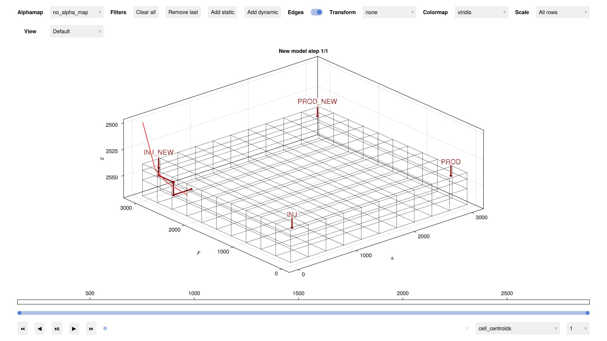
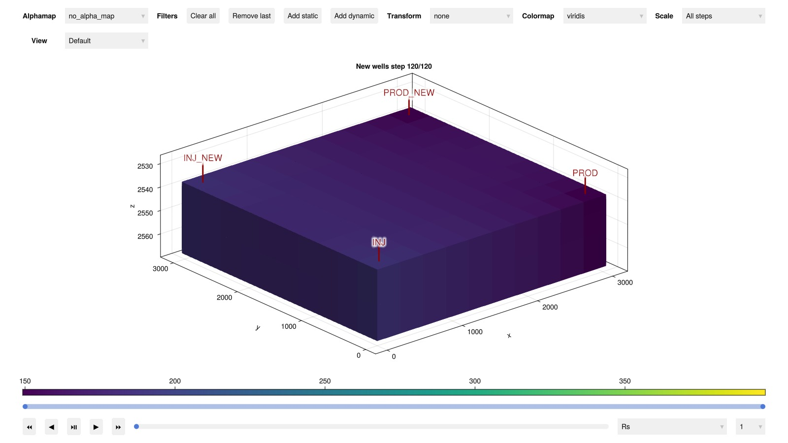
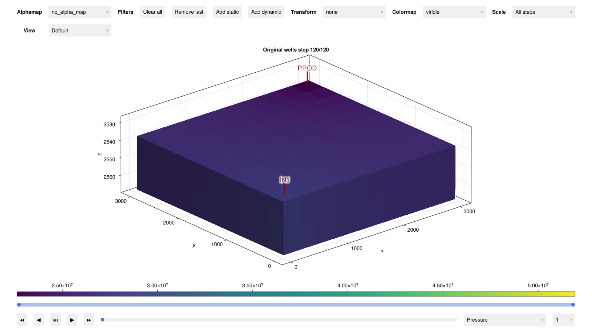
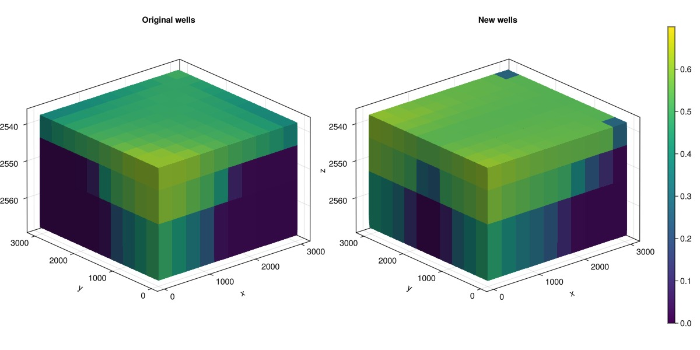

# Adding new wells to an existing model {#Adding-new-wells-to-an-existing-model}

Taking an existing reservoir model and modifying it with new wells is a typical operation in reservoir simulation. This example demonstrates how to add new wells to an existing model and a few ways to setup these wells.

The example uses the SPE1 data set as the model. We load the dataset as a `JutulCase` as usual and unpack the parts of the problem from the `case` before simulating the base case.

```julia
using Jutul, JutulDarcy, GLMakie
spe1_pth = JutulDarcy.GeoEnergyIO.test_input_file_path("SPE1", "SPE1.DATA")
case = setup_case_from_data_file(spe1_pth)
(; model, state0, forces, parameters, dt) = case
ws, states = simulate_reservoir(case)
```


```
ReservoirSimResult with 120 entries:

  wells (2 present):
    :INJ
    :PROD
    Results per well:
       :wrat => Vector{Float64} of size (120,)
       :Aqueous_mass_rate => Vector{Float64} of size (120,)
       :orat => Vector{Float64} of size (120,)
       :bhp => Vector{Float64} of size (120,)
       :gor => Vector{Float64} of size (120,)
       :lrat => Vector{Float64} of size (120,)
       :mass_rate => Vector{Float64} of size (120,)
       :rate => Vector{Float64} of size (120,)
       :Vapor_mass_rate => Vector{Float64} of size (120,)
       :control => Vector{Symbol} of size (120,)
       :Liquid_mass_rate => Vector{Float64} of size (120,)
       :wcut => Vector{Float64} of size (120,)
       :grat => Vector{Float64} of size (120,)

  states (Vector with 120 entries, reservoir variables for each state)
    :BlackOilUnknown => Vector{BlackOilX{Float64}} of size (300,)
    :Saturations => Matrix{Float64} of size (3, 300)
    :Pressure => Vector{Float64} of size (300,)
    :Rs => Vector{Float64} of size (300,)
    :ImmiscibleSaturation => Vector{Float64} of size (300,)
    :TotalMasses => Matrix{Float64} of size (3, 300)

  time (report time for each state)
     Vector{Float64} of length 120

  result (extended states, reports)
     SimResult with 120 entries

  extra
     Dict{Any, Any} with keys :simulator, :config

  Completed at May. 20 2025 23:05 after 786 milliseconds, 137 microseconds, 654 nanoseconds.
```


## Replacing the existing wells with new wells with the same name {#Replacing-the-existing-wells-with-new-wells-with-the-same-name}

The simplest way to replace a well is to create a new well with the same name so that the new well replaces the old one. This is done by calling the setup routines and using the same name as the original wells. We place one injector and one producer, using the same names as in the original version of the case.

Here, we make use of the `setup_well` function to create the new wells and use the cell indices directly.

```julia
reservoir = reservoir_domain(model)
I1 = setup_well(reservoir, 1, name = :INJ)
P1 = setup_well(reservoir, 10, name = :PROD)
```


```
SimpleWell [PROD] (1 nodes, 0 segments, 1 perforations)
```


## Add a new producer as multisegment well {#Add-a-new-producer-as-multisegment-well}

We can also add more wells than originally present by adding new wells with new names. Some care will have to be taken later on to ensure that these wells have valid control and limits. We pick a cell with a IJK index to place this producer.

```julia
P2 = setup_well(reservoir, (10, 10, 1), name = :PROD_NEW, simple_well = false)
```


```
MultiSegmentWell [PROD_NEW] (2 nodes, 1 segments, 1 perforations)
```


## Add a new injector with a trajectory {#Add-a-new-injector-with-a-trajectory}

An alternative to placing wells by cell index is to place them by trajectory. We can define a trajectory as a set of points in 3D space, here represented as a Matrix with three columns where each row represents a point along the trajectory. The trajectory is then used to discretize the well into cells.

```julia
traj = [
    50.0 3100.0 2500.0;
    56.0 2850.0 2540.0;
    120.0 2680.0 2550.0;
    400.0 2600.0 2565.0
]
I2 = setup_well_from_trajectory(reservoir, traj, name = :INJ_NEW)
```


```
SimpleWell [INJ_NEW] (1 nodes, 0 segments, 5 perforations)
```


## Set up the new model {#Set-up-the-new-model}

The new model is set up by calling the `setup_reservoir_model` function with the old model as the template. This function will create a new model with the same properties and customizations as the original model, but with the new wells added. The template model takes the place of the `sys` argument seen in other examples.

```julia
new_model, new_parameters = setup_reservoir_model(reservoir, model, wells = [I1, I2, P1, P2]);
```


## Visualize the new wells and the trajectory {#Visualize-the-new-wells-and-the-trajectory}

We can see the new wells and the trajectory by plotting the model. Note that the trajectory is connected to cell centers in the numerical model. The coarse resolution of the model makes the trajectory appear jagged when realized along cells.

```julia
fig = plot_reservoir(new_model, title = "New model", alpha = 0.0, edge_color = :black)
lines!(fig.current_axis[], traj', color = :red)
fig
```



## Setup a new state and forces {#Setup-a-new-state-and-forces}

The new state and forces are set up in the same way as the original model, using the previous state0 and forces as templates. The new control and limits are duplicated from the old ones, mapping producer controls and limits to producers and injector controls and limits to injectors.

We keep the controls of the wells constant throughout the simulation, but we could also have made a `forces` Vector with one value per step.

```julia
new_state0 = setup_reservoir_state(new_model, state0)

new_control = Dict()
new_limits = Dict()

facility_forces = forces[1][:Facility]

ictrl = facility_forces.control[:INJ]
ilims = facility_forces.limits[:INJ]

pctrl = facility_forces.control[:PROD]
plims = facility_forces.limits[:PROD]

new_control[:INJ] = ictrl
new_control[:PROD] = pctrl
new_limits[:INJ] = ilims
new_limits[:PROD] = plims

new_control[:INJ_NEW] = ictrl
new_limits[:INJ_NEW] = ilims

new_control[:PROD_NEW] = pctrl
new_limits[:PROD_NEW] = plims

new_forces = setup_reservoir_forces(new_model, control = new_control, limits = new_limits)
```


```
Dict{Symbol, Any} with 6 entries:
  :INJ       => (mask = nothing,)
  :PROD      => (mask = nothing,)
  :PROD_NEW  => (mask = nothing,)
  :Reservoir => (bc = nothing, sources = nothing)
  :Facility  => (control = Dict{Any, Any}(:INJ=>InjectorControl{TotalRateTarget…
  :INJ_NEW   => (mask = nothing,)
```


## Simulate the new case {#Simulate-the-new-case}

```julia
new_ws, new_states = simulate_reservoir(new_state0, new_model, dt, forces = new_forces, parameters = new_parameters)
```


```
ReservoirSimResult with 120 entries:

  wells (4 present):
    :INJ
    :PROD
    :PROD_NEW
    :INJ_NEW
    Results per well:
       :wrat => Vector{Float64} of size (120,)
       :Aqueous_mass_rate => Vector{Float64} of size (120,)
       :orat => Vector{Float64} of size (120,)
       :bhp => Vector{Float64} of size (120,)
       :gor => Vector{Float64} of size (120,)
       :lrat => Vector{Float64} of size (120,)
       :mass_rate => Vector{Float64} of size (120,)
       :rate => Vector{Float64} of size (120,)
       :Vapor_mass_rate => Vector{Float64} of size (120,)
       :control => Vector{Symbol} of size (120,)
       :Liquid_mass_rate => Vector{Float64} of size (120,)
       :wcut => Vector{Float64} of size (120,)
       :grat => Vector{Float64} of size (120,)

  states (Vector with 120 entries, reservoir variables for each state)
    :BlackOilUnknown => Vector{BlackOilX{Float64}} of size (300,)
    :Saturations => Matrix{Float64} of size (3, 300)
    :Pressure => Vector{Float64} of size (300,)
    :Rs => Vector{Float64} of size (300,)
    :ImmiscibleSaturation => Vector{Float64} of size (300,)
    :TotalMasses => Matrix{Float64} of size (3, 300)

  time (report time for each state)
     Vector{Float64} of length 120

  result (extended states, reports)
     SimResult with 120 entries

  extra
     Dict{Any, Any} with keys :simulator, :config

  Completed at May. 20 2025 23:05 after 10 seconds, 566 milliseconds, 506.2 microseconds.
```


## Visualize the results {#Visualize-the-results}

We can visualize the results of the new model and the old model

```julia
plot_reservoir(new_model, new_states, title = "New wells", step = 120, key = :Rs)
```



## We can also visualize the original model for comparison {#We-can-also-visualize-the-original-model-for-comparison}

```julia
plot_reservoir(model, states, title = "Original wells", step = 120, key = :Pressure)
```



## Side by side comparison {#Side-by-side-comparison}

```julia
g = physical_representation(reservoir)
fig = Figure(size = (1200, 600))
ax = Axis3(fig[1, 1], zreversed = true, title = "Original wells")
plt = plot_cell_data!(ax, g, states[120][:Saturations][3, :], colorrange = (0.0, 0.7))
ax = Axis3(fig[1, 2], zreversed = true, title = "New wells")
plot_cell_data!(ax, g, new_states[120][:Saturations][3, :], colorrange = (0.0, 0.7))
Colorbar(fig[1, 3], plt)
fig
```



## Example on GitHub {#Example-on-GitHub}

If you would like to run this example yourself, it can be downloaded from the JutulDarcy.jl GitHub repository [as a script](https://github.com/sintefmath/JutulDarcy.jl/blob/main/examples/workflow/adding_new_wells.jl), or as a [Jupyter Notebook](https://github.com/sintefmath/JutulDarcy.jl/blob/gh-pages/dev/final_site/notebooks/workflow/adding_new_wells.ipynb)

```
This example took 34.685093018 seconds to complete.
```


---


_This page was generated using [Literate.jl](https://github.com/fredrikekre/Literate.jl)._
