# CO2 injection in saline aquifer with storage inventory {#CO2-injection-in-saline-aquifer-with-storage-inventory}

This example demonstrates a custom K-value compositional model for the injection of CO2 into a saline aquifer. The physical model for flow of CO2 is a realization of the description in [11th SPE Comparative Solutions Project](https://spe.org/en/csp/). Simulation of CO2 can be challenging, and we load the HYPRE package to improve performance.

The model also has an option to run immiscible simulations with otherwise identical PVT behavior. This is often faster to run, but lacks the dissolution model present in the compositional version (i.e. no solubility of CO2 in brine, and no vaporization of water in the vapor phase).

```julia
use_immiscible = false
using Jutul, JutulDarcy
using HYPRE
using GLMakie
nx = 100
nz = 50
Darcy, bar, kg, meter, day, yr = si_units(:darcy, :bar, :kilogram, :meter, :day, :year)
```


```
(9.86923266716013e-13, 100000.0, 1.0, 1.0, 86400.0, 3.1556952e7)
```


## Set up a 2D aquifer model {#Set-up-a-2D-aquifer-model}

We set up a Cartesian mesh that is then transformed into an unstructured mesh. We can then modify the coordinates to create a domain with a undulating top surface. CO2 will flow along the top surface and the topography of the top surface has a large impact on where the CO2 migrates.

```julia
cart_dims = (nx, 1, nz)
physical_dims = (1000.0, 1.0, 50.0)
cart_mesh = CartesianMesh(cart_dims, physical_dims)
mesh = UnstructuredMesh(cart_mesh, z_is_depth = true)

points = mesh.node_points
for (i, pt) in enumerate(points)
    x, y, z = pt
    x_u = 2*π*x/1000.0
    w = 0.2
    dz = 0.05*x + 0.05*abs(x - 500.0)+ w*(30*sin(2.0*x_u) + 20*sin(5.0*x_u))
    points[i] = pt + [0, 0, dz]
end;
```


## Find and plot cells intersected by a deviated injector well {#Find-and-plot-cells-intersected-by-a-deviated-injector-well}

We place a single injector well. This well was unfortunately not drilled completely straight, so we cannot directly use `add_vertical_well` based on logical indices. We instead define a matrix with three columns x, y, z that lie on the well trajectory and use utilities from `Jutul` to find the cells intersected by the trajectory.

```julia
import Jutul: find_enclosing_cells, plot_mesh_edges
trajectory = [
    645.0 0.5 75;    # First point
    660.0 0.5 85;    # Second point
    710.0 0.5 100.0  # Third point
]

wc = find_enclosing_cells(mesh, trajectory)

fig, ax, plt = plot_mesh_edges(mesh)
plot_mesh!(ax, mesh, cells = wc, transparency = true, alpha = 0.4)
```


```
MakieCore.Mesh{Tuple{GeometryBasics.Mesh{3, Float64, GeometryBasics.NgonFace{3, GeometryBasics.OffsetInteger{-1, UInt32}}, (:position, :normal), Tuple{Vector{GeometryBasics.Point{3, Float64}}, Vector{GeometryBasics.Vec{3, Float32}}}, Vector{GeometryBasics.NgonFace{3, GeometryBasics.OffsetInteger{-1, UInt32}}}}}}
```


View from the side

```julia
ax.azimuth[] = 1.5*π
ax.elevation[] = 0.0
lines!(ax, trajectory', color = :red)
fig
```

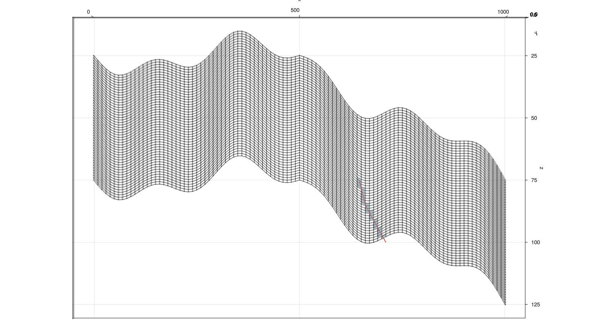

## Define permeability and porosity {#Define-permeability-and-porosity}

We loop over all cells and define three layered regions by the K index of each cell. We can then set a corresponding diagonal permeability tensor (3 values) and porosity (scalar) to introduce variation between the layers.

```julia
nc = number_of_cells(mesh)
perm = zeros(3, nc)
poro = fill(0.3, nc)
region = zeros(Int, nc)
for cell in 1:nc
    I, J, K = cell_ijk(mesh, cell)
    if K < 0.3*nz
        reg = 1
        permxy = 0.3*Darcy
        phi = 0.2
    elseif K < 0.7*nz
        reg = 2
        permxy = 1.2*Darcy
        phi = 0.35
    else
        reg = 3
        permxy = 0.1*Darcy
        phi = 0.1
    end
    permz = 0.5*permxy
    perm[1, cell] = perm[2, cell] = permxy
    perm[3, cell] = permz
    poro[cell] = phi
    region[cell] = reg
end

fig, ax, plt = plot_cell_data(mesh, poro)
fig
```

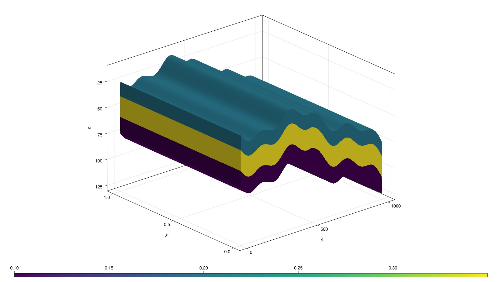

## Set up simulation model {#Set-up-simulation-model}

We set up a domain and a single injector. We pass the special :co2brine argument in place of the system to the reservoir model setup routine. This will automatically set up a compositional two-component CO2-H2O model with the appropriate functions for density, viscosity and miscibility.

Note that this model by default is isothermal, but we still need to specify a temperature when setting up the model. This is because the properties of CO2 strongly depend on temperature, even when thermal transport is not solved.

The model also accounts for a constant, reservoir-wide salinity. We input mole fractions of salts in the brine so that the solubilities, densities and viscosities for brine cells are corrected in the property model.

```julia
domain = reservoir_domain(mesh, permeability = perm, porosity = poro, temperature = convert_to_si(60.0, :Celsius))
Injector = setup_well(domain, wc, name = :Injector, simple_well = true)

if use_immiscible
    physics = :immiscible
else
    physics = :kvalue
end
model = setup_reservoir_model(domain, :co2brine,
    wells = Injector,
    extra_out = false,
    salt_names = ["NaCl", "KCl", "CaSO4", "CaCl2", "MgSO4", "MgCl2"],
    salt_mole_fractions = [0.01, 0.005, 0.005, 0.001, 0.0002, 1e-5],
    co2_physics = physics
);
```


## Customize model by adding relative permeability with hysteresis {#Customize-model-by-adding-relative-permeability-with-hysteresis}

We define three relative permeability functions: kro(so) for the brine/liquid phase and krg(g) for both drainage and imbibition. Here we limit the hysteresis to only the non-wetting gas phase, but either combination of wetting or non-wetting hysteresis is supported.

Note that we import a few utilities from JutulDarcy that are not exported by default since hysteresis falls under advanced functionality.

```julia
import JutulDarcy: table_to_relperm, add_relperm_parameters!, brooks_corey_relperm
so = range(0, 1, 10)
krog_t = so.^2
krog = PhaseRelativePermeability(so, krog_t, label = :og)
```


```
PhaseRelativePermeability for og:
  .k: Internal representation: Jutul.LinearInterpolant{Vector{Float64}, Vector{Float64}, Missing}([-1.0e-16, 0.1111111111111111, 0.2222222222222222, 0.3333333333333333, 0.4444444444444444, 0.5555555555555556, 0.6666666666666666, 0.7777777777777778, 0.8888888888888887, 1.0], [0.0, 0.012345679012345678, 0.04938271604938271, 0.1111111111111111, 0.19753086419753085, 0.308641975308642, 0.4444444444444444, 0.6049382716049383, 0.7901234567901234, 1.0], missing)
  Connate saturation = 0.0
  Critical saturation = 0.0
  Maximum rel. perm = 1.0 at 1.0

```


Higher resolution for second table:

```julia
sg = range(0, 1, 50);
```


Evaluate Brooks-Corey to generate tables:

```julia
tab_krg_drain = brooks_corey_relperm.(sg, n = 2, residual = 0.1)
tab_krg_imb = brooks_corey_relperm.(sg, n = 3, residual = 0.25)

krg_drain  = PhaseRelativePermeability(sg, tab_krg_drain, label = :g)
krg_imb  = PhaseRelativePermeability(sg, tab_krg_imb, label = :g)

fig, ax, plt = lines(sg, tab_krg_drain, label = "krg drainage")
lines!(ax, sg, tab_krg_imb, label = "krg imbibition")
lines!(ax, 1 .- so, krog_t, label = "kro")
axislegend()
fig
# Define a relative permeability variable
```

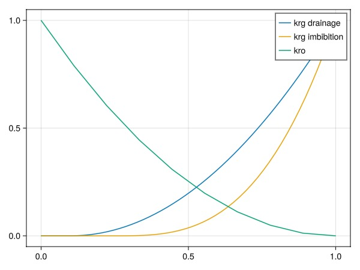

JutulDarcy uses type instances to define how different variables inside the simulation are evaluated. The `ReservoirRelativePermeabilities` type has support for up to three phases with w, ow, og and g relative permeabilities specified as a function of their respective phases. It also supports saturation regions.

Note: If regions are used, all drainage curves come first followed by equal number of imbibition curves. Since we only have a single (implicit) saturation region, the krg input should have two entries: One for drainage, and one for imbibition.

We also call `add_relperm_parameters` to the model. This makes sure that when hysteresis is enabled, we track maximum saturation for hysteresis in each reservoir cell.

```julia
import JutulDarcy: KilloughHysteresis, ReservoirRelativePermeabilities
krg = (krg_drain, krg_imb)
H_g = KilloughHysteresis() # Other options: CarlsonHysteresis, JargonHysteresis
relperm = ReservoirRelativePermeabilities(g = krg, og = krog, hysteresis_g = H_g)
replace_variables!(model, RelativePermeabilities = relperm)
add_relperm_parameters!(model);
```


## Define approximate hydrostatic pressure and set up initial state {#Define-approximate-hydrostatic-pressure-and-set-up-initial-state}

The initial pressure of the water-filled domain is assumed to be at hydrostatic equilibrium. If we use an immiscible model, we must provide the initial saturations. If we are using a compositional model, we should instead provide the overall mole fractions. Note that since both are fractions, and the CO2 model has correspondence between phase ordering and component ordering (i.e. solves for liquid and vapor, and H2O and CO2), we can use the same input value.

```julia
nc = number_of_cells(mesh)
p0 = zeros(nc)
depth = domain[:cell_centroids][3, :]
g = Jutul.gravity_constant
@. p0 = 160bar + depth*g*1000.0
fig, ax, plt = plot_cell_data(mesh, p0)
fig
```

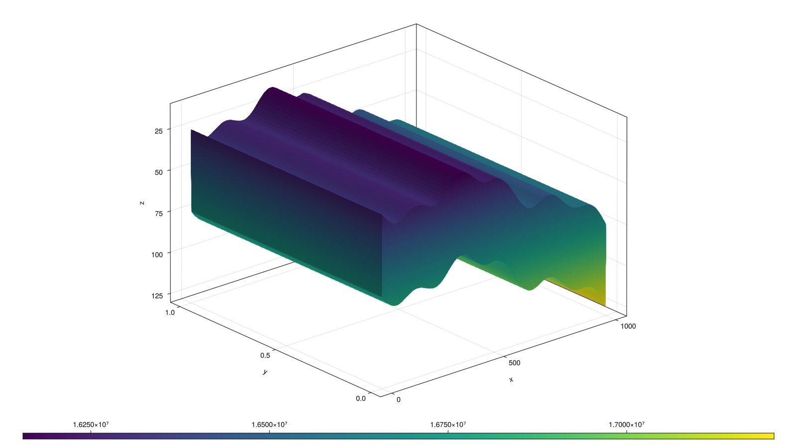

Set up initial state and parameters

```julia
if use_immiscible
    state0 = setup_reservoir_state(model,
        Pressure = p0,
        Saturations = [1.0, 0.0],
    )
else
    state0 = setup_reservoir_state(model,
        Pressure = p0,
        OverallMoleFractions = [1.0, 0.0],
    )
end
parameters = setup_parameters(model)
```


```
Dict{Symbol, Any} with 3 entries:
  :Injector  => Dict{Symbol, Any}(:FluidVolume=>[0.0630954], :WellIndicesTherma…
  :Reservoir => Dict{Symbol, Any}(:Transmissibilities=>[2.85521e-14, 2.87444e-1…
  :Facility  => Dict{Symbol, Any}()
```


## Find the boundary and apply a constant pressureboundary condition {#Find-the-boundary-and-apply-a-constant-pressureboundary-condition}

We find cells on the left and right boundary of the model and set a constant pressure boundary condition to represent a bounding aquifer that retains the initial pressure far away from injection.

```julia
boundary = Int[]
for cell in 1:nc
    I, J, K = cell_ijk(mesh, cell)
    if I == 1 || I == nx
        push!(boundary, cell)
    end
end
bc = flow_boundary_condition(boundary, domain, p0[boundary], fractional_flow = [1.0, 0.0])
println("Boundary condition added to $(length(bc)) cells.")
```


```
Boundary condition added to 100 cells.
```


## Plot the model {#Plot-the-model}

```julia
plot_reservoir(model)
```

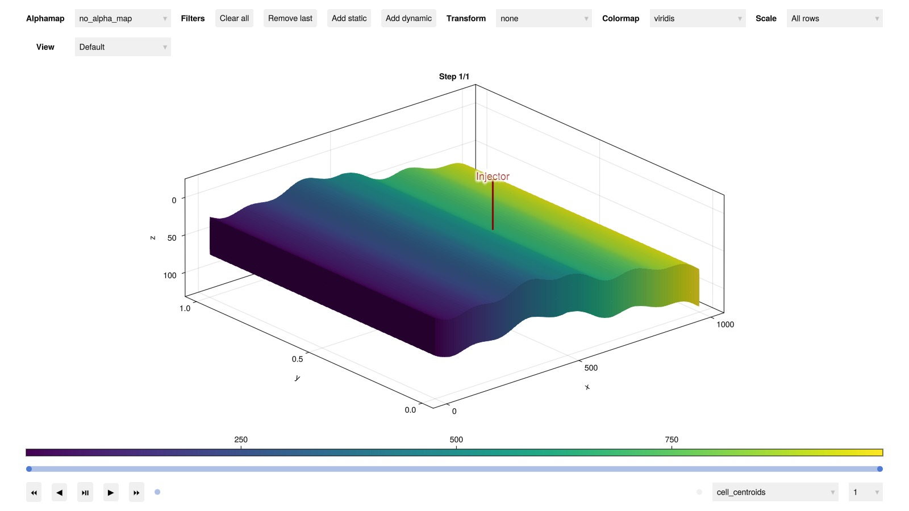

## Set up schedule {#Set-up-schedule}

We set up 25 years of injection and 475 years of migration where the well is shut. The density of the injector is set to 630 kg/m^3, which is roughly the density of CO2 at the in-situ conditions.

```julia
nstep = 25
nstep_shut = 475
dt_inject = fill(365.0day, nstep)
pv = pore_volume(model, parameters)
inj_rate = 0.075*sum(pv)/sum(dt_inject)

rate_target = TotalRateTarget(inj_rate)
I_ctrl = InjectorControl(rate_target, [0.0, 1.0],
    density = 630.0,
)
```


```
InjectorControl{TotalRateTarget{Float64}, Float64, Tuple{Tuple{Int64, Float64}}, Vector{Float64}, Missing, Missing}(TotalRateTarget with value 1.084474885844749e-6 [m^3/s], [0.0, 1.0], 630.0, ((1, 1.0),), 293.15, missing, 1.0, missing)
```


Set up forces for use in injection

```julia
controls = Dict(:Injector => I_ctrl)
forces_inject = setup_reservoir_forces(model, control = controls, bc = bc)
```


```
Dict{Symbol, Any} with 3 entries:
  :Injector  => (mask = nothing,)
  :Reservoir => (bc = FlowBoundaryCondition{Int64, Float64, Tuple{Float64, Floa…
  :Facility  => (control = Dict{Symbol, InjectorControl{TotalRateTarget{Float64…
```


Forces with shut wells

```julia
forces_shut = setup_reservoir_forces(model, bc = bc)
dt_shut = fill(365.0day, nstep_shut);
```


Combine the report steps and forces into vectors of equal length

```julia
dt = vcat(dt_inject, dt_shut)
forces = vcat(
    fill(forces_inject, nstep),
    fill(forces_shut, nstep_shut)
)
println("$nstep report steps with injection, $nstep_shut report steps with migration.")
```


```
25 report steps with injection, 475 report steps with migration.
```


## Add some more outputs for plotting {#Add-some-more-outputs-for-plotting}

```julia
rmodel = reservoir_model(model)
push!(rmodel.output_variables, :RelativePermeabilities)
push!(rmodel.output_variables, :PhaseViscosities)
```


```
9-element Vector{Symbol}:
 :Pressure
 :OverallMoleFractions
 :TotalMasses
 :LiquidMassFractions
 :VaporMassFractions
 :Saturations
 :PhaseMassDensities
 :RelativePermeabilities
 :PhaseViscosities
```


## Simulate the schedule {#Simulate-the-schedule}

We set a maximum internal time-step of 30 days to ensure smooth convergence and reduce numerical diffusion.

```julia
wd, states, t = simulate_reservoir(state0, model, dt,
    parameters = parameters,
    forces = forces,
    max_timestep = 90day
);
```


```
Jutul: Simulating 499 years, 34.86 weeks as 500 report steps
╭────────────────┬───────────┬────────────────┬──────────────╮
│ Iteration type │  Avg/step │   Avg/ministep │        Total │
│                │ 500 steps │ 2572 ministeps │     (wasted) │
├────────────────┼───────────┼────────────────┼──────────────┤
│ Newton         │      8.98 │        1.74572 │   4490 (375) │
│ Linearization  │    14.124 │        2.74572 │   7062 (400) │
│ Linear solver  │    39.442 │        7.66757 │ 19721 (1399) │
│ Precond apply  │    78.884 │        15.3351 │ 39442 (2798) │
╰────────────────┴───────────┴────────────────┴──────────────╯
╭───────────────┬─────────┬────────────┬─────────╮
│ Timing type   │    Each │   Relative │   Total │
│               │      ms │ Percentage │       s │
├───────────────┼─────────┼────────────┼─────────┤
│ Properties    │  1.9274 │    13.48 % │  8.6541 │
│ Equations     │  0.9998 │    10.99 % │  7.0606 │
│ Assembly      │  0.6209 │     6.83 % │  4.3849 │
│ Linear solve  │  0.7539 │     5.27 % │  3.3850 │
│ Linear setup  │  3.4890 │    24.39 % │ 15.6654 │
│ Precond apply │  0.3938 │    24.18 % │ 15.5322 │
│ Update        │  0.2195 │     1.53 % │  0.9854 │
│ Convergence   │  0.4420 │     4.86 % │  3.1217 │
│ Input/Output  │  0.0746 │     0.30 % │  0.1919 │
│ Other         │  1.1674 │     8.16 % │  5.2417 │
├───────────────┼─────────┼────────────┼─────────┤
│ Total         │ 14.3035 │   100.00 % │ 64.2229 │
╰───────────────┴─────────┴────────────┴─────────╯
```


## Plot the CO2 mole fraction {#Plot-the-CO2-mole-fraction}

We plot the overall CO2 mole fraction. We scale the color range to log10 to account for the fact that the mole fraction in cells made up of only the aqueous phase is much smaller than that of cells with only the gaseous phase, where there is almost just CO2.

The aquifer gives some degree of passive flow through the domain, ensuring that much of the dissolved CO2 will leave the reservoir by the end of the injection period.

```julia
using GLMakie
function plot_co2!(fig, ix, x, title = "")
    ax = Axis3(fig[ix, 1],
        zreversed = true,
        azimuth = -0.51π,
        elevation = 0.05,
        aspect = (1.0, 1.0, 0.3),
        title = title)
    plt = plot_cell_data!(ax, mesh, x, colormap = :seaborn_icefire_gradient)
    Colorbar(fig[ix, 2], plt)
end
fig = Figure(size = (900, 1200))
for (i, step) in enumerate([5, nstep, nstep + Int(floor(nstep_shut/2)), nstep+nstep_shut])
    if use_immiscible
        plot_co2!(fig, i, states[step][:Saturations][2, :], "CO2 plume saturation at report step $step/$(nstep+nstep_shut)")
    else
        plot_co2!(fig, i, log10.(states[step][:OverallMoleFractions][2, :]), "log10 of CO2 mole fraction at report step $step/$(nstep+nstep_shut)")
    end
end
fig
```

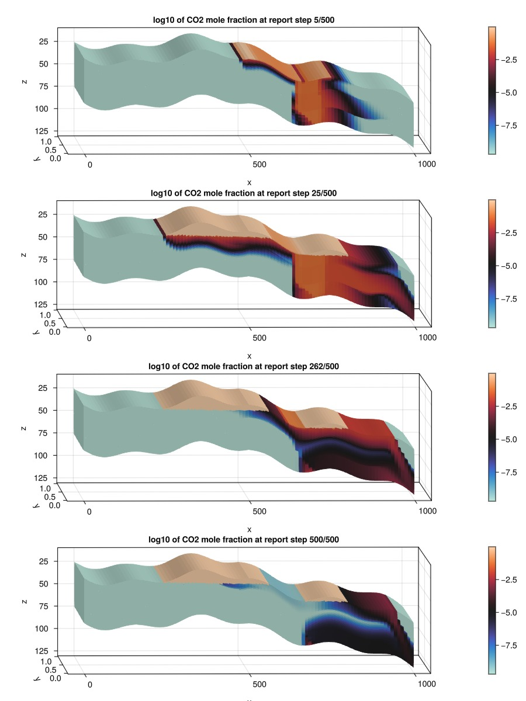

## Plot all relative permeabilities for all time-steps {#Plot-all-relative-permeabilities-for-all-time-steps}

We can plot all relative permeability evaluations. This both verifies that the hysteresis model is active, but also gives an indication to how many cells are exhibiting imbibition during the simulation.

```julia
kro_val = Float64[]
krg_val = Float64[]
sg_val = Float64[]
for state in states
    kr_state = state[:RelativePermeabilities]
    s_state = state[:Saturations]
    for c in 1:nc
        push!(kro_val, kr_state[1, c])
        push!(krg_val, kr_state[2, c])
        push!(sg_val, s_state[2, c])
    end
end

fig = Figure()
ax = Axis(fig[1, 1], title = "Relative permeability during simulation")
fig, ax, plt = scatter(sg_val, kro_val, label = "kro", alpha = 0.3)
scatter!(ax, sg_val, krg_val, label = "krg", alpha = 0.3)
axislegend()
fig
```

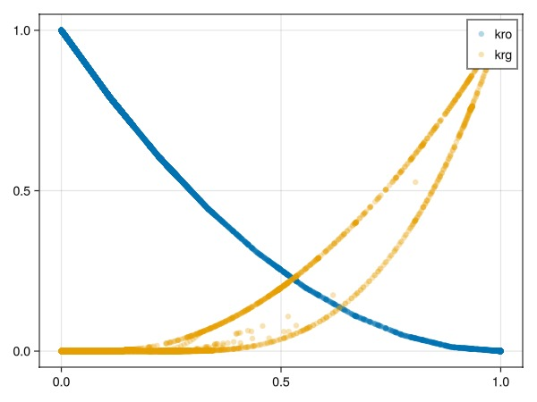

## Plot result in interactive viewer {#Plot-result-in-interactive-viewer}

If you have interactive plotting available, you can explore the results yourself.

```julia
plot_reservoir(model, states)
# Calculate and display inventory of CO2
```

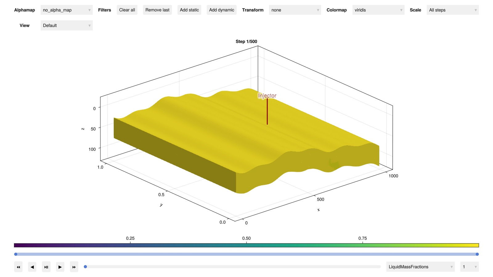

We can classify and plot the status of the CO2 in the reservoir. We use a fairly standard classification where CO2 is divided into:
- dissolved CO2 (dissolution trapping)
  
- residual CO2 (immobile due to zero relative permeability, residual trapping)
  
- mobile CO2 (mobile but still inside domain)
  
- outside domain (left the simulation model and migrated outside model)
  

We also note that some of the mobile CO2 could be considered to be structurally trapped, but this is not classified in our inventory.

```julia
inventory = co2_inventory(model, wd, states, t)
JutulDarcy.plot_co2_inventory(t, inventory)
```

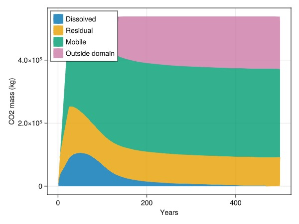

## Pick a region to investigate the CO2 {#Pick-a-region-to-investigate-the-CO2}

We can also specify a region to the CO2 inventory. This will introduce additional categories to distinguish between outside and inside the region of interest.

```julia
cells = findall(region .== 2)
inventory = co2_inventory(model, wd, states, t, cells = cells)
JutulDarcy.plot_co2_inventory(t, inventory)
```

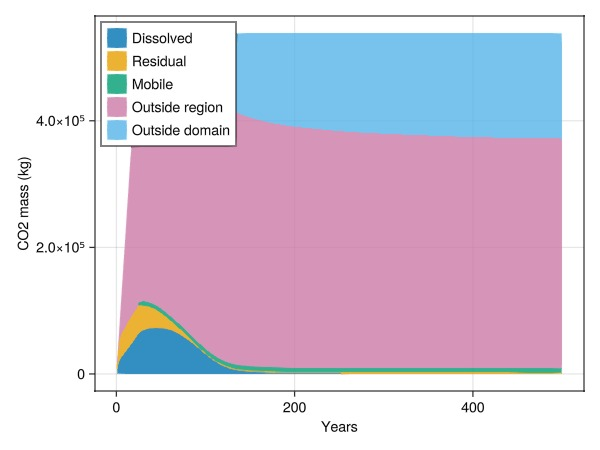

## Define a region of interest using geometry {#Define-a-region-of-interest-using-geometry}

Another alternative to determine a region of interest is to use geometry. We pick all cells within an ellipsoid a bit away from the injection point.

```julia
is_inside = fill(false, nc)
centers = domain[:cell_centroids]
for cell in 1:nc
    x, y, z = centers[:, cell]
    is_inside[cell] = sqrt((x - 720.0)^2 + 20*(z-70.0)^2) < 75
end
fig, ax, plt = plot_cell_data(mesh, is_inside)
fig
```

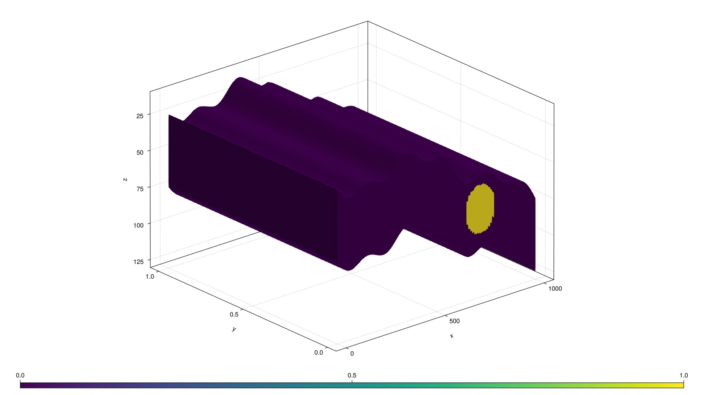

## Plot inventory in ellipsoid {#Plot-inventory-in-ellipsoid}

Note that a small mobile dip can be seen when free CO2 passes through this region.

```julia
inventory = co2_inventory(model, wd, states, t, cells = findall(is_inside))
JutulDarcy.plot_co2_inventory(t, inventory)
```

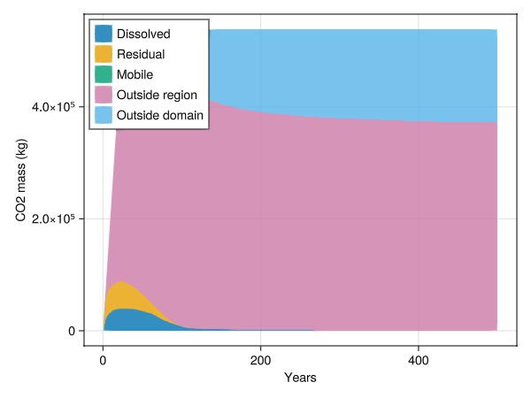

## Plot the average pressure in the ellipsoid region {#Plot-the-average-pressure-in-the-ellipsoid-region}

Now that we know what cells are within the region of interest, we can easily apply a function over all time-steps to figure out what the average pressure value was.

```julia
using Statistics
p_avg = map(
    state -> mean(state[:Pressure][is_inside])./bar,
    states
)
lines(t./yr, p_avg,
    axis = (
        title = "Average pressure in region",
        xlabel = "Years", ylabel = "Pressure (bar)"
    )
)
```

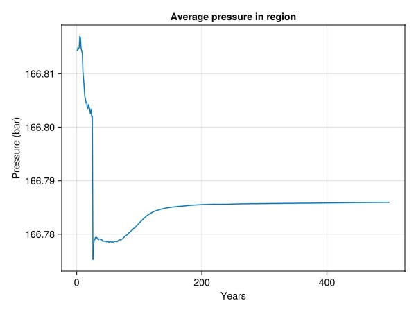

## Make a composite plot to correlate CO2 mass in region with spatial distribution {#Make-a-composite-plot-to-correlate-CO2-mass-in-region-with-spatial-distribution}

We create a pair of plots that combine both 2D and 3D plots to simultaneously show the ellipsoid, the mass of CO2 in that region for a specific step, and the time series of the CO2 in the same region.

```julia
stepno = 30
co2_mass_in_region = map(
    state -> sum(state[:TotalMasses][2, is_inside])/1e3,
    states
)
fig = Figure(size = (1200, 600))
ax1 = Axis(fig[1, 1],
    title = "Mass of CO2 in region",
    xlabel = "Years",
    ylabel = "Tonnes CO2"
)
lines!(ax1, t./yr, co2_mass_in_region)
scatter!(ax1, t[stepno]./yr, co2_mass_in_region[stepno], markersize = 12, color = :red)
ax2 = Axis3(fig[1, 2], zreversed = true)
plot_cell_data!(ax2, mesh, states[stepno][:TotalMasses][2, :])
plot_mesh!(ax2, mesh, cells = findall(is_inside), alpha = 0.5)
ax2.azimuth[] = 1.5*π
ax2.elevation[] = 0.0
fig
```

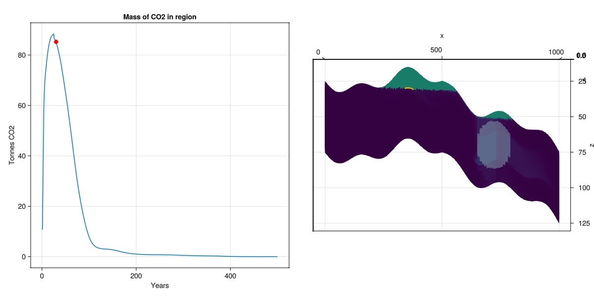

## Example on GitHub {#Example-on-GitHub}

If you would like to run this example yourself, it can be downloaded from the JutulDarcy.jl GitHub repository [as a script](https://github.com/sintefmath/JutulDarcy.jl/blob/main/examples/workflow/co2_sloped.jl), or as a [Jupyter Notebook](https://github.com/sintefmath/JutulDarcy.jl/blob/gh-pages/dev/final_site/notebooks/workflow/co2_sloped.ipynb)

```
This example took 248.69711981 seconds to complete.
```


---


_This page was generated using [Literate.jl](https://github.com/fredrikekre/Literate.jl)._
