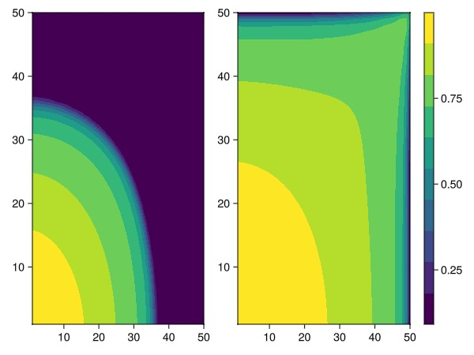
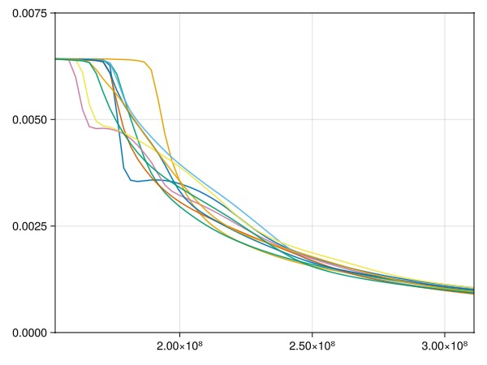
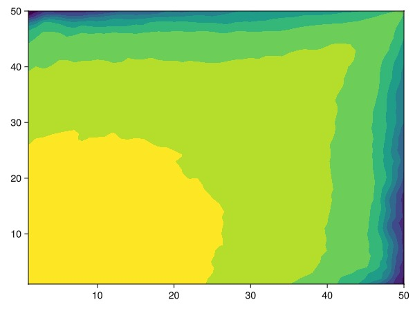
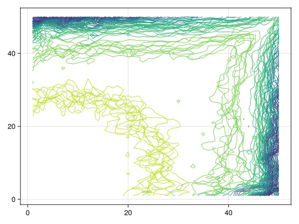

# Quarter-five-spot example {#Quarter-five-spot-example}

The quarter-five-spot is a standard test problem that simulates 1/4 of the five spot well pattern by assuming axial symmetry. The problem contains an injector in one corner and the producer in the opposing corner, with a significant volume of fluids injected into the domain.

```julia
using JutulDarcy, Jutul
nx = 50;
```


## Setup {#Setup}

We define a function that, for a given porosity field, computes a solution with an estimated permeability field. For assumptions and derivation of the specific form of the Kozeny-Carman relation used in this example, see [Lie, Knut-Andreas. An introduction to reservoir simulation using MATLAB/GNU Octave: User guide for the MATLAB Reservoir Simulation Toolbox (MRST). Cambridge University Press, 2019, Section 2.5.2](https://doi.org/10.1017/9781108591416)

```julia
function perm_kozeny_carman(Φ)
    return ((Φ^3)*(1e-5)^2)/(0.81*72*(1-Φ)^2);
end

function simulate_qfs(porosity = 0.2)
    Dx = 1000.0
    Dz = 10.0
    Darcy = 9.869232667160130e-13
    Darcy, bar, kg, meter, Kelvin, day, sec = si_units(:darcy, :bar, :kilogram, :meter, :Kelvin, :day, :second)

    mesh = CartesianMesh((nx, nx, 1), (Dx, Dx, Dz))
    K = perm_kozeny_carman.(porosity)
    domain = reservoir_domain(mesh, permeability = K, porosity = porosity)
    Inj = setup_vertical_well(domain, 1, 1, name = :Injector);
    Prod = setup_vertical_well(domain, nx, nx, name = :Producer);
    phases = (LiquidPhase(), VaporPhase())
    rhoLS = 1000.0*kg/meter^3
    rhoGS = 700.0*kg/meter^3
    rhoS = [rhoLS, rhoGS]
    sys = ImmiscibleSystem(phases, reference_densities = rhoS)
    model, parameters = setup_reservoir_model(domain, sys, wells = [Inj, Prod])
    c = [1e-6/bar, 1e-6/bar]
    ρ = ConstantCompressibilityDensities(p_ref = 150*bar, density_ref = rhoS, compressibility = c)
    kr = BrooksCoreyRelativePermeabilities(sys, [2.0, 2.0])
    replace_variables!(model, PhaseMassDensities = ρ, RelativePermeabilities = kr);

    state0 = setup_reservoir_state(model, Pressure = 150*bar, Saturations = [1.0, 0.0])
    dt = repeat([30.0]*day, 12*10)
    dt = vcat([0.1, 1.0, 10.0], dt)
    inj_rate = Dx*Dx*Dz*0.2/sum(dt) # 1 PVI if average porosity is 0.2

    rate_target = TotalRateTarget(inj_rate)
    I_ctrl = InjectorControl(rate_target, [0.0, 1.0], density = rhoGS)
    bhp_target = BottomHolePressureTarget(50*bar)
    P_ctrl = ProducerControl(bhp_target)
    controls = Dict()
    controls[:Injector] = I_ctrl
    controls[:Producer] = P_ctrl
    forces = setup_reservoir_forces(model, control = controls)
    return simulate_reservoir(state0, model, dt, parameters = parameters, forces = forces)
end
```


```
simulate_qfs (generic function with 2 methods)
```


## Simulate base case {#Simulate-base-case}

This will give the solution with uniform porosity of 0.2.

```julia
ws, states, report_time = simulate_qfs();
```


```
Jutul: Simulating 9 years, 44.69 weeks as 123 report steps
╭────────────────┬───────────┬───────────────┬──────────╮
│ Iteration type │  Avg/step │  Avg/ministep │    Total │
│                │ 123 steps │ 141 ministeps │ (wasted) │
├────────────────┼───────────┼───────────────┼──────────┤
│ Newton         │    3.3252 │       2.90071 │  409 (0) │
│ Linearization  │   4.47154 │       3.90071 │  550 (0) │
│ Linear solver  │   10.2358 │       8.92908 │ 1259 (0) │
│ Precond apply  │   20.4715 │       17.8582 │ 2518 (0) │
╰────────────────┴───────────┴───────────────┴──────────╯
╭───────────────┬────────┬────────────┬────────╮
│ Timing type   │   Each │   Relative │  Total │
│               │     ms │ Percentage │      s │
├───────────────┼────────┼────────────┼────────┤
│ Properties    │ 0.2410 │     5.35 % │ 0.0986 │
│ Equations     │ 0.2194 │     6.55 % │ 0.1207 │
│ Assembly      │ 0.2564 │     7.66 % │ 0.1410 │
│ Linear solve  │ 0.2973 │     6.60 % │ 0.1216 │
│ Linear setup  │ 1.8823 │    41.82 % │ 0.7699 │
│ Precond apply │ 0.1889 │    25.84 % │ 0.4756 │
│ Update        │ 0.0800 │     1.78 % │ 0.0327 │
│ Convergence   │ 0.0743 │     2.22 % │ 0.0409 │
│ Input/Output  │ 0.0461 │     0.35 % │ 0.0065 │
│ Other         │ 0.0821 │     1.82 % │ 0.0336 │
├───────────────┼────────┼────────────┼────────┤
│ Total         │ 4.5011 │   100.00 % │ 1.8410 │
╰───────────────┴────────┴────────────┴────────╯
```


### Plot the solution of the base case {#Plot-the-solution-of-the-base-case}

We observe a radial flow pattern initially, before coning occurs near the producer well once the fluid has reached the opposite corner. The uniform permeability and porosity gives axial symmetry at $x=y$.

```julia
using GLMakie
to_2d(x) = reshape(vec(x), nx, nx)
get_sat(state) = to_2d(state[:Saturations][2, :])
nt = length(report_time)
fig = Figure()
h = nothing
ax = Axis(fig[1, 1])
h = contourf!(ax, get_sat(states[nt÷3]))
ax = Axis(fig[1, 2])
h = contourf!(ax, get_sat(states[nt]))
Colorbar(fig[1, end+1], h)
fig
```



## Create 10 realizations {#Create-10-realizations}

We create a small set of realizations of the same model, with porosity that is uniformly varying between 0.05 and 0.3. This is not especially sophisticated geostatistics - for a more realistic approach, take a look at [GeoStats.jl](https://juliaearth.github.io/GeoStats.jl). The main idea is to get significantly different flow patterns as the porosity and permeability changes.

```julia
N = 10
saturations = []
wells = []
report_step = nt
for i = 1:N
    poro = 0.05 .+ 0.25*rand(Float64, (nx*nx))
    ws_i, states_i, rt = simulate_qfs(poro)
    push!(wells, ws_i)
    push!(saturations, get_sat(states_i[report_step]))
end
```


```
Jutul: Simulating 9 years, 44.69 weeks as 123 report steps
╭────────────────┬───────────┬───────────────┬─────────────╮
│ Iteration type │  Avg/step │  Avg/ministep │       Total │
│                │ 123 steps │ 245 ministeps │    (wasted) │
├────────────────┼───────────┼───────────────┼─────────────┤
│ Newton         │   10.7236 │       5.38367 │   1319 (30) │
│ Linearization  │   12.7154 │       6.38367 │   1564 (32) │
│ Linear solver  │   41.8211 │       20.9959 │  5144 (130) │
│ Precond apply  │   83.6423 │       41.9918 │ 10288 (260) │
╰────────────────┴───────────┴───────────────┴─────────────╯
╭───────────────┬────────┬────────────┬────────╮
│ Timing type   │   Each │   Relative │  Total │
│               │     ms │ Percentage │      s │
├───────────────┼────────┼────────────┼────────┤
│ Properties    │ 0.2475 │     4.37 % │ 0.3264 │
│ Equations     │ 0.2601 │     5.45 % │ 0.4068 │
│ Assembly      │ 0.2682 │     5.62 % │ 0.4195 │
│ Linear solve  │ 0.3654 │     6.46 % │ 0.4820 │
│ Linear setup  │ 2.2972 │    40.60 % │ 3.0300 │
│ Precond apply │ 0.1809 │    24.94 % │ 1.8608 │
│ Update        │ 0.0922 │     1.63 % │ 0.1216 │
│ Convergence   │ 0.3495 │     7.32 % │ 0.5466 │
│ Input/Output  │ 0.0375 │     0.12 % │ 0.0092 │
│ Other         │ 0.1966 │     3.48 % │ 0.2594 │
├───────────────┼────────┼────────────┼────────┤
│ Total         │ 5.6575 │   100.00 % │ 7.4623 │
╰───────────────┴────────┴────────────┴────────╯
Jutul: Simulating 9 years, 44.69 weeks as 123 report steps
╭────────────────┬───────────┬───────────────┬──────────╮
│ Iteration type │  Avg/step │  Avg/ministep │    Total │
│                │ 123 steps │ 148 ministeps │ (wasted) │
├────────────────┼───────────┼───────────────┼──────────┤
│ Newton         │    3.9187 │       3.25676 │  482 (0) │
│ Linearization  │   5.12195 │       4.25676 │  630 (0) │
│ Linear solver  │   11.5854 │       9.62838 │ 1425 (0) │
│ Precond apply  │   23.1707 │       19.2568 │ 2850 (0) │
╰────────────────┴───────────┴───────────────┴──────────╯
╭───────────────┬────────┬────────────┬────────╮
│ Timing type   │   Each │   Relative │  Total │
│               │     ms │ Percentage │      s │
├───────────────┼────────┼────────────┼────────┤
│ Properties    │ 0.2419 │     4.97 % │ 0.1166 │
│ Equations     │ 0.2474 │     6.65 % │ 0.1559 │
│ Assembly      │ 0.2608 │     7.01 % │ 0.1643 │
│ Linear solve  │ 0.3060 │     6.29 % │ 0.1475 │
│ Linear setup  │ 2.2849 │    46.98 % │ 1.1013 │
│ Precond apply │ 0.1830 │    22.24 % │ 0.5215 │
│ Update        │ 0.0858 │     1.76 % │ 0.0414 │
│ Convergence   │ 0.0801 │     2.15 % │ 0.0505 │
│ Input/Output  │ 0.0465 │     0.29 % │ 0.0069 │
│ Other         │ 0.0799 │     1.64 % │ 0.0385 │
├───────────────┼────────┼────────────┼────────┤
│ Total         │ 4.8638 │   100.00 % │ 2.3443 │
╰───────────────┴────────┴────────────┴────────╯
Jutul: Simulating 9 years, 44.69 weeks as 123 report steps
╭────────────────┬───────────┬───────────────┬──────────╮
│ Iteration type │  Avg/step │  Avg/ministep │    Total │
│                │ 123 steps │ 151 ministeps │ (wasted) │
├────────────────┼───────────┼───────────────┼──────────┤
│ Newton         │   3.95122 │       3.21854 │  486 (0) │
│ Linearization  │   5.17886 │       4.21854 │  637 (0) │
│ Linear solver  │    13.748 │       11.1987 │ 1691 (0) │
│ Precond apply  │   27.4959 │       22.3974 │ 3382 (0) │
╰────────────────┴───────────┴───────────────┴──────────╯
╭───────────────┬────────┬────────────┬────────╮
│ Timing type   │   Each │   Relative │  Total │
│               │     ms │ Percentage │      s │
├───────────────┼────────┼────────────┼────────┤
│ Properties    │ 0.2426 │     4.62 % │ 0.1179 │
│ Equations     │ 0.2518 │     6.29 % │ 0.1604 │
│ Assembly      │ 0.2624 │     6.55 % │ 0.1671 │
│ Linear solve  │ 0.3373 │     6.43 % │ 0.1639 │
│ Linear setup  │ 2.2776 │    43.39 % │ 1.1069 │
│ Precond apply │ 0.1826 │    24.21 % │ 0.6176 │
│ Update        │ 0.0865 │     1.65 % │ 0.0420 │
│ Convergence   │ 0.0798 │     1.99 % │ 0.0508 │
│ Input/Output  │ 0.5579 │     3.30 % │ 0.0842 │
│ Other         │ 0.0825 │     1.57 % │ 0.0401 │
├───────────────┼────────┼────────────┼────────┤
│ Total         │ 5.2492 │   100.00 % │ 2.5511 │
╰───────────────┴────────┴────────────┴────────╯
Jutul: Simulating 9 years, 44.69 weeks as 123 report steps
╭────────────────┬───────────┬───────────────┬─────────────╮
│ Iteration type │  Avg/step │  Avg/ministep │       Total │
│                │ 123 steps │ 246 ministeps │    (wasted) │
├────────────────┼───────────┼───────────────┼─────────────┤
│ Newton         │   10.7073 │       5.35366 │   1317 (15) │
│ Linearization  │   12.7073 │       6.35366 │   1563 (16) │
│ Linear solver  │   52.8293 │       26.4146 │  6498 (103) │
│ Precond apply  │   105.659 │       52.8293 │ 12996 (206) │
╰────────────────┴───────────┴───────────────┴─────────────╯
╭───────────────┬────────┬────────────┬────────╮
│ Timing type   │   Each │   Relative │  Total │
│               │     ms │ Percentage │      s │
├───────────────┼────────┼────────────┼────────┤
│ Properties    │ 0.2431 │     4.29 % │ 0.3201 │
│ Equations     │ 0.2519 │     5.27 % │ 0.3936 │
│ Assembly      │ 0.2651 │     5.55 % │ 0.4143 │
│ Linear solve  │ 0.4599 │     8.11 % │ 0.6057 │
│ Linear setup  │ 2.3391 │    41.25 % │ 3.0807 │
│ Precond apply │ 0.1786 │    31.07 % │ 2.3205 │
│ Update        │ 0.0880 │     1.55 % │ 0.1160 │
│ Convergence   │ 0.0835 │     1.75 % │ 0.1304 │
│ Input/Output  │ 0.0383 │     0.13 % │ 0.0094 │
│ Other         │ 0.0582 │     1.03 % │ 0.0767 │
├───────────────┼────────┼────────────┼────────┤
│ Total         │ 5.6700 │   100.00 % │ 7.4674 │
╰───────────────┴────────┴────────────┴────────╯
Jutul: Simulating 9 years, 44.69 weeks as 123 report steps
╭────────────────┬───────────┬───────────────┬──────────╮
│ Iteration type │  Avg/step │  Avg/ministep │    Total │
│                │ 123 steps │ 150 ministeps │ (wasted) │
├────────────────┼───────────┼───────────────┼──────────┤
│ Newton         │   4.01626 │       3.29333 │  494 (0) │
│ Linearization  │   5.23577 │       4.29333 │  644 (0) │
│ Linear solver  │   19.2439 │         15.78 │ 2367 (0) │
│ Precond apply  │   38.4878 │         31.56 │ 4734 (0) │
╰────────────────┴───────────┴───────────────┴──────────╯
╭───────────────┬────────┬────────────┬────────╮
│ Timing type   │   Each │   Relative │  Total │
│               │     ms │ Percentage │      s │
├───────────────┼────────┼────────────┼────────┤
│ Properties    │ 0.2396 │     4.32 % │ 0.1183 │
│ Equations     │ 0.2393 │     5.62 % │ 0.1541 │
│ Assembly      │ 0.2572 │     6.04 % │ 0.1656 │
│ Linear solve  │ 0.4124 │     7.43 % │ 0.2037 │
│ Linear setup  │ 2.2788 │    41.06 % │ 1.1257 │
│ Precond apply │ 0.1779 │    30.73 % │ 0.8424 │
│ Update        │ 0.0806 │     1.45 % │ 0.0398 │
│ Convergence   │ 0.0742 │     1.74 % │ 0.0478 │
│ Input/Output  │ 0.0445 │     0.24 % │ 0.0067 │
│ Other         │ 0.0757 │     1.36 % │ 0.0374 │
├───────────────┼────────┼────────────┼────────┤
│ Total         │ 5.5498 │   100.00 % │ 2.7416 │
╰───────────────┴────────┴────────────┴────────╯
Jutul: Simulating 9 years, 44.69 weeks as 123 report steps
╭────────────────┬───────────┬───────────────┬──────────╮
│ Iteration type │  Avg/step │  Avg/ministep │    Total │
│                │ 123 steps │ 144 ministeps │ (wasted) │
├────────────────┼───────────┼───────────────┼──────────┤
│ Newton         │   3.47967 │       2.97222 │  428 (0) │
│ Linearization  │   4.65041 │       3.97222 │  572 (0) │
│ Linear solver  │   14.6748 │       12.5347 │ 1805 (0) │
│ Precond apply  │   29.3496 │       25.0694 │ 3610 (0) │
╰────────────────┴───────────┴───────────────┴──────────╯
╭───────────────┬────────┬────────────┬────────╮
│ Timing type   │   Each │   Relative │  Total │
│               │     ms │ Percentage │      s │
├───────────────┼────────┼────────────┼────────┤
│ Properties    │ 0.2459 │     4.48 % │ 0.1052 │
│ Equations     │ 0.3039 │     7.40 % │ 0.1738 │
│ Assembly      │ 0.2611 │     6.36 % │ 0.1493 │
│ Linear solve  │ 0.3849 │     7.02 % │ 0.1647 │
│ Linear setup  │ 2.2909 │    41.75 % │ 0.9805 │
│ Precond apply │ 0.1793 │    27.56 % │ 0.6471 │
│ Update        │ 0.0864 │     1.57 % │ 0.0370 │
│ Convergence   │ 0.0801 │     1.95 % │ 0.0458 │
│ Input/Output  │ 0.0508 │     0.31 % │ 0.0073 │
│ Other         │ 0.0876 │     1.60 % │ 0.0375 │
├───────────────┼────────┼────────────┼────────┤
│ Total         │ 5.4867 │   100.00 % │ 2.3483 │
╰───────────────┴────────┴────────────┴────────╯
Jutul: Simulating 9 years, 44.69 weeks as 123 report steps
╭────────────────┬───────────┬───────────────┬────────────╮
│ Iteration type │  Avg/step │  Avg/ministep │      Total │
│                │ 123 steps │ 194 ministeps │   (wasted) │
├────────────────┼───────────┼───────────────┼────────────┤
│ Newton         │   6.82114 │       4.32474 │   839 (45) │
│ Linearization  │   8.39837 │       5.32474 │  1033 (48) │
│ Linear solver  │   18.1545 │       11.5103 │  2233 (90) │
│ Precond apply  │   36.3089 │       23.0206 │ 4466 (180) │
╰────────────────┴───────────┴───────────────┴────────────╯
╭───────────────┬────────┬────────────┬────────╮
│ Timing type   │   Each │   Relative │  Total │
│               │     ms │ Percentage │      s │
├───────────────┼────────┼────────────┼────────┤
│ Properties    │ 0.2415 │     5.18 % │ 0.2026 │
│ Equations     │ 0.2714 │     7.17 % │ 0.2803 │
│ Assembly      │ 0.2580 │     6.82 % │ 0.2665 │
│ Linear solve  │ 0.2860 │     6.14 % │ 0.2400 │
│ Linear setup  │ 2.2511 │    48.31 % │ 1.8887 │
│ Precond apply │ 0.1842 │    21.04 % │ 0.8226 │
│ Update        │ 0.0819 │     1.76 % │ 0.0687 │
│ Convergence   │ 0.0770 │     2.03 % │ 0.0795 │
│ Input/Output  │ 0.0409 │     0.20 % │ 0.0079 │
│ Other         │ 0.0631 │     1.35 % │ 0.0529 │
├───────────────┼────────┼────────────┼────────┤
│ Total         │ 4.6601 │   100.00 % │ 3.9098 │
╰───────────────┴────────┴────────────┴────────╯
Jutul: Simulating 9 years, 44.69 weeks as 123 report steps
╭────────────────┬───────────┬───────────────┬───────────╮
│ Iteration type │  Avg/step │  Avg/ministep │     Total │
│                │ 123 steps │ 165 ministeps │  (wasted) │
├────────────────┼───────────┼───────────────┼───────────┤
│ Newton         │   4.99187 │       3.72121 │  614 (30) │
│ Linearization  │   6.33333 │       4.72121 │  779 (32) │
│ Linear solver  │   12.0569 │       8.98788 │ 1483 (30) │
│ Precond apply  │   24.1138 │       17.9758 │ 2966 (60) │
╰────────────────┴───────────┴───────────────┴───────────╯
╭───────────────┬────────┬────────────┬────────╮
│ Timing type   │   Each │   Relative │  Total │
│               │     ms │ Percentage │      s │
├───────────────┼────────┼────────────┼────────┤
│ Properties    │ 0.2410 │     5.27 % │ 0.1480 │
│ Equations     │ 0.2456 │     6.81 % │ 0.1913 │
│ Assembly      │ 0.2618 │     7.26 % │ 0.2040 │
│ Linear solve  │ 0.2735 │     5.98 % │ 0.1679 │
│ Linear setup  │ 2.2540 │    49.26 % │ 1.3839 │
│ Precond apply │ 0.1852 │    19.55 % │ 0.5492 │
│ Update        │ 0.0843 │     1.84 % │ 0.0518 │
│ Convergence   │ 0.0794 │     2.20 % │ 0.0619 │
│ Input/Output  │ 0.0444 │     0.26 % │ 0.0073 │
│ Other         │ 0.0723 │     1.58 % │ 0.0444 │
├───────────────┼────────┼────────────┼────────┤
│ Total         │ 4.5760 │   100.00 % │ 2.8097 │
╰───────────────┴────────┴────────────┴────────╯
Jutul: Simulating 9 years, 44.69 weeks as 123 report steps
╭────────────────┬───────────┬───────────────┬───────────╮
│ Iteration type │  Avg/step │  Avg/ministep │     Total │
│                │ 123 steps │ 174 ministeps │  (wasted) │
├────────────────┼───────────┼───────────────┼───────────┤
│ Newton         │    5.2439 │        3.7069 │  645 (15) │
│ Linearization  │   6.65854 │        4.7069 │  819 (16) │
│ Linear solver  │   14.8211 │        10.477 │ 1823 (21) │
│ Precond apply  │   29.6423 │        20.954 │ 3646 (42) │
╰────────────────┴───────────┴───────────────┴───────────╯
╭───────────────┬────────┬────────────┬────────╮
│ Timing type   │   Each │   Relative │  Total │
│               │     ms │ Percentage │      s │
├───────────────┼────────┼────────────┼────────┤
│ Properties    │ 0.2415 │     4.98 % │ 0.1558 │
│ Equations     │ 0.2547 │     6.67 % │ 0.2086 │
│ Assembly      │ 0.3081 │     8.07 % │ 0.2523 │
│ Linear solve  │ 0.3021 │     6.23 % │ 0.1949 │
│ Linear setup  │ 2.2750 │    46.91 % │ 1.4674 │
│ Precond apply │ 0.1835 │    21.39 % │ 0.6691 │
│ Update        │ 0.0858 │     1.77 % │ 0.0554 │
│ Convergence   │ 0.0828 │     2.17 % │ 0.0678 │
│ Input/Output  │ 0.0462 │     0.26 % │ 0.0080 │
│ Other         │ 0.0753 │     1.55 % │ 0.0486 │
├───────────────┼────────┼────────────┼────────┤
│ Total         │ 4.8494 │   100.00 % │ 3.1279 │
╰───────────────┴────────┴────────────┴────────╯
Jutul: Simulating 9 years, 44.69 weeks as 123 report steps
╭────────────────┬───────────┬───────────────┬───────────╮
│ Iteration type │  Avg/step │  Avg/ministep │     Total │
│                │ 123 steps │ 160 ministeps │  (wasted) │
├────────────────┼───────────┼───────────────┼───────────┤
│ Newton         │   4.73984 │       3.64375 │  583 (15) │
│ Linearization  │   6.04065 │       4.64375 │  743 (16) │
│ Linear solver  │   12.3821 │       9.51875 │ 1523 (15) │
│ Precond apply  │   24.7642 │       19.0375 │ 3046 (30) │
╰────────────────┴───────────┴───────────────┴───────────╯
╭───────────────┬────────┬────────────┬────────╮
│ Timing type   │   Each │   Relative │  Total │
│               │     ms │ Percentage │      s │
├───────────────┼────────┼────────────┼────────┤
│ Properties    │ 0.2402 │     5.06 % │ 0.1400 │
│ Equations     │ 0.2445 │     6.57 % │ 0.1817 │
│ Assembly      │ 0.2599 │     6.98 % │ 0.1931 │
│ Linear solve  │ 0.3469 │     7.31 % │ 0.2023 │
│ Linear setup  │ 2.2519 │    47.47 % │ 1.3129 │
│ Precond apply │ 0.1905 │    20.98 % │ 0.5803 │
│ Update        │ 0.0827 │     1.74 % │ 0.0482 │
│ Convergence   │ 0.0785 │     2.11 % │ 0.0583 │
│ Input/Output  │ 0.0437 │     0.25 % │ 0.0070 │
│ Other         │ 0.0723 │     1.52 % │ 0.0422 │
├───────────────┼────────┼────────────┼────────┤
│ Total         │ 4.7443 │   100.00 % │ 2.7659 │
╰───────────────┴────────┴────────────┴────────╯
```


### Plot the oil rate at the producer over the ensemble {#Plot-the-oil-rate-at-the-producer-over-the-ensemble}

```julia
using Statistics
fig = Figure()
ax = Axis(fig[1, 1])
for i = 1:N
    ws = wells[i]
    q = -ws[:Producer][:orat]
    lines!(ax, report_time, q)
end
xlims!(ax, [mean(report_time), report_time[end]])
ylims!(ax, 0, 0.0075)
fig
```



### Plot the average saturation over the ensemble {#Plot-the-average-saturation-over-the-ensemble}

```julia
avg = mean(saturations)
fig = Figure()
h = nothing
ax = Axis(fig[1, 1])
h = contourf!(ax, avg)
fig
```



### Plot the isocontour lines over the ensemble {#Plot-the-isocontour-lines-over-the-ensemble}

```julia
fig = Figure()
h = nothing
ax = Axis(fig[1, 1])
for s in saturations
    contour!(ax, s, levels = 0:0.1:1)
end
fig
```



## Example on GitHub {#Example-on-GitHub}

If you would like to run this example yourself, it can be downloaded from the JutulDarcy.jl GitHub repository [as a script](https://github.com/sintefmath/JutulDarcy.jl/blob/main/examples/workflow/five_spot_ensemble.jl), or as a [Jupyter Notebook](https://github.com/sintefmath/JutulDarcy.jl/blob/gh-pages/dev/final_site/notebooks/workflow/five_spot_ensemble.ipynb)

```
This example took 48.413373885 seconds to complete.
```


---


_This page was generated using [Literate.jl](https://github.com/fredrikekre/Literate.jl)._
