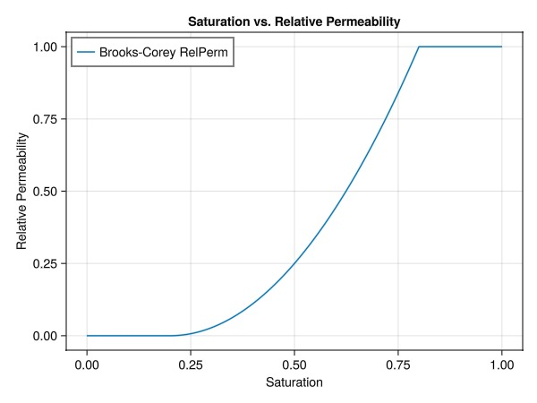
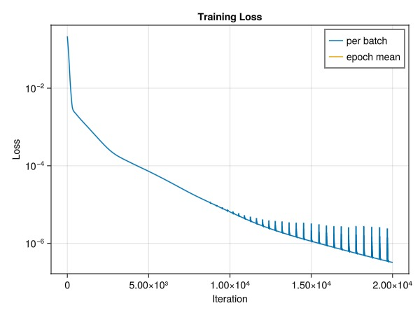
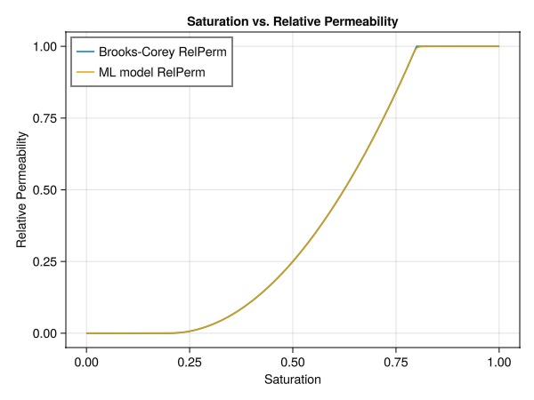
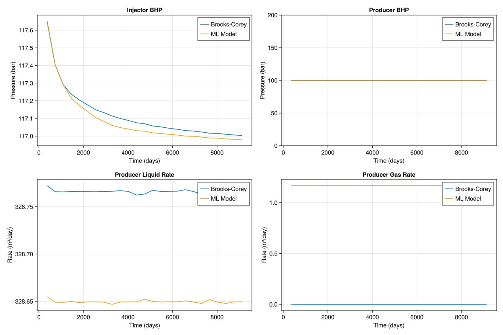
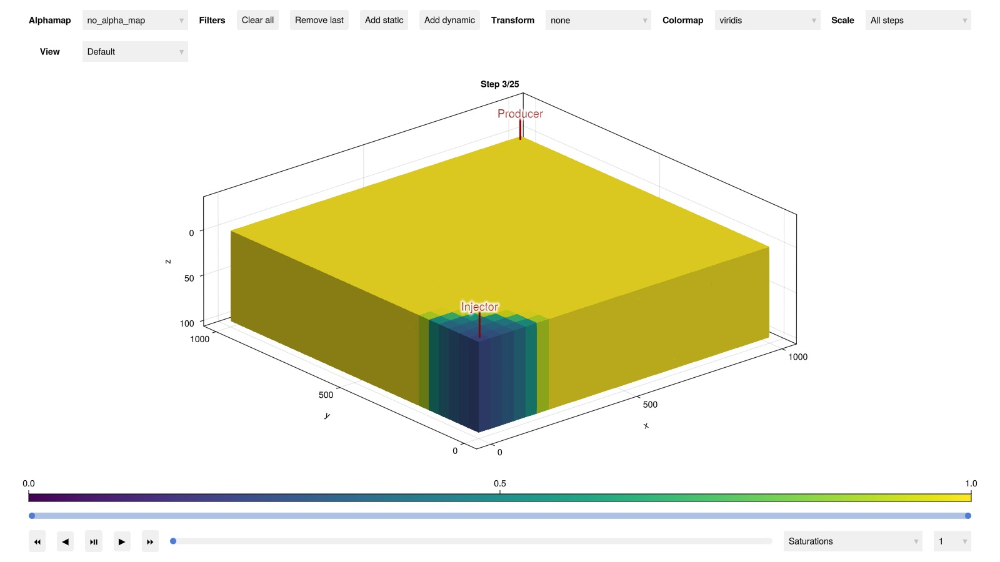

# Hybrid simulation with neural network for relative permeability {#Hybrid-simulation-with-neural-network-for-relative-permeability}

This example demonstrates how to integrate a neural network into JutulDarcy.jl for relative permeability modeling in reservoir simulations. It includes the following steps:
1. Set up a simple reference simulation with a Brooks-Corey relative permeability model
  
2. Train a neural network to approximate the Brooks-Corey relative permeability model
  
3. Incorporate the trained network into a simulation model
  
4. Compare the results of the neural network-based simulation with the reference simulation
  

This approach showcases the flexibility of JutulDarcy.jl in incorporating machine learning models into conventional reservoir simulation workflows, potentially enabling more accurate and efficient simulations of complex fluid behavior.

## Preliminaries {#Preliminaries}

First, let&#39;s import the necessary packages. We will use Lux for the neural network model, due to its explicit representation of the model and the ability to use different optimisers, ideal for integration with Jutul. However, Flux.jl would work just as well for this simple example.

```julia
using JutulDarcy, Jutul, Lux, ADTypes, Zygote, Optimisers, Random, Statistics, GLMakie
```


## Set up the simulation case {#Set-up-the-simulation-case}

We set up a reference simulation case following the [Your first JutulDarcy.jl simulation](https://sintefmath.github.io/JutulDarcy.jl/dev/man/first_ex) example:
- Create a simple Cartesian Mesh
  
- Convert it to a reservoir domain with permeability and porosity
  
- Set up two wells: a vertical injector and a single-perforation producer
  

#### Fluid system and model setup {#Fluid-system-and-model-setup}
- Use a two-phase immiscible system (liquid and vapor)
  
- Set reference densities: 1000 kg/m³ for liquid, 100 kg/m³ for vapor
  

#### Timesteps and well controls {#Timesteps-and-well-controls}
- Set reporting timesteps: every year for 25 years
  
- Producer: fixed bottom-hole pressure
  
- Injector: high gas injection rate (for dramatic visualization)
  

These steps create a basic simulation setup that we&#39;ll use to compare against the neural network-based relative permeability model.

```julia
Darcy, bar, kg, meter, day = si_units(:darcy, :bar, :kilogram, :meter, :day)

function setup_simulation_case()
    nx = ny = 25
    nz = 10
    cart_dims = (nx, ny, nz)
    physical_dims = (1000.0, 1000.0, 100.0).*meter
    g = CartesianMesh(cart_dims, physical_dims)
    domain = reservoir_domain(g, permeability = 0.3Darcy, porosity = 0.2)
    Injector = setup_vertical_well(domain, 1, 1, name = :Injector)
    Producer = setup_well(domain, (nx, ny, 1), name = :Producer)

    phases = (LiquidPhase(), VaporPhase())
    rhoLS = 1000.0kg/meter^3
    rhoGS = 100.0kg/meter^3
    reference_densities = [rhoLS, rhoGS]
    sys = ImmiscibleSystem(phases, reference_densities = reference_densities)

    nstep = 25
    dt = fill(365.0day, nstep)

    pv = pore_volume(domain)
    inj_rate = 1.5*sum(pv)/sum(dt)
    rate_target = TotalRateTarget(inj_rate)
    bhp_target = BottomHolePressureTarget(100bar)

    I_ctrl = InjectorControl(rate_target, [0.0, 1.0], density = rhoGS)
    P_ctrl = ProducerControl(bhp_target)
    controls = Dict(:Injector => I_ctrl, :Producer => P_ctrl)

    model, parameters = setup_reservoir_model(domain, sys, wells = [Injector, Producer])
    forces = setup_reservoir_forces(model, control = controls);

    return model, parameters, forces, sys, dt
end

ref_model, ref_parameters, ref_forces, ref_sys, ref_dt = setup_simulation_case();
```


The simulation model has a set of default secondary variables (properties) that are used to compute the flow equations. We can have a look at the reservoir model to see what the defaults are for the Darcy flow part of the domain:

```julia
reservoir_model(ref_model)
```


```
SimulationModel:

  Model with 12500 degrees of freedom, 12500 equations and 54000 parameters

  domain:
    DiscretizedDomain with MinimalTPFATopology (6250 cells, 17625 faces) and discretizations for mass_flow, heat_flow

  system:
    ImmiscibleSystem with LiquidPhase, VaporPhase

  context:
    ParallelCSRContext(BlockMajorLayout(false), 1000, 1, MetisPartitioner(:KWAY))

  formulation:
    FullyImplicitFormulation()

  data_domain:
    DataDomain wrapping CartesianMesh (3D) with 25x25x10=6250 cells with 19 data fields added:
  6250 Cells
    :permeability => 6250 Vector{Float64}
    :porosity => 6250 Vector{Float64}
    :rock_thermal_conductivity => 6250 Vector{Float64}
    :fluid_thermal_conductivity => 6250 Vector{Float64}
    :rock_heat_capacity => 6250 Vector{Float64}
    :component_heat_capacity => 6250 Vector{Float64}
    :rock_density => 6250 Vector{Float64}
    :cell_centroids => 3×6250 Matrix{Float64}
    :volumes => 6250 Vector{Float64}
  17625 Faces
    :neighbors => 2×17625 Matrix{Int64}
    :areas => 17625 Vector{Float64}
    :normals => 3×17625 Matrix{Float64}
    :face_centroids => 3×17625 Matrix{Float64}
  35250 HalfFaces
    :half_face_cells => 35250 Vector{Int64}
    :half_face_faces => 35250 Vector{Int64}
  2250 BoundaryFaces
    :boundary_areas => 2250 Vector{Float64}
    :boundary_centroids => 3×2250 Matrix{Float64}
    :boundary_normals => 3×2250 Matrix{Float64}
    :boundary_neighbors => 2250 Vector{Int64}

  primary_variables:
   1) Pressure    ∈ 6250 Cells: 1 dof each
   2) Saturations ∈ 6250 Cells: 1 dof, 2 values each

  secondary_variables:
   1) PhaseMassDensities     ∈ 6250 Cells: 2 values each
      -> ConstantCompressibilityDensities as evaluator
   2) TotalMasses            ∈ 6250 Cells: 2 values each
      -> TotalMasses as evaluator
   3) RelativePermeabilities ∈ 6250 Cells: 2 values each
      -> BrooksCoreyRelativePermeabilities as evaluator
   4) PhaseMobilities        ∈ 6250 Cells: 2 values each
      -> JutulDarcy.PhaseMobilities as evaluator
   5) PhaseMassMobilities    ∈ 6250 Cells: 2 values each
      -> JutulDarcy.PhaseMassMobilities as evaluator

  parameters:
   1) Transmissibilities        ∈ 17625 Faces: Scalar
   2) TwoPointGravityDifference ∈ 17625 Faces: Scalar
   3) PhaseViscosities          ∈ 6250 Cells: 2 values each
   4) FluidVolume               ∈ 6250 Cells: Scalar

  equations:
   1) mass_conservation ∈ 6250 Cells: 2 values each
      -> ConservationLaw{:TotalMasses, TwoPointPotentialFlowHardCoded{Vector{Int64}, Vector{@NamedTuple{self::Int64, other::Int64, face::Int64, face_sign::Int64}}}, Jutul.DefaultFlux, 2}

  output_variables:
    Pressure, Saturations, TotalMasses

  extra:
    OrderedDict{Symbol, Any} with keys: Symbol[]

```


The secondary variables can be swapped out, replaced and new variables can be added with arbitrary functional dependencies thanks to Jutul&#39;s flexible setup for automatic differentiation. Let us adjust the defaults by replacing the relative permeabilities with Brooks-Corey functions:

### Brooks-Corey {#Brooks-Corey}

The Brooks-Corey model is a simple model that can be used to generate relative permeabilities. The model is defined in the mobile region as:

$k_{rw} = k_{max,w} \bar{S}_w$

$k_{rg} = k_{max,g} \bar{S}_g$

where $k_{max,w}$ is the maximum relative permeability, $\bar{S}_w$ is the normalized saturation for the water phase,

$\bar{S}_w = \frac{S_w - S_{wi}}{1 - S_{wi} - S_{rg}}$

and, similarly, for the vapor phase:

$\bar{S}_g = \frac{S_g - S_{rg}}{1 - S_{wi} - S_{rg}}$

We use the Brooks Corey function available in JutulDarcy to evaluate the values for a given saturation range. For simplicity, we use the same exponent and residual saturation for both the liquid and vapour phase, such that we only need to train a single model

```julia
exponent = 2.0
sr_g = sr_w = 0.2
r_tot = sr_g + sr_w;

kr = BrooksCoreyRelativePermeabilities(ref_sys, [exponent, exponent], [sr_w, sr_g])
replace_variables!(ref_model, RelativePermeabilities = kr);
```


### Run the reference simulation {#Run-the-reference-simulation}

We then set up the initial state with constant pressure and liquid-filled reservoir. The inputs (pressure and saturations) must match the model&#39;s primary variables. We can now run the simulation (where we first run a warmup step to avoid JIT compilation overhead).

```julia
ref_state0 = setup_reservoir_state(ref_model,
    Pressure = 120bar,
    Saturations = [1.0, 0.0]
)

simulate_reservoir(ref_state0, ref_model, ref_dt, parameters = ref_parameters, forces = ref_forces);
ref_wd, ref_states, ref_t = simulate_reservoir(ref_state0, ref_model, ref_dt, parameters = ref_parameters, forces = ref_forces, info_level = 1);
```


```
Jutul: Simulating 24 years, 51.31 weeks as 25 report steps
╭────────────────┬──────────┬──────────────┬──────────╮
│ Iteration type │ Avg/step │ Avg/ministep │    Total │
│                │ 25 steps │ 33 ministeps │ (wasted) │
├────────────────┼──────────┼──────────────┼──────────┤
│ Newton         │     4.32 │      3.27273 │  108 (0) │
│ Linearization  │     5.64 │      4.27273 │  141 (0) │
│ Linear solver  │      9.2 │       6.9697 │  230 (0) │
│ Precond apply  │     18.4 │      13.9394 │  460 (0) │
╰────────────────┴──────────┴──────────────┴──────────╯
╭───────────────┬─────────┬────────────┬────────╮
│ Timing type   │    Each │   Relative │  Total │
│               │      ms │ Percentage │      s │
├───────────────┼─────────┼────────────┼────────┤
│ Properties    │  0.4698 │     3.87 % │ 0.0507 │
│ Equations     │  0.7140 │     7.68 % │ 0.1007 │
│ Assembly      │  0.8342 │     8.97 % │ 0.1176 │
│ Linear solve  │  0.6458 │     5.32 % │ 0.0697 │
│ Linear setup  │  5.5684 │    45.87 % │ 0.6014 │
│ Precond apply │  0.5470 │    19.19 % │ 0.2516 │
│ Update        │  0.1659 │     1.37 % │ 0.0179 │
│ Convergence   │  0.1280 │     1.38 % │ 0.0180 │
│ Input/Output  │  0.0691 │     0.17 % │ 0.0023 │
│ Other         │  0.7499 │     6.18 % │ 0.0810 │
├───────────────┼─────────┼────────────┼────────┤
│ Total         │ 12.1390 │   100.00 % │ 1.3110 │
╰───────────────┴─────────┴────────────┴────────╯
Jutul: Simulating 24 years, 51.31 weeks as 25 report steps
Step  1/25: Solving start to 52 weeks, 1 day, Δt = 52 weeks, 1 day
Step  2/25: Solving 52 weeks, 1 day to 1 year, 52.11 weeks, Δt = 52 weeks, 1 day
Step  3/25: Solving 1 year, 52.11 weeks to 2 years, 52.07 weeks, Δt = 52 weeks, 1 day
Step  4/25: Solving 2 years, 52.07 weeks to 3 years, 52.04 weeks, Δt = 52 weeks, 1 day
Step  5/25: Solving 3 years, 52.04 weeks to 4 years, 52 weeks, Δt = 52 weeks, 1 day
Step  6/25: Solving 4 years, 52 weeks to 5 years, 51.97 weeks, Δt = 52 weeks, 1 day
Step  7/25: Solving 5 years, 51.97 weeks to 6 years, 51.94 weeks, Δt = 52 weeks, 1 day
Step  8/25: Solving 6 years, 51.94 weeks to 7 years, 51.9 weeks, Δt = 52 weeks, 1 day
Step  9/25: Solving 7 years, 51.9 weeks to 8 years, 51.87 weeks, Δt = 52 weeks, 1 day
Step 10/25: Solving 8 years, 51.87 weeks to 9 years, 51.83 weeks, Δt = 52 weeks, 1 day
Step 11/25: Solving 9 years, 51.83 weeks to 10 years, 51.8 weeks, Δt = 52 weeks, 1 day
Step 12/25: Solving 10 years, 51.8 weeks to 11 years, 51.76 weeks, Δt = 52 weeks, 1 day
Step 13/25: Solving 11 years, 51.76 weeks to 12 years, 51.73 weeks, Δt = 52 weeks, 1 day
Step 14/25: Solving 12 years, 51.73 weeks to 13 years, 51.69 weeks, Δt = 52 weeks, 1 day
Step 15/25: Solving 13 years, 51.69 weeks to 14 years, 51.66 weeks, Δt = 52 weeks, 1 day
Step 16/25: Solving 14 years, 51.66 weeks to 15 years, 51.62 weeks, Δt = 52 weeks, 1 day
Step 17/25: Solving 15 years, 51.62 weeks to 16 years, 51.59 weeks, Δt = 52 weeks, 1 day
Step 18/25: Solving 16 years, 51.59 weeks to 17 years, 51.55 weeks, Δt = 52 weeks, 1 day
Step 19/25: Solving 17 years, 51.55 weeks to 18 years, 51.52 weeks, Δt = 52 weeks, 1 day
Step 20/25: Solving 18 years, 51.52 weeks to 19 years, 51.48 weeks, Δt = 52 weeks, 1 day
Step 21/25: Solving 19 years, 51.48 weeks to 20 years, 51.45 weeks, Δt = 52 weeks, 1 day
Step 22/25: Solving 20 years, 51.45 weeks to 21 years, 51.42 weeks, Δt = 52 weeks, 1 day
Step 23/25: Solving 21 years, 51.42 weeks to 22 years, 51.38 weeks, Δt = 52 weeks, 1 day
Step 24/25: Solving 22 years, 51.38 weeks to 23 years, 51.35 weeks, Δt = 52 weeks, 1 day
Step 25/25: Solving 23 years, 51.35 weeks to 24 years, 51.31 weeks, Δt = 52 weeks, 1 day
Simulation complete: Completed 25 report steps in 1 second, 227 milliseconds, 127.4 microseconds and 108 iterations.
╭────────────────┬──────────┬──────────────┬──────────╮
│ Iteration type │ Avg/step │ Avg/ministep │    Total │
│                │ 25 steps │ 33 ministeps │ (wasted) │
├────────────────┼──────────┼──────────────┼──────────┤
│ Newton         │     4.32 │      3.27273 │  108 (0) │
│ Linearization  │     5.64 │      4.27273 │  141 (0) │
│ Linear solver  │      9.2 │       6.9697 │  230 (0) │
│ Precond apply  │     18.4 │      13.9394 │  460 (0) │
╰────────────────┴──────────┴──────────────┴──────────╯
╭───────────────┬─────────┬────────────┬────────╮
│ Timing type   │    Each │   Relative │  Total │
│               │      ms │ Percentage │      s │
├───────────────┼─────────┼────────────┼────────┤
│ Properties    │  0.4708 │     4.14 % │ 0.0508 │
│ Equations     │  0.6686 │     7.68 % │ 0.0943 │
│ Assembly      │  0.8250 │     9.48 % │ 0.1163 │
│ Linear solve  │  0.6263 │     5.51 % │ 0.0676 │
│ Linear setup  │  5.5253 │    48.63 % │ 0.5967 │
│ Precond apply │  0.5399 │    20.24 % │ 0.2484 │
│ Update        │  0.1652 │     1.45 % │ 0.0178 │
│ Convergence   │  0.1252 │     1.44 % │ 0.0176 │
│ Input/Output  │  0.0659 │     0.18 % │ 0.0022 │
│ Other         │  0.1415 │     1.25 % │ 0.0153 │
├───────────────┼─────────┼────────────┼────────┤
│ Total         │ 11.3623 │   100.00 % │ 1.2271 │
╰───────────────┴─────────┴────────────┴────────╯
```


## Training a neural network to compute relative permeability {#Training-a-neural-network-to-compute-relative-permeability}

The next step is to train a neural network to learn the Brooks-Corey relative permeability curve. While using a neural network to learn a simple analytical function is not typically practical, it serves as a good example for integrating machine learning with reservoir simulation.

First we must generate some data for training a model to represent the Brooks Corey function.

```julia
train_samples = 1000
test_samples = 1000

training_sat = collect(range(Float64(0), stop=Float64(1), length=train_samples))
training_sat = reshape(training_sat, 1, :)

rel_perm_analytical = JutulDarcy.brooks_corey_relperm.(training_sat, n = exponent, residual = sr_g, residual_total = r_tot)
fig = Figure()
ax = Axis(fig[1,1],
    xlabel = "Saturation",
    ylabel = "Relative Permeability",
    title = "Saturation vs. Relative Permeability",
    xticks = 0:0.25:1,
    yticks = 0:0.25:1
)
lines!(ax, vec(training_sat), vec(rel_perm_analytical), label="Brooks-Corey RelPerm")
axislegend(ax, position = :lt)
fig
```



### Define the neural network architecture {#Define-the-neural-network-architecture}

Next we define the neural network architecture. The model takes in a saturation value and outputs a relative permeability value. For a batched input, such as the number of cells in the model, the input and output shapes are (1xN_cells).

We define our neural network architecture for relative permeability prediction using a multi-layer perceptron (MLP) with the following characteristics:
- Input layer: 1 neuron (saturation value)
  
- Three hidden layers: 16 neurons each, with tanh activation
  
- Output layer: 1 neuron with sigmoid activation (relative permeability)
  

Key design choices:
- Use of tanh activation in hidden layers for smooth first derivatives
  
- Sigmoid in the final layer to constrain output to [0, 1] range
  
- Float64 precision to match JutulDarcy&#39;s numerical precision
  

```julia
BrooksCoreyMLModel = Chain(
    Dense(1 => 16, tanh),
    Dense(16 => 16, tanh),
    Dense(16 => 16, tanh),
    Dense(16 => 1, sigmoid)
)
```


```
Chain(
    layer_1 = Dense(1 => 16, tanh),     # 32 parameters
    layer_2 = Dense(16 => 16, tanh),    # 272 parameters
    layer_3 = Dense(16 => 16, tanh),    # 272 parameters
    layer_4 = Dense(16 => 1, σ),        # 17 parameters
)         # Total: 593 parameters,
          #        plus 0 states.
```


Define training parameters We train the model using the Adam optimizer with a learning rate of 0.0005. For a total of 20 000 epochs. The `optim` object will store the optimiser momentum, etc.

```julia
epochs = 20000;
lr = 0.0005;
```


Training loop, using the whole data set epochs number of times. We use Adam for the optimiser, set the random seed and initialise the parameters. Lux defaults to float32 precision, so we need to convert the parameters to float64. Lux uses a stateless, explicit representation of the model. It consists of four parts:
- model - the model architecture
  
- parameters - the learnable parameters of the model
  
- states - the state of the model, e.g. the hidden states of the recurrent model
  
- optimiser state - the state of the optimiser, e.g. the momentum
  

In addition, we need to define a rule for automatic differentiation. Here we use Zygote.

```julia
rng = Random.default_rng()
Random.seed!(rng, 42)

function train_model(ml_model, training_sat, rel_perm_analytical, epochs, lr)
    opt = Optimisers.Adam(lr);
    ps, st = Lux.setup(rng, ml_model);
    ps = ps |> f64;
    tstate = Lux.Training.TrainState(ml_model, ps, st, opt);
    vjp_rule = ADTypes.AutoZygote();
    loss_function = Lux.MSELoss();

    warmup_data = rand(Float64, 1, 1);
    Training.compute_gradients(vjp_rule, loss_function, (warmup_data, warmup_data), tstate)
    @time begin
        losses = []
        for epoch in 1:epochs
            epoch_losses = []
            _, loss, _, tstate = Lux.Training.single_train_step!(vjp_rule, loss_function, (training_sat, rel_perm_analytical), tstate);
            push!(epoch_losses, loss)
            append!(losses, epoch_losses)
            if epoch % 1000 == 0 || epoch == epochs
                println("Epoch: $(lpad(epoch, 3)) \t Loss: $(round(mean(epoch_losses), sigdigits=5))")
            end
        end
    end

    return tstate, losses
end

tstate, losses = train_model(BrooksCoreyMLModel, training_sat, rel_perm_analytical, epochs, lr);
```


```
Epoch: 1000 	 Loss: 0.0012998
Epoch: 2000 	 Loss: 0.00045315
Epoch: 3000 	 Loss: 0.00018975
Epoch: 4000 	 Loss: 0.00011431
Epoch: 5000 	 Loss: 7.1938e-5
Epoch: 6000 	 Loss: 4.4165e-5
Epoch: 7000 	 Loss: 2.6378e-5
Epoch: 8000 	 Loss: 1.5976e-5
Epoch: 9000 	 Loss: 1.011e-5
Epoch: 10000 	 Loss: 6.4655e-6
Epoch: 11000 	 Loss: 4.1865e-6
Epoch: 12000 	 Loss: 2.8233e-6
Epoch: 13000 	 Loss: 2.0134e-6
Epoch: 14000 	 Loss: 1.4899e-6
Epoch: 15000 	 Loss: 1.7199e-6
Epoch: 16000 	 Loss: 8.725e-7
Epoch: 17000 	 Loss: 6.7346e-7
Epoch: 18000 	 Loss: 5.2225e-7
Epoch: 19000 	 Loss: 4.0757e-7
Epoch: 20000 	 Loss: 3.2248e-7
 16.908755 seconds (9.90 M allocations: 22.843 GiB, 11.68% gc time, 7.50% compilation time)
```


The loss function is plotted to show that the model is learning.

```julia
fig = Figure()
ax = Axis(fig[1,1],
    xlabel = "Iteration",
    ylabel = "Loss",
    title = "Training Loss",
    yscale = log10
)
lines!(ax, losses, label="per batch")
lines!(ax, epochs:epochs:length(losses),
    mean.(Iterators.partition(losses, epochs)),
    label="epoch mean"
)
axislegend()
fig
```



To test the trained model , we generate some test data, different to the training set

```julia
testing_sat = sort([0.0; rand(Float64, test_samples-2); 1.0])
testing_sat = reshape(testing_sat, 1, :)
```


```
1×1000 Matrix{Float64}:
 0.0  7.23002e-5  0.000395539  …  0.996979  0.997467  0.997879  1.0
```


Next, we calculate the analytical solution and predicted values with the trained model.

```julia
test_y = JutulDarcy.brooks_corey_relperm.(testing_sat, n = exponent, residual = sr_g, residual_total = r_tot)
pred_y = Lux.apply(BrooksCoreyMLModel, testing_sat, tstate.parameters, tstate.states)[1]

fig = Figure()
ax = Axis(fig[1,1],
    xlabel = "Saturation",
    ylabel = "Relative Permeability",
    title = "Saturation vs. Relative Permeability",
    xticks = 0:0.25:1,
    yticks = 0:0.25:1
)
lines!(ax, vec(testing_sat), vec(test_y), label="Brooks-Corey RelPerm")
lines!(ax, vec(testing_sat), vec(pred_y), label="ML model RelPerm")
axislegend(ax, position = :lt)
fig
```



The plot demonstrates that our neural network has successfully learned to approximate the Brooks-Corey relative permeability curve. This close match between the analytical solution and the ML model&#39;s predictions indicates that we can use this trained neural network in our simulation model.

## Replacing the relative permeability function with our neural network {#Replacing-the-relative-permeability-function-with-our-neural-network}

Now we can replace the relative permeability function with our neural network. We define a new type `MLModelRelativePermeabilities` that wraps our neural network model and implements the `update_kr!` function. This function is called by the simulator to update the relative permeability values for the liquid and vapour phase. A potential benefit of using a neural network, is that we can compute all the cells in parallel, and access to highly optimised GPU acceleration is trivial.

```julia
struct MLModelRelativePermeabilities{M, P, S} <: JutulDarcy.AbstractRelativePermeabilities
    ML_model::M
    parameters::P
    states::S
    function MLModelRelativePermeabilities(input_ML_model, parameters, states)
        new{typeof(input_ML_model), typeof(parameters), typeof(states)}(input_ML_model, parameters, states)
    end
end

Jutul.@jutul_secondary function update_kr!(kr, kr_def::MLModelRelativePermeabilities, model, Saturations, ix)
    ML_model = kr_def.ML_model
    ps = kr_def.parameters
    st = kr_def.states
    for ph in axes(kr, 1)
        sat_batch = reshape(Saturations[ph, :], 1, length(Saturations[ph, :]))
        kr_pred, st = Lux.apply(ML_model, sat_batch, ps, st)
        @inbounds kr[ph, :] .= vec(kr_pred)
    end
end
```


Since JutulDarcy uses automatic differentiation, our new relative permeability model needs to be differentiable. This is inherently satisfied by our neural network model, as differentiability is a core requirement for machine learning models. One thing to note, is that we are using Lux with Zygote.jl for automatic differentiation, while Jutul uses ForwardDiff.jl. This is not a problem, as the gradient of our simple neural network is fully compatible with ForwardDiff.jl, so no middleware is needed for this integration. We can now replace the default relative permeability model with our new neural network-based model.

```julia
ml_model, ml_parameters, ml_forces, ml_sys, ml_dt = setup_simulation_case()

ml_kr = MLModelRelativePermeabilities(BrooksCoreyMLModel, tstate.parameters, tstate.states)
replace_variables!(ml_model, RelativePermeabilities = ml_kr);
```


We can now inspect the model to see that the relative permeability model has been replaced.

```julia
reservoir_model(ml_model)
```


```
SimulationModel:

  Model with 12500 degrees of freedom, 12500 equations and 54000 parameters

  domain:
    DiscretizedDomain with MinimalTPFATopology (6250 cells, 17625 faces) and discretizations for mass_flow, heat_flow

  system:
    ImmiscibleSystem with LiquidPhase, VaporPhase

  context:
    ParallelCSRContext(BlockMajorLayout(false), 1000, 1, MetisPartitioner(:KWAY))

  formulation:
    FullyImplicitFormulation()

  data_domain:
    DataDomain wrapping CartesianMesh (3D) with 25x25x10=6250 cells with 19 data fields added:
  6250 Cells
    :permeability => 6250 Vector{Float64}
    :porosity => 6250 Vector{Float64}
    :rock_thermal_conductivity => 6250 Vector{Float64}
    :fluid_thermal_conductivity => 6250 Vector{Float64}
    :rock_heat_capacity => 6250 Vector{Float64}
    :component_heat_capacity => 6250 Vector{Float64}
    :rock_density => 6250 Vector{Float64}
    :cell_centroids => 3×6250 Matrix{Float64}
    :volumes => 6250 Vector{Float64}
  17625 Faces
    :neighbors => 2×17625 Matrix{Int64}
    :areas => 17625 Vector{Float64}
    :normals => 3×17625 Matrix{Float64}
    :face_centroids => 3×17625 Matrix{Float64}
  35250 HalfFaces
    :half_face_cells => 35250 Vector{Int64}
    :half_face_faces => 35250 Vector{Int64}
  2250 BoundaryFaces
    :boundary_areas => 2250 Vector{Float64}
    :boundary_centroids => 3×2250 Matrix{Float64}
    :boundary_normals => 3×2250 Matrix{Float64}
    :boundary_neighbors => 2250 Vector{Int64}

  primary_variables:
   1) Pressure    ∈ 6250 Cells: 1 dof each
   2) Saturations ∈ 6250 Cells: 1 dof, 2 values each

  secondary_variables:
   1) PhaseMassDensities     ∈ 6250 Cells: 2 values each
      -> ConstantCompressibilityDensities as evaluator
   2) TotalMasses            ∈ 6250 Cells: 2 values each
      -> TotalMasses as evaluator
   3) RelativePermeabilities ∈ 6250 Cells: 2 values each
      -> Main.MLModelRelativePermeabilities as evaluator
   4) PhaseMobilities        ∈ 6250 Cells: 2 values each
      -> JutulDarcy.PhaseMobilities as evaluator
   5) PhaseMassMobilities    ∈ 6250 Cells: 2 values each
      -> JutulDarcy.PhaseMassMobilities as evaluator

  parameters:
   1) Transmissibilities        ∈ 17625 Faces: Scalar
   2) TwoPointGravityDifference ∈ 17625 Faces: Scalar
   3) PhaseViscosities          ∈ 6250 Cells: 2 values each
   4) FluidVolume               ∈ 6250 Cells: Scalar

  equations:
   1) mass_conservation ∈ 6250 Cells: 2 values each
      -> ConservationLaw{:TotalMasses, TwoPointPotentialFlowHardCoded{Vector{Int64}, Vector{@NamedTuple{self::Int64, other::Int64, face::Int64, face_sign::Int64}}}, Jutul.DefaultFlux, 2}

  output_variables:
    Pressure, Saturations, TotalMasses

  extra:
    OrderedDict{Symbol, Any} with keys: Symbol[]

```


### Run the simulation {#Run-the-simulation}

```julia
ml_state0 = setup_reservoir_state(ml_model,
    Pressure = 120bar,
    Saturations = [1.0, 0.0]
)

simulate_reservoir(ml_state0, ml_model, ml_dt, parameters = ml_parameters, forces = ml_forces, info_level = -1);
ml_wd, ml_states, ml_t = simulate_reservoir(ml_state0, ml_model, ml_dt, parameters = ml_parameters, forces = ml_forces, info_level = 1);
```


```
Jutul: Simulating 24 years, 51.31 weeks as 25 report steps
Step  1/25: Solving start to 52 weeks, 1 day, Δt = 52 weeks, 1 day
Step  2/25: Solving 52 weeks, 1 day to 1 year, 52.11 weeks, Δt = 52 weeks, 1 day
Step  3/25: Solving 1 year, 52.11 weeks to 2 years, 52.07 weeks, Δt = 52 weeks, 1 day
Step  4/25: Solving 2 years, 52.07 weeks to 3 years, 52.04 weeks, Δt = 52 weeks, 1 day
Step  5/25: Solving 3 years, 52.04 weeks to 4 years, 52 weeks, Δt = 52 weeks, 1 day
Step  6/25: Solving 4 years, 52 weeks to 5 years, 51.97 weeks, Δt = 52 weeks, 1 day
Step  7/25: Solving 5 years, 51.97 weeks to 6 years, 51.94 weeks, Δt = 52 weeks, 1 day
Step  8/25: Solving 6 years, 51.94 weeks to 7 years, 51.9 weeks, Δt = 52 weeks, 1 day
Step  9/25: Solving 7 years, 51.9 weeks to 8 years, 51.87 weeks, Δt = 52 weeks, 1 day
Step 10/25: Solving 8 years, 51.87 weeks to 9 years, 51.83 weeks, Δt = 52 weeks, 1 day
Step 11/25: Solving 9 years, 51.83 weeks to 10 years, 51.8 weeks, Δt = 52 weeks, 1 day
Step 12/25: Solving 10 years, 51.8 weeks to 11 years, 51.76 weeks, Δt = 52 weeks, 1 day
Step 13/25: Solving 11 years, 51.76 weeks to 12 years, 51.73 weeks, Δt = 52 weeks, 1 day
Step 14/25: Solving 12 years, 51.73 weeks to 13 years, 51.69 weeks, Δt = 52 weeks, 1 day
Step 15/25: Solving 13 years, 51.69 weeks to 14 years, 51.66 weeks, Δt = 52 weeks, 1 day
Step 16/25: Solving 14 years, 51.66 weeks to 15 years, 51.62 weeks, Δt = 52 weeks, 1 day
Step 17/25: Solving 15 years, 51.62 weeks to 16 years, 51.59 weeks, Δt = 52 weeks, 1 day
Step 18/25: Solving 16 years, 51.59 weeks to 17 years, 51.55 weeks, Δt = 52 weeks, 1 day
Step 19/25: Solving 17 years, 51.55 weeks to 18 years, 51.52 weeks, Δt = 52 weeks, 1 day
Step 20/25: Solving 18 years, 51.52 weeks to 19 years, 51.48 weeks, Δt = 52 weeks, 1 day
Step 21/25: Solving 19 years, 51.48 weeks to 20 years, 51.45 weeks, Δt = 52 weeks, 1 day
Step 22/25: Solving 20 years, 51.45 weeks to 21 years, 51.42 weeks, Δt = 52 weeks, 1 day
Step 23/25: Solving 21 years, 51.42 weeks to 22 years, 51.38 weeks, Δt = 52 weeks, 1 day
Step 24/25: Solving 22 years, 51.38 weeks to 23 years, 51.35 weeks, Δt = 52 weeks, 1 day
Step 25/25: Solving 23 years, 51.35 weeks to 24 years, 51.31 weeks, Δt = 52 weeks, 1 day
Simulation complete: Completed 25 report steps in 3 seconds, 220 milliseconds, 744.4 microseconds and 113 iterations.
╭────────────────┬──────────┬──────────────┬──────────╮
│ Iteration type │ Avg/step │ Avg/ministep │    Total │
│                │ 25 steps │ 34 ministeps │ (wasted) │
├────────────────┼──────────┼──────────────┼──────────┤
│ Newton         │     4.52 │      3.32353 │  113 (0) │
│ Linearization  │     5.88 │      4.32353 │  147 (0) │
│ Linear solver  │     9.64 │      7.08824 │  241 (0) │
│ Precond apply  │    19.28 │      14.1765 │  482 (0) │
╰────────────────┴──────────┴──────────────┴──────────╯
╭───────────────┬─────────┬────────────┬────────╮
│ Timing type   │    Each │   Relative │  Total │
│               │      ms │ Percentage │      s │
├───────────────┼─────────┼────────────┼────────┤
│ Properties    │ 17.0533 │    59.83 % │ 1.9270 │
│ Equations     │  0.7285 │     3.33 % │ 0.1071 │
│ Assembly      │  1.0789 │     4.92 % │ 0.1586 │
│ Linear solve  │  0.6062 │     2.13 % │ 0.0685 │
│ Linear setup  │  5.7060 │    20.02 % │ 0.6448 │
│ Precond apply │  0.5307 │     7.94 % │ 0.2558 │
│ Update        │  0.1663 │     0.58 % │ 0.0188 │
│ Convergence   │  0.1448 │     0.66 % │ 0.0213 │
│ Input/Output  │  0.0765 │     0.08 % │ 0.0026 │
│ Other         │  0.1440 │     0.51 % │ 0.0163 │
├───────────────┼─────────┼────────────┼────────┤
│ Total         │ 28.5022 │   100.00 % │ 3.2207 │
╰───────────────┴─────────┴────────────┴────────╯
```


### Compare results {#Compare-results}

We can now compare the results of the reference simulation and the simulation with the neural network-based relative permeability model.

```julia
function plot_comparison(ref_wd, ml_wd, ref_t, ml_t)
    fig = Figure(size = (1200, 800))

    ax1 = Axis(fig[1, 1], title = "Injector BHP", xlabel = "Time (days)", ylabel = "Pressure (bar)")
    lines!(ax1, ref_t/day, ref_wd[:Injector, :bhp]./bar, label = "Brooks-Corey")
    lines!(ax1, ml_t/day, ml_wd[:Injector, :bhp]./bar, label = "ML Model")
    axislegend(ax1)

    ax2 = Axis(fig[1, 2], title = "Producer BHP", xlabel = "Time (days)", ylabel = "Pressure (bar)")
    lines!(ax2, ref_t/day, ref_wd[:Producer, :bhp]./bar, label = "Brooks-Corey")
    lines!(ax2, ml_t/day, ml_wd[:Producer, :bhp]./bar, label = "ML Model")
    axislegend(ax2)

    ax3 = Axis(fig[2, 1], title = "Producer Liquid Rate", xlabel = "Time (days)", ylabel = "Rate (m³/day)")
    lines!(ax3, ref_t/day, abs.(ref_wd[:Producer, :lrat]).*day, label = "Brooks-Corey")
    lines!(ax3, ml_t/day, abs.(ml_wd[:Producer, :lrat]).*day, label = "ML Model")
    axislegend(ax3)

    ax4 = Axis(fig[2, 2], title = "Producer Gas Rate", xlabel = "Time (days)", ylabel = "Rate (m³/day)")
    lines!(ax4, ref_t/day, abs.(ref_wd[:Producer, :grat]).*day, label = "Brooks-Corey")
    lines!(ax4, ml_t/day, abs.(ml_wd[:Producer, :grat]).*day, label = "ML Model")
    axislegend(ax4)

    return fig
end

plot_comparison(ref_wd, ml_wd, ref_t, ml_t)
```



From the plot, we can see that the neural network-based relative permeability model is able to match the reference simulation to an acceptable level.

Interactive visualization of the 3D results is also possible if GLMakie is loaded:

```julia
plot_reservoir(ml_model, ml_states, key = :Saturations, step = 3)
```



This example demonstrates how to integrate a neural network model for relative permeability into a reservoir simulation using JutulDarcy.jl. While we used a simple Brooks-Corey model for demonstration, this approach can be extended to more complex scenarios where analytical models may not be sufficient.

## Bonus: Improving performance with SimpleChains.jl {#Bonus:-Improving-performance-with-SimpleChains.jl}

When inspecting the simulation results, we observe that using the ML model is slower than the analytical model. This is not surprising, since we are comparing a 593 parameters neural network on a CPU with a simple analytical function.

Many popular machine learning libraries prioritize optimization for large neural networks and GPU processing, often at the expense of performance for smaller models and CPU-based computations. For instance, these libraries might use memory allocations to achieve more efficient matrix multiplications, which is beneficial when matrix operations dominate the computation time.

However, in our scenario with a relatively small network running on a CPU, we can leverage a specialised library to improve performance. SimpleChains.jl is designed specifically for optimising small neural networks on CPUs. It offers significant performance improvements over traditional deep learning frameworks in such scenarios.

Advantages of SimpleChains.jl include:
1. Efficient utilisation of CPU resources, including SIMD vectorisation.
  
2. Minimal memory allocations during forward and backward passes.
  
3. Compile-time optimisations specifically for small, fixed-size networks.
  

By using SimpleChains.jl, we can potentially reduce the training time and achieve performance closer to that of the analytical model.

Fortunately, Lux.jl makes it straightforward to use SimpleChains as a backend. We simply need to convert our model to a SimpleChains model using the `ToSimpleChainsAdaptor`. This allows us to utilise the SimpleChains backend while still using the Lux training API.

(Note: Lux also supports Flux.jl models through a similar adaptor approach.)

```julia
using SimpleChains
adaptor = ToSimpleChainsAdaptor(static(1));

BrooksCoreyMLModel_sc = adaptor(BrooksCoreyMLModel);
```


We can now train the model using the SimpleChains backend, with the Lux training API.

```julia
tstate_sc, losses_sc = train_model(BrooksCoreyMLModel_sc, training_sat, rel_perm_analytical, epochs, lr);
```


```
Epoch: 1000 	 Loss: 0.0013865
Epoch: 2000 	 Loss: 0.001263
Epoch: 3000 	 Loss: 0.0010092
Epoch: 4000 	 Loss: 0.00055212
Epoch: 5000 	 Loss: 0.00010216
Epoch: 6000 	 Loss: 5.649e-5
Epoch: 7000 	 Loss: 2.5355e-5
Epoch: 8000 	 Loss: 1.5611e-5
Epoch: 9000 	 Loss: 1.0017e-5
Epoch: 10000 	 Loss: 6.4321e-6
Epoch: 11000 	 Loss: 4.2482e-6
Epoch: 12000 	 Loss: 2.8038e-6
Epoch: 13000 	 Loss: 1.8985e-6
Epoch: 14000 	 Loss: 1.2014e-6
Epoch: 15000 	 Loss: 8.5977e-7
Epoch: 16000 	 Loss: 6.5758e-7
Epoch: 17000 	 Loss: 5.2244e-7
Epoch: 18000 	 Loss: 4.2307e-7
Epoch: 19000 	 Loss: 3.4667e-7
Epoch: 20000 	 Loss: 2.8714e-7
  6.250418 seconds (2.94 M allocations: 1.884 GiB, 4.86% gc time, 2.83% compilation time)
```


The training time should be significantly reduced, since SimpleChains is optimised for small networks. With the trained model, we can now replace the relative permeability model in the simulation case, and run the simulation.

```julia
ml_sc_model, ml_sc_parameters, ml_sc_forces, ml_sc_sys, ml_sc_dt = setup_simulation_case()

ml_sc_kr = MLModelRelativePermeabilities(BrooksCoreyMLModel_sc, tstate_sc.parameters, tstate_sc.states)
replace_variables!(ml_sc_model, RelativePermeabilities = ml_sc_kr);

ml_sc_state0 = setup_reservoir_state(ml_sc_model,
    Pressure = 120bar,
    Saturations = [1.0, 0.0]
)

simulate_reservoir(ml_sc_state0, ml_sc_model, ml_sc_dt, parameters = ml_sc_parameters, forces = ml_sc_forces, info_level = -1);
ml_sc_wd, ml_sc_states, ml_sc_t = simulate_reservoir(ml_sc_state0, ml_sc_model, ml_sc_dt, parameters = ml_sc_parameters, forces = ml_sc_forces, info_level = 1);
```


```
Jutul: Simulating 24 years, 51.31 weeks as 25 report steps
Step  1/25: Solving start to 52 weeks, 1 day, Δt = 52 weeks, 1 day
Step  2/25: Solving 52 weeks, 1 day to 1 year, 52.11 weeks, Δt = 52 weeks, 1 day
Step  3/25: Solving 1 year, 52.11 weeks to 2 years, 52.07 weeks, Δt = 52 weeks, 1 day
Step  4/25: Solving 2 years, 52.07 weeks to 3 years, 52.04 weeks, Δt = 52 weeks, 1 day
Step  5/25: Solving 3 years, 52.04 weeks to 4 years, 52 weeks, Δt = 52 weeks, 1 day
Step  6/25: Solving 4 years, 52 weeks to 5 years, 51.97 weeks, Δt = 52 weeks, 1 day
Step  7/25: Solving 5 years, 51.97 weeks to 6 years, 51.94 weeks, Δt = 52 weeks, 1 day
Step  8/25: Solving 6 years, 51.94 weeks to 7 years, 51.9 weeks, Δt = 52 weeks, 1 day
Step  9/25: Solving 7 years, 51.9 weeks to 8 years, 51.87 weeks, Δt = 52 weeks, 1 day
Step 10/25: Solving 8 years, 51.87 weeks to 9 years, 51.83 weeks, Δt = 52 weeks, 1 day
Step 11/25: Solving 9 years, 51.83 weeks to 10 years, 51.8 weeks, Δt = 52 weeks, 1 day
Step 12/25: Solving 10 years, 51.8 weeks to 11 years, 51.76 weeks, Δt = 52 weeks, 1 day
Step 13/25: Solving 11 years, 51.76 weeks to 12 years, 51.73 weeks, Δt = 52 weeks, 1 day
Step 14/25: Solving 12 years, 51.73 weeks to 13 years, 51.69 weeks, Δt = 52 weeks, 1 day
Step 15/25: Solving 13 years, 51.69 weeks to 14 years, 51.66 weeks, Δt = 52 weeks, 1 day
Step 16/25: Solving 14 years, 51.66 weeks to 15 years, 51.62 weeks, Δt = 52 weeks, 1 day
Step 17/25: Solving 15 years, 51.62 weeks to 16 years, 51.59 weeks, Δt = 52 weeks, 1 day
Step 18/25: Solving 16 years, 51.59 weeks to 17 years, 51.55 weeks, Δt = 52 weeks, 1 day
Step 19/25: Solving 17 years, 51.55 weeks to 18 years, 51.52 weeks, Δt = 52 weeks, 1 day
Step 20/25: Solving 18 years, 51.52 weeks to 19 years, 51.48 weeks, Δt = 52 weeks, 1 day
Step 21/25: Solving 19 years, 51.48 weeks to 20 years, 51.45 weeks, Δt = 52 weeks, 1 day
Step 22/25: Solving 20 years, 51.45 weeks to 21 years, 51.42 weeks, Δt = 52 weeks, 1 day
Step 23/25: Solving 21 years, 51.42 weeks to 22 years, 51.38 weeks, Δt = 52 weeks, 1 day
Step 24/25: Solving 22 years, 51.38 weeks to 23 years, 51.35 weeks, Δt = 52 weeks, 1 day
Step 25/25: Solving 23 years, 51.35 weeks to 24 years, 51.31 weeks, Δt = 52 weeks, 1 day
Simulation complete: Completed 25 report steps in 2 seconds, 180 milliseconds, 592.6 microseconds and 112 iterations.
╭────────────────┬──────────┬──────────────┬──────────╮
│ Iteration type │ Avg/step │ Avg/ministep │    Total │
│                │ 25 steps │ 34 ministeps │ (wasted) │
├────────────────┼──────────┼──────────────┼──────────┤
│ Newton         │     4.48 │      3.29412 │  112 (0) │
│ Linearization  │     5.84 │      4.29412 │  146 (0) │
│ Linear solver  │     9.56 │      7.02941 │  239 (0) │
│ Precond apply  │    19.12 │      14.0588 │  478 (0) │
╰────────────────┴──────────┴──────────────┴──────────╯
╭───────────────┬─────────┬────────────┬────────╮
│ Timing type   │    Each │   Relative │  Total │
│               │      ms │ Percentage │      s │
├───────────────┼─────────┼────────────┼────────┤
│ Properties    │  7.9808 │    40.99 % │ 0.8938 │
│ Equations     │  0.6929 │     4.64 % │ 0.1012 │
│ Assembly      │  1.0341 │     6.92 % │ 0.1510 │
│ Linear solve  │  0.6388 │     3.28 % │ 0.0715 │
│ Linear setup  │  5.7891 │    29.73 % │ 0.6484 │
│ Precond apply │  0.5363 │    11.76 % │ 0.2563 │
│ Update        │  0.1730 │     0.89 % │ 0.0194 │
│ Convergence   │  0.1357 │     0.91 % │ 0.0198 │
│ Input/Output  │  0.0767 │     0.12 % │ 0.0026 │
│ Other         │  0.1476 │     0.76 % │ 0.0165 │
├───────────────┼─────────┼────────────┼────────┤
│ Total         │ 19.4696 │   100.00 % │ 2.1806 │
╰───────────────┴─────────┴────────────┴────────╯
```


From the simulation results, we should observe a performance improvement when using the SimpleChains model.

## Example on GitHub {#Example-on-GitHub}

If you would like to run this example yourself, it can be downloaded from the JutulDarcy.jl GitHub repository [as a script](https://github.com/sintefmath/JutulDarcy.jl/blob/main/examples/workflow/hybrid_simulation_relperm.jl), or as a [Jupyter Notebook](https://github.com/sintefmath/JutulDarcy.jl/blob/gh-pages/dev/final_site/notebooks/workflow/hybrid_simulation_relperm.ipynb)

```
This example took 95.536399903 seconds to complete.
```


---


_This page was generated using [Literate.jl](https://github.com/fredrikekre/Literate.jl)._
