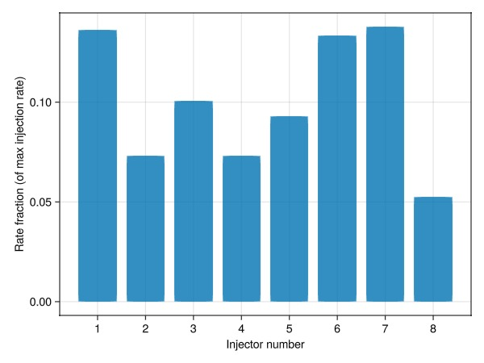
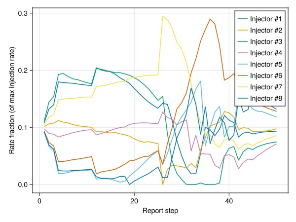
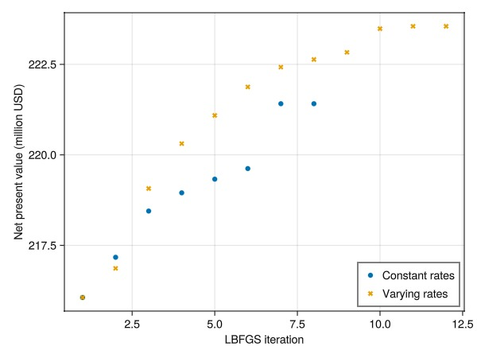
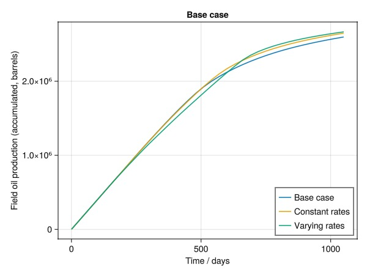
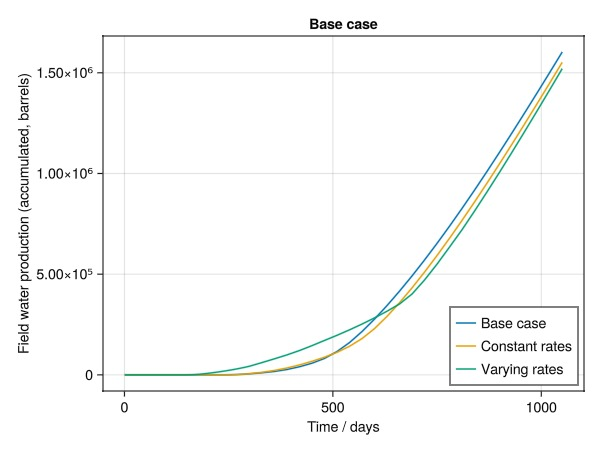
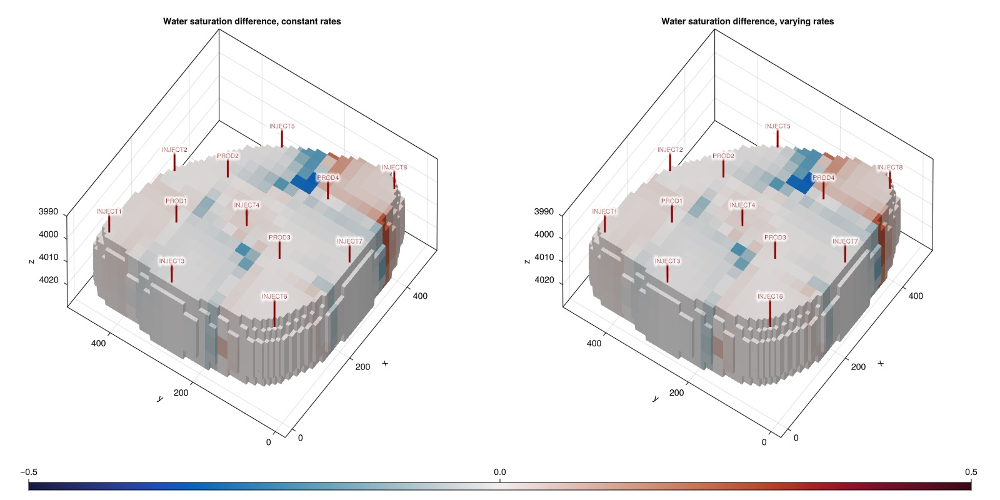

# Gradient-based optimization of net present value (NPV) {#Gradient-based-optimization-of-net-present-value-NPV}

One usage of a differentiable simulator is control optimization. A counterpart to history matching, control optimization is the process of finding the optimal controls for a given objective and simulation model. In this example, we will optimize the injection rates for a simplified version of the EGG model to maximize the net present value (NPV) of the reservoir.

## Setting up a coarse model {#Setting-up-a-coarse-model}

We start off by loading the Egg model and coarsening it to a 20x20x3 grid. We limit the optimization to the first 50 timesteps to speed up the optimization process. If you want to run the optimization for all timesteps on the fine model directly, you can remove the slicing of the case and replace the coarse case with the fine case.

```julia
using Jutul, JutulDarcy, GLMakie, GeoEnergyIO, HYPRE, LBFGSB
data_dir = GeoEnergyIO.test_input_file_path("EGG")
data_pth = joinpath(data_dir, "EGG.DATA")
fine_case = setup_case_from_data_file(data_pth)
fine_case = fine_case[1:50];
coarse_case = coarsen_reservoir_case(fine_case, (20, 20, 3), method = :ijk);
```


## Set up the rate optimization {#Set-up-the-rate-optimization}

We use an utility to set up the rate optimization problem. The utility sets up the objective function, constraints, and initial guess for the optimization. The optimization is set up to maximize the NPV of the reservoir. The contribution to the NPV for a given time $t_i$ given in years is defined as: $\text{NPV}_i = \Delta t_i C_i(q_o, q_w)(1 + r)^{-t_i}$

Here, $r$ is the discount rate and $C_i(q_o, q_w)$ is the cash flow for the current rates. The cash flow is defined as the price of producing each phase (oil and water, with oil having a positive price and water a negative price) minus the cost of injecting water.

We set the prices and costs (per barrel) as well as a discount rate of 5% per year. The base rate will be used for all injectors initially, which matches the base case for the Egg model. The utility function takes in a `steps` argument that can be used to set how often the rates are allowed to change.

The values used here are arbitrary for the purposes of the example. You are encouraged to play around with the values to see how the outcome changes in the optimization. Generally higher discount rates prioritze immediate income, while lower or zero discount rates prioritize maximizing the oil production over the entire simulation period.

```julia
ctrl = coarse_case.forces[1][:Facility].control
base_rate = ctrl[:INJECT1].target.value
function optimize_rates(steps; use_box_bfgs = true)
    setup = JutulDarcy.setup_rate_optimization_objective(coarse_case, base_rate,
        max_rate_factor = 10,
        oil_price = 100.0,
        water_price = -10.0,
        water_cost = 5.0,
        discount_rate = 0.05,
        maximize = use_box_bfgs,
        sim_arg = (
            rtol = 1e-5,
            tol_cnv = 1e-5
        ),
        steps = steps
    )
    if use_box_bfgs
        obj_best, x_best, hist = Jutul.unit_box_bfgs(setup.x0,
        setup.obj,
            maximize = true,
            lin_eq = setup.lin_eq
        )
        H = hist.val
    else
        lower = zeros(length(setup.x0))
        upper = ones(length(setup.x0))
        results, x_best = lbfgsb(setup.F!, setup.dF!, setup.x0,
            lb=lower,
            ub=upper,
            iprint = 1,
            factr = 1e12,
            maxfun = 20,
            maxiter = 20,
            m = 20
        )
        H = results
    end
    return (setup.case, H, x_best)
end
```


```
optimize_rates (generic function with 1 method)
```


## Optimize the rates {#Optimize-the-rates}

We optimize the rates for two different strategies. The first strategy is to optimize constant rates for the entire period. The second strategy is to optimize the rates for each report step.

### Optimize with a single set of rates {#Optimize-with-a-single-set-of-rates}

```julia
case1, hist1, x1 = optimize_rates(:first);
```


```
Rate optimization: steps=:first selected, optimizing one set of controls for all steps.
Rate optimization: 8 injectors and 4 producers selected.
It:   0 | val: 2.161e+08 | ls-its: NaN | pgrad: 6.764e+08
It:   1 | val: 2.172e+08 | ls-its: 1 | pgrad: 2.140e+07
It:   2 | val: 2.184e+08 | ls-its: 1 | pgrad: 1.952e+07
It:   3 | val: 2.190e+08 | ls-its: 2 | pgrad: 1.981e+07
It:   4 | val: 2.193e+08 | ls-its: 1 | pgrad: 1.288e+07
It:   5 | val: 2.196e+08 | ls-its: 1 | pgrad: 9.710e+06
LBFGS: Line search unable to succeed in 5 iterations ...
It:   6 | val: 2.214e+08 | ls-its: 5 | pgrad: 5.717e+06
LBFGS: Line search unable to succeed in 5 iterations ...
LBFGS: Hessian not updated during iteration 7
It:   7 | val: 2.214e+08 | ls-its: 5 | pgrad: 3.400e+07
```


### Plot rate allocation for the constant case {#Plot-rate-allocation-for-the-constant-case}

```julia
fig = Figure()
ax = Axis(fig[1, 1], xlabel = "Injector number", ylabel = "Rate fraction (of max injection rate)")
barplot!(ax, x1)
ax.xticks = eachindex(x1)
fig
```



### Optimize with varying rates per time-step {#Optimize-with-varying-rates-per-time-step}

```julia
case2, hist2, x2 = optimize_rates(:each);
```


```
Rate optimization: steps=:each selected, optimizing controls for all 50 steps separately.
Rate optimization: 8 injectors and 4 producers selected.
It:   0 | val: 2.161e+08 | ls-its: NaN | pgrad: 1.118e+08
It:   1 | val: 2.169e+08 | ls-its: 1 | pgrad: 2.146e+06
It:   2 | val: 2.191e+08 | ls-its: 1 | pgrad: 1.825e+06
It:   3 | val: 2.203e+08 | ls-its: 1 | pgrad: 2.753e+06
It:   4 | val: 2.211e+08 | ls-its: 1 | pgrad: 3.689e+06
It:   5 | val: 2.219e+08 | ls-its: 1 | pgrad: 3.027e+06
It:   6 | val: 2.224e+08 | ls-its: 1 | pgrad: 5.555e+06
It:   7 | val: 2.226e+08 | ls-its: 1 | pgrad: 5.367e+06
It:   8 | val: 2.228e+08 | ls-its: 1 | pgrad: 5.300e+06
It:   9 | val: 2.235e+08 | ls-its: 1 | pgrad: 5.182e+06
It:  10 | val: 2.236e+08 | ls-its: 1 | pgrad: 5.518e+06
LBFGS: Line search unable to succeed in 5 iterations ...
LBFGS: Hessian not updated during iteration 11
It:  11 | val: 2.236e+08 | ls-its: 5 | pgrad: 3.669e+06
```


### Plot rate allocation per well {#Plot-rate-allocation-per-well}

```julia
allocs = reshape(x2, length(x1), :)
fig = Figure()
ax = Axis(fig[1, 1], xlabel = "Report step", ylabel = "Rate fraction (of max injection rate)")
for i in axes(allocs, 1)
    lines!(ax, allocs[i, :], label = "Injector #$i")
end
axislegend()
fig
```



## Plot the evolution of the NPV {#Plot-the-evolution-of-the-NPV}

We plot the evolution of the NPV for the two strategies to compare the results. Note that the optimization produces a higher NPV for the varying rates. This is expected, as the optimization can adjust the rates to the changes in the mobility field during the progress of the simulation.

```julia
fig = Figure()
ax = Axis(fig[1, 1], xlabel = "LBFGS iteration", ylabel = "Net present value (million USD)")
scatter!(ax, 1:length(hist1), hist1./1e6, label = "Constant rates")
scatter!(ax, 1:length(hist2), hist2./1e6, marker = :x, label = "Varying rates")
axislegend(position = :rb)
fig
```



## Simulate the results {#Simulate-the-results}

We finally simulate all the cases to compare the results.

```julia
ws0, states0 = simulate_reservoir(coarse_case, info_level = -1)
ws1, states1 = simulate_reservoir(case1, info_level = -1)
ws2, states2 = simulate_reservoir(case2, info_level = -1)
```


```
ReservoirSimResult with 50 entries:

  wells (12 present):
    :PROD4
    :INJECT3
    :PROD2
    :PROD3
    :INJECT5
    :INJECT4
    :INJECT8
    :PROD1
    :INJECT6
    :INJECT1
    :INJECT2
    :INJECT7
    Results per well:
       :lrat => Vector{Float64} of size (50,)
       :wrat => Vector{Float64} of size (50,)
       :Aqueous_mass_rate => Vector{Float64} of size (50,)
       :orat => Vector{Float64} of size (50,)
       :control => Vector{Symbol} of size (50,)
       :bhp => Vector{Float64} of size (50,)
       :Liquid_mass_rate => Vector{Float64} of size (50,)
       :wcut => Vector{Float64} of size (50,)
       :mass_rate => Vector{Float64} of size (50,)
       :rate => Vector{Float64} of size (50,)

  states (Vector with 50 entries, reservoir variables for each state)
    :Saturations => Matrix{Float64} of size (2, 975)
    :Pressure => Vector{Float64} of size (975,)
    :TotalMasses => Matrix{Float64} of size (2, 975)

  time (report time for each state)
     Vector{Float64} of length 50

  result (extended states, reports)
     SimResult with 50 entries

  extra
     Dict{Any, Any} with keys :simulator, :config

  Completed at May. 20 2025 23:05 after 718 milliseconds, 568 microseconds, 398 nanoseconds.
```


### Compute measurables and compare {#Compute-measurables-and-compare}

NPV favors early production, as later income/costs have less relative value. We compute the field measurables to be able to compare the oil and water production.

```julia
f0 = reservoir_measurables(coarse_case.model, ws0)
f1 = reservoir_measurables(case1.model, ws1)
f2 = reservoir_measurables(case2.model, ws2)
```


```
Dict{Symbol, Any} with 16 entries:
  :fwit => (values = [636.0, 3180.0, 6360.0, 12720.0, 19080.0, 25440.0, 31800.0…
  :fwpt => (values = [0.15039, 0.15039, 0.15039, 0.15039, 0.15039, 0.15039, 0.1…
  :flpr => (values = [0.0071784, 0.00736, 0.00736037, 0.00736064, 0.00736119, 0…
  :time => [86400.0, 432000.0, 864000.0, 1.728e6, 2.592e6, 3.456e6, 4.32e6, 5.1…
  :fwct => (values = [0.000242481, 2.34206e-12, 3.60626e-18, 0.0, 0.0, 2.32853e…
  :fopr => (values = [0.00717666, 0.00736, 0.00736037, 0.00736064, 0.00736119, …
  :fwir => (values = [0.00736111, 0.00736111, 0.00736111, 0.00736111, 0.0073611…
  :foir => (values = [0.0, 0.0, 0.0, 0.0, 0.0, 0.0, 0.0, 0.0, 0.0, 0.0  …  0.0,…
  :fgpr => (values = [0.0, 0.0, 0.0, 0.0, 0.0, 0.0, 0.0, 0.0, 0.0, 0.0  …  0.0,…
  :fgir => (values = [0.0, 0.0, 0.0, 0.0, 0.0, 0.0, 0.0, 0.0, 0.0, 0.0  …  0.0,…
  :fwpr => (values = [1.74062e-6, 1.72376e-14, 2.65434e-20, 0.0, 0.0, 1.7139e-2…
  :fgit => (values = [0.0, 0.0, 0.0, 0.0, 0.0, 0.0, 0.0, 0.0, 0.0, 0.0  …  0.0,…
  :fgor => (values = [0.0, 0.0, 0.0, 0.0, 0.0, 0.0, 0.0, 0.0, 0.0, 0.0  …  0.0,…
  :fopt => (values = [620.063, 3163.68, 6343.36, 12702.9, 19063.0, 25422.5, 317…
  :foit => (values = [0.0, 0.0, 0.0, 0.0, 0.0, 0.0, 0.0, 0.0, 0.0, 0.0  …  0.0,…
  :fgpt => (values = [0.0, 0.0, 0.0, 0.0, 0.0, 0.0, 0.0, 0.0, 0.0, 0.0  …  0.0,…
```


### Plot the cumulative field oil production {#Plot-the-cumulative-field-oil-production}

The optimized cases produce more oil than the base case.

```julia
bbl = si_unit(:stb)
fig = Figure()
ax = Axis(fig[1, 1], xlabel = "Time / days", ylabel = "Field oil production (accumulated, barrels)", title = "Base case")
t = ws0.time./si_unit(:day)
lines!(ax, t, f0[:fopt].values./bbl, label = "Base case")
lines!(ax, t, f1[:fopt].values./bbl, label = "Constant rates")
lines!(ax, t, f2[:fopt].values./bbl, label = "Varying rates")
axislegend(position = :rb)
fig
```



### Plot the cumulative field water production {#Plot-the-cumulative-field-water-production}

The optimized cases produce less water than the base case.

```julia
fig = Figure()
ax = Axis(fig[1, 1], xlabel = "Time / days", ylabel = "Field water production (accumulated, barrels)", title = "Base case")
t = ws0.time./si_unit(:day)
lines!(ax, t, f0[:fwpt].values./bbl, label = "Base case")
lines!(ax, t, f1[:fwpt].values./bbl, label = "Constant rates")
lines!(ax, t, f2[:fwpt].values./bbl, label = "Varying rates")
axislegend(position = :rb)
fig
```



### Plot the differences in water saturation {#Plot-the-differences-in-water-saturation}

The optimized cases have a different water saturation distribution compared to the base case.

```julia
reservoir = reservoir_domain(coarse_case.model)
g = physical_representation(reservoir)
function plot_diff!(ax, s)
    plt = plot_cell_data!(ax, g, s0 - s1, colorrange = (-0.5, 0.5), colormap = :balance)
    for (w, wd) in get_model_wells(coarse_case.model)
        plot_well!(ax, g, wd, top_factor = 0.8, fontsize = 10)
    end
    ax.elevation[] = 1.03
    ax.azimuth[] = 3.75
    return plt
end

s0 = states0[end][:Saturations][1, :]
s1 = states1[end][:Saturations][1, :]
s2 = states2[end][:Saturations][1, :]
fig = Figure(size = (1600, 800))
ax = Axis3(fig[1, 1], zreversed = true, title = "Water saturation difference, constant rates")
plt = plot_diff!(ax, s1)
ax = Axis3(fig[1, 2], zreversed = true, title = "Water saturation difference, varying rates")
plot_diff!(ax, s2)
Colorbar(fig[2, :], plt, vertical = false)
fig
```



## Example on GitHub {#Example-on-GitHub}

If you would like to run this example yourself, it can be downloaded from the JutulDarcy.jl GitHub repository [as a script](https://github.com/sintefmath/JutulDarcy.jl/blob/main/examples/workflow/rate_optimization.jl), or as a [Jupyter Notebook](https://github.com/sintefmath/JutulDarcy.jl/blob/gh-pages/dev/final_site/notebooks/workflow/rate_optimization.ipynb)

```
This example took 93.459734281 seconds to complete.
```


---


_This page was generated using [Literate.jl](https://github.com/fredrikekre/Literate.jl)._
