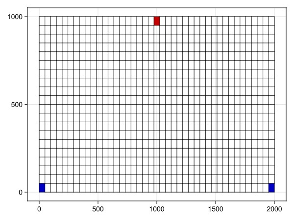
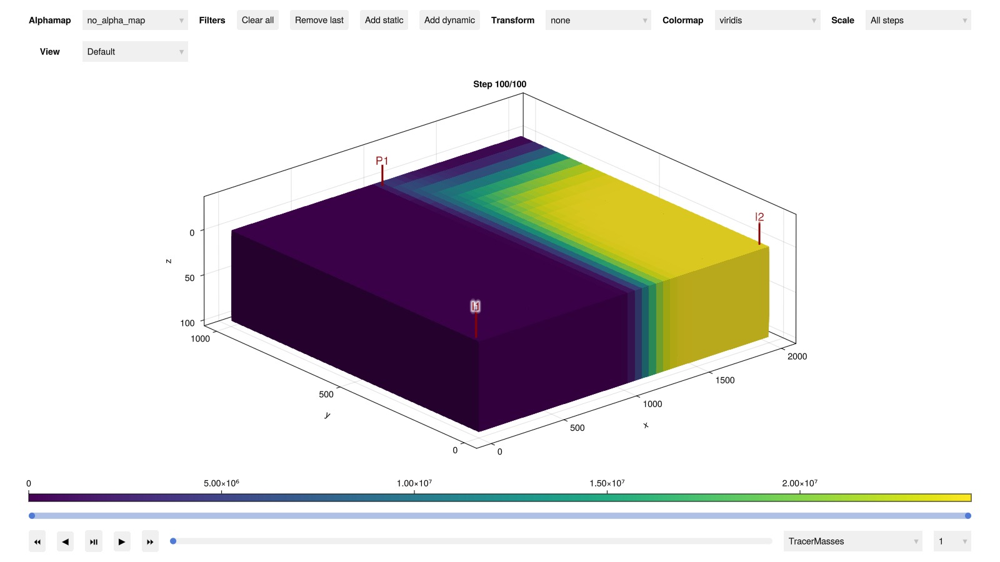
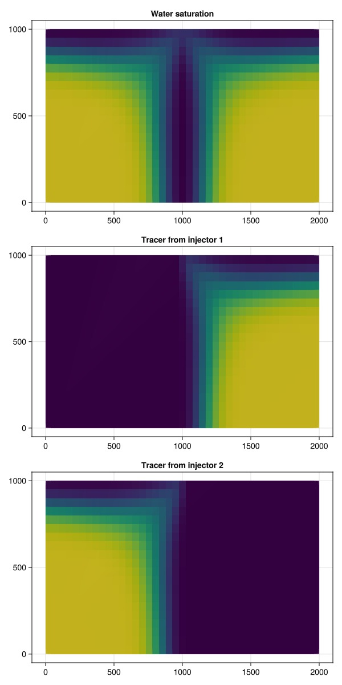

# Adding tracers to a flow simulation {#Adding-tracers-to-a-flow-simulation}

JutulDarcy supports tracers, which are concentrations that flow in one or more phases. These tracers can be passive, or they can be active and change the properties.

This example demonstrates passive tracers for a simple model with two injectors. We will add a different type of tracer to each injector so that we can show what region of the reservoir is being flooded by each injector.

## Set up mesh and identify the well cells {#Set-up-mesh-and-identify-the-well-cells}

```julia
using Jutul, JutulDarcy, GLMakie
Darcy, kg, meter, day, bar = si_units(:darcy, :kg, :meter, :day, :bar)
ny = 20
nx = 2*ny + 1
nz = 1

g = CartesianMesh((nx, ny, nz), (2000.0, 1000.0, 100.0))

c_i = cell_index(g, (nx÷2+1, ny, 1))
c_p1 = cell_index(g, (1, 1, 1))
c_p2 = cell_index(g, (nx, 1, 1))

fig = Figure()
ax = Axis(fig[1, 1])
Jutul.plot_mesh_edges!(ax, g)
plot_mesh!(ax, g, cells = c_i, color = :red)
plot_mesh!(ax, g, cells = [c_p1, c_p2], color = :blue)
fig
```



## Set up reservoir and well {#Set-up-reservoir-and-well}

```julia
reservoir = reservoir_domain(g, permeability = 0.1Darcy, porosity = 0.1)
c_i1 = cell_index(g, (nx÷2+1, ny, 1))

P1 = setup_vertical_well(reservoir, nx÷2+1, ny, name = :P1)
I1 = setup_vertical_well(reservoir, 1, 1, name = :I1)
I2 = setup_vertical_well(reservoir, nx, 1, name = :I2)
```


```
SimpleWell [I2] (1 nodes, 0 segments, 1 perforations)
```


## Set up the fluid system {#Set-up-the-fluid-system}

We set up a simple two-phase immiscible system.

```julia
phases = (AqueousPhase(), LiquidPhase())
rhoWS = rhoLS = 1000.0
rhoS = [rhoWS, rhoLS] .* kg/meter^3
sys = ImmiscibleSystem(phases, reference_densities = rhoS)
```


```
ImmiscibleSystem with AqueousPhase, LiquidPhase
```


## Define the tracers {#Define-the-tracers}

We set up two tracers, one for each injector. The single-phase tracers are in this case associated with the aqueous phase and will only travel with the aqueous phase. The multiphase tracer will travel with both phases.

```julia
tracer_1 = SinglePhaseTracer(sys, AqueousPhase())
tracer_2 = MultiPhaseTracer(sys)

tracers = [tracer_1, tracer_2]
```


```
2-element Vector{JutulDarcy.Tracers.AbstractTracer}:
 SinglePhaseTracer(1)
 MultiPhaseTracer{2}((1, 2))
```


## Set up the schedule and reporting steps {#Set-up-the-schedule-and-reporting-steps}

This is similar to other examples, but we also specify the tracer concentration for the injector wells. Wells without tracer concentration specified will be assumed to have zero concentration for all tracers.

JutulDarcy supports time-varying time-steps, so it is possible to have a a tracer active for a specific time period.

```julia
dt = repeat([30.0]*day, 100)
pv = pore_volume(reservoir)
inj_rate = 0.35*sum(pv)/sum(dt)

rate_target = TotalRateTarget(inj_rate)
I_ctrl1 = InjectorControl(rate_target, [1.0, 0.0], density = rhoWS, tracers = [0.0, 1.0])
I_ctrl2 = InjectorControl(rate_target, [1.0, 0.0], density = rhoWS, tracers = [1.0, 0.0])

bhp_target = BottomHolePressureTarget(50*bar)
P_ctrl = ProducerControl(bhp_target)
controls = Dict()
controls[:I1] = I_ctrl1
controls[:I2] = I_ctrl2
controls[:P1] = P_ctrl
```


```
ProducerControl{BottomHolePressureTarget{Float64}, Float64}(BottomHolePressureTarget with value 50.0 [bar], 1.0)
```


## Set up the reservoir model and simulate {#Set-up-the-reservoir-model-and-simulate}

We set up the reservoir model and simulate the flow. Note that we must pass the tracers to the setup function for the reservoir model - otherwise the tracers will not be simulated.

```julia
model, parameters = setup_reservoir_model(reservoir, sys,
    wells = [I1, I2, P1],
    tracers = tracers,
)

forces = setup_reservoir_forces(model, control = controls)
state0 = setup_reservoir_state(model, Pressure = 100*bar, Saturations = [0.0, 1.0])
ws, states = simulate_reservoir(state0, model, dt, info_level = -1, parameters = parameters, forces = forces);
```


## Plot interactively {#Plot-interactively}

```julia
plot_reservoir(model, states, key = :TracerMasses, step = length(dt))
```



## Plot the final water saturation and tracer concentrations {#Plot-the-final-water-saturation-and-tracer-concentrations}

Note that the fluid front has filled most of the domain. The tracers give us additional information about what water volume comes from a specific injector.

```julia
tracer_mass = states[end][:TracerMasses]
sw = states[end][:Saturations][1, :]
c1 = tracer_mass[1, :]
c2 = tracer_mass[2, :]
fig = Figure(size = (600, 1200))
ax = Axis(fig[1, 1], title = "Water saturation")
plot_cell_data!(ax, g, sw)
ax = Axis(fig[2, 1], title = "Tracer from injector 1")
plot_cell_data!(ax, g, c1)
ax = Axis(fig[3, 1], title = "Tracer from injector 2")
plot_cell_data!(ax, g, c2)
fig
```



## Example on GitHub {#Example-on-GitHub}

If you would like to run this example yourself, it can be downloaded from the JutulDarcy.jl GitHub repository [as a script](https://github.com/sintefmath/JutulDarcy.jl/blob/main/examples/workflow/tracers_two_wells.jl), or as a [Jupyter Notebook](https://github.com/sintefmath/JutulDarcy.jl/blob/gh-pages/dev/final_site/notebooks/workflow/tracers_two_wells.ipynb)

```
This example took 23.127830457 seconds to complete.
```


---


_This page was generated using [Literate.jl](https://github.com/fredrikekre/Literate.jl)._
