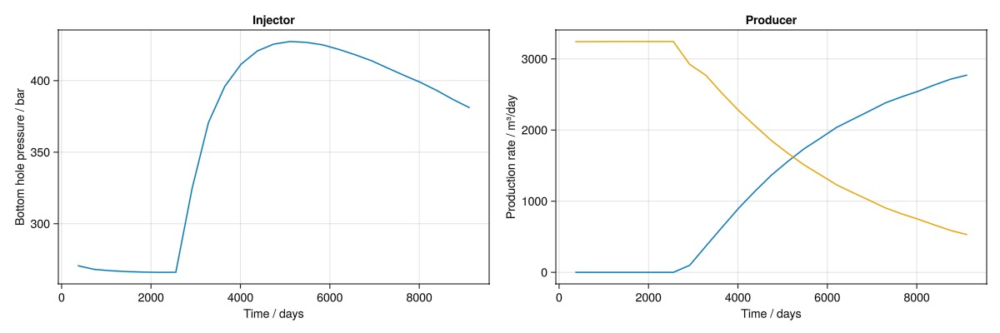
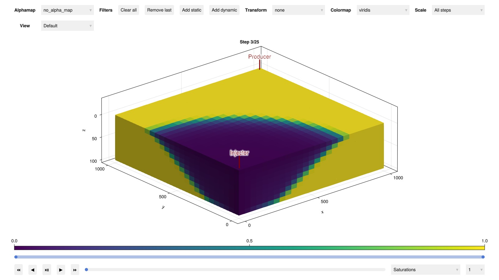

# Your first JutulDarcy.jl simulation {#Your-first-JutulDarcy.jl-simulation}

After a bit of time has passed compiling the packages, you are now ready to use JutulDarcy. There are a number of examples included in this manual, but we include a brief example here that briefly demonstrates the key concepts.

## Setting up the domain {#Setting-up-the-domain}

We set up a simple Cartesian Mesh that is converted into a reservoir domain with static properties permeability and porosity values together with geometry information. We then use this domain to set up two wells: One vertical well for injection and a single perforation producer.

```julia
using JutulDarcy, Jutul
Darcy, bar, kg, meter, day = si_units(:darcy, :bar, :kilogram, :meter, :day)
nx = ny = 25
nz = 10
cart_dims = (nx, ny, nz)
physical_dims = (1000.0, 1000.0, 100.0).*meter
g = CartesianMesh(cart_dims, physical_dims)
domain = reservoir_domain(g, permeability = 0.3Darcy, porosity = 0.2)
Injector = setup_vertical_well(domain, 1, 1, name = :Injector)
Producer = setup_well(domain, (nx, ny, 1), name = :Producer)
# Show the properties in the domain
domain
```


```
DataDomain wrapping CartesianMesh (3D) with 25x25x10=6250 cells with 19 data fields added:
  6250 Cells
    :permeability => 6250 Vector{Float64}
    :porosity => 6250 Vector{Float64}
    :rock_thermal_conductivity => 6250 Vector{Float64}
    :fluid_thermal_conductivity => 6250 Vector{Float64}
    :rock_heat_capacity => 6250 Vector{Float64}
    :component_heat_capacity => 6250 Vector{Float64}
    :rock_density => 6250 Vector{Float64}
    :cell_centroids => 3×6250 Matrix{Float64}
    :volumes => 6250 Vector{Float64}
  17625 Faces
    :neighbors => 2×17625 Matrix{Int64}
    :areas => 17625 Vector{Float64}
    :normals => 3×17625 Matrix{Float64}
    :face_centroids => 3×17625 Matrix{Float64}
  35250 HalfFaces
    :half_face_cells => 35250 Vector{Int64}
    :half_face_faces => 35250 Vector{Int64}
  2250 BoundaryFaces
    :boundary_areas => 2250 Vector{Float64}
    :boundary_centroids => 3×2250 Matrix{Float64}
    :boundary_normals => 3×2250 Matrix{Float64}
    :boundary_neighbors => 2250 Vector{Int64}

```


## Setting up a fluid system {#Setting-up-a-fluid-system}

We select a two-phase immiscible system by declaring that the liquid and vapor phases are present in the model. These are assumed to have densities of 1000 and 100 kilograms per meters cubed at reference pressure and temperature conditions.

```julia
phases = (LiquidPhase(), VaporPhase())
rhoLS = 1000.0kg/meter^3
rhoGS = 100.0kg/meter^3
reference_densities = [rhoLS, rhoGS]
sys = ImmiscibleSystem(phases, reference_densities = reference_densities)
```


```
ImmiscibleSystem with LiquidPhase, VaporPhase
```


## Setting up the model {#Setting-up-the-model}

We now have everything we need to set up a model. We call the reservoir model setup function and get out the model together with the parameters. Parameter represent numerical input values that are static throughout the simulation. These are automatically computed from the domain&#39;s geometry, permeability and porosity.

```julia
model, parameters = setup_reservoir_model(domain, sys, wells = [Injector, Producer])
model
```


```
MultiModel with 4 models and 6 cross-terms. 12506 equations, 12506 degrees of freedom and 54039 parameters.

  models:
    1) Reservoir (12500x12500)
       ImmiscibleSystem with LiquidPhase, VaporPhase
       ∈ MinimalTPFATopology (6250 cells, 17625 faces)
    2) Injector (2x2)
       ImmiscibleSystem with LiquidPhase, VaporPhase
       ∈ SimpleWell [Injector] (1 nodes, 0 segments, 10 perforations)
    3) Producer (2x2)
       ImmiscibleSystem with LiquidPhase, VaporPhase
       ∈ SimpleWell [Producer] (1 nodes, 0 segments, 1 perforations)
    4) Facility (2x2)
       JutulDarcy.PredictionMode()
       ∈ WellGroup([:Injector, :Producer], true, true)

  cross_terms:
    1) Injector <-> Reservoir (Eqs: mass_conservation <-> mass_conservation)
       JutulDarcy.ReservoirFromWellFlowCT
    2) Producer <-> Reservoir (Eqs: mass_conservation <-> mass_conservation)
       JutulDarcy.ReservoirFromWellFlowCT
    3) Injector  -> Facility (Eq: control_equation)
       JutulDarcy.FacilityFromWellFlowCT
    4) Facility  -> Injector (Eq: mass_conservation)
       JutulDarcy.WellFromFacilityFlowCT
    5) Producer  -> Facility (Eq: control_equation)
       JutulDarcy.FacilityFromWellFlowCT
    6) Facility  -> Producer (Eq: mass_conservation)
       JutulDarcy.WellFromFacilityFlowCT

Model storage will be optimized for runtime performance.

```


The model has a set of default secondary variables (properties) that are used to compute the flow equations. We can have a look at the reservoir model to see what the defaults are for the Darcy flow part of the domain:

```julia
reservoir_model(model)
```


```
SimulationModel:

  Model with 12500 degrees of freedom, 12500 equations and 54000 parameters

  domain:
    DiscretizedDomain with MinimalTPFATopology (6250 cells, 17625 faces) and discretizations for mass_flow, heat_flow

  system:
    ImmiscibleSystem with LiquidPhase, VaporPhase

  context:
    ParallelCSRContext(BlockMajorLayout(false), 1000, 1, MetisPartitioner(:KWAY))

  formulation:
    FullyImplicitFormulation()

  data_domain:
    DataDomain wrapping CartesianMesh (3D) with 25x25x10=6250 cells with 19 data fields added:
  6250 Cells
    :permeability => 6250 Vector{Float64}
    :porosity => 6250 Vector{Float64}
    :rock_thermal_conductivity => 6250 Vector{Float64}
    :fluid_thermal_conductivity => 6250 Vector{Float64}
    :rock_heat_capacity => 6250 Vector{Float64}
    :component_heat_capacity => 6250 Vector{Float64}
    :rock_density => 6250 Vector{Float64}
    :cell_centroids => 3×6250 Matrix{Float64}
    :volumes => 6250 Vector{Float64}
  17625 Faces
    :neighbors => 2×17625 Matrix{Int64}
    :areas => 17625 Vector{Float64}
    :normals => 3×17625 Matrix{Float64}
    :face_centroids => 3×17625 Matrix{Float64}
  35250 HalfFaces
    :half_face_cells => 35250 Vector{Int64}
    :half_face_faces => 35250 Vector{Int64}
  2250 BoundaryFaces
    :boundary_areas => 2250 Vector{Float64}
    :boundary_centroids => 3×2250 Matrix{Float64}
    :boundary_normals => 3×2250 Matrix{Float64}
    :boundary_neighbors => 2250 Vector{Int64}

  primary_variables:
   1) Pressure    ∈ 6250 Cells: 1 dof each
   2) Saturations ∈ 6250 Cells: 1 dof, 2 values each

  secondary_variables:
   1) PhaseMassDensities     ∈ 6250 Cells: 2 values each
      -> ConstantCompressibilityDensities as evaluator
   2) TotalMasses            ∈ 6250 Cells: 2 values each
      -> TotalMasses as evaluator
   3) RelativePermeabilities ∈ 6250 Cells: 2 values each
      -> BrooksCoreyRelativePermeabilities as evaluator
   4) PhaseMobilities        ∈ 6250 Cells: 2 values each
      -> JutulDarcy.PhaseMobilities as evaluator
   5) PhaseMassMobilities    ∈ 6250 Cells: 2 values each
      -> JutulDarcy.PhaseMassMobilities as evaluator

  parameters:
   1) Transmissibilities        ∈ 17625 Faces: Scalar
   2) TwoPointGravityDifference ∈ 17625 Faces: Scalar
   3) PhaseViscosities          ∈ 6250 Cells: 2 values each
   4) FluidVolume               ∈ 6250 Cells: Scalar

  equations:
   1) mass_conservation ∈ 6250 Cells: 2 values each
      -> ConservationLaw{:TotalMasses, TwoPointPotentialFlowHardCoded{Vector{Int64}, Vector{@NamedTuple{self::Int64, other::Int64, face::Int64, face_sign::Int64}}}, Jutul.DefaultFlux, 2}

  output_variables:
    Pressure, Saturations, TotalMasses

  extra:
    OrderedDict{Symbol, Any} with keys: Symbol[]

```


The secondary variables can be swapped out, replaced and new variables can be added with arbitrary functional dependencies thanks to Jutul&#39;s flexible setup for automatic differentiation. Let us adjust the defaults by replacing the relative permeabilities with Brooks-Corey functions and the phase density functions by constant compressibilities:

```julia
c = [1e-6, 1e-4]/bar
density = ConstantCompressibilityDensities(
    p_ref = 100*bar,
    density_ref = reference_densities,
    compressibility = c
)
kr = BrooksCoreyRelativePermeabilities(sys, [2.0, 3.0])
replace_variables!(model, PhaseMassDensities = density, RelativePermeabilities = kr)
```


## Initial state: Pressure and saturations {#Initial-state:-Pressure-and-saturations}

Now that we are happy with our model setup, we can designate an initial state. Equilibration of reservoirs can be a complicated affair, but here we set up a constant pressure reservoir filled with the liquid phase. The inputs must match the primary variables of the model, which in this case is pressure and saturations in every cell.

```julia
state0 = setup_reservoir_state(model,
    Pressure = 120bar,
    Saturations = [1.0, 0.0]
)
```


```
Dict{Any, Any} with 4 entries:
  :Producer  => Dict{Symbol, Any}(:PhaseMassDensities=>[0.0; 0.0;;], :Saturatio…
  :Injector  => Dict{Symbol, Any}(:PhaseMassDensities=>[0.0; 0.0;;], :Saturatio…
  :Reservoir => Dict{Symbol, Any}(:PhaseMassMobilities=>[0.0 0.0 … 0.0 0.0; 0.0…
  :Facility  => Dict{Symbol, Any}(:TotalSurfaceMassRate=>[0.0, 0.0], :WellGroup…
```


## Setting up timesteps and well controls {#Setting-up-timesteps-and-well-controls}

We set up reporting timesteps. These are the intervals that the simulator gives out outputs. The simulator may use shorter steps internally, but will always hit these points in the output. Here, we report every year for 25 years.

```julia
nstep = 25
dt = fill(365.0day, nstep);
```


```
25-element Vector{Float64}:
 3.1536e7
 3.1536e7
 3.1536e7
 3.1536e7
 3.1536e7
 3.1536e7
 3.1536e7
 3.1536e7
 3.1536e7
 3.1536e7
 ⋮
 3.1536e7
 3.1536e7
 3.1536e7
 3.1536e7
 3.1536e7
 3.1536e7
 3.1536e7
 3.1536e7
 3.1536e7
```


We next set up a rate target with a high amount of gas injected into the model. This is not fully realistic, but will give some nice and dramatic plots for our example later on.

```julia
pv = pore_volume(model, parameters)
inj_rate = 1.5*sum(pv)/sum(dt)
rate_target = TotalRateTarget(inj_rate)
```


```
TotalRateTarget with value 0.0380517503805175 [m^3/s]
```


The producer is set to operate at a fixed pressure:

```julia
bhp_target = BottomHolePressureTarget(100bar)
```


```
BottomHolePressureTarget with value 100.0 [bar]
```


We can finally set up forces for the model. Note that while JutulDarcy supports time-dependent forces and limits for the wells, we keep this example as simple as possible.

```julia
I_ctrl = InjectorControl(rate_target, [0.0, 1.0], density = rhoGS)
P_ctrl = ProducerControl(bhp_target)
controls = Dict(:Injector => I_ctrl, :Producer => P_ctrl)
forces = setup_reservoir_forces(model, control = controls);
```


```
Dict{Symbol, Any} with 4 entries:
  :Producer  => (mask = nothing,)
  :Injector  => (mask = nothing,)
  :Reservoir => (bc = nothing, sources = nothing)
  :Facility  => (control = Dict{Symbol, WellControlForce}(:Producer=>ProducerCo…
```


## Simulate and analyze results {#Simulate-and-analyze-results}

We call the simulation with our initial state, our model, the timesteps, the forces and the parameters:

```julia
wd, states, t = simulate_reservoir(state0, model, dt, parameters = parameters, forces = forces)
```


```
ReservoirSimResult with 25 entries:

  wells (2 present):
    :Producer
    :Injector
    Results per well:
       :Vapor_mass_rate => Vector{Float64} of size (25,)
       :lrat => Vector{Float64} of size (25,)
       :orat => Vector{Float64} of size (25,)
       :control => Vector{Symbol} of size (25,)
       :bhp => Vector{Float64} of size (25,)
       :Liquid_mass_rate => Vector{Float64} of size (25,)
       :mass_rate => Vector{Float64} of size (25,)
       :rate => Vector{Float64} of size (25,)
       :grat => Vector{Float64} of size (25,)
       :gor => Vector{Float64} of size (25,)

  states (Vector with 25 entries, reservoir variables for each state)
    :Saturations => Matrix{Float64} of size (2, 6250)
    :Pressure => Vector{Float64} of size (6250,)
    :TotalMasses => Matrix{Float64} of size (2, 6250)

  time (report time for each state)
     Vector{Float64} of length 25

  result (extended states, reports)
     SimResult with 25 entries

  extra
     Dict{Any, Any} with keys :simulator, :config

  Completed at May. 20 2025 23:05 after 4 seconds, 419 milliseconds, 143.3 microseconds.
```


We can interactively look at the well results in the command line:

```julia
wd(:Producer)
```


```
Legend
┌──────────────────┬──────────────────────────────────────────┬──────┬────────────────────────────────┐
│ Label            │ Description                              │ Unit │ Type of quantity               │
├──────────────────┼──────────────────────────────────────────┼──────┼────────────────────────────────┤
│ Liquid_mass_rate │ Component mass rate for Liquid component │ kg/s │ mass per time                  │
│ Vapor_mass_rate  │ Component mass rate for Vapor component  │ kg/s │ mass per time                  │
│ bhp              │ Bottom hole pressure                     │ Pa   │ pressure                       │
│ control          │ Control                                  │ -    │ none                           │
│ gor              │ Gas-oil-ratio                            │      │ id                             │
│ grat             │ Surface gas rate                         │ m³/s │ gas_volume_surface per time    │
│ lrat             │ Surface water rate                       │ m³/s │ liquid_volume_surface per time │
│ mass_rate        │ Total mass rate                          │ kg/s │ mass per time                  │
│ orat             │ Surface oil rate                         │ m³/s │ liquid_volume_surface per time │
│ rate             │ Surface total rate                       │ m³/s │ liquid_volume_surface per time │
└──────────────────┴──────────────────────────────────────────┴──────┴────────────────────────────────┘
Producer result
┌────────┬──────────────────┬─────────────────┬───────┬─────────┬──────────┬─────────────┬─────────────┬───────────┬─────────────┬────────────┐
│   time │ Liquid_mass_rate │ Vapor_mass_rate │   bhp │ control │      gor │        grat │        lrat │ mass_rate │        orat │       rate │
│   days │             kg/s │            kg/s │    Pa │       - │          │        m³/s │        m³/s │      kg/s │        m³/s │       m³/s │
├────────┼──────────────────┼─────────────────┼───────┼─────────┼──────────┼─────────────┼─────────────┼───────────┼─────────────┼────────────┤
│  365.0 │         -37.5266 │            -0.0 │ 1.0e7 │     bhp │      0.0 │        -0.0 │  -0.0375266 │  -37.5266 │  -0.0375266 │ -0.0375266 │
│  730.0 │         -37.5381 │            -0.0 │ 1.0e7 │     bhp │      0.0 │        -0.0 │  -0.0375381 │  -37.5381 │  -0.0375381 │ -0.0375381 │
│ 1095.0 │         -37.5434 │            -0.0 │ 1.0e7 │     bhp │      0.0 │        -0.0 │  -0.0375434 │  -37.5434 │  -0.0375434 │ -0.0375434 │
│ 1460.0 │         -37.5486 │            -0.0 │ 1.0e7 │     bhp │      0.0 │        -0.0 │  -0.0375486 │  -37.5486 │  -0.0375486 │ -0.0375486 │
│ 1825.0 │         -37.5515 │            -0.0 │ 1.0e7 │     bhp │      0.0 │        -0.0 │  -0.0375515 │  -37.5515 │  -0.0375515 │ -0.0375515 │
│ 2190.0 │         -37.5531 │            -0.0 │ 1.0e7 │     bhp │      0.0 │        -0.0 │  -0.0375531 │  -37.5531 │  -0.0375531 │ -0.0375531 │
│ 2555.0 │         -37.5503 │            -0.0 │ 1.0e7 │     bhp │      0.0 │        -0.0 │  -0.0375503 │  -37.5503 │  -0.0375503 │ -0.0375503 │
│ 2920.0 │         -33.8416 │       -0.113996 │ 1.0e7 │     bhp │ 0.033685 │ -0.00113996 │  -0.0338416 │  -33.9556 │  -0.0338416 │ -0.0349816 │
│ 3285.0 │           -32.04 │       -0.427894 │ 1.0e7 │     bhp │  0.13355 │ -0.00427894 │    -0.03204 │  -32.4679 │    -0.03204 │  -0.036319 │
│ 3650.0 │         -29.0773 │        -0.73694 │ 1.0e7 │     bhp │ 0.253442 │  -0.0073694 │  -0.0290773 │  -29.8142 │  -0.0290773 │ -0.0364467 │
│ 4015.0 │         -26.3288 │        -1.04267 │ 1.0e7 │     bhp │  0.39602 │  -0.0104267 │  -0.0263288 │  -27.3715 │  -0.0263288 │ -0.0367556 │
│ 4380.0 │          -23.859 │        -1.31873 │ 1.0e7 │     bhp │  0.55272 │  -0.0131873 │   -0.023859 │  -25.1777 │   -0.023859 │ -0.0370463 │
│ 4745.0 │         -21.4541 │        -1.57829 │ 1.0e7 │     bhp │  0.73566 │  -0.0157829 │  -0.0214541 │  -23.0324 │  -0.0214541 │  -0.037237 │
│ 5110.0 │         -19.4153 │        -1.80093 │ 1.0e7 │     bhp │ 0.927581 │  -0.0180093 │  -0.0194153 │  -21.2162 │  -0.0194153 │ -0.0374246 │
│ 5475.0 │         -17.5017 │        -2.00778 │ 1.0e7 │     bhp │  1.14719 │  -0.0200778 │  -0.0175017 │  -19.5095 │  -0.0175017 │ -0.0375795 │
│ 5840.0 │         -15.8833 │        -2.18008 │ 1.0e7 │     bhp │  1.37256 │  -0.0218008 │  -0.0158833 │  -18.0634 │  -0.0158833 │ -0.0376841 │
│ 6205.0 │         -14.2438 │         -2.3575 │ 1.0e7 │     bhp │  1.65511 │   -0.023575 │  -0.0142438 │  -16.6013 │  -0.0142438 │ -0.0378188 │
│ 6570.0 │         -12.9714 │        -2.49036 │ 1.0e7 │     bhp │  1.91988 │  -0.0249036 │  -0.0129714 │  -15.4618 │  -0.0129714 │  -0.037875 │
│ 6935.0 │         -11.7335 │        -2.62249 │ 1.0e7 │     bhp │  2.23505 │  -0.0262249 │  -0.0117335 │  -14.3559 │  -0.0117335 │ -0.0379583 │
│ 7300.0 │         -10.4791 │        -2.75746 │ 1.0e7 │     bhp │  2.63139 │  -0.0275746 │  -0.0104791 │  -13.2366 │  -0.0104791 │ -0.0380538 │
│ 7665.0 │         -9.50952 │        -2.85601 │ 1.0e7 │     bhp │  3.00332 │  -0.0285601 │ -0.00950952 │  -12.3655 │ -0.00950952 │ -0.0380696 │
│ 8030.0 │         -8.64768 │        -2.94548 │ 1.0e7 │     bhp │   3.4061 │  -0.0294548 │ -0.00864768 │  -11.5932 │ -0.00864768 │ -0.0381025 │
│ 8395.0 │         -7.70709 │        -3.04872 │ 1.0e7 │     bhp │  3.95573 │  -0.0304872 │ -0.00770709 │  -10.7558 │ -0.00770709 │ -0.0381943 │
│ 8760.0 │         -6.81424 │        -3.14318 │ 1.0e7 │     bhp │  4.61266 │  -0.0314318 │ -0.00681424 │  -9.95742 │ -0.00681424 │  -0.038246 │
│ 9125.0 │         -6.13111 │        -3.20929 │ 1.0e7 │     bhp │  5.23443 │  -0.0320929 │ -0.00613111 │   -9.3404 │ -0.00613111 │  -0.038224 │
└────────┴──────────────────┴─────────────────┴───────┴─────────┴──────────┴─────────────┴─────────────┴───────────┴─────────────┴────────────┘
```


Let us look at the pressure evolution in the injector:

```julia
wd(:Injector, :bhp)
```


```
Legend
┌───────┬──────────────────────┬──────┬──────────────────┐
│ Label │ Description          │ Unit │ Type of quantity │
├───────┼──────────────────────┼──────┼──────────────────┤
│ bhp   │ Bottom hole pressure │ Pa   │ pressure         │
└───────┴──────────────────────┴──────┴──────────────────┘
Injector result
┌────────┬───────────┐
│   time │       bhp │
│   days │        Pa │
├────────┼───────────┤
│  365.0 │ 2.70634e7 │
│  730.0 │ 2.68094e7 │
│ 1095.0 │ 2.67143e7 │
│ 1460.0 │  2.6654e7 │
│ 1825.0 │ 2.66192e7 │
│ 2190.0 │ 2.66018e7 │
│ 2555.0 │ 2.66071e7 │
│ 2920.0 │ 3.24804e7 │
│ 3285.0 │ 3.70721e7 │
│ 3650.0 │ 3.96019e7 │
│ 4015.0 │ 4.11513e7 │
│ 4380.0 │ 4.20768e7 │
│ 4745.0 │ 4.25517e7 │
│ 5110.0 │ 4.27345e7 │
│ 5475.0 │ 4.26737e7 │
│ 5840.0 │  4.2501e7 │
│ 6205.0 │  4.2179e7 │
│ 6570.0 │ 4.18046e7 │
│ 6935.0 │ 4.13869e7 │
│ 7300.0 │ 4.08692e7 │
│ 7665.0 │ 4.03631e7 │
│ 8030.0 │ 3.98735e7 │
│ 8395.0 │ 3.93062e7 │
│ 8760.0 │ 3.86747e7 │
│ 9125.0 │ 3.81056e7 │
└────────┴───────────┘
```


If we have a plotting package available, we can visualize the results too:

```julia
using GLMakie
grat = wd[:Producer, :grat]
lrat = wd[:Producer, :lrat]
bhp = wd[:Injector, :bhp]
fig = Figure(size = (1200, 400))
ax = Axis(fig[1, 1],
    title = "Injector",
    xlabel = "Time / days",
    ylabel = "Bottom hole pressure / bar")
lines!(ax, t/day, bhp./bar)
ax = Axis(fig[1, 2],
    title = "Producer",
    xlabel = "Time / days",
    ylabel = "Production rate / m³/day")
lines!(ax, t/day, abs.(grat).*day)
lines!(ax, t/day, abs.(lrat).*day)
fig
```



Interactive visualization of the 3D results is also possible if GLMakie is loaded:

```julia
plot_reservoir(model, states, key = :Saturations, step = 3)
```


